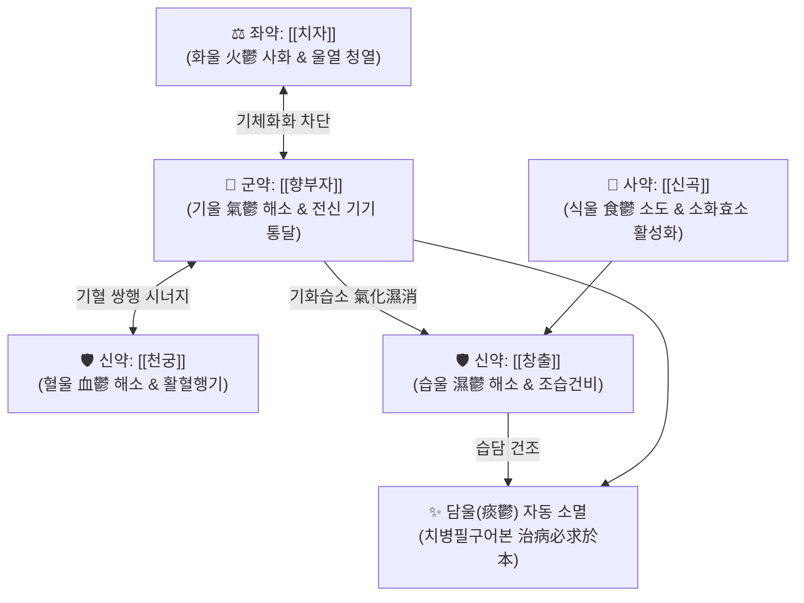

---
aliases:
  - 越鞠丸
  - Yue-ju-wan
  - Yueju Pill
  - 창출환
  - 육울환
tags:
  - 처방/이기화해제
  - 이기화해제/행기해울
  - 육울증
  - 해울통락
  - 급속항우울
  - 단계심법
---

# 🍵 [[월국환]] (越鞠丸, Yue-ju-wan / Escape Restraint Pill)

> **핵심 3줄 요약 (Key Summary)**:
> - 🌿 기본 구성: [[향부자]](기울), [[천궁]](혈울), [[창출]](습울), [[치자]](화울), [[신곡]](식울) 각 동량 배합 (기와 습이 돌면 담이 삭는 원리로 담울까지 아우르는 육울 통치 모방).
> - 🎯 기·혈·습·열·식·담 육울(六鬱) 정체로 인한 가슴과 명치끝의 비민(답답함), 완복창통, 탄산(신트림), 오심, 소화불량, 화병, 우울증, 신체화 장애.
> - 🔬 해마 mTOR 신호 활성화 및 BDNF 발현 유도를 통한 24시간 이내 케타민 유사 급속 항우울(Rapid Antidepressant), 그렐린 수용체 자극을 통한 위배출 촉진.
> - ⚠️ 주의사항: 방향신온(芳香辛溫) 및 조습(燥濕) 약재가 다수 배오되어 음허화왕(陰虛火旺) 및 진액 고갈 환자, 기혈 극허자에게는 보익제 배오 필요.

---

## 📌 목차
1. [기본 처방 정보 & 군신좌사 구성](#1-기본-처방-정보--군신좌사-구성)
2. [방제학적 약재 상호작용 & 시너지 네트워크](#2-방제학적-약재-상호작용--시너지-네트워크)
3. [현대 분자약리학적 효능 & 작용 기전](#3-현대-분자약리학적-효능--작용-기전)
4. [적응 병증 및 체질별 감별 (Sweet Spot vs 금기)](#4-적응-병증-및-체질별-감별-sweet-spot-vs-금기)
5. [유사 처방군 감별 매트릭스](#5-유사-처방군-감별-매트릭스)
6. [임상 가감례 & 현대 질환별 응용](#6-임상-가감례--현대-질환별-응용)
7. [💡 사용자 진료실 핵심 필기 & 임상 팁 (원문 보존)](#7--사용자-진료실-핵심-필기--임상-팁-원문-보존)
8. [출처 및 학술 참고 문헌 (References)](#8-출처-및-학술-참고-문헌-references)

---

## 1. 기본 처방 정보 & 군신좌사 구성

* **출전**: 금원사대가 주단계(朱丹溪) 《단계심법(丹溪心法)》 권3 육울문(六鬱門)
* **이명**: 창출환(蒼朮丸), 육울환(六鬱丸)
* **치법**: 행기해울(行氣解鬱), 조습화담(燥濕化痰), 소식청열(消食淸熱)
* **적응증**: 육울증(六鬱證) - 흉격비만, 완복창통, 애기탄산, 오심구토, 음식정체, 정서 억울

| 구분 | 약재명 | 표준 용량 | 본초 효능 & 방제 내 역할 |
| :--- | :--- | :--- | :--- |
| **군약 (君藥)** | [[향부자]] | 9g (동량) | 이기소간(理氣疏肝), 조경지통(調經止痛), 전신 기기(氣機) 소통으로 기울(氣鬱) 해소 |
| **신약 (臣藥)** | [[천궁]] | 9g (동량) | 활혈행기(活血行氣), 거풍지통(祛風止痛), 혈액 순환 울체 해소로 혈울(血鬱) 치유 |
| **신약 (臣藥)** | [[창출]] | 9g (동량) | 조습건비(燥濕健脾), 거풍발한(祛風發汗), 체내 과잉 수습을 말려 습울(濕鬱) 해소 |
| **좌약 (佐藥)** | [[치자]] | 9g (동량) | 청열사화(淸熱瀉火), 양혈해독(凉血解毒), 기체로 뭉친 울화(鬱火)를 꺼 화울(火鬱) 해소 |
| **사약 (使藥)** | [[신곡]] | 9g (동량) | 소식화적(消食化積), 건비개위(健脾開胃), 정체된 음식 독을 삭여 식울(食鬱) 해소 |

> **배오 특징 (원장님 구성 분석 & 담울 해소 원리)**:
> 1. **육울(六鬱) 입체 타격**: 기(氣)·혈(血)·습(濕)·화(火)·식(食)의 5대 울증을 5개 본초가 동량으로 각자 담당하여 동시에 실타래를 풀어헤칩니다.
> 2. **담울(痰鬱)을 다스리는 절묘한 방제학적 이치**: 처방 내에 반하나 담남성 같은 담을 직접 삭이는 약재가 없으나, "기가 돌면 담이 저절로 삭고(기울 해소), 습이 마르면 담이 생기지 않는다(습울 해소)"는 병기 원리에 의해 **기울과 습울이 풀리면서 담울(痰鬱)은 저절로 소멸**됩니다.

---

## 2. 방제학적 약재 상호작용 & 시너지 네트워크

* **기혈수(氣血水) 삼위일체 해울**: [[향부자]]가 기를 돌리고 [[천궁]]이 혈을 돌리며 [[창출]]이 습을 말려, 인체 순환 대사의 3대 핵심 축을 동시에 개통합니다.
* **치자와 신곡의 화식평형(火食平衡)**: 기와 음식이 뭉쳐서 열로 변하는 과정을 [[치자]]의 서늘한 기운으로 차단하고, [[신곡]]으로 소화 효소 분비를 촉진하여 속더부룩함과 신트림을 즉각 진정시킵니다.

---

## 3. 현대 분자약리학적 효능 & 작용 기전

### 1) 해마 mTOR/BDNF 경로 활성화를 통한 급속 항우울 (Rapid Antidepressant)
* 월국환 추출물이 뇌 해마의 **mTORC1 복합체 인산화를 촉진**하고 시냅스 가소성 단백질(PSD-95, Synapsin-1) 및 BDNF 발현을 즉각 상향 조절합니다.
* 기존 SSRI 항우울제가 효능 발현에 2~4주가 걸리는 것과 달리, 월국환은 **투여 후 24시간 이내에 케타민과 유사한 급속 항우울 효과**를 발휘함이 규명되었습니다.

### 2) 소화관 연동 운동 촉진 및 위점막 보호
* [[창출]]의 아트락틸로딘이 위장관 그렐린(Ghrelin) 수용체를 자극하여 위 배출능을 촉진하고 조기 포만감을 해소합니다.
* [[치자]]의 제니포시드가 위점막 프로스타글란딘 합성을 유도하고 공격 인자(위산 분비)를 억제하여 역류성 식도염 점막을 보호합니다.

### 3) 세로토닌 및 도파민 신경계 조절
* [[향부자]]의 알파-시페론과 [[천궁]]의 페룰산이 중추 모노아민 신경 전달을 안정화하여 화병(火病) 및 스트레스성 가슴 답답함을 완화합니다.

---

## 4. 적응 병증 및 체질별 감별 (Sweet Spot vs 금기)

[✅ 최적 적응증 (Sweet Spot)]
• 병태생리: 만성적인 스트레스, 분노 억압, 불규칙한 식습관으로 기·혈·습·열·식의 육울이 복합 정체된 상태
• 주치 병증: 가슴과 명치가 꽉 막힌 듯 답답함(흉격비만), 신트림과 헛배부름(탄산애기), 신경성 위염, 기능성 소화불량, 화병, 우울증, 신체화 장애
• 설진/맥진: 설태후니(厚膩) 또는 미황니(微黃膩), 맥현(弦) 또는 맥침활(沈滑)

[⚠️ 신중 투여 및 금기 (Caution / Contraindication)]
• 음허혈소(陰虛血少): 혀가 붉고 태가 없으며(설홍무태) 입마름과 도한이 심한 환자 신중 투여
• 임산부 신중: 천궁의 활혈통경 작용과 향부자의 자궁 수축 조절 작용으로 임신 중 고용량 복용 주의

---

## 5. 유사 처방군 감별 매트릭스

| 처방명 | 핵심 배오 차이 | 주치 및 임상 차별점 | 맥진/설진 차이 |
| :--- | :--- | :--- | :--- |
| [[월국환]] | 5대 본초 동량 (기·혈·습·화·식) | **통치육울, 흉격비만, 탄산애기, 급속 항우울, 신체화 장애** | 맥현, 설태후니 |
| [[소요산]] | [[시호]], [[당귀]], [[백작약]], [[백출]], [[복령]] | **간울혈허, 간비불화, 여성 월경불순, 피로, 갱년기 신경증** | 맥현세, 설담홍 |
| [[반하후박탕]] | [[반하]], [[후박]], [[복령]], [[생강]], [[소엽]] | **기담조체, 목구멍 이물감(매핵기), 뱉어도 안 나오는 가래** | 맥현완, 설태백윤 |
| [[평위산]] | [[창출]], [[후박]], [[진피]], [[감초]] | **순수 비위 습체, 식체, 복부 팽만, 묽은 설사** | 맥완, 설태백니 |
| [[분심기음]] | [[자소엽]], [[청피]], [[진피]], [[목향]] 등 16미 | **칠정울결, 가슴과 옆구리가 결리고 소변불통이 겸한 화병** | 맥침현, 설태백 |

---

## 6. 임상 가감례 & 현대 질환별 응용

* **증상별 가감 공식**:
  * 습담(濕痰)과 메스꺼움, 구역질이 극심할 때 $\rightarrow$ + [[반하]], [[진피]] ([[월국이진탕]])
  * 찌르는 듯한 어혈 복통이 뚜렷할 때 $\rightarrow$ + [[도인]] 6g, [[홍화]] 4g
  * 속쓰림과 타는 듯한 열감이 심할 때 $\rightarrow$ + [[황련]] 3g, [[오수유]] 1g (좌금환 결합)
  * 기허(氣虛)가 겸해져 무기력할 때 $\rightarrow$ + [[백출]] 6g, [[인삼]] 4g
* **현대 질환별 응용**:
  * 기능성 소화불량증, 신경성 위염, 위식도역류질환(GERD)
  * 경증~중등도 우울장애, 범불안장애, 화병, 신체형 장애
  * 만성 스트레스성 장관내가스 정체 및 복부 팽만증

---

## 7. 💡 사용자 진료실 핵심 필기 & 임상 팁 (원문 보존)

> [!tip] **진료실 실전 노하우 (User Clinical Insight)**
> 
> ### 1) 소화기 울증과 신체화 장애의 절대적 제1 선택방
> * **"온몸의 기운이 꽉 막혀 소화도 전혀 안 되고, 가슴이 답답해서 숨도 깊게 쉬어지지 않는다"**고 호소하는 신체화 장애 환자에게 탁월한 효과를 발휘함.
> * 환자가 복부 팽만, 가슴 답답함, 신트림, 우울감 등 여러 장부의 증상을 동시에 호소할 때 처방을 복잡하게 쓰지 않고 월국환 하나로 모든 얽힌 기기를 풀어냄.
> 
> ### 2) 케타민 유사 급속 항우울 효과의 임상 활용
> * 기존 양방 항우울제 복용에 거부감이 있거나, 항우울제 효과가 나타나기까지의 수 주간을 견디기 힘들어하는 우울·불안 환자에게 단기 투여하여 24시간 이내에 기분을 빠르게 반등시키는 용도로 응용함.
> 
> ### 3) 가루약(환제) 휴대 복용 팁
> * 전통적으로 오자대(오동나무 씨앗 크기) 환제로 복용하며, 식후에 속이 꽉 막히거나 가슴이 답답할 때 따뜻한 물로 6~9g 복용하도록 지도함.

---

## 8. 출처 및 학술 참고 문헌 (References)

1. **주진형 (1347)**. 《단계심법(丹溪心法)》 권3 육울(六鬱).
   - [고전 원전] "越鞠丸, 解諸鬱. 凡鬱皆在中焦, 以局方神麴, 蒼朮, 香附, 芎藭, 梔子等分爲末, 蒸餅丸." (월국환은 모든 울증을 푼다. 무릇 모든 울증은 중초에 있으니, 국방 신곡, 창출, 향부, 궁궁, 치자를 동량으로 가루 내어 환을 짓는다.)
3. * **Zou Z et al. (2017)**. Neural Plasticity Associated with Hippocampal PKA-CREB and NMDA Signaling Is Involved in the Antidepressant Effect of Repeated Low Dose of Yueju Pill on Chronic Mouse Model of Learned Helplessness. *Neural plasticity*, 2017: 9160515. [PMID: 29075536](https://pubmed.ncbi.nlm.nih.gov/29075536/)
