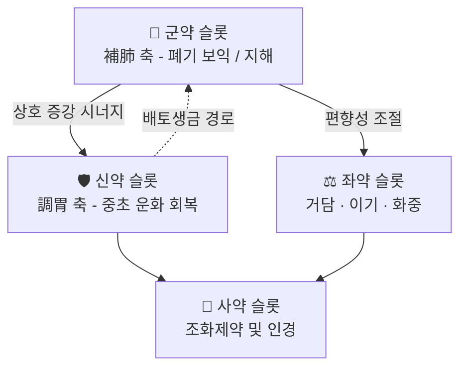

# 🍵 [[조위보폐탕]] (調胃補肺湯, Jo-wi Bo-pye-tang)

> **핵심 3줄 요약 (Key Summary)**:
> - 🌿 **모체/기원 처방 + 배오 구조**: 『[[淸江醫鑑]]』 소재 처방으로, 명칭 그대로 **調胃(중초 비위 조화) + 補肺(상초 폐기 보익)** 의 2축(軸) 구조를 취한다. 즉 하부의 소화·기운 생성 기능을 먼저 세운 뒤 그 氣를 폐로 올려 보하는 **배토생금(培土生金)** 설계로 해석된다. ⚠️ 다만 **구성 약재·용량의 원문 텍스트는 본 노트 작성 시점에서 1차 자료 미확보로 '근거 미확인'** 이며, 실제 처방 구성은 『淸江醫鑑』 원문 대조가 필요하다.
> - 🎯 **임상 최적 적응증**: 폐기(肺氣)가 허하면서 동시에 비위(脾胃)가 약해 **음식이 잘 안 넘어가고(소식·완비), 기운이 없으며, 기침·가래·숨참이 오래 끄는** 만성 호흡기 허증 환자. 즉 '폐만 보하면 소화가 더 막히고, 소화만 시키면 기침이 심해지는' 난치 패턴의 절충 처방으로 진료실에서 활용 가치가 있다. 체질적으로는 소음인·태음인 허약형, 마르고 피부가 건조하며 기력이 저하된 만성병 환자가 1순위 후보로 추정된다(체질 감별은 근거 미확인).
> - 🔬 **핵심 분자약리 기전**: 조위보폐탕 자체에 대한 직접 연구는 제공된 문헌에 **없다(근거 미확인)**. 다만 동일한 '補肺' 명명 계열 처방들에서 **NF-κB 신호 억제, MMP-9/TIMP-1 균형 회복을 통한 기도 리모델링 억제(COPD 모델)**, **항염증 기전을 통한 폐섬유화 완화(bleomycin 유도 IPF 모델)**, **표적항암제(gefitinib) 병용 시 임상 지표 개선(진행성 비소세포폐암)** 이 보고되어, '보폐(補肺)' 축의 현대적 근거는 축적되어 있다.
> - ⚠️ 주의사항: 보폐·자보(滋補) 계열 처방의 일반 원칙상 **외감 초기 표증 미해(表證未解), 실열(實熱)·담열옹폐, 급성 감염 발열기**에는 단독 투여를 피하고, 소화기 허약자가 자보제를 복용할 때 발생하는 **완비·복만·식욕저하·설사** 반응을 반드시 관찰해야 한다. 원문 금기 조문은 **근거 미확인**이므로 투여 전 『淸江醫鑑』 원문 확인이 필요하다.

---
## 📌 목차
1. [기본 처방 정보 & 군신좌사 구성](#1-기본-처방-정보--군신좌사-구성)
2. [방제학적 약재 상호작용 & 시너지 네트워크](#2-방제학적-약재-상호작용--시너지-네트워크)
3. [현대 분자약리학적 효능 & 작용 기전](#3-현대-분자약리학적-효능--작용-기전)
4. [적응 병증 및 체질별 감별 (Sweet Spot vs 금기)](#4-적응-병증-및-체질별-감별-sweet-spot-vs-금기)
5. [유사 처방군 감별 매트릭스](#5-유사-처방군-감별-매트릭스)
6. [임상 가감례 & 현대 질환별 응용](#6-임상-가감례--현대-질환별-응용)
7. [💡 사용자 진료실 핵심 필기 & 임상 팁 (원문 보존)](#7--사용자-진료실-핵심-필기--임상-팁-원문-보존)
8. [출처 및 학술 참고 문헌 (References)](#8-출처-및-학술-참고-문헌-references)

---
## 1. 기본 처방 정보 & 군신좌사 구성

* **출전**: 『[[淸江醫鑑]]』(淸江醫鑑) — 처방 별칭에 출전이 명기된 한국 전통 의서 계열 문헌.
  * ⚠️ **저자·간행 연도·판본 정보는 1차 자료 미확보로 '근거 미확인'**. 한국 한의학 고전 DB 및 원문 이미지 대조 후 본 항목 보완 필요.
  * 『[[상한론]]』·『[[동의보감]]』 계열 처방과의 직접적 계보 관계 역시 **근거 미확인**.
* **치법**: **조위화중(調胃和中) + 보폐지해(補肺止咳)** — 나아가 **배토생금(培土生金)** 및 **폐위동치(肺胃同治)** 로 요약되는 2축 치법.
* **방제 명칭 해석**:
  * **調胃**: 胃氣를 고르게 한다 → 中焦(脾胃)의 受納·腐熟·運化 기능 회복. 소화 불량, 식사량 저하, 완비(脘痞), 대변 이상을 겨냥.
  * **補肺**: 肺氣를 보한다 → 宣發·肅降 기능 회복, 기침·가래·숨참·자한(自汗)·성음 저하를 겨냥.
  * 두 축을 한 처방에 묶은 것은 **"폐병을 오래 앓으면 자식이 어미의 기운을 빼앗는다(子盜母氣)"** 는 병기 논리에 대한 전형적 대응 설계로 볼 수 있다. (이 병기 해석은 방제 명칭 및 전통 이론에 근거한 **해석**이며, 원문 조문 인용은 근거 미확인.)

| 구분 | 약재명 | 표준 용량 | 본초 효능 & 방제 내 역할 |
| :--- | :--- | :--- | :--- |
| **군약 (君藥)** | ⚠️ **원문 미확인** | 미확인 | 補肺 축의 핵심 — 폐기 보익 및 지해(止咳)·평천(平喘)을 주도하는 슬롯 |
| **신약 (臣藥)** | ⚠️ **원문 미확인** | 미확인 | 調胃 축의 핵심 — 중초 운화 회복, 군약의 보익 작용이 滯하지 않도록 받쳐주는 슬롯 |
| **좌약 (佐藥)** | ⚠️ **원문 미확인** | 미확인 | 거담·이기·화중(和中) — 담음과 기체(氣滯)를 풀어 보익제의 편향성을 제어하는 슬롯 |
| **사약 (使藥)** | ⚠️ **원문 미확인** | 미확인 | 조화제약(調和諸藥) 및 인경(引經) — 폐·비위로 약성을 유도하는 슬롯 |

> **배오 특징(구조적 해석)**: 명칭상 이 처방은 **"先調中焦 → 後補上焦"** 의 순차적 구조를 갖는다. 자보(滋補) 계열 약재만 나열하면 위완부가 막혀(滋膩碍胃) 환자가 복약을 견디지 못하는데, **調胃 축을 먼저 세워 中氣의 運化力을 확보한 뒤 補肺 약재가 흡수·활용되도록 하는 설계**로 읽힌다. 이는 승강출입(升降出入) 관점에서 中焦의 升(脾升)이 上焦 肺의 宣發을 가능하게 하는 구조와 맞닿아 있다. ⚠️ **약재별 실제 배합 비율 및 가감 원칙은 원문 대조 전까지 근거 미확인.**

---
## 2. 방제학적 약재 상호작용 & 시너지 네트워크

* **[[군약]] + [[신약]] 배오 (補肺 × 調胃)**: 전통 방제학에서 補氣·補肺 계열 약재(예: 인삼·황기 계열)는 단독 대량 투여 시 氣滯·脘痞를 유발할 수 있어, **이기·건비 약재와 짝을 지어 相使 관계로 운용**하는 것이 정석이다. 조위보폐탕의 구조는 이 원리를 처방 명칭 차원에서 명시한 것으로 해석된다. ⚠️ 실제 약재 조합은 **근거 미확인**.
* **培土生金(배토생금) 경로**: 脾胃(土)의 運化 → 肺(金)로의 精微 공급이라는 오행 상생 논리. 점선 화살표로 표시한 이 경로가 이 처방의 병리 치료 전략 핵심이다. 임상적으로는 **"소화기를 먼저 살리고 나서 폐 증상이 줄어든다"** 는 반응 패턴으로 관찰된다(관찰 보고 근거 미확인, 경험적 가설).
* **[[좌약]] + [[사약]] 배오**: 佐藥 군은 담음·기체를 풀어 자보제의 체류성(滯性)을 완충하고, 使藥 군은 약성을 폐·비위로 유도해 **상부(폐) 목표 도달률과 중부(위) 내약성(耐藥性)을 동시에 확보**하는 역할을 한다.

---
## 3. 현대 분자약리학적 효능 & 작용 기전

> ⚠️ **전제**: **조위보폐탕 자체를 사용한 실험·임상 연구는 본 노트에 제공된 문헌에 존재하지 않는다(근거 미확인).** 아래는 동일한 **'補肺(보폐)' 명명 계열 처방**에서 보고된 기전이며, 조위보폐탕의 補肺 축에 대한 **간접 참조 근거**로만 활용해야 한다.

### 1) 핵심 분자 표적 및 면역/항염증 조절

* **[[NF-κB]] 신호전달 억제와 기도 리모델링**: 肺氣虛證 COPD 랫트 모델에서 **[[삼기보폐탕]](參耆補肺湯, Shenqi Bufei Tang)** 투여가 기도 조직의 **NF-κB 발현**, **[[MMP-9]]**, **[[TIMP-1]]** 발현에 영향을 주어 **기도 리모델링(airway remodeling)** 을 개선한 것으로 보고되었다(PMID: 19160802). MMP-9/TIMP-1 비(比)의 불균형은 세포외기질 분해·침착 균형 붕괴의 핵심 지표이므로, 이 균형 회복은 기도 벽 비후·평활근 증식 억제와 연결된다.
* **항염증을 통한 폐섬유화 완화**: **[[보폐탕]](補肺湯, Bufei Decoction)** 이 **bleomycin 유도 특발성 폐섬유화(IPF)** 마우스 모델에서 **항염증(anti-inflammation) 기전**으로 병변을 완화한 것으로 보고되었다(PMID: 32963571). 폐섬유화는 만성 미세염증 → 섬유아세포 활성화 → 교원질 침착의 연쇄로 진행되므로, 항염증 개입은 초기 단계 차단 전략에 해당한다.
* **보폐 + 화어(化瘀) 병용의 항암 보조 효과**: **[[보폐화어탕]](補肺化瘀湯, Bufei Huayu Tang)** 을 **[[gefitinib]]** 과 병용한 **진행성 비소세포폐암(NSCLC)** 임상 연구가 보고되었다(PMID: 28412678). 즉 補肺 계열 처방은 단독 항종양 효과보다 **표적항암제와의 병용 보조요법(면역·염증 환경 개선, 내약성 및 삶의 질 관리)** 위치에서 연구되고 있다.

### 2) 순환기·미세순환 및 대사 개선

* 위 세 문헌은 모두 **폐 실질·기도 조직 중심의 염증 및 세포외기질 리모델링**을 평가한 것으로, 전신 미세순환·eNOS·혈관 평활근 이완·미토콘드리아 대사 경로에 대한 조위보폐탕의 효과는 **제공 문헌 범위 내 근거 미확인**. 추후 별도 문헌 검색이 필요하다.

### 3) 신경계·근골격계 및 자율신경 조절

* 조위보폐탕의 신경계·근골격계 작용(진통, 항경련, HPA축 조절 등)에 대한 근거는 **제공 문헌 범위 내 근거 미확인**.

### 4) 기전 요약 표

| 축(軸) | 관련 처방(근거) | 표적·기전 | 임상적 함의 |
| :--- | :--- | :--- | :--- |
| 補肺 | [[삼기보폐탕]] (PMID 19160802) | NF-κB ↓, MMP-9/TIMP-1 균형 회복 | COPD 기도 리모델링 억제 |
| 補肺 | [[보폐탕]] (PMID 32963571) | 항염증 | bleomycin 유도 폐섬유화 완화 |
| 補肺+化瘀 | [[보폐화어탕]] (PMID 28412678) | gefitinib 병용 | 진행성 NSCLC 보조요법 |
| 調胃 | **근거 미확인** | — | 중초 운화 회복 축은 본 노트의 문헌 범위에서 직접 근거 없음 |

---
## 4. 적응 병증 및 체질별 감별 (Sweet Spot vs 금기)

[✅ 최적 적응증 (Sweet Spot)]
* **원전 조문**: ⚠️ 『淸江醫鑑』 원문 주치 조문은 **근거 미확인**. 아래는 처방 명칭·치법 및 전통 병기 이론에 근거한 **임상 가설**이다.
* **체질 소견(가설)**:
  * **소음인 허약형**: 체격이 마르거나 근육량이 적고, 손발이 찬 편이며, 기운이 없고 말소리가 약하다. 소화력이 낮아 조금만 먹어도 더부룩하다.
  * **태음인 만성병형**: 체격이 보통 이상이나 만성 기침·가래가 오래 지속되고, 활동 시 숨참이 동반되며, 피부가 건조하고 땀 조절이 원활하지 않다.
  * ⚠️ **사상체질별 정식 감별 기준은 근거 미확인** — 사상의학 문헌이 아닌 일반 방제 문헌 계열로 보이므로 체질 처방으로 단정하지 말 것.
* **임상 주치(가설)**: **만성 기침 + 소화불량의 동반**. 진료실에서 "기침약을 쓰면 속이 쓰리고, 소화제를 쓰면 기침이 늘어난다"고 호소하는 환자군이 전형적 적응 대상. 병후 회복기(폐렴·독감 후유 기침 + 식욕 저하), 노인성 만성 기침에 동반된 위장 기능 저하 등.
* **설진/맥진(가설)**: 설질 담백(淡白) 또는 담홍, 설태 박백(薄白)~백니(白膩), 설체 치흔(齒痕) 동반 가능. 맥은 **부세(浮細)·부약(浮弱)·침완(沈緩)** 계열의 허맥이 예상된다. ⚠️ 특정 맥상 기준은 **근거 미확인**.

[⚠️ 신중 투여 및 금기 (Caution / Contraindication)]
* **허실·한열 반대 병증**: 補肺 축은 기본적으로 **허증(虛證)** 을 전제하므로, **실열(實熱)·담열(痰熱)로 인한 황색 농담(濃痰), 고열, 인후통, 급성 기관지염 초기**에는 단독 투여를 피한다. 자보제가 열을 돕거나 담을 조장할 수 있다.
* **표증 미해(表證未解)**: 외감 초기 오한·발열·코막힘이 진행 중일 때 보익제를 먼저 쓰면 **사기(邪氣)를 안으로 끌어들인다(閉門留寇)** 는 것이 방제학의 일반 금기 원칙. 이 처방의 구체적 금기 조문은 근거 미확인이나, 동일 원칙 적용이 권장된다.
* **소화기 반응 주의**: 자보제 복용 후 **완비(脘痞)·복만·식욕저하·연변·설사**가 나타나면 補益 약재 비중을 줄이거나 調胃 축(이기·소도·건비)을 강화하는 방향으로 조정한다. 조위보폐탕의 처방명 자체가 이 문제를 이미 고려한 설계라는 점이 임상적 장점이다.
* **양약 병용 주의**:
  * COPD·천식 환자의 **흡입 스테로이드·기관지확장제**와 병용 시 자의적 감량·중단 금지. 병용 근거는 **미확인**.
  * NSCLC 등 **표적항암제(gefitinib 등)** 병용은 반드시 종양내과 주치의와 협의 하에 진행. PMID 28412678은 병용 **보조요법** 연구이며, 항암제를 대체하는 근거가 아니다.
  * 항응고제·항혈소판제 복용 환자에서 化瘀 계열 약재를 가미할 경우 출혈 위험 상승 가능 — **가미 시 별도 평가 필요(근거 미확인)**.
* **임신·수유부, 소아**: 용량 및 안전성 근거 **미확인** — 원문 및 별도 문헌 확인 전 신중.

---
## 5. 유사 처방군 감별 매트릭스

| 처방명 | 핵심 구성 차이 | 주치 및 체질 차이 | 맥진/설진 차이 |
| :--- | :--- | :--- | :--- |
| [[조위보폐탕]] | 기준 구성 (⚠️ 원문 미확인) | **폐허 + 위기불화 동반** — 기침과 소화불량이 함께 있을 때. 肺胃同治 | 설담태백, 맥부세 또는 침완 (가설) |
| [[보폐탕]] | 補肺 단일 축 중심 (PMID 32963571) | **폐섬유화·만성 폐질환의 보폐** 중심. 소화기 증상 비중 낮음 | 폐허 소견 중심, 소화기 설진 소견 약함 |
| [[보폐화어탕]] | 補肺 + 化瘀 (PMID 28412678) | **폐암·어혈 동반 병증** — 종양·담어 배제, 표적항암제 병용 상황 | 설암자(舌暗紫)·어점(瘀點), 맥삽(澁)·현(弦) |
| [[삼기보폐탕]] | 人參·黃耆 계열 補氣 강화 (PMID 19160802) | **肺氣虛 COPD** — 기력 저하·숨참이 주증, 소화기 증상 부차적 | 맥허약·부완, 설담백 |
| [[사군자탕]] | 비위 보기 단일 축 | **순수 비위 허약** — 호흡기 증상 없을 때 | 맥허연(虛軟), 설담태백 |
| [[보중익기탕]] | 補中 + 升陽擧陷 | **중기하함(中氣下陷)** — 기력저하·탈항·설사, 昇提 필요 시 | 맥홍허(洪虛)·우관무력, 설담 |

> ⚠️ 표 내부에서는 마크다운 열 구분자 파괴를 방지하기 위해 파이프(`|`)가 들어간 링크를 쓰지 않고 순수한 [[처방명]] 단독 형태로만 작성합니다.
> ⚠️ 조위보폐탕을 제외한 각 처방의 구성·주치 정보는 참조용 일반 지식이며, 개별 처방 노트에서 원문과 대조해 확정해야 합니다.

---
## 6. 임상 가감례 & 현대 질환별 응용

* **수반 증상별 가감법** (⚠️ 아래는 방제 이론 기반 **가안(加減 案)** 이며, 『淸江醫鑑』 원문 가감례는 **근거 미확인**):
  * **기침·가래가 심하고 담이 많을 때** → 거담·이기 약재 가미 ([[이진탕]] 계열 병용 검토)
  * **숨참·천명(喘鳴)이 주 증상일 때** → 강기평천(降氣平喘) 약재 가미
  * **식욕부진·완비가 심할 때** → 소도·건비 약재 가미, 補益 약재 용량 감량
  * **자한(自汗)·오풍(惡風) 동반 시** → 고표(固表) 약재 가미 ([[옥병풍산]] 계열 개념)
  * **야간 기침·건조한 기침이 지속될 때** → 윤폐(潤肺)·양음 약재 가미
  * **피로·기력 저하가 심할 때** → 補氣 약재 증량 (단, 脹滿 여부 확인 후 증량)
* **현대 질환별 임상 매핑**:
  * **호흡기계**:
    * **COPD 안정기** — 기도 리모델링 억제 기전은 補肺 계열에서 보고됨(PMID 19160802). 조위보폐탕의 직접 근거는 **미확인**이나, 폐기허 + 소화기 허약이 동반된 COPD 환자에서 응용 가치 검토 가능.
    * **특발성 폐섬유화(IPF)** — 항염증을 통한 섬유화 완화 기전 보고(PMID 32963571). 다만 진행성 섬유화는 전문과 협진 필수.
    * **폐렴·독감 후유 만성 기침 + 식욕 저하** — 본 처방의 명칭상 최적 응용 영역으로 **추정**(근거 미확인).
    * **알레르기 비염·급성 기관지염** — 급성 표증기에는 금기 원칙 적용, 회복기 이후 검토.
  * **소화기계**: 기능성 소화불량, 위하수, 식후 복만, 병후 식욕부진 — 다만 폐 증상이 동반되지 않으면 단독 사용보다 [[사군자탕]]·[[향사육군자탕]] 등이 우선 검토 대상.
  * **종양 보조요법**: 진행성 NSCLC에서 표적항암제 병용 보조요법 연구 존재(PMID 28412678 — 단, 이는 補肺化瘀湯 연구로 조위보폐탕과는 다른 처방). **본 처방으로 항암 효과를 기대해서는 안 되며**, 보조적 체력·소화 관리 목적의 접근만 허용된다.
  * **기타**: 노인성 허약, 만성 병후 회복기, 장기 입원 후 폐·비 기능 동시 저하 상태 등에서 **증상 표적 보조 처방**으로 고려 가능(근거 미확인).

---
## 7. 💡 사용자 진료실 핵심 필기 & 임상 팁 (원문 보존)

> [!tip] **진료실 실전 노하우 (User Clinical Insight)**
> - ⚠️ **본 노트 생성 시점에 사용자(원장님)의 기존 메모·필기는 제공되지 않았습니다.** 따라서 보존할 원문이 없으며, 아래는 향후 기록을 위한 **템플릿 슬롯**입니다. 원장님의 실제 필기를 이 위치에 그대로 추가해 주세요(기존 내용 삭제 금지).
> - **[처방 선택 기준 – 기록 슬롯]**: 소음인 vs 태음인 등 체질별로 이 처방을 선택하는 실제 기준을 기재.
> - **[투여 용량·복약 기간 – 기록 슬롯]**: 실제 사용 용량, 1일 복용 횟수, 통상 투여 기간.
> - **[환자 티칭 팁 – 기록 슬롯]**: "폐를 보하려면 먼저 밥을 잘 먹어야 한다"는 설명 방식, 식이 지도(생냉·기름진 음식 제한 등) 전달 문구.
> - **[복약 반응 관찰 포인트 – 기록 슬롯]**:
>   * 초진 후 1주: 소화 상태(식후 복만·트림·대변) 변화를 먼저 확인 — 調胃 축 반응이 先行하는지.
>   * 2~4주: 기침 빈도·객담량·야간 기침·활동 시 숨참 변화 확인 — 補肺 축 반응 확인.
>   * 이상 반응 발생 시: 완비·설사·식욕저하 여부를 문진하여 가감 방향 결정.
> - **[원문 확인 체크리스트 – 기록 슬롯]**: 『淸江醫鑑』 원문에서 아래 항목을 확인해 본 노트의 '근거 미확인' 표기를 갱신할 것.
>   1. 처방 구성 약재 및 정확한 용량
>   2. 원문 주치 조문(主治)
>   3. 복약법 및 가감례
>   4. 금기·주의 조문

---
## 8. 출처 및 학술 참고 문헌 (References)

1. **Zhang K, Zhang Y (2008)**. *Effects of Shenqi Bufei Tang on expressions of NF-kappaB, MMP-9 and TIMP-1 in airway remodeling of COPD rat model with lung-Qi deficiency syndrome*. **Zhongguo Zhong Yao Za Zhi**. PMID: 19160802.
   - **[연구 요약]**: 肺氣虛證 COPD 랫트 모델에서 參耆補肺湯(삼기보폐탕)이 기도 조직의 **NF-κB**, **MMP-9**, **TIMP-1** 발현에 영향을 미쳐 **기도 리모델링을 개선**한 것으로 보고. MMP-9/TIMP-1 균형 회복이 핵심 기전으로 제시됨. → 補肺 축의 분자 기전 간접 근거.
2. **Yuan F, Si-Ning C (2016)**. *Clinical study of lung-supplementing and stasis-dissolving decoction (Bufei Huayu Tang) combined with gefitinib for treatment of advanced non-small cell lung cancer*. **Pak J Pharm Sci**. PMID: 28412678.
   - **[연구 요약]**: 진행성 비소세포폐암(NSCLC)에서 **補肺化瘀湯 + gefitinib** 병용의 임상 연구. 표적항암제 단독 대비 병용 요법의 임상 지표를 평가한 **보조요법** 성격의 연구. → 補肺 계열 처방의 종양 영역 응용 근거(단, 조위보폐탕과는 다른 처방).
3. **Yang S, Cui W (2020)**. *Bufei Decoction Alleviated Bleomycin-Induced Idiopathic Pulmonary Fibrosis in Mice by Anti-Inflammation*. **Evid Based Complement Alternat Med**. PMID: 32963571.
   - **[연구 요약]**: **bleomycin 유도 특발성 폐섬유화(IPF)** 마우스 모델에서 **補肺湯**이 **항염증 기전**을 통해 폐섬유화를 완화함을 보고. → 補肺 축의 폐실질 보호 근거.
4. **『淸江醫鑑』(청강의감)**.
   - **[고전 원전]**: 조위보폐탕(調胃補肺湯)의 출전으로 기재된 문헌.
   - ⚠️ **본 노트 작성 시점에서 원문 텍스트 미확보** — 구성 약재, 주치 조문, 복약법, 금기 조문 모두 **근거 미확인**. 원문 확보 후 본 노트의 해당 항목(섹션 1·4·7)을 반드시 갱신할 것.
5. **장중경 (200년경)**. 『[[상한론]]』.
   - **[고전 원전]**: 방제학적 군신좌사 이론 및 表證未解 시 보익제 금기 원칙의 배경 문헌. ※ 본 처방의 직접 출전은 아님(계보 관계 근거 미확인).
6. **허준 (1613)**. 『[[동의보감]]』.
   - **[임상 문헌]**: 폐·비위 관련 처방의 전통적 주치 및 배오 원리 참조용. ※ 본 처방의 직접 출전은 아님.

> **📋 본 노트의 신뢰도 표기 요약**
> - ✅ **확인된 것**: 참고 논문 3건의 PMID, 논문 제목, 연구 대상 처방명, 보고된 기전 키워드(NF-κB, MMP-9, TIMP-1, 항염증, gefitinib 병용).
> - 🟡 **해석·가설**: 처방 명칭에 근거한 調胃 + 補肺 2축 구조 해석, 배토생금 설계론, 체질·맥진·가감 가안.
> - ⚠️ **근거 미확인**: 조위보폐탕의 실제 구성 약재·용량, 원문 주치 조문, 금기 조문, 조위보폐탕 자체의 실험·임상 연구.