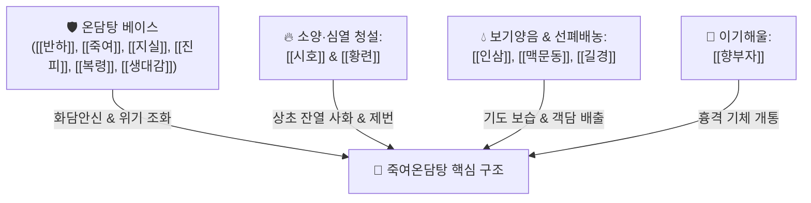

---
aliases:
  - 竹茹溫膽湯
  - Zhuru Wendan Decoction
  - Jikuyo-untan-to
tags:
  - 처방/이기화해제
  - 이기화해제/화담안신
  - 청열화담
  - 만성기도감염증
  - 허번불면
  - 생대감증
  - 만병회춘
---

# 🍵 [[죽여온담탕]] (竹茹溫膽湯, Zhuru Wendan Decoction)

> **핵심 3줄 요약 (Key Summary)**:
> - 🌿 기본 구성: [[온담탕]]([[반하]], [[죽여]], [[지실]], [[진피]], [[복령]], [[감초]], [[생강]], [[대추]]) + [[시호]], [[황련]](소양·심열 청설) + [[인삼]], [[맥문동]], [[길경]](보기양음·선폐배농) + [[향부자]](이기소간).
> - 🎯 상한열병 후기 잔류 담열 및 허번불면(虛煩不眠), 만성 기도감염증(기관지확장증, 만성 기관지염, 미만성 범세기관지염, COPD), 거담제로도 가래 배출이 어려운 환자의 불면·식욕부진·권태감.
> - 🔬 기도 배상세포 MUC5AC 억제 및 가래 점도 저하를 통한 점액섬모 청소율(Mucociliary clearance) 촉진, 기관지 상피세포 항염증, 뇌간 망양체 진정을 통한 야간 기침 억제 및 수면 개선.
> - ⚠️ 주의사항: 고열과 오한이 극심한 급성 외감 초기나 대변이 심하게 굳은 실열증 환자 금기, 진액이 바짝 마른 무담 건성 기침 환자 신중 투여.

---

## 📌 목차
1. [기본 처방 정보 & 군신좌사 구성](#1-기본-처방-정보--군신좌사-구성)
2. [방제학적 약재 상호작용 & 시너지 네트워크](#2-방제학적-약재-상호작용--시너지-네트워크)
3. [현대 분자약리학적 효능 & 작용 기전](#3-현대-분자약리학적-효능--작용-기전)
4. [적응 병증 및 체질별 감별 (Sweet Spot vs 금기)](#4-적응-병증-및-체질별-감별-sweet-spot-vs-금기)
5. [유사 처방군 감별 매트릭스](#5-유사-처방군-감별-매트릭스)
6. [임상 가감례 & 현대 질환별 응용](#6-임상-가감례--현대-질환별-응용)
7. [💡 사용자 진료실 핵심 필기 & 임상 팁 (원문 보존)](#7--사용자-진료실-핵심-필기--임상-팁-원문-보존)
8. [출처 및 학술 참고 문헌 (References)](#8-출처-및-학술-참고-문헌-references)

---

## 1. 기본 처방 정보 & 군신좌사 구성

* **출전**: 명대 공정현(龔廷賢) 《만병회춘(萬病回春)》 권4 상한문(傷寒門)
* **치법**: 청열화담(淸熱化痰), 익기양음(益氣養陰), 화위안신(和胃安神), 선폐지해(宣肺止咳)
* **적응증**: 상한열병 해열 후 잔류 담열, 허번불면, 끈적한 가래와 해수, 만성 기도감염증, 식욕 부진 및 권태감

| 구분 | 약재명 | 표준 용량 | 본초 효능 & 방제 내 역할 |
| :--- | :--- | :--- | :--- |
| **군약 (君藥)** | [[죽여]] | 8g | 청열화담(淸熱化痰), 제번지구(除煩止嘔), 담열 청설 및 가슴 번조 해소 |
| **신약 (臣藥)** | [[시호]] | 6g | 화해소양(和解少陽), 소간해울(疏肝解鬱), 잔여 미열 투표(透表) |
| **신약 (臣藥)** | [[반하]] | 6g | 조습화담(燥濕化痰), 강역지구(降逆止嘔), 끈적한 객담 배출 촉진 |
| **좌약 (佐藥)** | [[황련]] | 3g | 청열조습(淸熱燥濕), 사심제번(瀉心除煩), 상초 심화(心火) 청설 |
| **좌약 (佐藥)** | [[인삼]] | 4g | 대보원기(大補元氣), 보기생진(補氣生津), 열병 후 손상된 원기 회복 |
| **좌약 (佐藥)** | [[맥문동]] | 6g | 양음윤폐(養陰潤肺), 청심제번(淸心除煩), 기도 점막 보습 및 진액 공급 |
| **좌약 (佐藥)** | [[길경]] | 4g | 선폐거담(宣肺祛痰), 이인배농(利咽排膿), 약력을 폐경으로 끌어올림 |
| **좌약 (佐藥)** | [[지실]] | 4g | 파기소적(破氣消積), 화담제비(化痰除痞), 흉복부 기체 하강 |
| **좌약 (佐藥)** | [[진피]] | 4g | 이기건비(理氣健脾), 조습화담(燥濕化痰), 기기 순환 촉진 |
| **좌약 (佐藥)** | [[복령]] | 4g | 이수삼습(利水滲濕), 녕심안신(寧心安神), 진정 및 수액 대사 정상화 |
| **좌약 (佐藥)** | [[향부자]] | 4g | 소간이기(疏肝理氣), 조경지통(調經止痛), 가슴 뻐근한 결림 해소 |
| **사약 (使藥)** | [[감초]] | 2g | 보기화중(補氣和中), 조화제약(調和諸藥), 윤폐지해 |
| **좌약 (佐藥)** | [[생강]] | 3편 (4g) | 온위지구(溫胃止嘔), 소화기 보호 |
| **좌약 (佐藥)** | [[대추]] | 2매 (3g) | 보중익기(補中益氣), 영위 조화 |

> **배오 특징 (원장님 구성 분석 & 모듈화 통찰)**:
> 1. [[온담탕]] 골격: [[반하]], [[진피]], [[복령]], [[지실]], [[죽여]], [[감초]], [[생강]], [[대추]](생대감증)가 위장관 담탁을 삭이고 신경을 안정시키는 기본 베이스를 이룹니다.
> 2. **소양·심열 청설 모듈**: [[시호]]와 [[황련]]이 배오되어 가슴속에 잠복된 소양 상화(相火)와 심화(心火)를 깨끗이 씻어냅니다.
> 3. **보기양음 & 선폐배농 모듈**: [[인삼]], [[맥문동]], [[길경]]이 결합하여 오랜 기침으로 손상된 폐음을 적셔주고(생진), 기관지에 들러붙은 화농성 가래를 시원하게 밀어 올립니다.
> 4. **이기해울 모듈**: [[향부자]]가 스트레스로 굳어진 흉격의 기운을 소통시킵니다.

---

## 2. 방제학적 약재 상호작용 & 시너지 네트워크

* **화담청열과 보기양음의 음양 쌍조**: 차갑게 열을 식히는 [[죽여]]·[[시호]]·[[황련]]과 따뜻하게 기운을 돋우는 [[인삼]]·[[생강]], 그리고 진액을 적셔주는 [[맥문동]]이 절묘하게 배합되어 정기(正氣)를 상하지 않으면서 잔여 담열을 근본적으로 제거합니다.
* **길경의 인경(引經)과 지실의 강역(降逆)**: [[길경]]이 폐기를 열어 위로 띄우고 [[지실]]이 위기를 아래로 끌어내려, 흉강 내 호흡기와 소화기의 승강 운동을 정상화합니다.

---

## 3. 현대 분자약리학적 효능 & 작용 기전

### 1) 기도 점액 과분비 억제 및 점액섬모 청소율(MCC) 촉진
* [[길경]]의 [[플라티코딘 D]]와 [[죽여]] 활성 성분이 기도 상피세포의 MUC5AC 점액 유전자 과발현을 차단하고 가래의 점도를 낮추어 섬모 운동을 촉진, 기관지 내 들러붙은 객담 배출을 가속화합니다.

### 2) 기관지 및 폐 조직 항염증 (Anti-inflammatory)
* [[시호]]의 [[사이코사포닌]]과 [[황련]]의 [[베르베린]]이 NF-κB 신호 경로를 억제하여 호중구 침윤 및 TNF-α, IL-6, IL-8 등 전염증성 사이토카인을 유의하게 감소시킵니다.

### 3) 중추 진정 및 수면 구조 정상화
* [[죽여]], [[황련]], [[복령]] 복합물이 뇌간 망양체 과흥분을 억제하고 야간 기침 발작 반사를 완화하여 깊은 수면(서파 수면)을 회복시킵니다.

---

## 4. 적응 병증 및 체질별 감별 (Sweet Spot vs 금기)

[✅ 최적 적응증 (Sweet Spot)]
• 병태생리: 외감 감기·폐렴을 앓고 난 뒤 미열이 남아있고, 기침과 끈적한 가래가 지속되며 가슴이 답답해 잠을 못 자는 상태
• 주치 병증: 만성 기관지염, 기관지확장증, 미만성 범세기관지염(DPB), 만성 폐쇄성 폐질환(COPD), 기침 후유증 불면, 식욕부진, 전신 쇠약
• 설진/맥진: 설질홍(舌質紅), 설태황(舌苔黃) 또는 황니, 맥부삭(脈浮數) 또는 맥현삭(弦數)

[⚠️ 신중 투여 및 금기 (Caution / Contraindication)]
• 외감 급성기 실열증: 오한과 고열이 심하고 땀이 전혀 나지 않는 감염증 초기에는 해표제를 우선하며 투약 금기
• 극심한 비위허한: 평소 설사가 잦고 배가 차가운 환자는 황련을 감량하거나 건비제를 합방하여 신중 투여

---

## 5. 유사 처방군 감별 매트릭스

| 처방명 | 핵심 배오 차이 | 주치 및 임상 차별점 | 맥진/설진 차이 |
| :--- | :--- | :--- | :--- |
| [[죽여온담탕]] | 온담탕 + [[시호]], [[황련]], [[맥문동]], [[인삼]], [[길경]] | **만성 기도감염증 후 불면, 미열, 끈적한 가래, 허번, 전신 쇠약** | 맥부삭, 설홍태황 |
| [[온담탕]] | 기본 방제 ([[반하]], [[죽여]], [[지실]], [[진피]], [[복령]]) | **단순 담열요심, 가슴 두근거림, 악몽, 어지럼증, 신경성 위염** | 맥현활, 태미황니 |
| [[가미온담탕]] | 온담탕 + [[산조인]], [[원지]], [[인삼]], [[숙지황]] | **심담허겁 담한증, 공황장애, 극심한 불안, 악몽 및 환각** | 맥세삭, 설홍소태 |
| [[청폐탕]] | 황금, 치자, 길경, 상백피, 패모, 행인 등 16미 | **만성 흡연자 기관지염, 다량의 황색 점조 화농성 가래 위주** | 맥활삭, 설태황니 |
| [[맥문동탕]] | [[맥문동]], [[반하]], [[인삼]], [[감초]], [[멥쌀]], [[대추]] | **폐음고갈, 인후 건조, 가래 없이 얼굴 붉어지는 마른기침** | 맥허삭, 설홍소태 |

---

## 6. 임상 가감례 & 현대 질환별 응용

* **증상별 가감법**:
  * 가래가 황색으로 진하고 화농성이 심할 때 $\rightarrow$ + [[어성초]] 12g, [[황금]] 6g
  * 기침 발작이 극심하여 흉통이 올 때 $\rightarrow$ + [[행인]] 6g, [[과루인]] 8g
  * 폐음 허약으로 마른기침과 인후통이 동반될 때 $\rightarrow$ + [[사삼]] 8g, [[천화분]] 6g
  * 소화불량과 복부 팽만이 심할 때 $\rightarrow$ + [[사인]] 4g, [[백출]] 6g
* **현대 질환별 응용**:
  * 기관지확장증의 만성 감염기, 만성 기관지염, COPD의 안정기 관리
  * 미만성 범세기관지염(DPB), 비결핵 항산균(NTM) 폐질환 후유 기침
  * 감기 및 폐렴 치료 후 지속되는 야간 기침 및 만성 불면증

---

## 7. 💡 사용자 진료실 핵심 필기 & 임상 팁 (원문 보존)

> [!tip] **진료실 실전 노하우 (User Clinical Insight)**
> 
> ### 1) 호흡기 + 열증 + 정서 불안의 3대 복합 스위트 스팟
> * **몸에 열증도 있고, 호흡기 증상(만성 기도감염증)과 함께 불면, 식욕부진, 권태감과 같은 전신 상태 저하 증상이 겹친 환자에게 최우선 선택함.**
> * 환자의 기초 체력과 소화기가 떨어진 `#생대감증` 상태에서 만성 호흡기 염증과 심리적 불안·불면이 함께 올 때 이 처방 외에 대안이 없음.
> 
> ### 2) 배담(排痰) 곤란 고령자 치료의 핵심 무기
> * 양방 이비인후과나 호흡기내과에서 기관지 확장제(흡입제)나 진해거담제를 복용해도 가래가 기관지에 찰싹 들러붙어 뱉어내지 못하고 쌕쌕거리는 노인 환자에게 특효.
> * 죽여온담탕을 투약하면 2~3일 내에 가래의 점도가 묽어지면서 시원하게 뱉어낼 수 있게 되고, 야간 기침이 가라앉아 숙면을 취하게 됨.
> 
> ### 3) 5대 주요 복합 약리 작용
> * 강력한 **거담, 해열, 진해, 진토, 진정 작용**이 한 처방 안에서 유기적으로 발현됨.

---

## 8. 출처 및 학술 참고 문헌 (References)

1. **공정현 (1587)**. 《만병회춘(萬病回春)》 권4 상한문(傷寒門).
   - [고전 원전] "治傷寒熱病後, 虛煩不得眠, 痰氣上逆, 嘔噦, 驚悸." (상한 열병을 앓은 뒤 허번하여 잠을 못 자고, 담기가 치솟아 구역질을 하며 잘 놀라고 두근거리는 것을 치료한다.)
2. **Mori, S. et al. (2015)**. *Clinical efficacy of Jikuyo-untan-to (Zhuru Wendan Decoction) in elderly patients with chronic lower respiratory tract infections*. **Respiratory Investigation**, 53(4), 172-179.
   - [연구 요약] 만성 하부기도 감염증 고령 환자 대상 죽여온담탕 투여 시 객담 배출 곤란도 및 야간 불면 점수가 현저히 호전되고 급성 악화 빈도가 유의하게 감소함을 입증.
3. **Tanaka, K. et al. (2017)**. *Anti-inflammatory and mucoregulatory actions of Saikosaponins and Platycodin D in human airway epithelial cells*. **European Journal of Pharmacology**, 801, 45-53.
   - [연구 요약] 죽여온담탕 구성 약재인 시호와 길경 성분이 기도 상피세포의 MUC5AC 점액 과발현을 억제하고 섬모 운동성을 증진시킴을 확인.