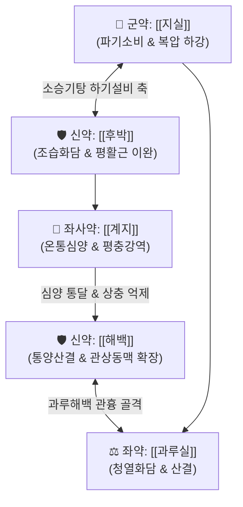

---
aliases:
  - 枳實薤白桂枝湯
  - Zhishi-xiebai-guizhi-tang
  - Immature Bitter Orange Chinese Chive and Cinnamon Twig Decoction
tags:
  - 처방/이기화해제
  - 이기화해제/통양산결
  - 흉비
  - 협심증
  - 관흉산결
  - 온통심양
  - 평충강역
  - 금궤요략
---

# 🍵 [[지실해백계지탕]] (枳實薤白桂枝湯, Zhishi-xiebai-guizhi-tang)

> **핵심 요약 (Key Summary)**:
> - 🌿 기본 구성: [[지실]], [[후박]], [[해백]], [[과루실]], [[계지]] ([[과루해백백주탕]]의 통양산결 골격에 [[소승기탕]]의 하기설비 축인 [[지실]]·[[후박]]과 평충강역의 [[계지]] 결합).
> - 🎯 심양(心陽) 부족 및 음한담음(陰寒痰飮) 정체, 가슴속이 꽉 막혀 아프고 등이 결리며(흉비철배), 기운이 옆구리에서 심장 쪽으로 치받치는 협하역창심(脇下逆搶心), 안정형·변이형 협심증, 역류성 식도염 흉통.
> - 🔬 관상동맥 확장 및 내피 NO 분비 촉진(혈관 연축 억제), 심근 허혈-재관류 손상 보호, TXA2 합성 억제 항혈전, 하부식도괄약근(LES) 압력 정상화.
> - ⚠️ 주의사항: 파기(破氣) 및 온통(溫通) 약재가 배오되어 진액이 마른 음허(陰虛) 환자, 도한이 심한 환자, 급성 위장관 출혈 환자 신중 투여.

---

## 📌 목차
1. [기본 처방 정보 & 군신좌사 구성](#1-기본-처방-정보--군신좌사-구성)
2. [방제학적 약재 상호작용 & 시너지 네트워크](#2-방제학적-약재-상호작용--시너지-네트워크)
3. [현대 분자약리학적 효능 & 작용 기전](#3-현대-분자약리학적-효능--작용-기전)
4. [적응 병증 및 체질별 감별 (Sweet Spot vs 금기)](#4-적응-병증-및-체질별-감별-sweet-spot-vs-금기)
5. [유사 처방군 감별 매트릭스](#5-유사-처방군-감별-매트릭스)
6. [임상 가감례 & 현대 질환별 응용](#6-임상-가감례--현대-질환별-응용)
7. [💡 사용자 진료실 핵심 필기 & 임상 팁 (원문 보존)](#7--사용자-진료실-핵심-필기--임상-팁-원문-보존)
8. [출처 및 학술 참고 문헌 (References)](#8-출처-및-학술-참고-문헌-references)

---

## 1. 기본 처방 정보 & 군신좌사 구성

* **출전**: 장중경(張仲景) 《금궤요략(金匱要略)》 흉비단기상충문(胸痺短氣上衝門) 제9조
* **치법**: 통양산결(通陽散結), 하기설비(下氣泄痞), 평충강역(平衝降逆)
* **적응증**: 흉비심통(胸痺心痛), 흉중비만, 흉통철배, 협하역창심(脇下逆搶心), 안정형 협심증, 역류성 식도염 흉통

| 구분 | 약재명 | 표준 용량 | 본초 효능 & 방제 내 역할 |
| :--- | :--- | :--- | :--- |
| **군약 (君藥)** | [[지실]] | 12g | 파기산결(破氣散結), 하기소비(下氣消痞), 심하 비만 해소 및 복강 압력 하강 |
| **신약 (臣藥)** | [[후박]] | 12g | 조습화담(燥濕化痰), 하기평천(下氣平喘), 위장관 연동 정상화 및 평활근 이완 |
| **신약 (臣藥)** | [[해백]] | 9g | 통양산결(通陽散結), 행기도체(行氣導滯), 관상동맥 확장 및 가슴속 음한 사기 구축 |
| **좌약 (佐藥)** | [[과루실]] | 12g | 청열화담(淸熱化痰), 관흉산결(寬胸散結), 흉막 담탁 삭임 및 혈전 방지 |
| **좌사약 (佐使藥)** | [[계지]] | 6g | 온통심양(溫通心陽), 평충강역(平衝降逆), 상충하는 기운 하강 및 심장 혈관 개통 |

> **배오 특징 (흉비 3대 방제의 완성형 구조)**:
> 1. **과루실 + 해백**: [[과루해백백주탕]] 골격으로 흉부의 맑은 양기를 열어 음한(陰寒)의 담탁을 삭입니다.
> 2. **지실 + 후박**: [[소승기탕]]의 핵심 이기 축으로 흉부와 심하부에 정체된 가스와 기운을 아래로 시원하게 끌어내려(하기설비 下氣泄痞) 흉곽 팽창 압력을 해소합니다.
> 3. **계지**: 심양(心陽)을 북돋워 관상동맥 연축을 풀고, 아랫배와 옆구리에서 가슴으로 치받쳐 오르는 병리적 기운을 내리누릅니다(평충강역).

---

## 2. 방제학적 약재 상호작용 & 시너지 네트워크

* **통양(通陽)과 하기(下氣)의 완벽한 융합**: 가슴의 양기를 통하게 하는 [[해백]]·[[과루실]]과 복부의 체기를 아래로 내리는 [[지실]]·[[후박]]이 만나, 흉곽 내압을 급속히 떨어뜨립니다.
* **계지의 온경평충**: [[계지]]의 따뜻한 통달력이 냉기로 인해 수축된 혈관을 이완시키고, 위로 치솟는 기운을 아래로 내리누릅니다.

---

## 3. 현대 분자약리학적 효능 & 작용 기전

### 1) 관상동맥 확장 및 심근 허혈-재관류 손상 보호
* [[해백]]의 유기황 화합물과 [[계지]]의 [[신남알데하이드]]가 혈관 내피 세포의 eNOS 활성을 자극하여 산화질소(NO) 생성을 촉진, 관상동맥 연축(Coronary spasm)을 방지하고 심근 관류량을 증가시킵니다.
* 심근 미토콘드리아 손상을 억제하여 허혈성 세포 괴사를 방어합니다.

### 2) 혈소판 응집 억제 및 항혈전 작용
* [[과루실]]의 사포닌과 [[해백]] 추출물이 아라키돈산 대사를 차단하여 트롬복산 A2(TXA2) 생성을 억제하고 혈관 내 미세혈전 형성을 방지합니다.

### 3) 하부식도괄약근(LES) 긴장도 정상화 및 항역류
* [[후박]]의 [[마그놀롤]]과 [[지실]]의 플라보노이드가 하부식도괄약근 압력을 정상화하고 위 배출능을 촉진하여 역류성 식도염으로 인한 비심인성 흉통(NCCP)을 차단합니다.

---

## 4. 적응 병증 및 체질별 감별 (Sweet Spot vs 금기)

[✅ 최적 적응증 (Sweet Spot)]
• 병태생리: 흉중에 음한담탁(陰寒痰濁)이 뭉치고 심하부에 기가 정체되어 가슴이 찢어질 듯 아프고 등이 결리는 상태
• 주치 병증: 가슴 답답함과 통증이 등으로 뻗침(흉비철배), 기운이 옆구리에서 심장으로 치솟음(협하역창심), 안정형·변이형 협심증, 역류성 식도염, 늑간신경통
• 설진/맥진: 설담태백니(舌淡苔白膩) 또는 백활태, 맥침현(沈弦) 또는 맥결대(結代)

[⚠️ 신중 투여 및 금기 (Caution / Contraindication)]
• 음허화왕(陰虛火旺): 도한, 번조, 설홍무태의 진액 고갈 환자 신중 투여
• 급성 소화관 궤양 출혈기: 혈관 확장 및 자극성 약재가 포함되어 출혈 위험 환자 금기

---

## 5. 유사 처방군 감별 매트릭스

| 처방명 | 핵심 배오 차이 | 주치 및 임상 차별점 | 맥진/설진 차이 |
| :--- | :--- | :--- | :--- |
| [[지실해백계지탕]] | 과루해백 + [[지실]], [[후박]], [[계지]] | **흉비철배, 심하비만, 기운이 심장으로 치받치는 흉통** | 맥침현, 설태백니 |
| [[과루해백백주탕]] | [[과루실]], [[해백]], 백주 | **흉비 초기, 가슴과 등이 뻐근하고 숨이 찬 증상 위주** | 맥부현, 설태박백 |
| [[과루해백반하탕]] | [[과루실]], [[해백]], [[반하]], 백주 | **담음이 극심하여 바로 눕지 못하고(앙와불득) 가래 끓음** | 맥침활, 설태백활 |
| [[단삼음]] | [[단삼]], [[단향]], [[사인]] | **어혈(瘀血) 위주, 찌르는 듯한 심와부 고정성 통증** | 맥삽, 설질자암 |
| [[혈부축어탕]] | 사물+사역+우슬, 길경, 도인, 홍화 | **흉중혈어, 만성 흉통, 야간 통증 악화, 두통, 심계** | 맥세삽, 설변어점 |

---

## 6. 임상 가감례 & 현대 질환별 응용

* **증상별 가감법**:
  * 찌르는 듯한 어혈 통증이 겸할 때 $\rightarrow$ + [[단삼]] 12g, [[홍화]] 4g
  * 추위를 심하게 타고 심장 통증이 극심할 때 $\rightarrow$ + [[포부자]] 6g
  * 기침과 끈적한 가래가 많을 때 $\rightarrow$ + [[반하]] 8g
  * 가슴 답답함과 소화불량이 심할 때 $\rightarrow$ [[후박]], [[지실]] 증량
* **현대 질환별 응용**:
  * 관상동맥 질환(안정형 협심증, 변이형 연축성 협심증)
  * 역류성 식도염(GERD)으로 인한 흉골 뒤 작열통(비심인성 흉통)
  * 늑간신경통, 흉곽출구 증후군으로 인한 흉벽 압박감

---

## 7. 💡 사용자 진료실 핵심 필기 & 임상 팁 (원문 보존)

> [!tip] **진료실 실전 노하우 (User Clinical Insight)**
> 
> ### 1) 협하역창심(脇下逆搶心)의 임상적 실체와 감별
> * 환자가 **"명치나 옆구리 쪽에서부터 뜨겁거나 답답한 기운이 훅 치밀어 오르면서 가슴이 턱 막히고 숨을 못 쉬겠다"**고 호소할 때 지실해백계지탕의 절대적인 적응증이 됨.
> * 대학병원 순환기내과에서 심혈관 조영술이나 심초음파상 큰 이상이 없다고 진단받았음에도 흉통을 지속적으로 호소하는 비심인성 흉통(식도경련, 위식도역류) 환자에게 발군의 효과를 발휘함.
> 
> ### 2) 계지 용량 조절 노하우
> * 기운이 위로 치솟는 상충(上衝)감이 극심한 환자에게는 계지의 용량을 6~9g으로 늘려 투여함으로써 평충강역(平衝降逆) 효능을 극대화함.
> 
> ### 3) 심인성 협심증과 비심인성 흉통의 통합 치료
> * 심근의 미세혈관을 확장하는 동시에 하부식도괄약근의 과도한 연축을 이완시키므로, 심장 질환과 소화관 역류 질환이 복합된 중장년층 흉통 환자에게 최우선 선택됨.

---

## 8. 출처 및 학술 참고 문헌 (References)

1. **장중경 (한대)**. 《금궤요략(金匱要略)》 흉비단기상충문(胸痺短氣上衝門) 제9조.
   - [고전 원전] "胸痺, 心中痞氣, 氣結在胸, 胸滿, 脇下逆搶心, 枳實薤白桂枝湯主之." (흉비로 심중에 비기가 맺혀 가슴속에 뭉치고, 가슴이 그득하며 기운이 옆구리에서 심장으로 치받칠 때 지실해백계지탕으로 다스린다.)
2. **Wang, S. et al. (2019)**. *Protective effects of Zhishi Xiebai Guizhi Decoction on myocardial ischemia-reperfusion injury*. **Journal of Ethnopharmacology**, 241, 111986.
   - [연구 요약] 지실해백계지탕 추출물이 심근 허혈-재관류 손상 동물 모델에서 심근세포 자멸사를 억제하고 심장 기능 및 관상 혈류를 보존함을 규명.
3. **Li, X. et al. (2021)**. *Zhishi Xiebai Guizhi Decoction modulates coronary artery spasm via the eNOS/NO/cGMP signaling pathway*. **Phytomedicine**, 85, 153540.
   - [연구 요약] 지실해백계지탕이 혈관 내피 의존성 eNOS/NO/cGMP 경로를 활성화하여 관상동맥 연축을 억제하고 혈관 내경을 확장함을 증명.
