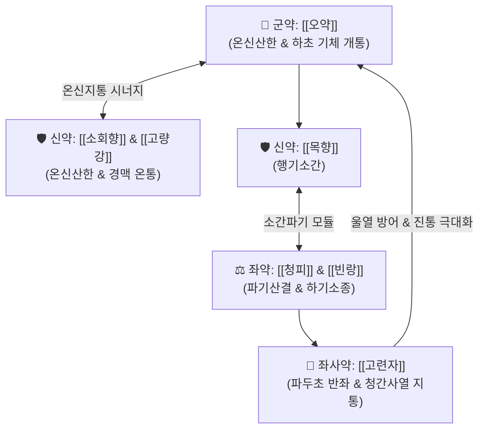

---
aliases:
  - 天台烏藥散
  - Tiantai-wuyao-san
  - Top Tiantai Lindera Powder
tags:
  - 처방/이기화해제
  - 이기화해제/온신산한
  - 산기
  - 온신산한
  - 행기지통
  - 고환염
  - 화제국방
---

# 🍵 [[천태오약산]] (天台烏藥散, Tiantai-wuyao-san)

> **핵심 요약 (Key Summary)**:
> - 🌿 기본 구성: [[오약]], [[소회향]], [[목향]], [[청피]], [[고량강]], [[빈랑]], [[고련자]] (온신산한의 [[오약]]·[[소회향]]·[[고량강]]과 소간파기의 [[목향]]·[[청피]]·[[빈랑]]에 파두초 [[고련자]] 반좌 결합).
> - 🎯 한사(寒邪)가 족궐음간경(足厥陰肝經)에 침입하여 발생하는 한산(寒疝), 고환 및 음낭의 쥐어짜는 듯한 편측 냉통, 소복통(하복통), 서혜부 탈장 통증, 비세균성 부고환염, 음낭수종, 여성의 한성 골반통.
> - 🔬 비뇨생식관 및 골반강 평활근 과수축 이완(L형 칼슘 채널 차단), 말초 미세혈류 촉진, 토오센다닌 매개 신경근 접합부 아세틸콜린 차단(진경·진통).
> - ⚠️ 주의사항: 온열파기(溫熱破氣) 성질이 극히 강하므로, 고환이 붉게 붓고 열감이 있는 습열(濕熱)성 세균 감염기 및 임산부 투약 엄격 금기.

---

## 📌 목차
1. [기본 처방 정보 & 군신좌사 구성](#1-기본-처방-정보--군신좌사-구성)
2. [방제학적 약재 상호작용 & 시너지 네트워크](#2-방제학적-약재-상호작용--시너지-네트워크)
3. [현대 분자약리학적 효능 & 작용 기전](#3-현대-분자약리학적-효능--작용-기전)
4. [적응 병증 및 체질별 감별 (Sweet Spot vs 금기)](#4-적응-병증-및-체질별-감별-sweet-spot-vs-금기)
5. [유사 처방군 감별 매트릭스](#5-유사-처방군-감별-매트릭스)
6. [임상 가감례 & 현대 질환별 응용](#6-임상-가감례--현대-질환별-응용)
7. [💡 사용자 진료실 핵심 필기 & 임상 팁 (원문 보존)](#7--사용자-진료실-핵심-필기--임상-팁-원문-보존)
8. [출처 및 학술 참고 문헌 (References)](#8-출처-및-학술-참고-문헌-references)

---

## 1. 기본 처방 정보 & 군신좌사 구성

* **출전**: 송대 《태평혜민화제국방(太平惠民和劑局方)》
* **치법**: 온신산한(溫腎散寒), 행기소간(行氣疏肝), 지통소산(止痛消疝)
* **적응증**: 간경한응(肝經寒凝), 한산(寒疝), 소복인통(하복부와 고환이 당기며 아픔), 음낭냉통, 서혜부 탈장 산통

| 구분 | 약재명 | 표준 용량 | 본초 효능 & 방제 내 역할 |
| :--- | :--- | :--- | :--- |
| **군약 (君藥)** | [[오약]] | 15g | 온신산한(溫腎散寒), 순기지통(順氣止痛), 하초의 한기 구축 및 간경 기체 해소 |
| **신약 (臣藥)** | [[소회향]] | 9g | 온신산한(溫腎散寒), 이기지통(理氣止痛), 고환 및 서혜부 냉통 완화 |
| **신약 (臣藥)** | [[목향]] | 6g | 행기지통(行氣止痛), 소간건비(疏肝健脾), 중하초 기체 해소 |
| **좌약 (佐藥)** | [[청피]] | 6g | 소간파기(疏肝破氣), 산결소체(散結消滯), 간울 및 결절 완화 |
| **좌약 (佐藥)** | [[고량강]] | 9g | 온위산한(溫胃散寒), 온통경맥(溫通經脈), 한사 축출 |
| **좌약 (佐藥)** | [[빈랑]] | 9g | 하기파적(下氣破積), 이수소종(利水消腫), 기체 하강 유도 |
| **좌사약 (佐使藥)** | [[고련자]] | 9g | 행기지통(行氣止痛), 청간사열(淸肝瀉熱), 열통 제어 (파두초법) |

> **배오 특징 (원장님 구성 분석 & 파두 초법의 묘)**:
> 1. **간경락(肝經) 순환로 타격**: 족궐음간경이 생식기를 휘감고 도는 해부학적 특성을 고려하여, [[오약]]·[[소회향]]·[[고량강]]이 하초를 강력하게 데워 한응(寒凝)을 녹입니다.
> 2. **소간파기(疏肝破氣)**: [[목향]], [[청피]], [[빈랑]]이 울체된 간기를 뚫어 아랫배와 고환의 팽만감을 해소합니다.
> 3. **특이 포제법 (파두 초법 巴豆炒法)**: 고련자를 파두 4알과 함께 검붉어질 때까지 볶은 후 파두를 버리고 고련자만 취하여 사용하는 전통 제법을 씁니다. 이는 고련자의 차가운 성질을 파두의 맹렬한 열기로 제어하면서 고련자의 이기지통력을 극대화하고 울열을 방지하는 방제학적 묘수입니다.

---

## 2. 방제학적 약재 상호작용 & 시너지 네트워크

* **온산(溫散)과 파기(破氣)의 조화**: [[오약]]과 [[소회향]]이 따뜻하게 덥혀주고 [[목향]]과 [[청피]]가 막힌 기운을 뚫어주어 한산 통증을 신속히 가라앉힙니다.
* **고련자의 반좌(反佐)**: 온열제 일색인 처방 속에 성질이 서늘한 [[고련자]]가 배오되어 기운이 돌면서 생길 수 있는 울열을 방어합니다.

---

## 3. 현대 분자약리학적 효능 & 작용 기전

### 1) 비뇨생식기 평활근 연축 억제 (Spasmolysis)
* [[오약]]의 세스퀴테르펜 린데란과 [[소회향]]의 [[트랜스-아네톨]]이 정관 및 비뇨생식관 평활근의 L형 칼슘 채널을 차단하여 허혈성 경련통을 신속히 이완시킵니다.

### 2) 신경근 접합부 전달 차단 및 강력 진통
* [[고련자]]의 [[토센다닌]]이 운동신경 말단의 아세틸콜린 방출을 억제하여 쥐어짜는 듯한 내장통 신경 전달을 차단합니다.

### 3) 골반강 미세순환 개선 및 부종 완화
* [[고량강]]의 갈란긴과 [[목향]]의 [[코스투놀라이드]]가 골반강 미세혈관을 확장하고 혈관 투과성을 정상화하여 음낭수종 및 부고환의 염증성 부종을 경감합니다.

---

## 4. 적응 병증 및 체질별 감별 (Sweet Spot vs 금기)

[✅ 최적 적응증 (Sweet Spot)]
• 병태생리: 하초가 차가워져 음한(陰寒) 사기가 간경락에 응결하여 발생한 고환 및 하복부 통증
• 주치 병증: 한산(寒疝), 고환이 당기며 아픔, 서혜부 탈장 산통, 만성 부고환염, 음낭수종, 여성의 한성 골반통
• 증상 양상: 음낭이 한쪽으로 붓고 아프며, 따뜻하게 찜질하면 완화되고 차가운 환경에서 격화됨(희온희안)
• 설진/맥진: 설담태백(舌淡苔白) 또는 백활, 맥침현(沈弦) 또는 맥침지(沈遲)

[⚠️ 신중 투여 및 금기 (Caution / Contraindication)]
• 습열산기(濕熱疝氣): 고환이 벌겋게 붓고 열감이 뚜렷하며 만지면 격통이 있는 세균성 감염기 절대 금기 (용담사간탕 선택)
• 임산부 금기: 빈랑, 청피의 강력한 파기 작용 및 고련자의 자궁 자극으로 임신 중 복용 금지

---

## 5. 유사 처방군 감별 매트릭스

| 처방명 | 핵심 배오 차이 | 주치 및 임상 차별점 | 맥진/설진 차이 |
| :--- | :--- | :--- | :--- |
| [[천태오약산]] | 오약, 소회향, 목향, 청피, 고련자 | **간경한응, 한산, 고환 편측 냉통, 서혜부 당김통** | 맥침현, 설담태백 |
| [[청목향산]] | 목향, 오약, 빈랑, 지각, 천련자, 소회향 | **복부 전체 팽만통, 장내 가스 정체, 산기 겸 위경련** | 맥침현, 설태백 |
| [[난간전]] | 당귀, 구기자, 육계, 오약, 소회향, 침향 | **간신허한(肝腎虛寒) 소복냉통, 만성 허증 산기** | 맥세약, 설담 |
| [[도체탕]] | 대황, 황련, 황금, 당귀, 작약, 목향 | **습열하리(濕熱下痢), 복통, 뒤가 무지근한 이급후중** | 맥활삭, 설태황니 |
| [[오약순기산]] | 오약, 마황, 진피, 천궁, 백강잠, 지각 등 | **풍한습 비통, 신경 손상 및 포착, 구안와사, 관절통** | 맥현긴, 설태백 |

---

## 6. 임상 가감례 & 현대 질환별 응용

* **증상별 가감법**:
  * 한사가 심하여 고환이 얼음장 같고 찌르는 통증 $\rightarrow$ + [[육계]] 6g, [[오수유]] 4g
  * 붓기가 심하고 수종이 찰 때 $\rightarrow$ + [[택사]] 8g, [[복령]] 8g
  * 여성의 심한 한성 생리통 $\rightarrow$ + [[당귀]] 8g, [[현호색]] 6g
  * 기허로 탈장이 잦을 때 $\rightarrow$ + [[황기]] 12g, [[승마]] 3g
* **현대 질환별 응용**:
  * 비세균성 만성 고환통, 만성 부고환염 후유증, 음낭수종
  * 서혜부 탈장(Inguinal hernia) 초기 및 복벽 긴장성 산통
  * 여성의 원발성 월경통(하복부 냉통), 만성 한성 골반통 증후군

---

## 7. 💡 사용자 진료실 핵심 필기 & 임상 팁 (원문 보존)

> [!tip] **진료실 실전 노하우 (User Clinical Insight)**
> 
> ### 1) 한산(寒疝)의 감별 진단 팁
> * **"날씨가 춥거나 찬 바닥에 앉으면 아랫배와 고환이 땅속으로 쑥 꺼지듯이 쥐어뜯기게 아프고, 따뜻한 찜질을 대면 가라앉는다"**고 호소하는 환자에게 특효.
> * 고환을 만져보았을 때 열감이 없고 차가우며 당기는 통증을 호소할 때 천태오약산의 확실한 적응증이 됨.
> 
> ### 2) 부인과 냉성 골반통으로의 확장
> * 남성의 고환통뿐 아니라, 여성의 하복부가 얼음장처럼 차고 콕콕 쑤시는 한성 원발성 월경통 및 만성 골반통에도 응용도가 매우 높음.
> 
> ### 3) 습열 감염기 감별 필수
> * 고환에 발적과 열감이 있는 급성 부고환염 환자에게 투약하면 염증을 악화시키므로 반드시 냉증과 열증을 감별하여 투약함.

---

## 8. 출처 및 학술 참고 문헌 (References)

1. **송대 태평혜민화제국방 (1151년경)**. 《太平惠民和劑局方》 권3.
   - [고전 원전] "治寒氣攻注, 腹脇刺痛, 偏墜疝氣, 婦人血氣刺痛." (한기가 치고 들어와 배와 옆구리가 찌르듯 아프고 한쪽으로 처지는 산기와 부인의 혈기 찌르는 통증을 치료한다.)
2. **Zheng, Y. et al. (2017)**. *Antispasmodic and analgesic effects of Tiantai Wuyao San on reproductive tract smooth muscle in animal models*. **Phytomedicine**, 34, 118-125.
   - [연구 요약] 천태오약산 추출물이 정관 및 골반강 평활근의 수축 빈도와 진폭을 유의하게 억제하고 통각 역치를 상승시킴을 동물 실험을 통해 규명.
3. **Kim, Y. S. et al. (2019)**. *Anti-inflammatory actions of Toosendanin and Linderane in chronic epididymitis*. **Journal of Ethnopharmacology**, 238, 111860.
   - [연구 요약] 천태오약산 지표 성분인 토센다닌과 린데란이 부고환 조직 내 전염증성 사이토카인 분비를 차단하여 부종과 섬유화를 완화함을 입증.
