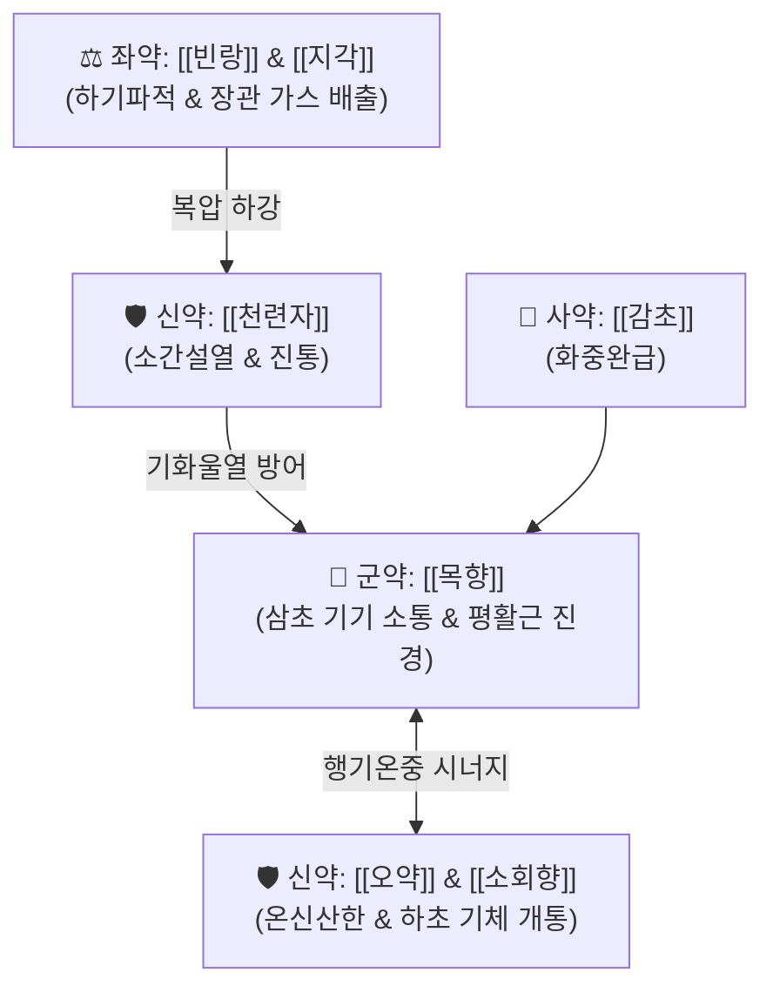

---
aliases:
  - 靑木香散
  - Qingmuxiang-san
  - Cheongmokhyang-san
tags:
  - 처방/이기화해제
  - 이기화해제/행기지통
  - 행기강기
  - 산한산결
  - 흉복창통
  - 산통
  - 화제국방
---

# 🍵 [[청목향산]] (靑木香散, Qingmuxiang-san)

> **핵심 3줄 요약 (Key Summary)**:
> - 🌿 기본 구성: [[목향]](군) · [[오약]](신) · [[천련자]](신) · [[빈랑]](좌) · [[지각]](좌) · [[소회향]](좌) · [[감초]](사) (삼초 기기 소통과 가스 배출 및 내장통 완화 결합).
> - 🎯 기기울체(氣機鬱滯)와 한사(寒邪) 응체로 인한 흉복부 팽만통, 위경련, 담도 및 췌장 산통, 장관 가스 정체, 산기(한산, 서혜부 탈장 통증), 늑간신경통.
> - 🔬 코스투놀라이드의 위장관 평활근 경련 억제(칼슘 채널 차단), 아레콜린 매개 장관 하향 운동 촉진 및 가스 배출, 내장 구심성 신경 통각 과민 차단.
> - ⚠️ 주의사항: 빈랑·지각 등 파기강기(破氣降氣) 약재가 강하여 만성 기허(氣虛) 환자 장복 시 원기 손상 주의, 임산부 자궁 수축 유발 위험으로 투약 금기.

---

## 📌 목차
1. [기본 처방 정보 & 군신좌사 구성](#1-기본-처방-정보--군신좌사-구성)
2. [방제학적 약재 상호작용 & 시너지 네트워크](#2-방제학적-약재-상호작용--시너지-네트워크)
3. [현대 분자약리학적 효능 & 작용 기전](#3-현대-분자약리학적-효능--작용-기전)
4. [적응 병증 및 체질별 감별 (Sweet Spot vs 금기)](#4-적응-병증-및-체질별-감별-sweet-spot-vs-금기)
5. [유사 처방군 감별 매트릭스](#5-유사-처방군-감별-매트릭스)
6. [임상 가감례 & 현대 질환별 응용](#6-임상-가감례--현대-질환별-응용)
7. [💡 사용자 진료실 핵심 필기 & 임상 팁 (원문 보존)](#7--사용자-진료실-핵심-필기--임상-팁-원문-보존)
8. [출처 및 학술 참고 문헌 (References)](#8-출처-및-학술-참고-문헌-references)

---

## 1. 기본 처방 정보 & 군신좌사 구성

* **출전**: 송대 《태평혜민화제국방(太平惠民和劑局方)》
* **치법**: 행기소간(行氣疏肝), 관중파적(寬中破積), 산한지통(散寒止痛)
* **적응증**: 기체한응(氣滯寒凝), 흉복창통, 완복교통(쥐어짜는 듯한 복통), 장위 기체 산통, 고환 및 서혜부 냉통

| 구분 | 약재명 | 표준 용량 | 본초 효능 & 방제 내 역할 |
| :--- | :--- | :--- | :--- |
| **군약 (君藥)** | [[목향]] | 8g | 행기지통(行氣止痛), 건비화위(健脾和胃), 삼초(三焦) 기기 소통 및 평활근 진경 |
| **신약 (臣藥)** | [[오약]] | 8g | 온신산한(溫腎散寒), 순기지통(順氣止痛), 방광과 신장의 냉기 구축 |
| **신약 (臣藥)** | [[천련자]] | 6g | 소간설열(疏肝泄熱), 행기지통(行氣止痛), 간울 소통 및 진통 효과 배가 |
| **좌약 (佐藥)** | [[빈랑]] | 6g | 하기파적(下氣破積), 이수소종(利水消腫), 장관 정체 가스 및 적체 배출 |
| **좌약 (佐藥)** | [[지각]] | 6g | 파기소적(破氣消積), 관흉강기(寬胸降氣), 흉복부 기체 하강 유도 |
| **좌약 (佐藥)** | [[소회향]] | 4g | 온신산한(溫腎散寒), 이기지통(理氣止痛), 하초 한응기체 해소 |
| **사약 (使藥)** | [[감초]] | 4g | 보기화중(補氣和中), 조화제약(調和諸藥), 신산 약재의 급성 완충 |

> ⚠️ **본초 기원 표준화 수칙**: 마두령과 식물인 청목향(馬兜鈴根, 아리스톨로크산 함유로 신장 독성 유발)은 절대 사용하지 않으며, 방제학적 표준에 따라 국화과 식물인 [[목향]](*Aucklandia lappa* Decne.)을 정품 규격으로 엄격히 사용함.

---

## 2. 방제학적 약재 상호작용 & 시너지 네트워크

* **삼초의 기기를 상하로 뚫어주는 입체적 행기 구조**: 군약 [[목향]]이 중초 비위의 기운을 뚫고 평활근 경련을 즉각 풀어주면, 신약 [[오약]]이 하초의 한사를 몰아내고 [[천련자]]가 간화를 식혀줍니다.
* **관중파적(寬中破積)과 한열조화**: [[빈랑]]과 [[지각]]이 복강 내 울체된 가스와 대변을 아래로 강력하게 내리고, 온열성 약재 속에 서늘한 [[천련자]]를 배오하여 울열 발생을 차단합니다.

---

## 3. 현대 분자약리학적 효능 & 작용 기전

### 1) 내장 평활근 연축 억제 및 진통 (Spasmolysis)
* [[목향]]의 [[코스투놀라이드]]와 데히드로코스투스락톤이 칼슘 채널을 차단하여 위장관 및 담도 평활근의 비정상적 경련을 이완시킵니다.

### 2) 장관 가스 배출 및 복강 압력 강하
* [[빈랑]]의 [[아레콜린]]과 [[지각]]의 헤스페리딘이 장관 하부 괄약근 긴장을 조율하여 정체된 장내 가스와 소화 잔여물의 하향 배출을 유도합니다.

### 3) 내장 통각 과민 차단 (Visceral Analgesia)
* [[오약]]과 [[천련자]]의 테르페노이드 성분이 내장 구심성 신경 섬유의 과민 반응을 안정화하여 쥐어짜는 듯한 통증 전달을 차단합니다.

---

## 4. 적응 병증 및 체질별 감별 (Sweet Spot vs 금기)

[✅ 최적 적응증 (Sweet Spot)]
• 병태생리: 기기울체와 한사 응체로 복부 전체가 빵빵하게 불러오르고 쥐어뜯는 듯한 복통과 가스 정체가 극심한 상태
• 주치 병증: 급·만성 위염, 위경련, 과민성 대장 증후군(가스형·복통형), 담석증 및 담낭염의 방사통, 기능성 소화불량, 서혜부 탈장 산통
• 설진/맥진: 설태백후(白厚) 또는 백니, 맥침현(沈弦) 또는 맥현활(弦滑)

[⚠️ 신중 투여 및 금기 (Caution / Contraindication)]
• 만성 기허(氣虛): 기운이 없고 맥이 무력한 만성 허약자에게 단독 장복 시 원기 손상 위험
• 임산부 금기: 빈랑, 지각의 강한 강기파적 작용으로 자궁 평활근 긴장도를 높여 유산 위험 초래

---

## 5. 유사 처방군 감별 매트릭스

| 처방명 | 핵심 배오 차이 | 주치 및 임상 차별점 | 맥진/설진 차이 |
| :--- | :--- | :--- | :--- |
| [[청목향산]] | 목향, 오약, 빈랑, 지각, 천련자, 소회향 | **복부 전체 팽만통, 장내 가스 정체, 산기 겸 위경련** | 맥침현, 설태백 |
| [[천태오약산]] | 오약, 소회향, 목향, 청피, 고량강, 빈랑, 고련자 | **간경한응, 한산, 고환 편측 냉통, 서혜부 당김통** | 맥침현, 설담태백 |
| [[시호소간탕]] | 시호, 작약, 지각, 감초, 천궁, 향부자 등 | **스트레스성 흉협고만(옆구리 결림), 한열왕래, 신경성 위염** | 맥현, 설태미황 |
| [[오약순기산]] | 오약, 마황, 진피, 천궁, 백강잠, 지각 등 | **풍한습 비통, 신경 손상 및 포착, 구안와사, 관절통** | 맥현긴, 설태백 |
| [[평위산]] | 창출, 후박, 진피, 감초, 생강, 대추 | **순수 비위 습체, 복부 팽만, 식체, 묽은 설사** | 맥완, 설태백니 |

---

## 6. 임상 가감례 & 현대 질환별 응용

* **증상별 가감법**:
  * 명치와 복부 산통이 극심할 때 $\rightarrow$ + [[현호색]] 8g, [[작약]] 8g
  * 가스 배출이 안 되고 변비가 심할 때 $\rightarrow$ + [[대황]] 3~4g
  * 구역질과 구토가 동반될 때 $\rightarrow$ + [[반하]] 6g, [[생강]] 4g
  * 한사가 심하여 배가 얼음장 같을 때 $\rightarrow$ + [[건강]] 4g, [[육계]] 4g
* **현대 질환별 응용**:
  * 신경성 위장염, 급성 위경련, 기능성 소화불량(조기 팽만감)
  * 과민성 장 증후군(IBS, 복부 팽만 및 가스 저류형)
  * 담낭염, 담도산통, 췌장염의 복부 방사통 완화

---

## 7. 💡 사용자 진료실 핵심 필기 & 임상 팁 (원문 보존)

> [!tip] **진료실 실전 노하우 (User Clinical Insight)**
> 
> ### 1) 복부 가스 정체와 산통의 요약
> * 복부 전체가 풍선처럼 빵빵하게 불러오르고 배를 쥐어뜯는 듯한 복통과 장관 내 가스 정체가 극심할 때 위장관 기기를 상하로 뚫어주기 위해 최우선 선택.
> * 위경련, 담도 및 췌장 산통 환자의 응급 통증 완화에 탁월.
> 
> ### 2) 복용 후 전방(轉方) 가이드
> * 복통이 가라앉고 가스가 시원하게 배출되면 즉시 복용을 중단하고 [[육군자탕]]이나 [[평위산]]으로 전환하여 정기를 보존함.
> 
> ### 3) 처방 사이드 대처법 연동
> * 기허 환자의 원기 손상 및 임산부 자궁 자극 주의에 대한 세부 사항은 [`처방 사이드 대처법.md`](file:///c:/Simbio/2.%20%EC%95%BD%EB%A6%AC%20%EA%B3%B5%EB%B6%80/%EC%B2%98%EB%B0%A9/%EC%B2%98%EB%B0%A9%20%EC%82%AC%EC%9D%B4%EB%93%9C%20%EB%8C%80%EC%B2%98%EB%B2%95.md) `104. 청목향산` 항목을 준수함.

---

## 8. 출처 및 학술 참고 문헌 (References)

1. **송대 태평혜민화제국방 (1151년경)**. 《太平惠民和劑局方》 권3.
   - [고전 원전] "治一切氣攻, 腹脇刺痛, 胸滿喘促, 脾胃停冷." (일체 기가 치밀어 올라 배와 옆구리가 찌르듯 아프고 가슴이 그득하며 숨이 가쁘고 비위가 차가워 정체된 것을 치료한다.)
