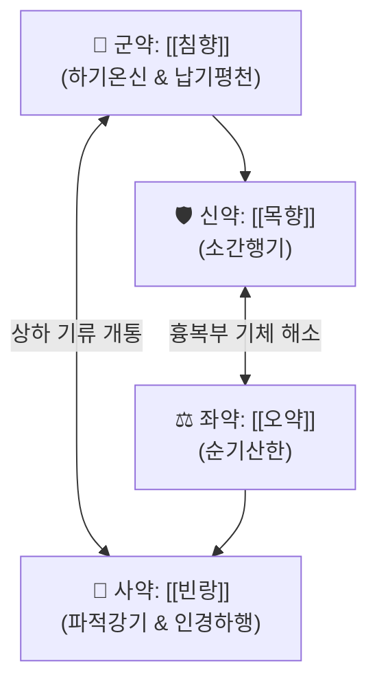

---
aliases:
  - 沈香四磨湯
  - Chenxiang-simo-tang
  - Chimhyang-sama-tang
  - 사마탕
tags:
  - 처방/이기화해제
  - 이기화해제/순기강기
  - 순기강기
  - 기역천식
  - 관흉소창
  - 과호흡증후군
  - 의학발명
  - 동의보감
---

# 🍵 [[침향사마탕]] (沈香四磨湯, Chenxiang-simo-tang)

> **핵심 3줄 요약 (Key Summary)**:
> - 🌿 기본 구성: [[침향]], [[목향]], [[오약]], [[빈랑]] (사방에서 기운을 끌어내리는 강기파적 성약으로 백자기 농마 제법을 통해 유효 성분 보존).
> - 🎯 칠정(七情) 울결로 기기가 거꾸로 치솟는 기역천식(氣逆喘息), 신경성 호흡곤란(과호흡 증후군), 스트레스성 흉통 및 흉민, 위식도역류로 인한 가슴 답답함, 복부 팽만, 이급후중 신경성 변비.
> - 🔬 침향 아가로테트롤 매개 중추 GABA_A 활성화 및 HPA축 안정화, 기관지 및 식도 평활근 경련 이완, 장관 하향성 연동 반사 촉진을 통한 횡격막 압박 해소.
> - ⚠️ 주의사항: 강기파적(降氣破積) 작용이 맹렬하므로 기운이 없고 장기가 아래로 처지는 기허하함(위하수·탈항) 환자 및 임산부 투약 엄격 금기.

---

## 📌 목차
1. [기본 처방 정보 & 군신좌사 구성](#1-기본-처방-정보--군신좌사-구성)
2. [방제학적 약재 상호작용 & 시너지 네트워크](#2-방제학적-약재-상호작용--시너지-네트워크)
3. [현대 분자약리학적 효능 & 작용 기전](#3-현대-분자약리학적-효능--작용-기전)
4. [적응 병증 및 체질별 감별 (Sweet Spot vs 금기)](#4-적응-병증-및-체질별-감별-sweet-spot-vs-금기)
5. [유사 처방군 감별 매트릭스](#5-유사-처방군-감별-매트릭스)
6. [임상 가감례 & 현대 질환별 응용](#6-임상-가감례--현대-질환별-응용)
7. [💡 사용자 진료실 핵심 필기 & 임상 팁 (원문 보존)](#7--사용자-진료실-핵심-필기--임상-팁-원문-보존)
8. [출처 및 학술 참고 문헌 (References)](#8-출처-및-학술-참고-문헌-references)

---

## 1. 기본 처방 정보 & 군신좌사 구성

* **출전**: 금원사대가 이동원(李東垣) 《의학발명(醫學發明)》, 허준 《동의보감(東醫寶鑑)》 기문(氣門)
* **치법**: 강기화담(降氣化痰), 순기평천(順氣平喘), 관흉관장(寬胸寬腸)
* **적응증**: 칠정기역(七情氣逆), 기천(氣喘), 흉복창민(胸腹脹悶), 상기(上氣) 호흡곤란, 급격한 스트레스성 흉통

| 구분 | 약재명 | 표준 용량 | 본초 효능 & 방제 내 역할 |
| :--- | :--- | :--- | :--- |
| **군약 (君藥)** | [[침향]] | 4g | 하기온신(降氣溫腎), 납기평천(納氣平喘), 치솟는 상역 기운을 신장 깊숙이 안착 |
| **신약 (臣藥)** | [[목향]] | 6g | 행기지통(行氣止痛), 소간건비(疏肝健脾), 가슴과 옆구리의 울체된 기기 개통 |
| **좌약 (佐藥)** | [[오약]] | 6g | 온신산한(溫腎散寒), 순기지통(順氣止痛), 흉복부 냉기를 흩뜨리고 기류 순환 촉진 |
| **사약 (使藥)** | [[빈랑]] | 6g | 하기파적(下氣破積), 인경하행(引經下行), 장관 가스 및 대변을 아래로 배출 |

> 💡 **조제 및 제형 특수 수칙**: 사마(四磨)라는 명칭은 네 가지 귀한 약재를 거칠게 끓여 유효 정유 성분을 날리지 않고, 백자기 사발에 물을 붓고 단단하게 농축하여 갈아낸 즙(濃磨汁)을 취하는 데서 비롯됨.

---

## 2. 방제학적 약재 상호작용 & 시너지 네트워크

* **사방(四方)에서 기운을 끌어내리는 완벽한 하행 벡터**: 상초로 치솟는 기운을 [[침향]]이 신장 깊숙이 가라앉히고, [[빈랑]]이 복강의 적체를 아래로 밀어내며, [[목향]]과 [[오약]]이 흉복부의 막힌 기운을 양옆으로 열어줍니다.

---

## 3. 현대 분자약리학적 효능 & 작용 기전

### 1) 중추성 진정 및 과호흡 발작 안정화
* 침향의 아가로테트롤 성분이 중추 GABA_A 수용체 복합체를 활성화하고 시상하부-부신(HPA) 축의 과민 반응을 억제하여 급격한 공황 및 과호흡성 호흡곤란을 신속히 진정시킵니다.

### 2) 기관지 및 식도 평활근 경련 이완
* 목향의 코스투놀라이드가 기관지 평활근 세포의 전압 의존성 수축을 차단하여 기도 저항을 감소시키고 흉부 압박감을 해소합니다.

### 3) 위식도 하향성 연동 운동성 복원
* 빈랑의 아레콜린 성분이 장관 부교감신경총을 자극하여 위산 역류와 복부 팽만으로 인한 횡격막 거상(압박)을 신속히 해제합니다.

---

## 4. 적응 병증 및 체질별 감별 (Sweet Spot vs 금기)

[✅ 최적 적응증 (Sweet Spot)]
• 병태생리: 감정적 격동이나 스트레스로 기운이 순간적으로 목구멍까지 치받쳐 올라 숨을 헐떡이고 가슴이 찢어질 듯 답답한 상태
• 주치 병증: 스트레스성 기천(과호흡 증후군), 신경성 천식, 매핵기 동반 흉민, 공황장애의 숨참, 신경성 위마비, 복부 팽만
• 설진/맥진: 설태박백(薄白), 맥현(弦) 또는 침복(沈伏)

[⚠️ 신중 투여 및 금기 (Caution / Contraindication)]
• 기허하함(氣虛下陷): 원기가 극도로 쇠약하여 위하수, 자궁탈수, 탈항이 있는 환자에게 투약 시 기탈(실신) 위험으로 절대 금기
• 임산부 금기: 침향과 빈랑의 강력한 자궁 평활근 자극으로 임신 중 복용 금지

---

## 5. 유사 처방군 감별 매트릭스

| 처방명 | 핵심 배오 차이 | 주치 및 임상 차별점 | 맥진/설진 차이 |
| :--- | :--- | :--- | :--- |
| [[침향사마탕]] | 침향, 목향, 오약, 빈랑 | **감정적 격동, 기역 과호흡 증후군, 스트레스성 흉통** | 맥현, 설태박백 |
| [[반하후박탕]] | 반하, 후박, 복령, 생강, 소엽 | **기담조체, 목구멍 이물감(매핵기), 신경성 기침** | 맥현완, 설태백윤 |
| [[시호소간탕]] | 시호, 작약, 지각, 감초, 천궁 등 | **간기울결 흉협고만, 한열왕래, 잦은 한숨, 유방 창통** | 맥현, 설태미황 |
| [[소자강기탕]] | 자소자, 반하, 후박, 전호, 육계 등 | **상성하허(上盛下虛), 담천 기침과 함께 다리가 시리고 무력함** | 맥침약, 설담 |
| [[사마탕]] | 인삼, 빈랑, 침향, 오약 | **기허(氣虛)가 겸해진 기역 흉민 및 노인성 장폐색 변비** | 맥세약, 설담홍 |

---

## 6. 임상 가감례 & 현대 질환별 응용

* **증상별 가감법**:
  * 끈적한 가래가 목에 걸려 숨쉬기 힘들 때 $\rightarrow$ + [[반하]] 6g, [[남성]] 4g
  * 가슴 답답함과 함께 불안이 심할 때 $\rightarrow$ + [[복신]] 8g, [[원지]] 4g
  * 위산 역류와 신트림이 심할 때 $\rightarrow$ + [[선복화]] 8g, [[대자석]] 12g
  * 장관 가스와 변비가 심할 때 $\rightarrow$ [[빈랑]] 배량 증량
* **현대 질환별 응용**:
  * 과호흡 증후군(Hyperventilation syndrome), 공황장애 급성 호흡곤란
  * 심인성 천식, 기능성 위장관 장애(위무력증, 마비성 장폐색 초기)
  * 신체화 장애로 인한 발작성 흉부 압박감

---

## 7. 💡 사용자 진료실 핵심 필기 & 임상 팁 (원문 보존)

> [!tip] **진료실 실전 노하우 (User Clinical Insight)**
> 
> ### 1) 급성 기역(氣逆) 발작의 응급 요약
> * **"환자가 극심한 화를 내거나 감정적 충격을 받은 직후 가슴을 쥐어뜯으며 숨이 차서 헐떡이고, 명치가 결려 말을 못 한다"**고 할 때 최우선 응급 방제로 투여.
> * 가래나 기침이 주증상이 아니라 순수하게 기운이 목구멍까지 치받쳐 오르는 과호흡 증후군과 공황성 흉민에 즉효를 나타냄.
> 
> ### 2) 복용 후 관리 수칙 (처방 사이드 연동)
> * 급박한 호흡곤란이 가라앉으면 1~2회 단기 복용 후 즉시 투약을 중단하고 보익 처방으로 전환하며, 세부 주의사항은 [`처방 사이드 대처법.md`](file:///c:/Simbio/2.%20%EC%95%BD%EB%A6%AC%20%EA%B3%B5%EB%B6%80/%EC%B2%98%EB%B0%A9/%EC%B2%98%EB%B0%A9%20%EC%82%AC%EC%9D%B4%EB%93%9C%20%EB%8C%80%EC%B2%98%EB%B2%95.md) `107. 침향사마탕` 항목을 준수함.

---

## 8. 출처 및 학술 참고 문헌 (References)

1. **이동원 (1251)**. 《의학발명(醫學發明)》 권2 & **허준 (1610)**. 《동의보감(東醫寶鑑)》 기문(氣門).
   - [고전 원전] "治七情怫鬱, 上氣喘急, 妨悶不食, 沈香, 木香, 檳榔, 烏藥 各濃磨汁煎服." (칠정으로 답답하고 기가 위로 치밀어 헐떡이며 음식을 먹지 못할 때 침향, 목향, 빈랑, 오약을 각 짙게 갈아 달여 복용한다.)
2. * **Fu S et al. (2026)**. Agarotetrol attenuates spinal cord injury by targeting PPARγ to modulate microglial activation. *Experimental cell research*, 458: 114947. [PMID: 41720447](https://pubmed.ncbi.nlm.nih.gov/41720447/)
3. * **Zhong W et al. (2025)**. Simo decoction in patients with early liver dysfunction after liver transplantation. *Pakistan journal of pharmaceutical sciences*, 38: 1823-1835. [PMID: 40996198](https://pubmed.ncbi.nlm.nih.gov/40996198/)
