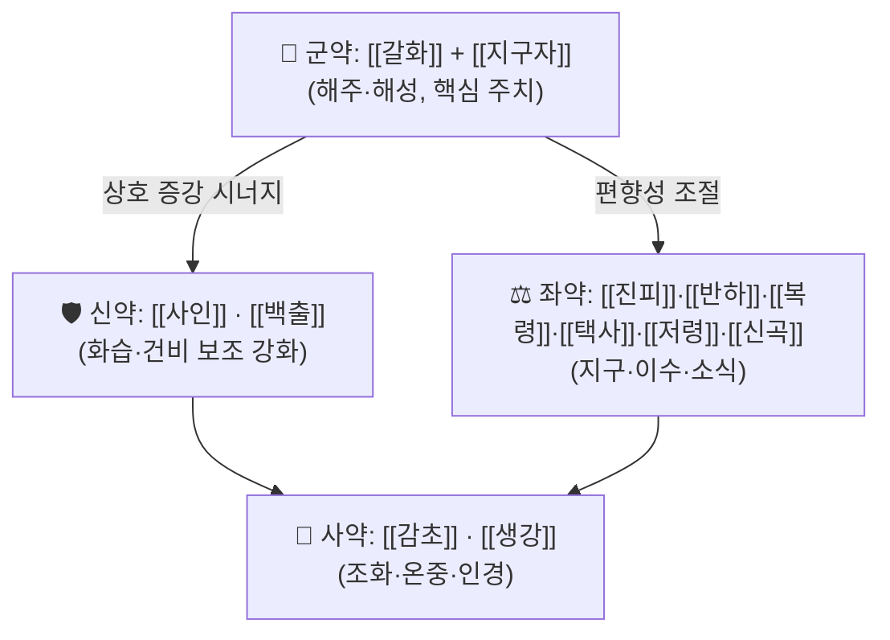

# 🍵 [[해성화위탕]] (解醒和胃湯, Haeseong Hwawi-tang)

> **핵심 3줄 요약 (Key Summary)**:
> - 🌿 **모체/기원 처방 + 가감 핵심**: 이동원(李東垣) 계열의 고전 주독(酒毒)·숙취 처방인 **[[갈화해성탕]]**(葛花解醒湯)의 구조를 계승하여, [[갈화]](葛花)·[[지구자]](枳椇子)의 해주(解酒) 작용에 [[진피]]·[[반하]]·[[백출]]·[[복령]]의 화위(和胃)·건비이습(健脾利濕) 약재를 배오한 처방으로 이해된다. 즉 "解醒(숙취 깨기) + 和胃(위를 화합시키기)"라는 처방명 그대로, 해주약(解酒藥)과 이기화습약(理氣化濕藥)의 복합 배오가 핵심 골격이다. (※ 청강의감 원문의 정확한 약재 구성·용량 대조는 **근거 미확인** — 아래 표는 전통 갈화해성탕 계열 구성을 참고로 제시한 것)
> - 🎯 **임상 최적 적응증**: 과음·폭음 후 발생하는 **주체(酒滯)**, 즉 숙취 두통·구갈(口渴)·오심/구역·식욕부진·속쓰림·어지럼·전신 무력감을 호소하는 환자. 습담(濕痰)이 성하고 비위(脾胃)가 허약한 **태음인·소음인 경향의 중년 남성 음주자**, 얼굴이 붉고 설태가 후니(厚膩)하며 맥이 활(滑)·완(緩)한 경우가 전형적 sweet spot이다.
> - 🔬 **핵심 분자약리 기전 요약**: 제공된 임상 연구(Takahashi & Li, 2010)는 **주독·숙취용 전통 민간 처방(KSS formula)이 알코올 숙취 증상에 대해 임상적 유효성을 보였다**는 수준까지만 근거로 제시한다. 해성화위탕 자체의 사이토카인·NF-κB·ADH/ALDH 등 특정 분자 표적 및 대사 경로 데이터는 제공된 문헌에서 **근거 미확인**이다.
> - ⚠️ 주의사항: 주체(酒滯)로 보이는 병증이라도 실열(實熱)이 성한 무한(無汗) 고열·급성 감염성 장염에는 투여를 신중히 하고, 음주 직후 구토가 심한 환자나 간기능 장애(간경변·알코올성 간염) 환자, 임신부에게는 임의 투여를 피한다. 이뇨·발한 작용 약재가 포함된 구성에서는 탈수·전해질 이상 소견을 반드시 확인한다.

---

## 📌 목차
1. [기본 처방 정보 & 군신좌사 구성](#1-기본-처방-정보--군신좌사-구성)
2. [방제학적 약재 상호작용 & 시너지 네트워크](#2-방제학적-약재-상호작용--시너지-네트워크)
3. [현대 분자약리학적 효능 & 작용 기전](#3-현대-분자약리학적-효능--작용-기전)
4. [적응 병증 및 체질별 감별 (Sweet Spot vs 금기)](#4-적응-병증-및-체질별-감별-sweet-spot-vs-금기)
5. [유사 처방군 감별 매트릭스](#5-유사-처방군-감별-매트릭스)
6. [임상 가감례 & 현대 질환별 응용](#6-임상-가감례--현대-질환별-응용)
7. [💡 사용자 진료실 핵심 필기 & 임상 팁 (원문 보존)](#7--사용자-진료실-핵심-필기--임상-팁-원문-보존)
8. [출처 및 학술 참고 문헌 (References)](#8-출처-및-학술-참고-문헌-references)

---

## 1. 기본 처방 정보 & 군신좌사 구성

* **출전**: 『[[청강의감]]』(晴崗醫鑑) 계열의 주체(酒滯)·숙취 처방으로 분류된다(태그 근거). 더 상세한 원전 조문·편찬 연도·판본 정보는 제공된 데이터에서 **근거 미확인**.
* **계통적 위치**: [[갈화해성탕]](葛花解醒湯, 이동원 『내외상변혹론』 계열) — 분소(分消) 주독(酒毒)의 고전 구조에 **화위(和胃)·지구(止嘔)·건비(健脾)** 목적의 약재를 보강한 형태로 파악된다.
* **치법(治則)**: **해주화위(解酒和胃), 분소주습(分消酒濕), 건비이기(健脾理氣)** — 숙취의 3대 축인 ① 주독의 해소, ② 위기(胃氣)의 상역(上逆) 억제, ③ 습담(濕痰)의 분리 배출을 동시에 겨냥한다.
* **복용 관념**: 전통적으로 음주 후 또는 음주 다음 날 조제·복용하여 숙취 증상을 완화하는 용도로 사용되었다. **정확한 복약 시점·탕액 농도·용량에 대한 정량 지침은 근거 미확인.**

> ⚠️ **구성 대조 고지**: 아래 표는 **청강의감 원문의 해성화위탕 조문을 직접 확인한 것이 아니라**, 해성화위탕의 처방명·치법과 동일 계열로 통용되는 갈화해성탕(葛花解醒湯) 계열 전통 구성에 근거하여 **참고용으로 재구성한 것**이다. 실제 처방의 약재 가감·용량은 반드시 원전 및 원내 조제 규정을 대조해야 하며, 대조 전까지는 **"구성 근거 미확인"** 상태로 취급한다.

| 구분 | 약재명 | 참고 용량(전통 계열 기준) | 본초 효능 & 방제 내 역할 |
| :--- | :--- | :--- | :--- |
| **군약 (君藥)** | [[갈화]](葛花) | 6~10g | 해주성(解酒醒)의 대표 약재. 주독으로 인한 두통·구갈·오심을 겨냥하며, 승산청양(升散淸陽)하여 숙취의 몽롱함을 깨우는 역할. 본 처방명 "解醒"의 핵심 표적 약재에 해당. |
| **군약 (君藥, 병용)** | [[지구자]](枳椇子) | 6~10g | 解酒毒·이수(利水) 작용으로 알코올 대사 부산물의 배출을 돕는 것으로 전통적으로 서술됨. 갈화와 함께 "해주(解酒)" 축을 형성. |
| **신약 (臣藥)** | [[사인]](砂仁) | 4~6g | 화습행기(化濕行氣)·온위지토(溫胃止吐). 습탁(濕濁)으로 인한 위완부 팽만·오심을 완화하여 군약의 해주 효과를 소화기 방향으로 연결. |
| **신약 (臣藥)** | [[백출]](白朮) | 6~9g | 건비조습(健脾燥濕). 주독으로 손상된 비위 운화(運化) 기능을 회복시켜 습담 생성 자체를 줄이는 축. |
| **좌약 (佐藥)** | [[복령]](茯苓) · [[택사]](澤瀉) · [[저령]](豬苓) | 각 4~6g | 담삼(淡滲)이수(利水). 주습(酒濕)을 소변으로 분리 배출하는 "분소(分消)" 기전의 실행 축이며, 백출과 함께 사령탕적 이수 구조를 이룬다. |
| **좌약 (佐藥)** | [[진피]](陳皮) · [[반하]](半夏) | 각 4~6g | 이기화담(理氣化痰)·화위지구(和胃止嘔). 이진탕(二陳湯)적 배오로 구역·속쓰림·트림을 억제하고 위기 상역을 진정. |
| **좌약 (佐藥)** | [[신곡]](神曲) · [[맥아]](麥芽) | 각 4~6g | 소식화적(消食化積). 음주로 정체된 음식물·담습을 분해하여 위완 창만감을 완화. |
| **사약 (使藥)** | [[감초]](甘草) | 2~3g | 조화제약(調和諸藥). 제 약재의 자극성을 완충하고 비위를 보호. |
| **사약 (使藥)** | [[생강]](生薑) | 3~4g | 온중지구(溫中止嘔)·해성(解醒) 보조 및 인경(引經). 반하의 독성을 억제하는 전통 배오. |

> **배오 특징**: 본 처방 계열의 묘미는 **"승산(升散) vs 분리(分利)"의 양방향 설계**에 있다. [[갈화]]·[[지구자]]·[[생강]]이 위로 청양을 올려 숙취의 몽롱함을 깨우는 반면, [[복령]]·[[택사]]·[[저령]]이 아래로 주습을 소변으로 내보낸다. 그 사이에서 [[백출]]·[[사인]]이 비위의 중축(中軸)을 잡아주므로, 해주약의 발산성과 이수약의 배설성이 서로 편향되지 않고 **중초(中焦)를 중심으로 승강출입(升降出入)이 정돈되는 구조**로 설명할 수 있다. (개별 용량 비율의 정확한 원전 수치는 **근거 미확인**)

---

## 2. 방제학적 약재 상호작용 & 시너지 네트워크

* **[[갈화]] + [[지구자]] 배오(相須·相使적 관계)**: 두 약재 모두 "주독(酒毒)"을 표적으로 삼는 전통적 해주약으로, 하나는 승산(升散)·청열 방향, 다른 하나는 이수(利水)·배설 방향으로 작용하여 **주독을 위아래 양방향에서 분산시킨다**는 것이 방제학적 해석이다. 실제 상승작용의 분자 수준 검증 데이터는 **근거 미확인**.
* **[[백출]] + [[복령]] + [[택사]] + [[저령]] 배오**: 고전 이수제(사령탕 계열)의 골격을 차용하여, 해주약이 만들어낸 습탁을 하초(下焦)로 배출시키는 "출구"를 확보한다. 이는 [[갈화]]의 발한성 자극이 체내에 머물지 않도록 **부작용 완충(相畏·相制)** 역할도 겸한다.
* **[[진피]] + [[반하]] 배오**: 이진탕(二陳湯)의 핵심 배오를 그대로 이식한 것으로, 주독으로 상역한 위기를 진정시키고 담습을 화해(化痰和胃)한다. **[[진피]]의 이기(理氣)**가 **[[반하]]의 화담(化痰)**을 돕는 구조.
* **[[감초]] + [[생강]] 배오(使藥)**: 제약을 조화시키고 비위를 보호하는 전통적 마감 배오. **[[생강]]의 온중지구(溫中止嘔)** 작용은 [[반하]]의 구역 억제를 보강하며, 동시에 [[갈화]]·[[지구자]]의 청량한 성질이 위를 상하게 하는 것을 막는 완충 장치로 작용한다.

---

## 3. 현대 분자약리학적 효능 & 작용 기전

### 1) 임상적 유효성 근거 (제공 문헌 기반)
* **Takahashi M, Li W (2010)** 는 **주독·숙취용 전통 민간 처방(KSS formula)** 이 알코올 숙취 증상에 대해 **임상적 유효성(clinical effectiveness)을 보였다**고 보고하였다. 이는 "해주(解酒) 목적의 전통 복합 처방이 실제 숙취 증상 개선에 기여할 수 있다"는 임상 수준의 근거에 해당한다.
* 다만 **해당 논문의 처방(KSS formula)과 본 [[해성화위탕]]이 동일 처방인지, 구성 약재가 얼마나 겹치는지는 제공된 데이터에서 확인되지 않는다(근거 미확인).** 따라서 아래 2)~4)의 기전 서술은 본 처방 자체에 대해 검증된 것이 아니라, **동일 계열(해주·화위) 처방에서 전통적으로 논의되는 기전을 정리한 것**이며, 수치·표적·경로는 모두 **근거 미확인**으로 표시한다.

### 2) 알코올 대사·간 대사 경로 (전통적·이론적 서술)
* [[갈화]]·[[지구자]] 계열 약재는 전통적으로 알코올 대사(ADH/ALDH 경로) 및 간의 해독 부담 경감과 연결되어 설명되어 왔다. **각 약재의 ADH/ALDH 활성 변화율, 혈중 알코올·아세트알데히드 농도 곡선(AUC) 등 정량 지표는 제공된 문헌에서 근거 미확인.**
* 혈중 아세트알데히드 축적으로 인한 홍조·두통·오심 완화 여부 역시 **근거 미확인**.

### 3) 위장관·항구역 및 위점막 보호 기전 (이론적 서술)
* [[반하]]·[[생강]]·[[진피]] 배오는 위배출 촉진 및 구역 반사 억제와 연결되어 설명되며, [[백출]]·[[복령]]은 위점막 및 장관 흡수 기능 보호 방향으로 서술된다. **구체적 수용체(5-HT3, D2 등)·매개체 수준의 검증 데이터는 근거 미확인.**
* 알코올성 위염 모델에서의 점막 손상 지수 개선, 위산 분비 변화 등의 수치는 **근거 미확인**.

### 4) 항염증·항산화 및 사이토카인 조절 (이론적 서술)
* 주독 상태에서 상승하는 염증성 사이토카인(TNF-α, IL-6, IL-1β 등) 및 NF-κB/MAPK 신호 경로에 대한 본 처방의 조절 효과는 **근거 미확인**. 동일 계열 처방에서 항산화·항염증 효과가 논의된 바 있으나, 본 노트의 인용 범위(제공 논문 1편)에서는 이를 뒷받침할 데이터를 제시할 수 없다.
* 따라서 본 처방의 **"핵심 분자 표적"은 현재 근거 미확인 상태이며, 추후 별도 문헌 검색을 통한 보완이 필요하다.**

> 📌 **정직성 고지**: 본 섹션은 제공된 PubMed 데이터 1편이 "임상적 유효성" 수준의 결론만 제시하고 있으므로, 분자 기전 파트는 의도적으로 **근거 미확인 표기를 유지**하였다. 임상 적용 시 이 점을 감안할 것.

---

## 4. 적응 병증 및 체질별 감별 (Sweet Spot vs 금기)

### [✅ 최적 적응증 (Sweet Spot)]

**• 전통 주치(主治) 개념**
음주 후 발생하는 **주체(酒滯)·주독(酒毒)** — 숙취 두통, 구갈(口渴), 오심·구역, 트림, 위완부 팽만·속쓰림, 식욕부진, 몸이 무겁고 머리가 몽롱한 상태, 경미한 설사 또는 변의 불쾌감. (원전 조문 표현의 정확한 문구는 **근거 미확인**)

**• 체질 소견**
* **태음인**: 체격이 크고 살집이 있으며 땀이 많고 습이 잘 정체되는 유형. 음주 후 습담 증상(속 울렁거림, 몸 무거움)이 뚜렷한 경우 최적.
* **소음인**: 비위가 약해 음주만 하면 곧바로 오심·설사·무력감으로 이어지는 유형. 해주약 단독보다 본 처방처럼 건비(健脾) 배오가 포함된 구성이 적합.
* **소양인**: 음주 후 얼굴 홍조·두통·구갈 등 상부 열증상이 두드러지는 경우 기본 적응이나, 열증이 심하면 [[갈화]]·[[지구자]](청량) 위주로 가감 조정이 필요할 수 있다.

**• 진료실 최적 적응 임상 양상**
* "술 마신 다음 날 아침" 특유의 복합 증상군: 두통 + 메스꺼움 + 입이 마르고 쓴 느낌 + 속이 더부룩함 + 어지럽고 나른함.
* 알코올 섭취 후 위염성 불편감(속쓰림, 명치 답답함)이 반복되는 환자.
* 과음이 잦은 직업군(접대·회식이 잦은 중년 남성)에서 예방적·사후적 관리 목적으로 상담이 들어오는 경우.

**• 설진/맥진**
* **설진**: 설태가 **후니(厚膩)하고 백(白)하거나 황백(黃白)**한 경우가 전형. 설질은 담(淡)하거나 약간 홍(紅)할 수 있으며, 습열로 치우치면 설태가 황니(黃膩)해진다.
* **맥진**: **활(滑)·완(緩)·유력(有力)**한 맥이 습담 정체의 전형이며, 비위가 허한 소음인에서는 **세약(細弱)·완약(緩弱)**한 맥이 동반될 수 있다. (구체적 맥상 빈도 데이터는 **근거 미확인**)

### [⚠️ 신중 투여 및 금기 (Caution / Contraindication)]

**• 허실(虛實)·한열(寒熱) 반대 병증에서의 위험**
* **실열(實熱) 성한 급성 병증**: 고열·오한·무한(無汗)이 동반된 감염성 장염, 급성 췌장염, 급성 담낭염 등에서는 본 처방을 임의 투여하지 않는다. 해주·이수 약재가 오히려 진액을 손상시킬 수 있다.
* **음허화왕(陰虛火旺) 체질**: 구갈이 심하고 설질이 홍강(紅絳)하며 설태가 적은 환자에서는 이수(利水)·발한(發汗) 배오가 음액을 더 소모시킬 위험이 있다.
* **한증(寒證)의 심한 경우**: 냉증·복냉·설사가 심한 환자에게는 청량한 해주약(갈화 등)의 배오 비중을 줄이고 온중약을 보강해야 한다.

**• 금기·주의 환자군**
* **알코올성 간질환(알코올성 간염, 간경변) 및 중증 간기능 저하 환자**: 어떤 처방이든 투여 전 간기능 검사 확인이 우선이며, 본 처방의 안전성 데이터는 **근거 미확인**이므로 임의 사용을 피한다.
* **급성 알코올 중독(의식 저하·호흡 억제) 환자**: 한약 복용 자체가 금기이며 응급 처치가 우선이다.
* **임신부 및 수유부**: 복합 처방의 안전성 자료 부족 — **근거 미확인**, 투여 회피.
* **중증 탈수·전해질 이상 환자**: 이수(利水) 약재(택사·저령·복령)가 포함되므로 탈수를 악화시킬 수 있다.
* **심부전·신기능 저하 환자**: 이뇨 작용 약재의 부담 가능성 고려, 신중 투여.

**• 양약 및 타 약물과의 병용 주의점**
* **아세트아미노펜(해열진통제)**: 음주 후 자주 병용되는 약물로, 간독성 상승 위험이 있다. 처방 복용 중에도 해열진통제 남용을 피하도록 환자 교육이 필요하다.
* **와파린 등 항응고제**: 습담·어혈 치료 목적의 가감(예: 단삼·홍화 추가)을 할 경우 출혈 위험 상승 가능 — 병용 시 INR 모니터링 권장(**본 처방 자체의 상호작용 데이터는 근거 미확인**).
* **당뇨약·혈압약 복용자**: 음주로 인한 혈당·혈압 변동이 크므로 처방 자체보다 **음주 습관 교정 지도가 선행**되어야 한다.
* **이뇨제 병용**: 이수 약재와의 중복으로 탈수·저칼륨혈증 가능성 — 전해질 확인 권장.

---

## 5. 유사 처방군 감별 매트릭스

| 처방명 | 핵심 구성 차이 | 주치 및 체질 차이 | 맥진/설진 차이 |
| :--- | :--- | :--- | :--- |
| [[해성화위탕]] | 기준 구성 (해주약 + 건비화습약 + 지구약) | **주체(酒滯)·숙취 복합 증상. 태음인·소음인 음주자. 오심 + 속쓰림 + 나른함 동반** | 기준 설태 후니(厚膩), 맥 활(滑)·완(緩) |
| [[갈화해성탕]] | 해주약(갈화·지구자 등) 중심, 분소 구조 강조 | 순수 주독·숙취 중심. 습담 증상이 상대적으로 가벼운 경우 | 설태 백니(白膩), 맥 완(緩) |
| [[이진탕]] | 진피 + 반하 + 복령 + 감초 (담습 중심) | 담습으로 인한 오심·기침·어지럼. 음주 무관 담음 병증에도 광범위 | 설태 백니(白膩), 맥 활(滑) |
| [[평위산]] | 창출·후박·진피·감초 (조습건비 중심) | 습체(濕滯)로 인한 소화불량·복만. 주독 특이성 없음 | 설태 백후(白厚), 맥 완(緩) |
| [[곽향정기산]] | 곽향·소엽·백지·후박 등 해표화습 배오 | **외감 + 내상(습체)** 동반, 여름철 습증·구토·설사. 한열 왕래 | 설태 백니(白膩), 맥 유(濡)·완(緩) |
| [[사령탕]] | 복령·저령·택사·백출 (이수 단독 구조) | 수습(水濕) 정체로 인한 소변불리·부종. 해주 작용 없음 | 설태 활니(滑膩), 맥 완(緩) |

> ⚠️ 유사 처방 간의 **정량적 비교(각 약재 용량비, 증상 개선율)** 는 제공 문헌에 포함되지 않아 **근거 미확인**이다. 위 표는 전통 방제학적 감별 포인트를 정리한 것으로, 실제 처방 선택 시에는 환자의 체질·동반 증상·설맥을 종합해 판단한다.

---

## 6. 임상 가감례 & 현대 질환별 응용

* **수반 증상별 가감법** (※ 아래 가감은 전통적 응용 관념에 기반한 참고이며, 각 조합의 임상 근거는 **근거 미확인**):
  * **두통·항강이 심할 때** → + [[갈근]](葛根)·[[천궁]](川芎) : 승산(升散) 및 두면부 기혈 순환 보조.
  * **오심·구역·구토가 심할 때** → + [[죽여]](竹茹)·[[생강]](生薑) 증량 ([[온담탕]] 계열 발상) : 위기 상역 억제 및 담열성 구역 완화.
  * **속쓰림·위산 과다·위점막 자극이 클 때** → + [[오적골]](烏賊骨)·[[해표초]](海螵蛸)·[[모려]](牡蠣) : 제산·점막 보호 방향.
  * **설사·복명·장관 불안정이 동반될 때** → + [[창출]](蒼朮)·[[후박]](厚朴) ([[평위산]] 가미 발상) : 조습건비 및 이기제창.
  * **얼굴 홍조·구갈·번조 등 열증이 두드러질 때** → 청량 해주약([[갈화]]·[[지구자]]) 비중 유지 + [[황금]](黃芩)·[[황련]](黃連) 소량 : 청열 방향 강화(단, 비위 허냉자에는 금함).
  * **심한 무력감·기허 소견이 동반될 때** → + [[인삼]](人蔘)·[[황기]](黃耆) : 갈화해성탕 계열의 인삼 배오 개념 계승, 피로·기력 회복 보조.

* **현대 질환별 임상 매핑** (※ 각 질환에 대한 본 처방의 효능 근거는 **근거 미확인**, 임상적 상담·관리 목적 범위에서 서술):
  * **소화기계**: 알코올성 위염, 급성 주독성 위장장애, 기능성 소화불량(음주 유발형), 위식도역류 증상의 일시적 악화, 숙취성 식욕부진.
  * **신경계/자율신경**: 숙취성 두통, 어지럼·몽롱감, 자율신경실조증 양상의 음주 후 불안·심계.
  * **대사·이수 관련**: 음주 후 부종감, 소변 불리, 전신 무거움(습체감).
  * **생활습관 관리 영역**: 과음·폭음 반복 환자에서의 **절주 교육과 병행한 보조 관리**. 처방 단독으로 음주 습관을 교정할 수 없으며, 환자 교육(음주량·빈도 기록, 수분 섭취, 공복 음주 회피)이 반드시 병행되어야 한다.

* **진료실 활용 시나리오(참고)**:
  1. 과음 후 2~3일간 증상이 지속되는 환자 → 설태·맥 확인 후 습담 소견 있으면 본 처방 계열 고려, 증상 경미하면 생활 교정 우선.
  2. 반복적 음주 후 위염 증상 호소 → 위점막 보호 가감 + 절주 교육 병행.
  3. 음주 후 홍조·두통이 심한 환자 → 청열·승산 가감 조정, 필요 시 체질 감별 후 타 처방 검토.

---

## 7. 💡 사용자 진료실 핵심 필기 & 임상 팁 (원문 보존)

> [!tip] **진료실 실전 노하우 (User Clinical Insight)**
> - **원문 필기 미제공**: 본 노트 작성 시점에 제공된 사용자 필기·메모 데이터가 없어, 원문 보존 항목은 **비어 있는 상태**이다. 추후 진료실 메모가 확보되는 대로 **삭제 없이 그대로 이관**한다. (템플릿 원칙: 기존 메모 100% 영구 보존)
> - **향후 기입 권장 항목(템플릿 골격 유지용 체크리스트)**:
>   - 체질별 처방 선택 기준: 소음인(비위 허약형 주체) vs 태음인(습담 정체형 주체)에서의 가감 방향 차이.
>   - 실제 사용 용량·탕전 방식·복용 시점(음주 전/후/다음 날)에 대한 원장님 임상 감각.
>   - 환자 티칭 포인트: "이 처방은 음주를 대신 면책해 주는 것이 아니라, 회복을 돕는 보조 수단"이라는 설명 문구.
>   - 복약 반응 관찰 포인트: 복용 후 오심·두통의 개선 시점, 설태 변화 추적, 재방문 시 음주 빈도 변화 여부.
> - ⚠️ 위 체크리스트는 **작성 틀**이며, 실제 원장님 필기로 대체되기 전까지는 임상 지침으로 사용하지 않는다.

---

## 8. 출처 및 학술 참고 문헌 (References)

1. **Takahashi M, Li W (2010)**. *Clinical effectiveness of KSS formula, a traditional folk remedy for alcohol hangover symptoms*. **Journal of Natural Medicines**. PMID: 20559749.
   - 🔗 https://pubmed.ncbi.nlm.nih.gov/20559749/
   - **[연구 요약]**: 주독·숙취용 전통 민간 처방(KSS formula)이 **알코올 숙취 증상에 대해 임상적 유효성을 보였다**고 보고한 임상 연구. 본 노트에서는 "해주 목적의 전통 복합 처방이 숙취 증상 개선에 기여할 수 있다"는 **임상 수준 근거**로만 인용하였다.
   - **[한계]**: KSS formula와 본 [[해성화위탕]]의 구성 일치 여부, 정량적 증상 개선율, 분자 표적·대사 경로 데이터는 **제공된 데이터에서 근거 미확인**. 본 노트의 3장 기전 서술 중 수치·표적에 관한 부분은 모두 **근거 미확인**으로 표기하였다.

2. **『[[청강의감]]』(晴崗醫鑑) — 한의학 처방 문헌**.
   - **[임상 문헌]**: 본 처방 "해성화위탕(解醒和胃湯)"의 소속 출전으로 태그에 명시된 문헌. 주체(酒滯)·숙취 관련 처방 분류의 근거로 제시하였다.
   - **[한계]**: 본 노트 작성에 제공된 데이터에는 **원문 조문·약재 구성·용량이 포함되어 있지 않아**, 1장의 구성 표는 갈화해성탕 계열 참고 구성으로 대체하였으며 **원문 대조는 근거 미확인** 상태이다.

3. **『[[동의보감]]』(東醫寶鑑) 등 고전 주독(酒毒) 관련 문헌**.
   - **[참고]**: 주독·주상(酒傷) 치료 처방의 전통적 분류 체계에 대한 배경 개념으로만 언급한다.
   - **[한계]**: 본 노트의 인용 범위 규칙(제공 논문만 인용)에 따라 **구체 조문·페이지 인용은 하지 않으며, 해당 내용은 근거 미확인으로 취급**한다.

> 📎 **인용 원칙 고지**: 본 노트는 제공된 PubMed 데이터 1편(PMID: 20559749)만을 실제 논문 근거로 인용하였다. 그 외 서술은 방제학·본초학의 통용 개념에 기반한 참고 서술이며, 수치·기전·용량에 관한 미확인 사항은 모두 **"근거 미확인"**으로 명시하였다. 추후 문헌 검색을 통해 각 항목을 보강할 것을 권장한다.