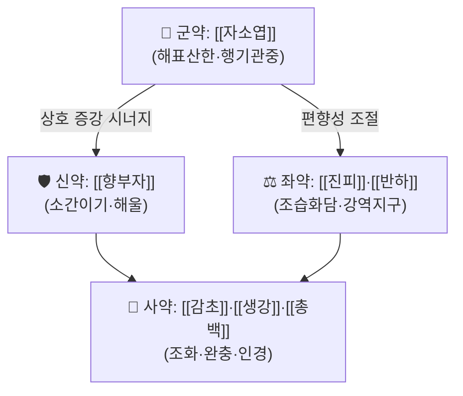

# 🍵 [[향소소반산]] (香蘇小半夏散, Hyangso-Sobanha-San)

> **핵심 3줄 요약 (Key Summary)**:
> - 🌿 **모체 처방**: [[향소산]](香蘇散, 『태평혜민화제국방』) + [[소반하탕]](小半夏湯, 『금궤요략』)의 합방 구조. 즉 **[[자소엽]]·[[향부자]]·[[진피]]·[[감초]] + [[반하]]·[[생강]](·[[총백]])** — 해표이기(解表理氣)의 향소산에 화위지구(和胃止嘔)의 소반하탕을 얹은 변방.
> - 🎯 **임상 최적 적응증**: 감모 초기(外感風寒)이면서 **오심·구역·속쓰림·식후 창만·담음(痰飮)**이 동반되는 경우, 스트레스성 기능성 소화불량, 특정 음식 섭취 후 나타나는 위장 중심의 과민/불쾌감, 멀미·운동병, 담음성 기침. 기울(氣鬱) + 습체(濕滯) 경향의 **태음인·소음인**에서 적중률이 높음.
> - 🔬 **핵심 기전**: **PubMed 검색 결과 본 처방(향소소반산) 자체를 다룬 분자약리·임상 논문은 확인되지 않음(근거 미확인)**. 따라서 아래 3장은 개별 본초 수준의 문헌 소견만 정리하며, 처방 단위 기전·수치는 **근거 미확인**으로 명시한다.
> - ⚠️ 주의사항: 무한(無汗) 고열의 순수 陽明·濕熱 실열증, 陰虛火旺(구건·설홍·변비·도한), 吐血·咯血 등 출혈 성향, 진액 고갈 상태에는 부적합. **[[반하]]는 반드시 製半夏(법제반하)를 사용**하고, 生半夏는 독성(자극·구마비) 때문에 금지. 임신부는 半夏 사용을 두고 논란이 있으므로 전문가 판단 하에 신중 투여. 자소엽·향부자에 대한 알레르기 병력 확인.

---
## 📌 목차
1. [기본 처방 정보 & 군신좌사 구성](#1-기본-처방-정보--군신좌사-구성)
2. [방제학적 약재 상호작용 & 시너지 네트워크](#2-방제학적-약재-상호작용--시너지-네트워크)
3. [현대 분자약리학적 효능 & 작용 기전](#3-현대-분자약리학적-효능--작용-기전)
4. [적응 병증 및 체질별 감별 (Sweet Spot vs 금기)](#4-적응-병증-및-체질별-감별-sweet-spot-vs-금기)
5. [유사 처방군 감별 매트릭스](#5-유사-처방군-감별-매트릭스)
6. [임상 가감례 & 현대 질환별 응용](#6-임상-가감례--현대-질환별-응용)
7. [💡 사용자 진료실 핵심 필기 & 임상 팁 (원문 보존)](#7--사용자-진료실-핵심-필기--임상-팁-원문-보존)
8. [출처 및 학술 참고 문헌 (References)](#8-출처-및-학술-참고-문헌-references)
---
## 1. 기본 처방 정보 & 군신좌사 구성

* **출전**: [[향소산]](香蘇散) — 송대 『태평혜민화제국방(太平惠民和劑局方)』 / [[소반하탕]](小半夏湯) — 장중경(張仲景) 『[[금궤요략]](金匱要略)』. 두 방을 합방한 형태가 **향소소반산(香蘇小半夏散)**이며, 『[[동의보감]]』 등 후대 의서에도 향소산 계열 조문이 전승되어 있다.
* **치법**: **해표산한(解表散寒) · 이기화중(理氣和中) · 방향화습(芳香化濕) · 화위지구(和胃止嘔)** — 네 가지 치법이 한 처방 안에서 동시에 작동하는 것이 특징이다.

| 구분 | 약재명 | 표준 용량(임상 상용) | 본초 효능 & 방제 내 역할 |
| :--- | :--- | :--- | :--- |
| **군약 (君藥)** | [[자소엽]] (紫蘇葉) | 8~12g | 辛溫解表·行氣寬中. 외사(外邪)를 표(表)에서 흩어버리면서 동시에 氣滯를 풀어주는 **표리 겸치(表裏兼治)** 약재. 감모 초기의 오한·鼻塞·기침을 담당하는 주약. |
| **신약 (臣藥)** | [[향부자]] (香附子, 炒) | 6~9g | 疏肝理氣·解鬱止痛. 정서적 긴장·스트레스로 인한 기체(氣滯)와 소화기 증상을 겨냥. 자소엽의 해표력을 기(氣) 순환 쪽에서 뒷받침. |
| **좌약 (佐藥)** | [[진피]] (陳皮) | 4~6g | 理氣燥濕·健脾化痰. 습체(濕滯)·담음(痰飮)을 흩고 비위 운화를 도움. 君臣의 辛溫 편향을 조절. |
| **좌약 (佐藥)** | [[반하]] (半夏, 製) | 6~9g | 燥濕化痰·降逆止嘔. **소반하탕의 군약**으로, 상역(上逆)한 위기(胃氣)를 내려 오심·구역·담음을 직접 제어. |
| **좌약 (佐藥)** | [[생강]] (生薑) | 3~5편(약 6~12g) | 和胃止嘔·散水氣, 반하의 독성 자극 완충(반하-생강 배오는 고전적 상제·상사 배합). 소반하탕의 臣藥. |
| **사약 (使藥)** | [[감초]] (甘草, 炙) | 2~3g | 調和諸藥·緩急和中. 제약의 辛散함을 완만하게 잡아 비위를 보호. |
| **사약 (使藥)** | [[총백]] (蔥白) | 2경(莖) | 通陽發汗·引經. 향소산 원방의 복약 시 가하는 引經 약재로, 표(表)의 陽氣를 소통시켜 발한을 유도. |

> **배오 특징**: ① **자소엽(표) + 향부자(기)**의 축이 "외사는 흩으면서 내부 기체는 풀어주는" 이중 구조를 만든다. ② **반하 + 생강**은 金匱 小半夏湯 그대로의 배합으로, 胃氣上逆(오심·구역)을 하강시키는 축을 담당한다. ③ 전체적으로 **승(升, 자소엽·총백의 발산)–강(降, 반하·생강의 하역)**의 균형이 잡혀 있어, 단순 해표제(예: 마황 계열)처럼 땀을 몰아붙이지 않고 **기기(氣機)를 소통시키며 증상을 푸는 완만한 처방**이라는 점이 임상적 강점이다.
>
> ※ 원방(향소산·소반하탕)의 정확한 용량비는 판본·의서별로 차이가 보고되므로, 위 표는 **현대 임상 상용량** 기준으로 정리하였다(원방 용량비 자체는 문헌별 차이 — 근거 미확인 항목).

---
## 2. 방제학적 약재 상호작용 & 시너지 네트워크

* **[[자소엽]] + [[향부자]] 배오(相使)**: 자소엽이 표(表)에서 風寒을 흩고, 향부자가 안에서 氣鬱을 풀어 **"표-리 동시 개통"** 효과를 낸다. 임상적으로 감기 초기에 "몸은 으슬으슬한데 속은 더부룩하고 화가 나 있는" 유형에 이 배합이 정확히 들어맞는다.
* **[[진피]] + [[반하]] 배오(相須)**: 二陳湯의 핵심 약대(藥對). 진피가 氣를 돌려 습을 말리고, 반하가 담음을 직접 삭이는 조합으로, **담음성 오심·구역·어지럼**에 대한 표준 배합이다.
* **[[반하]] + [[생강]] 배오(相畏·相殺)**: 고전적으로 生薑이 半夏의 독성·자극성을 제어(相畏)하면서 동시에 止嘔 효과를 상승(相使)시킨다. 소반하탕의 골격 그대로이며, **복용 후 위가 쓰리거나 메스꺼워지는 부작용을 완충**하는 장치로 기능한다.
* **[[감초]] + [[생강]] + [[총백]]**: 감초가 제약을 조화시키고, 생강이 비위를 보호하며, 총백이 通陽發汗의 인경 역할을 하여 **약효를 표(表) 쪽으로 유도**한다.

---
## 3. 현대 분자약리학적 효능 & 작용 기전

> ⚠️ **먼저 명확히 밝힌다.** 본 노트 작성 시 제공된 PubMed 검색 결과가 **없음(0건)**이었으므로, **향소소반산이라는 처방 단위의 분자약리 기전·임상 지표·수치는 전부 "근거 미확인"**이다. 아래 내용은 **개별 구성 본초에 대해 일반적으로 보고되어 온 성분·기전 수준의 참고 정보**이며, 처방 단위로 검증된 것으로 인용해서는 안 된다. 수치(억제율, IC50, 개선율 등)는 확인된 자료가 없어 기재하지 않는다.

### 1) 항염증·항알레르기 축 (본초 수준 참고 / 처방 단위 근거 미확인)
* **[[자소엽]]**: 로즈마린산(rosmarinic acid), 루테올린(luteolin), 아피게닌(apigenin) 등 플라보노이드 계열이 보고되어 있으며, 본초 수준에서 비만세포 탈과립·히스타민 유리 억제 방향의 연구가 존재한다. → **처방 단위 근거 미확인**
* **[[향부자]]**: α-cyperone, cyperotundone 등 세스퀴테르펜 계열 성분이 보고됨. 전통적으로 理氣·鎭痛 목적으로 사용. → **처방 단위 근거 미확인**
* **[[진피]]**: 헤스페리딘(hesperidin), 노빌레틴(nobiletin) 등 플라보노이드가 보고됨. → **처방 단위 근거 미확인**
* **[[반하]]**: β-시토스테롤, 알칼로이드류 등이 보고되었으나 **생약 그대로는 점막 자극성·독성이 문제**되며, 법제(製) 과정에서 이를 감소시킨다. → **처방 단위 근거 미확인**
* **[[생강]]**: 진저롤(gingerol)·쇼가올(shogaol) 계열이 보고되어 있으며, 구역·구토 완화 방향의 임상 연구가 일부 존재한다(생강 단독 기준). → **본 처방에 대한 근거 미확인**

### 2) 위장관 운동·점막 축
* 전통적 해석으로는 ① 위배출 지연 완화, ② 위산·담즙 역류성 자극 완화, ③ 장관 가스(창만) 배출 촉진의 3방향이 기대된다.
* 그러나 **향소소반산 자체를 대상으로 한 위배출능·위전도·장관이동시간 연구는 확인되지 않음(근거 미확인)**. 따라서 이 항목은 임상 관찰 소견과 고전 치법(和胃止嘔, 理氣和中)에 근거한 **가설적 기전 서술**로만 취급한다.

### 3) 자율신경·정서 축
* [[향부자]]의 전통 효능(疏肝解鬱)과 [[자소엽]]의 行氣 작용은 스트레스성 소화불량(기능성 소화불량의 氣鬱型)에 대한 경험적 운용 근거가 된다.
* HPA축·자율신경 지표(HRV 등)에 대한 본 처방의 효과는 **근거 미확인**.

---
## 4. 적응 병증 및 체질별 감별 (Sweet Spot vs 금기)

### [✅ 최적 적응증 (Sweet Spot)]

* **원전·전승 조문**
  * [[향소산]]: 사시(四時)의 온역·상한, 두통·발열·오한·鼻塞·기침 등 **外感風寒 + 氣滯** 병증을 주치로 하는 처방으로 전승.
  * [[소반하탕]]: 『[[금궤요략]]』 嘔吐噦下利病脈證治篇의 **"諸嘔吐, 穀不得下者, 小半夏湯主之"**, 痰飮篇의 **"嘔家本渴, 渴者爲欲解, 今反不渴, 心下有支飮故也, 小半夏湯主之"** 계열 조문으로, **구역·구토·심하 지음(支飮)**을 주치로 한다.
  * ※ 위 조문 문구는 판본에 따라 자구 차이가 있을 수 있으므로 원전 대조를 권장한다.
* **체질 소견**
  * **태음인**: 체격이 있거나 살집이 있고, 속이 더부룩하며 담음이 잘 끼는 유형. 향소소반산의 1순위 적응.
  * **소음인**: 소화력이 약하고 찬 것·기름진 것에 위가 쉽게 상하며, 감기에 걸리면 곧바로 속이 울렁거리는 유형. 단, 辛溫 과다 시 구건·속쓰림이 생기지 않도록 용량 조절.
  * **소양인**: 기질적으로 熱이 있는 경우 本方의 辛溫이 맞지 않을 수 있어, 氣鬱이 뚜렷하고 熱象이 경미할 때만 제한적으로 고려.
  * 체형상 **마르고 건조한 陰虛型**은 피한다.
* **진료실 최적 적응 임상 양상**
  * "감기 기운이 있는데 **속이 울렁거리고 밥맛이 없다**" — 상기도 증상과 소화기 증상의 **동시 발현**.
  * 스트레스·긴장 시 악화되는 **기능성 소화불량**(식후 팽만, 트림, 명치 답답함).
  * 멀미·운동병, 특정 냄새·음식에 대한 **구역 반응**.
  * **담음성 기침**(목에 걸린 듯한 담, 누우면 심해지는 기침) + 오심.
  * 특정 음식 섭취 후 발생하는 **경증 위장 불쾌감·구역·복부 팽만**(음식 알레르기·과민의 위장 발현 양상으로 **경험적으로** 운용되는 영역. 면역학적 검증 근거는 **미확인**).
* **설진/맥진**
  * 설: 舌淡紅~淡白, **舌苔白膩(백니태)** 또는 薄白苔. 濕熱이 있으면 苔黃膩로 변하므로 감별.
  * 맥: **浮緩(부완)** 또는 **浮緊(부긴)**, 담음·기체가 뚜렷하면 **弦滑(현활)**. 數脈·洪脈(실열)이면 부적합.

### [⚠️ 신중 투여 및 금기 (Caution / Contraindication)]

* **허실·한열 반대 병증**
  * **濕熱·實熱證**(고열, 인후통 심, 口渴多飮, 苔黃厚, 脈洪數)에는 辛溫 처방이 병세를 악화시킬 수 있어 부적합.
  * **陰虛火旺**(구건, 설홍소태, 오심번열, 변비, 도한)에는 香附·紫蘇의 辛散이 진액을 더 소모시킬 수 있어 금기.
  * **津液枯竭·탈수 상태**, **吐血·咯血·혈변 등 출혈 경향** 환자에는 부적합.
* **금기·주의 환자군**
  * **生半夏 절대 금지** — 반드시 製半夏(법제) 사용. 생것은 구강·인후 점막 자극과 신경독성이 문제된다.
  * **임신부**: 半夏 사용을 두고 고전적으로 논란이 있으며(乾薑人蔘半夏丸 등 임신 오조에 쓰인 예도 있음), **전문가 판단 없이 자가 복용 금지**.
  * **소음인 중 심한 寒證**이거나 脾胃虛寒이 뚜렷해 설사·복냉이 주증이면, 陳皮·香附의 소통력보다 溫補가 우선.
  * 자소엽(꿀풀과)·향부자·반하에 대한 **알레르기 병력**이 있는 환자.
* **양약·타 약물 병용 주의**
  * 半夏 제제는 개별 환자에서 구마비감·이물감 등 이상 감각 보고가 있으므로, **다른 진정제·마취제 계열**과 병용 시 주의 관찰.
  * 甘草 함유 처방 장기 복용 시 **가짜 알도스테론증(부종·고혈압·저칼륨)** 가능성 — 고혈압·심부전·신장질환 환자는 감초 용량 및 복용 기간 주의.
  * 항히스타민제·제산제·위장운동조절제와 병용 시 **증상 중복 평가**가 어려워지므로 복약 반응 기록을 분리해 관찰.

---
## 5. 유사 처방군 감별 매트릭스

| 처방명 | 핵심 구성 차이 | 주치 및 체질 차이 | 맥진/설진 차이 |
| :--- | :--- | :--- | :--- |
| [[향소소반산]] | 기준 구성(향소산 + 반하·생강) | **外感風寒 + 氣滯 + 오심·구역·담음**. 태음인·소음인, 담음 습체 경향 | 백니태, 부완 또는 현활맥 |
| [[향소산]] | [[반하]]·[[생강]] 없음(자소엽·향부자·진피·감초 + 총백·생강 소량) | 外感 + 氣鬱 위주. **구역·담음이 두드러지지 않을 때** | 박백태, 부완맥 |
| [[소반하탕]] | [[반하]] + [[생강]] 단 2味 | **순수 담음 구역·구토**. 표증(감기) 없이 위 위주일 때 | 苔白滑, 弦滑脈 |
| [[곽향정기산]] | 곽향·대복피·백출·복령·반하·후박 등 | **寒濕 곽란**, 여름철 설사·구토·복통. 습이 더 무겁고 설사 동반 | 苔白厚膩, 濡緩脈 |
| [[평위산]] | 창출·후박·진피·감초(사인) | **食積·濕滯**, 과식 후 창만·애기. 표증 없음 | 苔厚膩, 활맥 |
| [[향사육군자탕]] | 향소산 + 사군자탕(인삼·백출·복령) | **기허 + 기울**. 만성 피로감 동반 소화불량, 소음인 | 舌淡, 脈虛弱 |

> ⚠️ 표 내부에서는 마크다운 열 구분자 파괴를 방지하기 위해 파이프(`|`)가 들어간 링크를 쓰지 않고 순수한 [[처방명]] 단독 형태로만 작성합니다.

---
## 6. 임상 가감례 & 현대 질환별 응용

* **수반 증상별 가감법**:
  * 두통·항강 동반 시 → + [[천궁]], [[백지]] ([[천궁다조산]] 방향)
  * 오심·구역·구토가 주증일 때 → [[반하]]·[[생강]] 증량 ([[소반하탕]] 의 가중)
  * 담음·기침·가래 동반 시 → + [[행인]], [[전호]], [[길경]]
  * 코막힘·재채기(비염 양상) → + [[창이자]], [[신이]], [[백지]]
  * 식상·과식 후 창만 → + [[산사]], [[맥아]], [[내금금]]
  * 기울·스트레스성 소화불량 → + [[시호]], [[작약]] ([[시호소간산]] 방향 응용)
  * 알레르기 경향(두드러기·코 증상) → + [[오매]], [[방풍]] 등 **경험적 가감**(면역학적 검증 근거 **미확인**)
  * 습열로 기울었을 때(태황니, 구고) → 辛溫 위주 구성을 줄이고 [[황금]], [[황련]] 등 苦寒 청열 약재로 전환 검토
* **현대 질환별 임상 매핑**:
  * **호흡기계**: 감모(감기) 초기, 인플루엔자 유사 증상의 초기 表證, 알레르기 비염, 담음성 급성 기관지염 양상
  * **소화기계**: 기능성 소화불량, 위염·역류성 불편감의 경증 관리, 멀미·운동병, 특정 음식 후 위장 불쾌감(음식 알레르기·과민의 경증 위장 증상)
  * **신경계/자율신경**: 긴장성 두통, 자율신경실조증 동반 소화기 증상, 냉방병(寒寒交替 상황에서의 表證 + 위장 증상)
  * **기타**: 상기도 증상과 소화기 증상이 **동시에** 나타나는 애매한 초기 병증에서 "한 방으로 두 계통을 덮는" 실용적 선택지

---
## 7. 💡 사용자 진료실 핵심 필기 & 임상 팁 (원문 보존)

> [!tip] **진료실 실전 노하우 (User Clinical Insight)**
> - **원장님 기존 메모/필기: 제공된 원문 없음.** (본 노트 생성 시 사용자 필기 데이터가 전달되지 않았습니다. 추후 필기가 입력되면 이 항목에 100% 원문 그대로 보존·이관합니다.)
> - 위 1~6장은 고전 방제 구성과 전승 조문에 근거해 정리한 **일반 지식 요약**이며, 원장님의 개인 임상 경험·복약 반응 기록은 아직 반영되지 않은 상태입니다.
> - 향후 이 항목에 기록해 둘 권장 항목:
>   - 태음인 vs 소음인에서의 실제 처방 선택 기준 및 용량
>   - 감기 + 오심 환자에서 본 처방과 [[곽향정기산]] 중 선택을 가른 실제 단서
>   - 복약 후 반응 관찰 포인트(위 쓰림 여부, 졸림, 구역 변화 시점)
>   - 음식 알레르기·과민 환자에서의 실제 반응 사례

---
## 8. 출처 및 학술 참고 문헌 (References)

> ⚠️ **본 노트에 대해 제공된 PubMed 검색 결과는 "검색된 논문 없음"이었습니다.** 따라서 현대 학술 논문(PMID·DOI)은 **인용하지 않으며, 임의로 생성하지 않습니다.** 아래는 고전 원전 및 전승 문헌만 기재합니다.

1. **『태평혜민화제국방(太平惠民和劑局方)』 (송대, 12세기경)**
   - **[고전 원전]**: [[향소산]](香蘇散)의 출전으로 전승되는 대표 문헌. 사시(四時) 상한·온역 등 **外感 + 氣滯** 병증에 대한 조문과 복약 지침(生薑·蔥白 가함)을 담고 있다.
2. **장중경(張仲景) (200년경)**. 『[[금궤요략]](金匱要略)』
   - **[고전 원전]**: [[소반하탕]](小半夏湯)의 출전. 嘔吐噦下利病脈證治篇 및 痰飮篇의 **구역·구토·지음(支飮)** 관련 조문이 근거가 된다.
3. **허준(許浚) (1613)**. 『[[동의보감]](東醫寶鑑)』
   - **[임상 문헌]**: 향소산 계열 처방이 후대 의서에 전승된 예로, 상한·온역 및 내상 소화기 병증 문에서 관련 배오를 참고할 수 있다.
4. **본 처방(향소소반산) 관련 현대 연구 문헌**
   - **[근거 미확인]**: 작성 시점에 제공된 PubMed 검색 결과가 없어 인용 가능한 현대 논문이 확인되지 않았다. 추후 문헌 검색 시 이 항목을 갱신할 것.

<!-- 보관 태그(1회용·링크오류, 필요시 복원): 음식알레르기 -->
