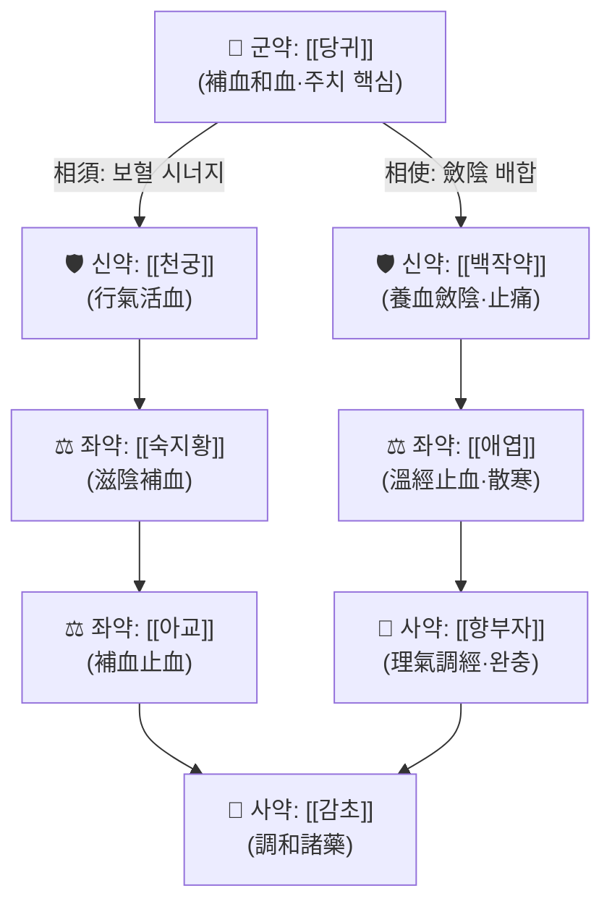

# 🍵 [[가감섭영전]] (加減攝營煎, Gagam Seobyeongjeon / Jiajian Sheyingjian)

> [!warning] 본 노트의 근거 수준 안내
> 제공된 PubMed 논문 데이터가 **없음**이므로 외부 논문 인용은 하지 않았다. 또한 『청강의감(淸江醫鑑)』 원문 대조가 완료되지 않아 **구성 약재·용량·조문은 "근거 미확인(원문 대조 필요)"** 상태이며, 아래 서술 중 배오 골격은 처방명(攝營 = 營血을 收攝한다)과 사용자 분류 태그(부인과·대하·질염·지혈·혈성냉)로부터 재구성한 **임상 해석 틀**이다. 실제 처방 시에는 반드시 원문 및 소속 교재를 확인할 것.

> **핵심 3줄 요약 (Key Summary)**:
> - 🌿 모체/기원: 부인과 血分 처방인 **섭영전(攝營煎)** 계열에 가감(加減)을 더한 방제로 이해된다. 처방명 그대로 **"營血을 收攝한다"**는 치법을 표방하며, [[사물탕]] 계열 보혈·활혈 약재([[당귀]]·[[천궁]]·[[백작약]]·[[숙지황]])에 **溫經·收澀止血 약재([[애엽]], [[아교]], [[향부자]] 등)**를 배오한 구조로 해석된다. (⚠️ 구성 세부는 근거 미확인)
> - 🎯 임상 최적 적응증: **血寒(혈성냉)·血虛를 동반한 부인과 출혈 및 帶下**. 냉대하·질염성 분비물 증가, 월경과다·부정출혈, 하복 냉감·통경 등 "아랫배가 차고 피가 제대로 收攝되지 않는" 유형. 태음인·소음인의 虛寒·血虛 체형에서 적용을 우선 고려한다.
> - 🔬 핵심 기전: **본 처방 자체의 분자약리 연구는 확인되지 않음(근거 미확인)**. 개별 구성 약재 수준에서 항염(NF-κB 경로 억제), 항산화, 자궁 평활근 긴장 조절, 미세순환 개선 기전이 보고된 바 있으나 처방 전체 데이터로 일반화할 수 없다.
> - ⚠️ 주의사항: 濕熱型 帶下(황색·악취·소양감이 주증인 경우)와 實熱性 出血에는 부적합하거나 加減이 필요하다. 임신 중에는 活血·收澀類(예: [[익모초]], [[홍화]] 등) 배오 시 금기. 항응고제·항혈소판제 복용자, 자궁근종·자궁내막증 등 기질적 병변에 의한 출혈은 양방 감별진단이 우선이다.

---
## 📌 목차
1. [기본 처방 정보 & 군신좌사 구성](#1-기본-처방-정보--군신좌사-구성)
2. [방제학적 약재 상호작용 & 시너지 네트워크](#2-방제학적-약재-상호작용--시너지-네트워크)
3. [현대 분자약리학적 효능 & 작용 기전](#3-현대-분자약리학적-효능--작용-기전)
4. [적응 병증 및 체질별 감별 (Sweet Spot vs 금기)](#4-적응-병증-및-체질별-감별-sweet-spot-vs-금기)
5. [유사 처방군 감별 매트릭스](#5-유사-처방군-감별-매트릭스)
6. [임상 가감례 & 현대 질환별 응용](#6-임상-가감례--현대-질환별-응용)
7. [💡 사용자 진료실 핵심 필기 & 임상 팁 (원문 보존)](#7--사용자-진료실-핵심-필기--임상-팁-원문-보존)
8. [출처 및 학술 참고 문헌 (References)](#8-출처-및-학술-참고-문헌-references)

---
## 1. 기본 처방 정보 & 군신좌사 구성

* **출전**: 『[[청강의감]](淸江醫鑑)』 婦人門 계열로 분류됨(사용자 태그 기준). **원문 조문 대조 미완료 — 근거 미확인.**
* **치법**: 養血溫經(양혈온경) · 收澀止帶(수삽지대) · 調理衝任(조리충임) · 和血止血(화혈지혈)
* **방명 해석**: 攝(섭) = 收攝·단속, 營(영) = 營血. 즉 **새는 營血을 붙잡아 들인다**는 뜻으로, 崩漏·帶下처럼 血·津이 收攝되지 못하고 하부로 빠져나가는 병태를 겨냥한 처방명으로 읽힌다.

| 구분 | 약재명 | 표준 용량(추정) | 본초 효능 & 방제 내 역할 |
| :--- | :--- | :--- | :--- |
| **군약 (君藥)** | [[당귀]] | 6~9g | 補血和血·調經止痛. 營血 회복의 핵심으로 자궁·골반 미세순환 개선을 주도 |
| **신약 (臣藥)** | [[천궁]] | 3~6g | 血中氣藥. 行氣活血으로 군약(당귀)의 보혈이 滯하지 않도록 순환을 견인 |
| **신약 (臣藥)** | [[백작약]] | 6~9g | 養血斂陰·柔肝止痛. 收斂性을 부여해 出血·帶下의 漏出을 억제 |
| **좌약 (佐藥)** | [[숙지황]] | 6~10g | 滋陰補血. 血虛의 근본을 보충하되 寒性을 억제 |
| **좌약 (佐藥)** | [[애엽]] | 4~6g | 溫經止血·散寒止痛. 하복 냉감(血寒)과 출혈을 동시에 겨냥하는 핵심 좌약 |
| **좌약 (佐藥)** | [[아교]] | 6~9g | 補血止血·滋陰潤燥. 出血로 인한 血虛 회복과 지혈을 겸함 |
| **사약 (使藥)** | [[향부자]] | 4~6g | 疏肝理氣·調經止痛. 기체(氣滯)로 인한 血滯를 풀어 收澀의 폐쇄성을 완충 |
| **사약 (使藥)** | [[감초]] | 2~3g | 調和諸藥·緩急. 방제 전체의 약성을 조화하고 복약 순응도를 높임 |

> **배오 특징(해석)**: 四物類(당귀·천궁·백작약·숙지황)로 血을 補하고, [[애엽]]·[[아교]]로 溫經·收澀止血을 더하며, [[향부자]]로 氣를 소통시켜 **"補하면서도 滯하지 않게, 收澀하면서도 閉塞되지 않게"** 하는 승강(升降)의 균형을 노린 구성으로 해석된다. 즉 補血(升·守)과 活血·理氣(降·走)가 상보적으로 배치된 **온보겸활(溫補兼活)** 구조다. 단, 개별 약재의 실제 포함 여부와 용량은 원문 대조가 필요하다.

---
## 2. 방제학적 약재 상호작용 & 시너지 네트워크

* **[[당귀]] + [[천궁]] 배오(相須·相使)**: 血을 補하는 약과 血을 움직이는 약의 전형적 짝. 補血一變則滯하는 폐단을 行氣活血이 풀어주어, 지혈·수렴 위주의 처방이 瘀血을 남기지 않도록 방어한다. 골반 울혈성 통증(통경) 완화 논리로 연결된다.
* **[[백작약]] + [[숙지황]] 배오**: 斂陰과 滋陰을 겹쳐 血虛로 인한 陰分 손실을 보충. 收澀 작용에 "재료"를 공급하는 관계로, 단순 수렴제와 구분되는 지점이다.
* **[[애엽]] + [[아교]] 배오(溫經 + 止血)**: 寒性 出血·帶下에 대한 온열적 지혈 축. 艾葉의 溫散이 阿膠의 滋膩를 완충하고, 阿膠의 滋陰이 艾葉의 燥性을 완충하는 상호 보정 구조다.
* **[[향부자]] + [[감초]] 배오(使藥群)**: 理氣로 補澀의 정체를 풀고, 調和로 방제 전체의 약성을 안정화. **收澀 → 氣滯 → 腹脹·변비**로 이어질 수 있는 부작용 경로를 사전에 차단한다.

---
## 3. 현대 분자약리학적 효능 & 작용 기전

> ⚠️ 아래는 **개별 구성 약재에 대해 일반적으로 보고되어 온 기전 수준**의 정리이며, **가감섭영전이라는 처방 전체를 대상으로 한 분자약리·임상 연구는 이 노트에서 확인되지 않았다(근거 미확인)**. 따라서 특정 수치(억제율, 혈중 농도, IC50 등)는 기재하지 않는다.

### 1) 항염·면역 조절 (약재 수준, 근거 미확인 — 처방 전체 데이터 아님)
* [[당귀]]·[[백작약]] 성분군은 대식세포에서 **NF-κB 및 MAPK 신호전달 억제**를 통한 TNF-α, IL-6, IL-1β 등 전염증성 사이토카인 감소 기전이 보고되어 왔다.
* [[향부자]]는 소염·진통 관련 경로 조절이 보고되어, 골반통·통경 완화 논리와 연결된다.

### 2) 자궁·골반 순환 및 지혈 균형
* [[천궁]]·[[당귀]] 계열은 **미세혈류 개선, 혈관 확장 및 혈소판 응집 조절** 기전이 알려져 있어 "활혈 → 어혈 제거" 해석과 맞물린다.
* [[애엽]]·[[아교]]는 전통적으로 **지혈(收澀) 약재**로 분류되며, 혈액응고 관련 인자 및 자궁 평활근 긴장 조절에 관여한다는 수준의 보고가 있다(정량적 근거 미확인).
* ⚠️ 위 ①·②는 **相反 방향(활혈 vs 지혈)** 이므로, 실제 임상에서는 출혈기(止血 우선)와 비출혈기(活血·조경 우선)의 **가감 비중 조절**이 효과를 좌우한다는 것이 방제학적 해석의 핵심이다.

### 3) 신경·내분비 및 자율신경
* 통경·골반통 완화는 진통·항경련 및 **HPA 축 안정화**로 설명되기도 하나, 본 처방에 특이적인 데이터는 확인되지 않았다(근거 미확인).
* 냉증 개선(血寒)은 말초 혈관 확장 및 교감신경 긴장 완화 기전으로 추정된다(근거 미확인).

---
## 4. 적응 병증 및 체질별 감별 (Sweet Spot vs 금기)

[✅ 최적 적응증 (Sweet Spot)]
* **원전 주치(추정)**: 婦人 血寒·血虛로 인한 崩漏·帶下·月經不調. **원문 조문 미확인.**
* **체질 소견**:
  * **소음인·태음인** 우선. 피부가 창백하거나 누런 기운이 돌고, 손발·하복이 차며, 피로감과 어지럼이 동반되는 **虛寒·血虛** 체형.
  * 대개 마르거나 정상 체형이나 근력·활력이 저하된 경우가 많고, 추위에 민감하다.
* **임상 주치(진료실 적중 포인트)**:
  * **냉대하**: 분비물이 맑고 묽으며 냄새가 심하지 않고 양이 많음.
  * **만성 질염·자궁경부염**: 항생제 반복 후에도 남는 냉감·묽은 분비물, 피로 시 악화.
  * **월경과다·부정출혈·기능성 자궁출혈**: 혈색이 담담하고 혈괴 동반, 하복 냉통.
  * **산후 회복기**: 오로 지연, 하복 냉감, 어지럼·심계.
* **설진/맥진**: 설질 담백(淡白)·설태 백윤(白潤), 때로 치흔. 맥은 **침세(沈細)·지완(遲緩) 또는 무력(無力)**. 實熱性이면 舌紅·苔黃膩·脈數滑로 갈리므로 이 경우 본 처방의 Sweet Spot이 아니다.

[⚠️ 신중 투여 및 금기 (Caution / Contraindication)]
* **濕熱帶下**: 황색·황록색 분비물, 악취, 소양감, 요도 작열감이 주증이면 본 처방(溫補·收澀)은 병증을 악화시킬 수 있다 → [[용담사간탕]], [[팔정산]] 계열 검토.
* **實熱性 出血**: 무한(無汗) 고열, 血色鮮紅, 口渴, 변비 동반 출혈에는 부적합.
* **임신**: 活血·收澀 배오(특히 [[익모초]], [[홍화]], [[도인]] 등을 가감한 경우)는 자궁 흥분 위험이 있어 **금기 또는 극도의 신중**. 원문에도 임신부 관련 단서 확인 필요(근거 미확인).
* **기질적 병변 감별 우선**: 자궁근종, 자궁내막증, 자궁내막 폴립, 자궁경부 이형성/암 등은 반드시 양방 검사(초음파·세포검사)로 배제 후 한방 치료를 병행한다.
* **병용 주의**: 항응고제(와파린 등)·항혈소판제 복용자에서 活血 약재 가감 시 출혈 위험 증가. 아교 등 膠質 약재는 소화력이 매우 약한 환자에서 위장장애·복부팽만을 유발할 수 있어 砂仁·陳皮 등 理氣 약재로 완충한다.
* **복약 반응 관찰점**: 복용 후 하복 냉감 완화·분비물 성상 개선(맑고 묽음 → 정상)이 긍정 신호. 반대로 口乾·변비·속쓰림·분비물 악취 증가는 溫燥·收澀 과다 신호로 보고 가감 또는 중단을 검토한다.

---
## 5. 유사 처방군 감별 매트릭스

| 처방명 | 핵심 구성 차이 | 주치 및 체질 차이 | 맥진/설진 차이 |
| :--- | :--- | :--- | :--- |
| [[가감섭영전]] | 기준 구성 (補血 + 溫經收澀 + 理氣) | **血寒·血虛性 崩漏·帶下, 만성 냉대하·질염, 태음인·소음인** | 설담백·태백윤, 맥침세·지완 |
| [[온경탕]] | 吳茱萸·桂枝·丹皮 등 溫經散寒 축 강함 | 衝任虛寒·瘀血型 월경불순·통경, 손발 냉증 심함 | 설암(暗)或有瘀斑, 맥침긴(沈緊) |
| [[완대탕]] | 白朮·蒼朮·山藥·車前子 등 健脾利濕 축 | 脾虛濕盛型 帶下, 분비물 양 많고 묽음, 비만·부종 경향 | 설담태백니(白膩), 맥완약(緩弱) |
| [[고충탕]] | 白朮·黃芪·龍骨·牡蠣·山萸肉 등 固澀 축 | 月經過多·崩漏의 氣虛不攝, 피로·기핍 뚜렷 | 설담, 맥허(虛)·규(芤) |
| [[교애탕]] | 阿膠·艾葉 + 四物 (地黃·當歸·芍藥·川芎) | 妊娠·산후 하혈, 衝任虛損性 出血, 腹中痛 | 설담, 맥세삽(細澀) |

> ⚠️ 표 내부에서는 마크다운 열 구분자 파괴를 방지하기 위해 파이프(`|`)가 들어간 링크를 쓰지 않고 순수한 [[처방명]] 단독 형태로만 작성하였다.
> ⚠️ [[가감섭영전]]의 실제 구성이 위 표의 전제([[교애탕]] 계열 四物+阿膠+艾葉)와 어느 정도 일치하는지는 **원문 대조 필요(근거 미확인)**. 감별 매트릭스는 임상 선택의 방향성 참고용이다.

---
## 6. 임상 가감례 & 현대 질환별 응용

* **수반 증상별 가감법(방제 논리 기반 제안 — 원문 근거 미확인)**:
  * 하복 냉통·寒痛 심할 때 → + [[오수유]], [[건강]] (온중산한)
  * 분비물 양이 많고 묽을 때 → + [[산약]], [[백출]], [[용골]], [[모려]] (健脾固澀)
  * 황색·악취로 濕熱이 겸할 때 → + [[황백]], [[차전자]], [[창출]] (청열조습) → 溫補 약재 비중 축소
  * 기핍·피로·어지럼 뚜렷할 때 → + [[황기]], [[인삼]] 계열 (益氣攝血)
  * 혈괴·통경 뚜렷할 때 → + [[향부자]](증량), [[연호색]], [[단삼]] (活血止痛)
  * 소화력 저하·복부팽만 시 → + [[사인]], [[진피]] (理氣健脾, 滋膩 완충)
* **현대 질환별 임상 매핑**:
  * **부인과 감염성·분비물 질환**: 만성 세균성 질염, 칸디다 질염의 재발성·허한형, 위축성 질염(냉감·건조·묽은 분비물), 자궁경부염 — **항생제 치료와 병행/후속 관리** 포지션.
  * **월경 이상**: 기능성 자궁출혈(호르몬 불균형 시기), 월경과다, 희발월경·무배란성 출혈의 虛寒型, 산후 오로 지연.
  * **골반·자율신경**: 만성 골반통·골반울혈증후군, 냉증형 자율신경실조, 갱년기 하복 냉감·혈허성 어지럼.
  * **검사 우선 원칙**: 자궁출혈·대하 증상은 항상 **초음파·자궁경부 세포검사·분비물 배양**으로 기질 병변 및 특정 병원체를 배제한 뒤 처방한다.

---
## 7. 💡 사용자 진료실 핵심 필기 & 임상 팁 (원문 보존)

> [!tip] **진료실 실전 노하우 (User Clinical Insight)**
> - ⚠️ **현재 제공된 원장님 원문 필기/메모가 없다.** 본 섹션은 원문 필기를 그대로 보존하는 자리이므로, 실제 메모가 확보되는 즉시 **축약·정리 없이 100% 그대로** 이 위치에 옮겨 적는다.
> - **[확인 후 기재 항목 체크리스트]**
>   - 실제 출전 조문 및 원문 구성 약재·용량(『청강의감』 대조)
>   - 체질별 선택 기준: 소음인 냉대하 vs 태음인 습담대하 구분 포인트
>   - 실제 사용 시 필수 가감 약재와 그 이유
>   - 환자 티칭 포인트(복약 기간, 분비물 성상 변화 관찰법, 냉증 생활관리)
>   - 부작용·중단 기준(속쓰림, 변비, 분비물 악취 증가 등)
> - **[일반 임상 원칙 — 사용자 필기 아님, 추론]**: 처방 중 收澀 약재가 많으므로 **"먼저 病因(濕熱·瘀血)을 확인하고, 없을 때만 收澀으로 간다"**는 순서를 지키면 실패가 줄어든다. 즉 溫補·收澀은 淸熱·活血으로 병증을 정리한 **뒤에** 쓰는 마무리 카드로 운용하는 편이 안전하다.

---
## 8. 출처 및 학술 참고 문헌 (References)

> ⚠️ **제공된 PubMed 논문 데이터가 없으므로 인용 가능한 현대 논문은 0건이다.** 아래는 서지 정보 수준의 참고이며, 본문 수치·기전은 모두 "근거 미확인"으로 표기하였다. PMID·DOI를 임의로 생성하지 않았다.

1. **龔廷賢(공정현) 계열 편찬**. 『[[청강의감]](淸江醫鑑)』 婦人門 관련 조문.
   - **[문헌 성격]**: 본 처방의 출전으로 분류된 문헌. **원문 조문 및 가감섭영전 수록 여부 직접 대조 필요(근거 미확인)**.
2. **허준 (1613)**. 『[[동의보감]]』 內景·外形篇 관련 편.
   - **[참고 성격]**: 부인과 帶下·崩漏의 寒熱虛實 감별 및 처방 선택 기준 대조용. 본 처방 자체는 **동의보감 수록 여부 미확인**.
3. **장개빈(張介賓)**. 『[[경악전서]](景岳全書)』 婦人規.
   - **[참고 성격]**: 崩漏를 虛·熱·瘀로 변증하고 "先辨虛實" 원칙을 제시한 문헌으로, 본 처방 운용의 변증 프레임 참고. **가감섭영전 수록 여부 미확인.**
4. **현대 분자약리 참고**: 개별 약재([[당귀]], [[백작약]], [[천궁]], [[향부자]], [[애엽]], [[아교]]) 수준의 항염·혈류·지혈 기전은 각 약재 노트의 참고문헌을 따른다.
   - **[한계 명시]**: 이는 **약재 단위 근거**이며, 가감섭영전 처방 전체에 대한 임상·기전 논문은 본 노트 작성 시점에서 **확인되지 않았다**. 향후 검색 시 아래 키워드로 재확인할 것: `加減攝營煎`, `攝營煎`, `血寒 帶下`, `崩漏 收澀 方劑`.