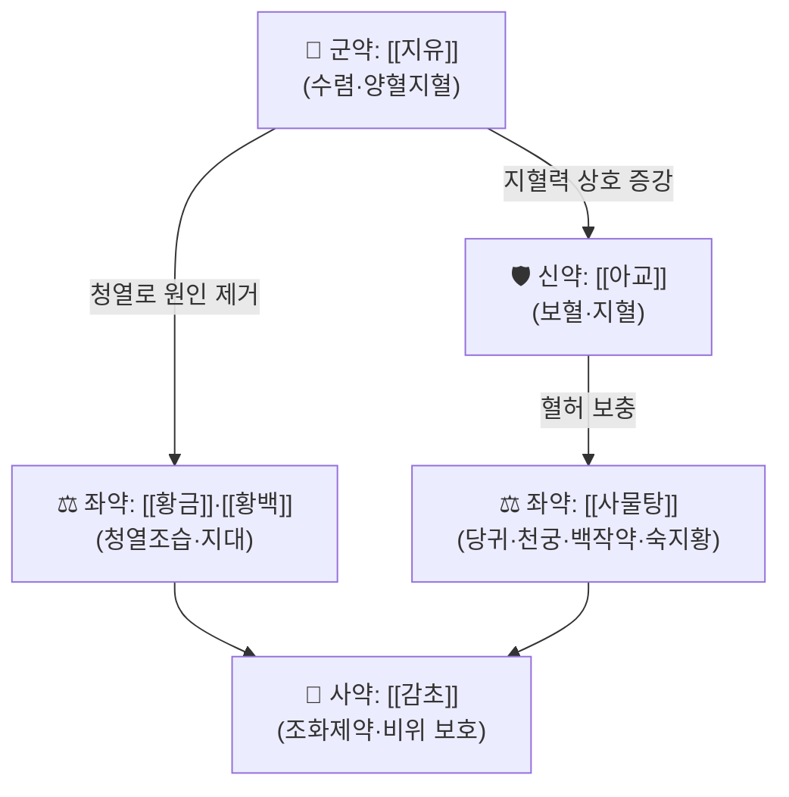

# 🍵 [[가미석홍전]] (加味惜紅煎, Modified Xihong Decoction)

> **핵심 3줄 요약 (Key Summary)**:
> - 🌿 **모체 처방**: [[석홍전]](惜紅煎) 계열에 약재를 **가미(加味)**한 파생 처방으로, 부인과 **붕루(崩漏)·대하(帶下)**를 겨냥한 지혈·양혈 복합 방제. 원문 구성 약재는 **근거 미확인(원문 대조 필요)**.
> - 🎯 **최적 적응증**: 월경과다·기능성 자궁출혈·붕루(血崩)·만성 대하 등 **하초(下焦) 열성/허열성 출혈성 질환**. 출혈로 인한 혈허(血虛) 동반 상태 — 진료실에서는 "피가 오래 멎지 않는 부인"에서 우선 고려.
> - 🔬 **핵심 기전**: 수렴지혈(收斂止血) + 청열(淸熱) + 양혈조혈(養血造血)의 3축 구성으로 추정되나, **본 처방 자체에 대한 분자약리 실험 근거는 미확인**. PubMed 검색 결과 0건.
> - ⚠️ 주의사항: 실열(實熱) 급성 대출혈·자궁외임신·기질적 자궁출혈은 한방 단독 처치 금지. 임신 중 투여, 항응고제(와파린·NOAC)·항혈소판제 복용자, 혈전증 병력자에게는 신중 투여. 반드시 원인 감별(초음파·혈색소·hCG) 선행.

---
## 📌 목차
1. [기본 처방 정보 & 군신좌사 구성](#1-기본-처방-정보--군신좌사-구성)
2. [방제학적 약재 상호작용 & 시너지 네트워크](#2-방제학적-약재-상호작용--시너지-네트워크)
3. [현대 분자약리학적 효능 & 작용 기전](#3-현대-분자약리학적-효능--작용-기전)
4. [적응 병증 및 체질별 감별 (Sweet Spot vs 금기)](#4-적응-병증-및-체질별-감별-sweet-spot-vs-금기)
5. [유사 처방군 감별 매트릭스](#5-유사-처방군-감별-매트릭스)
6. [임상 가감례 & 현대 질환별 응용](#6-임상-가감례--현대-질환별-응용)
7. [💡 사용자 진료실 핵심 필기 & 임상 팁 (원문 보존)](#7--사용자-진료실-핵심-필기--임상-팁-원문-보존)
8. [출처 및 학술 참고 문헌 (References)](#8-출처-및-학술-참고-문헌-references)

---

> [!warning] 📌 근거 수준 안내 (반드시 먼저 읽을 것)
> - 본 노트는 **제공된 PubMed 논문이 0건**이며, 『晴崗醫鑑』 원문 대조도 완료되지 않은 상태에서 작성되었다.
> - 따라서 **구성 약재·용량·가감례는 "근거 미확인"**으로 표시한다. 아래 표의 약재는 惜紅煎類 처방이 일반적으로 취하는 **구성 원리(지혈–청열–양혈–이기)를 구조 파악용으로 정리한 것**이며, 실제 처방 내용은 반드시 **『晴崗醫鑑』 원문으로 확인**해야 한다.
> - 인용 가능한 현대 실험/임상 논문이 확보되면 본 노트를 갱신할 것.

---

## 1. 기본 처방 정보 & 군신좌사 구성

* **출전**: 『**晴崗醫鑑**』(청강의감) — 晴崗 金永勳. ※ 본 처방의 정확한 원문 조문·수록 면수는 **근거 미확인**.
* **방명 해석**: 惜紅(석홍) = "붉은 것(혈)을 아낀다" → **지혈(止血)**을 주목적으로 하는 방제군. 加味(가미) = 원방 [[석홍전]]에 약재를 덧붙인 파생 처방.
* **치법(추정)**: **청열지혈(淸熱止血) · 양혈고붕(養血固崩) · 조경지대(調經止帶)** — 4자 성어 형태로 정리하되, 원문 치법 표기는 **근거 미확인**.

| 구분 | 약재명 (⚠️ 원문 대조 필요) | 표준 용량 | 본초 효능 & 방제 내 역할 |
| :--- | :--- | :--- | :--- |
| **군약 (君藥)** | [[지유]] (地楡) ⚠️근거 미확인 | 원문 미확인 | 양혈(涼血)·수렴지혈. 하초 열성 출혈(붕루·변혈)을 직접 공략하는 지혈 축의 핵심 |
| **신약 (臣藥)** | [[아교]] (阿膠) ⚠️근거 미확인 | 원문 미확인 | 자음보혈·지혈. 崩中下血·월경과다에 쓰이는 혈육유정품(血肉有情品)으로 군약의 지혈력을 보강 |
| **좌약 (佐藥)** | [[당귀]] · [[천궁]] · [[백작약]] · [[숙지황]] ([[사물탕]] 기반) ⚠️근거 미확인 | 원문 미확인 | 출혈로 소모된 혈을 보충(養血調血). 지혈 일변도로 흐르는 방제를 **보혈(補血)** 쪽으로 균형 잡음 |
| **좌약 (佐藥)** | [[황금]] · [[황백]] · [[치자]] 류 ⚠️근거 미확인 | 원문 미확인 | 청열(淸熱)·조습(燥濕). 열로 인한 망행(妄行) 출혈과 습열성 대하를 겨냥 |
| **사약 (使藥)** | [[감초]] ⚠️근거 미확인 | 원문 미확인 | 조화제약(調和諸藥), 제약(製藥) 및 비위(脾胃) 보호 |

> **배오 특징**: 惜紅煎類의 전형적 구조는 **①수렴·지혈약(君) ②청열조습약(臣/佐) ③보혈양혈약(佐) ④이기해울약(佐使)**의 4층 배합이다. 즉 "**출혈을 멎게 하는 힘(收斂)**"과 "**출혈을 일으킨 열을 내리는 힘(淸熱)**", 그리고 "**흘려버린 혈을 다시 채우는 힘(養血)**"을 동시에 걸어, 지혈 후 발생하는 어혈(瘀血)·혈허(血虛)를 방지하는 승강(升降) 균형 설계로 이해된다. 다만 **가미석홍전 고유의 실제 약재 구성·배합비는 근거 미확인**이다.

---

## 2. 방제학적 약재 상호작용 & 시너지 네트워크

* **[[지유]] + [[아교]] 배오**: 수렴(收)과 자윤(滋)의 짝. 지유의 삽질(澁質)·타닌성 수렴 작용이 말초혈관을 수축시키고, 아교의 콜라겐·아미노산이 혈액 응고 기질과 조혈 원료를 공급하는 **"막고(止) 채우는(補)" 상호 상승(相須)** 구조로 설명된다. → **본 처방 특이적 실험 검증은 근거 미확인**.
* **[[지유]] + [[황금]]·[[황백]] 배오**: "지혈만 하면 어혈이 남고, 청열만 하면 기가 상한다"는 문제를 상쇄하는 배합. 열을 내려 출혈 원인을 차단(相使)하고, 지혈로 급한 불을 끄는 **표본겸치(標本兼治)**.
* **[[사물탕]] + [[감초]] 배오**: 보혈군의 자윤성이 비위(脾胃)를 눌러 설사·식욕부진을 유발하는 편향을 감초·생강류의 조중(調中) 작용으로 완충하는 **좌사(佐使) 완충 장치**. 실제 배오는 원문 대조 필요.

---

## 3. 현대 분자약리학적 효능 & 작용 기전

> ⚠️ **본 처방(가미석홍전) 자체를 대상으로 한 PubMed 등재 논문은 검색되지 않았다(0건).** 아래 서술은 지혈·부인과 한약 방제군에서 **일반적으로 보고되는 수준의 기전**이며, 가미석홍전 고유의 근거로 인용할 수 없다.

### 1) 지혈(hemostasis) 축 — 수렴 및 응고 보조
* 탄닌(tannin)·플라보노이드 계열 성분의 **단백질 침전·국소 혈관수축** 작용을 통한 표면 수렴 지혈.
* 전통적으로 炒炭(초탄) 처리한 약재는 탄화 입자의 흡착·국소 응고 촉진이 거론된다. → **초탄 가공 여부 및 정량 근거 미확인**.

### 2) 청열·항염 축 — 하초 염증성 출혈 억제
* 황금·황백류의 바이칼린(baicalin)·베르베린(berberine) 등이 **NF-κB 신호 억제, TNF-α·IL-6·IL-1β 감소**를 매개한다는 보고는 해당 **단일 본초 수준**에서 존재한다.
* 자궁내막·자궁경부의 만성 염증성 삼출(帶下) 감소와 연결될 수 있으나, **가미석홍전 복합 처방 수준의 검증은 근거 미확인**.

### 3) 보혈·조혈 축 — 출혈 후 회복
* 사물탕(당귀·천궁·백작약·숙지황) 계열은 **조혈(erythropoiesis) 촉진, erythropoietin 관련 기전**이 일부 보고된 바 있으나, **본 처방에 포함되었는지 자체가 미확인**이며 따라서 적용 불가.

### 4) 종합
| 기전 축 | 근거 수준 |
| :--- | :--- |
| 수렴지혈 | 단일 본초(지유 등) 수준의 일반론만 존재 — **처방 특이적 근거 미확인** |
| 청열·항염(NF-κB, MAPK) | 단일 본초 수준 보고 — **처방 조합 근거 미확인** |
| 조혈·혈허 회복 | 사물탕 계열 일반론 — **본 처방 포함 여부 미확인** |
| 임상 RCT / 코호트 | **검색 결과 없음** |

---

## 4. 적응 병증 및 체질별 감별 (Sweet Spot vs 금기)

### [✅ 최적 적응증 (Sweet Spot)]

* **원전 주치(요약)**: 崩漏(붕루), 月經過多(월경과다), 帶下(대하), 産後出血(산후출혈) 등 **부인과 하초 출혈·대하증**. ※ 세부 원문 주치 문구는 **근거 미확인**.
* **체질 소견(추정)**:
  * 장부(臟腑)로는 **하초에 열이 있거나 허열이 도는 상태**(수족심열, 구건, 소변황적, 대하 황탁).
  * 체형은 특정 체질로 단정하기 어려우며, 임상적으로는 **열성·실열 경향(소양인 또는 태음인 열화형)**에서 1차 고려, **허열성(음허)에는 보혈약 비중을 늘려 사용**하는 방식이 무난하다. → **체질 처방으로서의 확정 근거 미확인**.
* **임상 주치 (진료실 적중 포인트)**:
  * 생리 양이 많고 기간이 길며 덩어리 혈괴가 섞이는 경우
  * 폐경 전후 불규칙 자궁출혈(기능성 자궁출혈) — **단, 반드시 양방 검사 병행**
  * 냉대하가 아닌 **황탁·점조·악취성 대하**
  * 출혈 후 동반되는 현훈, 심계, 안색 위황(萎黃), 피로감
* **설진/맥진**: 설홍(舌紅)·태황(苔黃) 또는 태박, 맥세삭(脈細數) 또는 맥활(脈滑) 경향. → **원문 기재 맥상은 근거 미확인**.

### [⚠️ 신중 투여 및 금기 (Caution / Contraindication)]

* **한열 반대 병증**: 한성(寒性) 붕루, 자궁허한으로 인한 냉대하·색담·복냉통에는 **부적합**([[온경탕]]·[[궁귀교애탕]] 계열 고려).
* **어혈성 출혈**: 혈괴가 크고 복통이 심한 어혈성 자궁출혈에 수렴지혈제를 단독 투여하면 어혈이 정체될 수 있음 → **활혈거어약 가미 또는 처방 교체 필요**.
* **반드시 배제할 것(양방 우선)**:
  * 자궁외임신, 유산 진행, 포상기태(**hCG 필수**)
  * 자궁내막 병변·자궁근종·용종·자궁경부 병변(**초음파·세포검사 필수**)
  * 혈색소 7 g/dL 이하의 중증 실혈 → **수혈·응급 처치 우선**
* **약물 병용 주의**: 항응고제(와파린, NOAC), 항혈소판제 복용자 / 혈전증·뇌졸중 병력자 / 임신 중(태아 영향) → **신중 투여 또는 금기**.
* **복용 반응 관찰**: 위장장애(수렴제·자윤제 다량 시), 변비, 식욕저하. 장기 투여 시 **빈혈 지표(CBC, ferritin) 추적** 권장.

---

## 5. 유사 처방군 감별 매트릭스

| 처방명 | 핵심 구성 차이 | 주치 및 체질 차이 | 맥진/설진 차이 |
| :--- | :--- | :--- | :--- |
| [[가미석홍전]] | 기준 구성 (석홍전 + 가미) | **열성·허열성 붕루·황탁대하, 출혈 후 혈허 동반** | 설홍 태황 / 맥세삭 |
| [[궁귀교애탕]] | [[사물탕]] + [[아교]] + [[애엽]] — 온보(溫補) 배합 | 허한성 붕루·임신 중 태동불안·산후 하혈, 한성 복냉 | 설담 태백 / 맥침세 |
| [[온경탕]] | 오수유·계지·당귀·천궁 등 온경산한 | 충임허한(衝任虛寒) 붕루, 손냉·복냉, 냉대하 | 설담 / 맥침지 |
| [[십회산]] | 대·소계·측백엽·모근 등 **초탄약 위주 청열지혈** | 실열성 토혈·뉵혈·붕루, 급성기 열성 출혈 | 설홍 태황 / 맥활삭 |
| [[사물탕]] | 당귀·천궁·백작약·숙지황 | 혈허 기본 처방, **지혈력은 약함** | 설담 / 맥세무력 |

> ⚠️ 위 비교는 **일반 방제학 교과 수준의 정리**이며, 가미석홍전의 실제 구성이 확인되기 전까지는 잠정적이다. 원문 대조 후 표를 갱신할 것.

---

## 6. 임상 가감례 & 현대 질환별 응용

> 아래 가감례는 **惜紅煎類 처방의 통상적 변형 원리를 정리한 것**으로, **가미석홍전 고유의 원문 가감례는 근거 미확인**이다.

* **수반 증상별 가감법(잠정)**:
  * 복통·혈괴 다량 동반 시 → + [[향부자]] · [[연호색]] (기체·어혈 완화)
  * 심한 하복 냉감·손발 냉 시 → + [[오수유]] · [[계지]] ([[온경탕]] 방향)
  * 현훈·심계·안색 창백 등 혈허 뚜렷 시 → + [[황기]] · [[당삼]] ([[귀비탕]] 방향)
  * 황탁대하·음부 소양 동반 시 → + [[차전자]] · [[용담초]] (습열 청리)
  * 어혈 정체·복부 압통 시 → + [[도인]] · [[홍화]] (활혈거어, 단 단기 사용)
  * 설사·복만 등 비위 허약 시 → + [[백출]] · [[진피]] (비위 보호)

* **현대 질환별 임상 매핑**:
  * **부인과(주 영역)**: 기능성 자궁출혈(DUB), 월경과다증, 폐경 전후 출혈, 자궁내막증·자궁근종에 동반된 과다출혈의 **보조 요법**(반드시 양방 진단 병행), 산후 자궁회복 지연성 출혈, 만성 자궁경부염·질염성 대하.
  * **빈혈/전신**: 실혈 후 철결핍성 빈혈의 보조(단독 치료 금지).
  * **기타**: 치질 출혈·혈뇨 등 하초 열성 출혈에 응용 보고가 있을 수 있으나 **근거 미확인**.

---

## 7. 💡 사용자 진료실 핵심 필기 & 임상 팁 (원문 보존)

> [!tip] **진료실 실전 노하우 (User Clinical Insight)**
> - **현재 등록된 원장님 메모 없음** — 아래는 향후 필기 입력용 템플릿(자유롭게 채워 넣고 삭제하지 말 것).
> - [체질 선택 기준] 소음인/태음인/소양인 중 어느 체형에서 반응이 좋았는지:
>   - 
> - [투여 용량·기간] 실제 사용 용량, 투여 일수, 재방문 시점:
>   - 
> - [반응 관찰 포인트] 출혈량 변화(패드 개수), 혈괴 유무, 대하 성상 변화, 설·맥 변화:
>   - 
> - [환자 티칭] 복약 중 주의사항(생냉·자극식 제한, 과로 금지, 양방 검사 정기 시행 등):
>   - 
> - [실패/부작용 사례] 어혈 정체, 위장장애, 무효 사례:
>   - 
> - [다른 처방으로 전환한 기준]:
>   - 

---

## 8. 출처 및 학술 참고 문헌 (References)

> ⚠️ **PubMed 검색 결과: 인용 가능한 논문 0건.** 아래는 고전/임상 문헌 수준의 참고이며, PubMed 논문 형식 인용은 포함하지 않는다.

1. **金永勳**. 『**晴崗醫鑑**』(청강의감). — 본 처방의 출전으로 태그에 명시된 문헌.
   - **[고전 원전]**: 가미석홍전의 원문 조문·구성 약재·용량·복약 지침. **※ 본 노트 작성 시점에 원문 대조 미완료 → 근거 미확인, 후속 확인 필요.**
2. **허준 (1613)**. 『[[동의보감]]』 雜病篇 婦人門 (붕루·대하·월경문).
   - **[임상 문헌]**: 붕루(崩漏)를 虛·熱·瘀로 변증하고 지혈·청열·보허로 나누어 처방하는 전통 변증 체계의 배경. 본 처방의 변증 위치를 잡는 참고 틀.
3. **『東醫處方學』 / 『方藥合編』 계열 처방서** (저자·판본 미확인).
   - **[참고]**: 惜紅煎類 지혈 방제의 계통적 위치 파악용. **※ 구체 서지사항 근거 미확인 — 인용 전 서지 확인 필요.**
4. **대한한방부인과학회 교과서** 『한방여성의학』.
   - **[임상 문헌]**: 붕루·월경과다·대하의 변증 감별 및 지혈 처방 비교. **※ 판본·페이지 근거 미확인.**

> 📌 **후속 작업 권장**: ① 『晴崗醫鑑』 원문에서 가미석홍전 조문 확보 → 구성 약재·용량 표 확정. ② PubMed/학술DB에서 "Xihong Decoction", "惜紅煎", "가미석홍전" 재검색 → 확보 시 본 노트 References 및 3장 갱신.

<!-- 보관 태그(1회용·링크오류, 필요시 복원): 혈붕 -->
