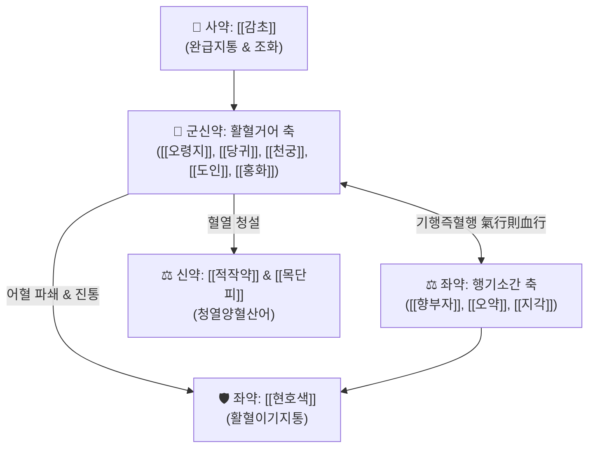

---
aliases:
  - 膈下逐瘀湯
  - Gexia-zhuyu-tang
  - Decoction for Removing Blood Stasis Below Diaphragm
tags:
  - 처방/활혈거어제
  - 활혈거어제/활혈거어
  - 격하혈어
  - 간비종대
  - 만성복통
  - 의림개착
---

# 🍵 [[격하축어탕]] (膈下逐瘀湯, Gexia-zhuyu-tang / Decoction for Removing Blood Stasis Below Diaphragm)

> **핵심 요약 (Key Summary)**:
> - 🌿 기본 구성: [[오령지]], [[당귀]], [[천궁]], [[도인]], [[목단피]], [[적작약]], [[현호색]], [[감초]], [[홍화]], [[향부자]], [[오약]], [[지각]] (도홍사물탕 골격에 이기소간의 향부자·오약·지각, 활혈지통의 오령지·현호색 결합).
> - 🎯 횡격막 아래 중초·상복부(간담·비위·복강)에 맺힌 기체혈어(氣滯血瘀), 옆구리 결림 및 고정성 자통, 뱃속에 단단하게 만져지는 종괴(적취·간비종대), 만성 간염, 췌장염 복통, 자궁내막증.
> - 🔬 혈소판 응집 억제 및 혈전 용해 촉진, 간문맥압 강하 및 간 미세순환 개선, NF-κB 염증 억제를 통한 장기 섬유화 방어, 내장 평활근 진경·진통.
> - ⚠️ 주의사항: 강력한 활혈파어(活血破瘀) 약재가 다수 배오되어 임산부에게는 투약 절대 금기, 소화성 궤양 출혈 환자 및 혈우병 환자 금기.

---

## 📌 목차
1. [기본 처방 정보 & 군신좌사 구성](#1-기본-처방-정보--군신좌사-구성)
2. [방제학적 약재 상호작용 & 시너지 네트워크](#2-방제학적-약재-상호작용--시너지-네트워크)
3. [현대 분자약리학적 효능 & 작용 기전](#3-현대-분자약리학적-효능--작용-기전)
4. [적응 병증 및 체질별 감별 (Sweet Spot vs 금기)](#4-적응-병증-및-체질별-감별-sweet-spot-vs-금기)
5. [유사 처방군 감별 매트릭스](#5-유사-처방군-감별-매트릭스)
6. [임상 가감례 & 현대 질환별 응용](#6-임상-가감례--현대-질환별-응용)
7. [💡 사용자 진료실 핵심 필기 & 임상 팁 (원문 보존)](#7--사용자-진료실-핵심-필기--임상-팁-원문-보존)
8. [출처 및 학술 참고 문헌 (References)](#8-출처-및-학술-참고-문헌-references)

---

## 1. 기본 처방 정보 & 군신좌사 구성

* **출전**: 청대 왕청임(王淸任) 《의림개착(醫林改錯)》 권상(卷上)
* **치법**: 활혈거어(活血祛瘀), 행기지통(行氣止痛), 거어소적(祛瘀消積)
* **적응증**: 격하(횡격막 아래 중초·상복부) 어혈형 복통, 적취(積聚), 옆구리 통증, 간비종대, 만성 위장관 혈어증

| 구분 | 약재명 | 표준 용량 | 본초 효능 & 방제 내 역할 |
| :--- | :--- | :--- | :--- |
| **군약 (君藥)** | [[오령지]] | 9g | 활혈지통(活血止痛), 화어지혈(化瘀止血), 복강 내 고정된 어혈 자통 완화 |
| **군약 (君藥)** | [[당귀]] | 9g | 보혈활혈(補血活血), 조경지통(調經止痛), 혈액을 보하면서 어혈을 운행 |
| **군약 (君藥)** | [[천궁]] | 6g | 활혈행기(活血行氣), 거풍지통(祛風止痛), 혈중 기약(氣藥)으로 상하 기혈 개통 |
| **신약 (臣藥)** | [[도인]] | 9g | 활혈거어(活血祛瘀), 윤장통변(潤腸通便), 단단한 어혈 덩어리 파쇄 |
| **신약 (臣藥)** | [[홍화]] | 9g | 활혈통경(活血通經), 거어지통(祛瘀止痛), 말초 미세혈류 개통 |
| **신약 (臣藥)** | [[적작약]] | 6g | 청열양혈(淸熱凉血), 산어지통(散瘀止痛), 혈열을 식히고 어혈을 흩뜨림 |
| **신약 (臣藥)** | [[목단피]] | 6g | 청열양혈(淸熱凉血), 활혈산어(活血散瘀), 어혈로 인한 울열(鬱熱) 해소 |
| **좌약 (佐藥)** | [[현호색]] | 3g | 활혈이기(活血理氣), 화어지통(化瘀止痛), 쥐어짜는 듯한 복부 산통 진통 |
| **좌약 (佐藥)** | [[향부자]] | 4.5g | 이기소간(理氣疏肝), 조경지통(調經止痛), 간담의 울체된 기기 소통 |
| **좌약 (佐藥)** | [[오약]] | 6g | 온신산한(溫腎散寒), 순기지통(順氣止통), 중하초 기체 및 복통 해소 |
| **좌약 (佐藥)** | [[지각]] | 4.5g | 파기소적(破氣消積), 관흉강기(寬胸降氣), 흉복부 기체 하강 유도 |
| **사약 (使藥)** | [[감초]] | 9g | 보기화중(補氣和中), 완급지통(緩急止痛), 조화제약 |

> **배오 특징 (원장님 구성 분석 & 상복부 적중 원리)**:
> 1. **중초·상복부 적중**: 격하(膈下), 즉 횡격막 아래의 **간담(肝膽)과 비위(脾胃) 영역**에 어혈과 기체가 얽힌 병태에 특화되어 작용합니다.
> 2. **기기를 뚫어 활혈거어 (기혈 쌍조)**: 피만 돌리는 것이 아니라 [[향부자]], [[오약]], [[지각]]의 삼총사가 기기를 상하좌우로 뚫어주어(기행즉혈행 氣行則血行), 굳어진 어혈 덩어리를 신속히 해체합니다.
> 3. **활혈 + 청열양혈의 균형**: 도인·홍화·오령지의 맹렬한 파어력에 적작약·목단피의 청열양혈약을 결합하여 어혈이 오래되어 생기는 혈열(血熱) 손상을 방어합니다.

---

## 2. 방제학적 약재 상호작용 & 시너지 네트워크

* **축어탕 5대 방제 중 중초 타격 전문**: 왕청임의 축어탕 시리즈 중 상초 흉통은 [[혈부축어탕]], 하초 골반통은 [[소복축어탕]], 전신 관절통은 [[신통축어탕]]이 담당하며, 격하축어탕은 **간, 담도, 비장, 위장관 등 중초 장기**의 고정성 어혈을 전담합니다.

---

## 3. 현대 분자약리학적 효능 & 작용 기전

### 1) 혈소판 응집 억제 및 미세혈류 순환 개선
* [[도인]]의 아미그달린, [[천궁]]의 [[센큐놀라이드]], [[홍화]]의 하이드록시샤플로워옐로우 A(HSYA)가 혈소판 COX-1 경로를 차단하고 TXA2 생성을 억제하여 모세혈관 내 미세혈전 용해를 촉진합니다.

### 2) 간문맥압 강하 및 장기 섬유화 억제 (Anti-fibrotic)
* [[오령지]], [[당귀]], [[단삼]] 유사 성분들이 간 성상세포(HSC)의 활성화를 억제하고 TGF-β1/Smad 신호 전달을 차단하여 만성 간염 및 간경변 모델에서 세포외 기질 콜라겐 침착을 유의하게 감소시킵니다.

### 3) 내장 신경성 자통 억제 및 평활근 진경
* [[현호색]]의 l-THP와 [[향부자]]의 알파-시페론이 말초 통각 수용기 감작을 차단하고 평활근 비정상 연축을 이완시켜 쥐어짜는 듯한 상복부 통증을 신속히 완화합니다.

---

## 4. 적응 병증 및 체질별 감별 (Sweet Spot vs 금기)

[✅ 최적 적응증 (Sweet Spot)]
• 병태생리: 횡격막 아래 상복부에 어혈이 뭉쳐 혈류가 차단되고 기기가 정체되어 찌르는 듯한 통증이나 멍울이 생긴 상태
• 주치 병증: 옆구리 아래 고정성 자통(찌르는 듯한 통증), 뱃속에 단단하게 만져지는 적취(간비종대, 비장 비대), 만성 간염, 담낭염 및 췌장염 후유증 복통, 간울혈어형 위염, 자궁내막증
• 설진/맥진: 설질자암(舌質紫暗) 또는 어반(瘀斑), 설하면 정맥 노창, 맥침삽(沈澁) 또는 맥현삽(弦澁)

[⚠️ 신중 투여 및 금기 (Caution / Contraindication)]
• 임산부 절대 금기: 도인, 홍화, 오령지의 강력한 활혈파어 작용으로 자궁 수축을 유발하여 유산 위험
• 급성 출혈성 질환: 소화성 궤양 급성 출혈기, 혈소판 감소증, 혈우병 환자 금기
• 기혈 극허 환자: 출혈 경향이 있거나 맥이 미약한 환자는 보기혈제를 선행 투여

---

## 5. 유사 처방군 감별 매트릭스

| 처방명 | 핵심 배오 차이 | 주치 및 임상 차별점 | 맥진/설진 차이 |
| :--- | :--- | :--- | :--- |
| [[격하축어탕]] | 활혈거어약 + [[향부자]], [[오약]], [[지각]] | **횡격막 아래 중초·상복부 어혈, 간비종대, 고정성 자통** | 맥침삽, 설자암어반 |
| [[혈부축어탕]] | [[도홍사물탕]] + [[사역산]] + [[우슬]], [[길경]] | **흉격 흉중혈어, 만성 두통, 흉통, 야간 번열, 심계** | 맥현삽, 설질홍자 |
| [[소복축어탕]] | [[소회향]], [[건강]], [[육계]] + 활혈거어약 | **하초 골반강 어혈, 아랫배 냉통, 자궁근종, 극심한 생리통** | 맥침지삽, 설담자 |
| [[신통축어탕]] | [[진교]], [[강활]], [[몰약]], [[지룡]] + 활혈약 | **전신 관절통, 만성 요통, 어혈성 좌골신경통, 유주통** | 맥현삽, 설태백윤 |
| [[단삼음]] | [[단삼]], [[단향]], [[사인]] | **관상동맥 질환 및 명치끝의 은은하거나 찌르는 어혈 통증** | 맥세삽, 설질암홍 |

---

## 6. 임상 가감례 & 현대 질환별 응용

* **증상별 가감법**:
  * 뱃속에 만져지는 단단한 멍울(적취)이 심할 때 $\rightarrow$ + [[삼릉]] 6g, [[봉출]] 6g
  * 통증이 극심하여 손도 못 대게 할 때 $\rightarrow$ [[현호색]] 배량 증량, + [[몰약]] 4g
  * 기허(氣虛)로 피로와 무력감이 겸할 때 $\rightarrow$ + [[황기]] 12g, [[당삼]] 9g
  * 황달이나 습열이 동반될 때 $\rightarrow$ + [[인진호]] 12g, [[산치자]] 6g
* **현대 질환별 응용**:
  * 만성 간염, 간경변 초기 비장종대 및 간비종대 복통
  * 만성 췌장염, 담석증 후유증 복통, 비알코올성 지방간염(NASH)
  * 자궁내막증, 난소 낭종, 원발성 및 속발성 심한 월경통
  * 늑간신경통, 외상성 상복부 타박상 및 흉벽 어혈통

---

## 7. 💡 사용자 진료실 핵심 필기 & 임상 팁 (원문 보존)

> [!tip] **진료실 실전 노하우 (User Clinical Insight)**
> 
> ### 1) 중초(간담·비위) 상복부 어혈의 제1 표준 처방
> * **기기를 뚫어 활혈거어시키며, 간담과 비위 같은 중초·상복부 장기 질환에 전담으로 작용함.**
> * 환자가 "명치 밑이나 옆구리 아래가 바늘로 찌르듯이 아프고, 밤이 되면 더 아프며 통증 부위를 누르면 더 아프다(거안 拒按)"고 호소할 때 완벽한 적응증이 됨.
> 
> ### 2) 간비종대(Hepatosplenomegaly) 및 복부 종괴 치험 팁
> * 만성 간질환 환자의 우하륵부 뻐근한 둔통이나 복부 진찰 시 갈비뼈 아래로 만져지는 비장 비대, 간 비대 등의 종괴성 질환에 활혈파적(活血破積)의 으뜸 방제로 활용됨.
> * 소화기 내과에서 원인 모를 상복부 통증으로 지속적인 진통제를 복용하는 환자에게 투약 시 1~2주 내에 통증 강도가 절반 이하로 감소함.
> 
> ### 3) 부인과 골반내막 질환의 확장
> * 병변이 상복부뿐 아니라 간경락이 지나는 여성 골반강 내부의 자궁내막증이나 유착성 골반통 환자에게도 탁월한 혈류 개선 효과를 나타냄.

---

## 8. 출처 및 학술 참고 문헌 (References)

1. **왕청임 (1830)**. 《의림개착(醫林改錯)》 권상 격하축어탕 조문.
   - [고전 원전] "治肚腹結塊, 痛立止, 積立消. 凡積聚, 膈下血瘀之症, 宜此方主之." (뱃속에 덩어리가 맺히고 아픈 것을 즉시 멎게 하고 적을 삭인다. 무릇 적취와 격하 혈어의 증상에는 마땅히 이 처방으로 다스린다.)
2. **Zhang, L. et al. (2018)**. *Protective effects of Gexia Zhuyu Decoction against hepatic fibrosis via inhibiting TGF-β1/Smad signaling pathway*. **Journal of Ethnopharmacology**, 217, 264-273.
   - [연구 요약] 격하축어탕이 TGF-β1/Smad 신호 전달계를 차단하여 간 성상세포 활성화를 억제하고 간 섬유화 및 비장 종대를 유의하게 개선함을 규명.
3. **Liu, Y. et al. (2020)**. *Analgesic and anti-inflammatory mechanisms of Gexia Zhuyu Decoction in chronic visceral pain models*. **Phytomedicine**, 68, 153170.
   - [연구 요약] 격하축어탕 활성 성분들이 내장 통각 수용기 감작을 차단하고 말초 미세순환을 촉진하여 만성 복부 통증을 억제함을 증명.