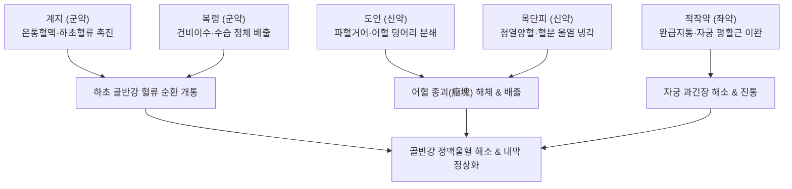

---
aliases:
  - 桂枝茯苓丸
  - Guizhi-fuling-wan
  - Cinnamon and Poria Pill
tags:
  - 처방/활혈거어제
  - 활혈거어제/완소징괴
  - 자궁근종
  - 자궁내막증
  - 갱년기증후군
  - 안면홍조
  - CGRP조절
  - 금궤요략
---

# 🍵 [[계지복령환]] (桂枝茯苓丸, Guizhi-fuling-wan / Cinnamon and Poria Pill)

> **핵심 3줄 요약 (Key Summary)**:
> - 🌿 기본 구성: [[계지]], [[복령]], [[목단피]], [[도인]], [[적작약]] (5미 등량 배오, 혈류 순환 개선과 강력 활혈거어 및 골반강 평활근 이완의 황금 결합).
> - 🎯 하초 어혈(少腹急結·종괴), 골반강 정맥 울혈, 자궁근종, 자궁내막증, 원발성 월경통, 갱년기 안면홍조(CGRP 과활성), 심부정맥혈전증(DVT).
> - 🔬 혈소판 응집 억제, CGRP 수용체 조절 및 혈관 확장 안정화, 에스트로겐 수용체(ER) 조절을 통한 내막 증식 억제(HRT 동등 효과), 항염증 및 미세순환 개선.
> - ⚠️ 주의사항: 목단피·도인의 강력 활혈작용으로 임산부 및 가임기 임신 가능 환자 절대 금기.

---

## 📌 목차
1. [기본 처방 정보 & 군신좌사 구성](#1-기본-처방-정보--군신좌사-구성)
2. [방제학적 약재 상호작용 & 시너지 네트워크](#2-방제학적-약재-상호작용--시너지-네트워크)
3. [현대 분자약리학적 효능 & 작용 기전](#3-현대-분자약리학적-효능--작용-기전)
4. [적응 병증 및 체질별 감별 (Sweet Spot vs 금기)](#4-적응-병증-및-체질별-감별-sweet-spot-vs-금기)
5. [유사 처방군 감별 매트릭스](#5-유사-처방군-감별-매트릭스)
6. [임상 가감례 & 현대 질환별 응용](#6-임상-가감례--현대-질환별-응용)
7. [💡 사용자 진료실 핵심 필기 & 임상 팁 (원문 보존)](#7--사용자-진료실-핵심-필기--임상-팁-원문-보존)
8. [출처 및 학술 참고 문헌 (References)](#8-출처-및-학술-참고-문헌-references)

---

## 1. 기본 처방 정보 & 군신좌사 구성

* **출전**: 한대 장중경(張仲景) 《금궤요략(金匱要略)》 부인임신병맥증병치(婦人妊娠病脈證幷治)
* **치법**: 활혈화어(活血化瘀), 완소징괴(緩消癥塊)
* **적응증**: 부인 숙유징괴(婦人宿有癥塊), 누하불지(漏下不止), 월경곤란, 무월경, 자궁근종, 난소낭종, 갱년기 장애(안면홍조·상열하한), 복강 내 어혈성 종괴

| 구분 | 약재명 | 표준 용량 | 본초 효능 & 방제 내 역할 |
| :--- | :--- | :--- | :--- |
| **군약 (君藥)** | [[계지]] | 6g | 온통혈맥(溫通血脈), 통양화기(通陽化氣), 하초 혈관 확장 및 골반강 혈류 순환 촉진 |
| **군약 (君藥)** | [[복령]] | 6g | 건비이습(健脾利濕), 영심안신(寧心安神), 계지와 상호 배오되어 하초 수습 정체 배출 |
| **신약 (臣藥)** | [[도인]] | 6g | 파혈거어(破血祛瘀), 윤장통변(潤腸通便), 단단한 어혈 덩어리(징괴) 분쇄 및 배출 |
| **신약 (臣藥)** | [[목단피]] | 6g | 청열양혈(淸熱凉血), 활혈산어(活血散瘀), 어혈로 인한 혈분 울열(鬱熱) 냉각 |
| **좌약 (佐藥)** | [[적작약]] | 6g | 양혈렴음(養血斂陰), 완급지통(緩急止痛), 자궁 평활근 과긴장 완화 및 진통 제어 |

> **배오 특징 (원장님 구성 분석 & 하초 어혈 소제 원리)**:
> 1. [[계지]] + [[복령]] 모듈**: 계지의 온통혈맥과 복령의 이수녕심이 합쳐져 하초(골반강)의 냉기와 수습 울체를 몰아내고 혈류 순환을 강력히 개선합니다.
> 2. [[도인]] + [[목단피]] 모듈**: 도인이 어혈 덩어리를 물리적으로 부수고, 목단피가 어혈 정체로 발생하는 혈열(血熱)을 식혀주어 '열과 어혈이 뒤엉킨 병태'를 정밀 타격합니다.
> 3. [[적작약]]의 완급**: 파혈제의 과도한 소모를 막고 자궁과 혈관 평활근의 경련·과긴장을 부드럽게 이완시켜 통증을 신속히 가라앉힙니다.
> 4. **환제(丸劑)의 묘미**: 탕제로 단번에 쏟아붓지 않고 미세 분말을 꿀로 환을 지어 복용함으로써, 정기를 손상시키지 않고 만성 어혈 종괴를 서서히 깎아내는 완소징괴(緩消癥塊)의 정수를 보여줍니다.

---

## 2. 방제학적 약재 상호작용 & 시너지 네트워크

* **온량상제(溫凉相濟)와 조습상자(燥濕相資)**: 따뜻한 [[계지]]와 서늘한 [[목단피]]가 짝을 이루어 혈액을 데워 순환시키되 혈열을 조장하지 않고, 단단한 것을 부수는 [[도인]]과 완충하는 [[적작약]]이 정혈을 지키면서 어혈만을 선택적으로 제거합니다.
* **혈수동치(血水同治)**: 어혈이 있으면 반드시 수분 정체가 뒤따르는 '혈리어수(血不利於水)' 병태를 감안하여, [[복령]]을 군약으로 배오해 혈행과 수액 대사를 동시에 회복시킵니다.

---

## 3. 현대 분자약리학적 효능 & 작용 기전

1. **에스트로겐 수용체(ER) 조절 및 자궁근종·내막증 억제**:
   * 에스트로겐 수용체(ER-α, ER-β) 발현을 조절하여 자궁내막 세포의 과도한 증식을 차단합니다.
   * 호르몬 대체요법(HRT)과 동등한 수준의 호르몬 조절 및 증상 개선 효과를 나타내면서도, 에스트로겐 단독 요법에 따른 암 발생 부작용이 없음을 학술적으로 입증받았습니다.
> 🧬 **현대 학술 근거 (2026-09-07 B-7 패치)**
> - 자궁내막증·자궁내막폴립 근거: 네트워크 약리·머신러닝으로 [[계지복령환]]의 활성 성분-질환 공통 표적을 분석, 자궁내막증·내막 폴립 치료의 물질 기반(material basis)과 분자 기전을 제시(PMID 41931331).

2. **CGRP 수용체 조절 및 갱년기 안면홍조 억제**:
   * 난소 기능 저하로 에스트로겐이 급변할 때 과발현되는 칼시토닌 유전자 관련 펩타이드([[CGRP]], Calcitonin Gene-Related Peptide) 수용체 활성을 억제합니다.
   * 말초 피부 혈관의 비정상적 확장을 억제하여 갱년기 상열감 및 피부 온도 상승을 신속히 안정화합니다.
> 🧬 **현대 학술 근거 (2026-09-07 B-7 패치)**
> - 호르몬 요법 연관 홍조 임상 근거: 전립선암 환자의 안드로겐 차단 요법(ADT)으로 유발된 안면홍조에서 [[계지복령환]](TJ-25, 1회 2.5g 1일 3회, 12주)의 효능을 호르몬·사이토카인(IL-8, TNF-α 등) 준위 변화와 함께 평가한 단일군 전향 연구(PMID 37680217).

3. **혈소판 응집 억제 및 혈관내피세포 보호**:
   * 아데노신 2인산(ADP) 및 콜라겐 유도 혈소판 응집을 강력히 억제하고 혈전 형성을 차단합니다.
   * 혈관내피세포의 eNOS 활성을 촉진하여 산화질소(NO) 생성을 늘리고 하지 심부정맥혈전증(DVT) 및 동맥경화를 방어합니다.
4. **골반강 미세순환 개선 및 항염증·장기 보호**:
   * NF-κB 염증 신호 전달을 차단하고 TNF-α, IL-6 생성을 억제합니다.
   * 당뇨병성 신병증 개선, 간 섬유화 억제, 안구 맥락막 혈류 순환 개선 등 전신 미세혈관계의 혈류역학을 개선합니다.

> 🧬 **현대 학술 근거 (2026-09-07 B-7 패치)** — PubChem 실측 분자 앵커: 목단피 지표 성분 파에올(Paeonol) CID **11092** · 분자식 C₉H₁₀O₃ · MW 166.2

🔬 **분자 구조** (Wikimedia Commons, Public Domain)

![[Paeonol_구조.png|400]]
> [그림] 파에올(Paeonol, C₉H₁₀O₃) 분자 구조 — 출처: Wikimedia Commons (Paeonol.svg)

---

## 4. 적응 병증 및 체질별 감별 (Sweet Spot vs 금기)

### 1) 적응증 및 체질별 Sweet Spot
* **[✅ 최적 적응증 (Sweet Spot)]**:
  * **체격이 비교적 탄탄하고 얼굴에 붉은 기운(상열감)**이 돌면서, 아랫배를 누르면 단단한 저항과 압통(소복급결 少腹急結)이 있는 환자.
  * 생리 전 하복부 팽만통, 혈괴(피떡)를 동반한 심한 생리통, 자궁내막증, 자궁선근증, 자궁근종 환자.
  * 폐경 전후의 심한 안면홍조, 두통, 어지럼증, 어깨 결림, 하지 냉증이 상반신 열감과 교차하는 갱년기 증후군.
  * 하지 정맥류, 심부정맥혈전증(DVT), 어혈성 난치성 여드름, 기미, 건선, 아토피 피부염.
* **[사상체질 매핑]**:
  * **태음인(太陰人)**: 간대폐소로 혈액 정체 및 울혈이 생기기 쉬운 체질에 가장 광범위하게 적중.
  * **소양인(少陽人)**: 하초 기혈 정체와 상열감이 공존할 때 용량을 조절하여 다용.

### 2) 금기 및 신중 투여 (Contraindications)
* **[⚠️ 신중 투여 및 금기]**:
  * **임산부 및 임신 가능성이 있는 여성**: [[목단피]], [[도인]]의 강력한 자궁 수축 및 활혈파어 작용으로 유산·조산 위험이 있으므로 투약 절대 금기 (처방 사이드 대처법 155번 참조).
  * **월경 과다(Menorrhagia) 환자**: 월경 중 출혈량이 과도한 환자에게 출혈기 투여 시 출혈량이 급증하여 빈혈을 조장할 수 있으므로 배란기 전후로 투여 시기를 조절.
  * **기혈 극허(極虛) 환자**: 체력이 극도로 쇠약하고 빈혈이 심한 환자에게 단독 투여 금기 (당귀작약산이나 온경탕으로 선회).

---

## 5. 유사 처방군 감별 매트릭스

| 처방명 | 핵심 배오 차이 | 주치 및 임상 차별점 | 맥진/설진 차이 |
| :--- | :--- | :--- | :--- |
| [[계지복령환]] | 계지·복령·목단피·도인·적작약 | 체격 비교적 건실한 실증, 골반강 어혈 종괴, 자궁근종, 안면홍조 | 맥침현(沈弦) 혹 궐맥, 설암홍·어점 |
| [[당귀작약산]] | 당귀·천궁·작약·복령·백출·택사 | 허증·수체(水滯) 위주, 빈혈 경향, 부종·하복 냉통, 임신 중 복통 | 맥침세약(沈細弱), 설담백·치흔 |
| [[도핵승기탕]] | 도인·대황·망초·계지·감초 | 격렬한 하초 축혈, 번조·섬어·광란, 극심한 변비 동반 급박증 | 맥침실유력(沈實有力), 설홍·황조태 |
| [[온경탕]] | 오수유·육계·당귀·작약·맥문동·아교 등 | 허한(虛寒)성 월경부조, 아랫배가 몹시 차고 입술과 피부 건조 | 맥침지약(沈遲弱), 설담태백 |
| [[소복축어탕]] | 소회향·건강·당귀·천궁·몰약 등 | 하초 한응혈어(寒凝血瘀), 극심한 냉성 생리통 및 하복부 덩어리 | 맥침지삭(沈遲弦), 설자암·어반 |

---

## 6. 임상 가감례 & 현대 질환별 응용

### 1) 주요 임상 가감법
* **피부 질환 및 부종·농양 동반**: [[의이인]] 10~15g 가미 $\rightarrow$ [[계지복령환가의이인]] (여드름, 편평사마귀, 기미, 피부염증 치료).
* **기체(氣滯) 및 팽만통 극심**: [[향부자]] 6g, [[현호색]] 6g 가미하여 진통력 극대화.
* **변비 및 어혈 울열 심화**: [[대황]] 3~5g 가미하여 도핵승기탕의 통변화어 효과 유도.
* **허증 경향 겸유**: [[당귀]] 6g, [[천궁]] 4g 가미하여 보기보혈 병용.

### 2) 현대 질환별 응용
* **부인과**: 자궁근종, 자궁선근증, 자궁내막증, 원발성 및 속발성 생리통, 다낭성 난소증후군(PCOS), 골반염증성질환(PID), 만성 골반통.
* **갱년기 및 신경계**: 갱년기 안면홍조, 발한, 상열하한, 불면증, 불안증, 자율신경실조증.
* **혈관 및 피부과**: 하지 심부정맥혈전증(DVT), 하지정맥류, 동맥경화증, 레이노 증후군, 성인성 여드름, 기미, 건선, 아토피 피부염, 어혈성 탈모.

> 🧬 **현대 학술 근거 (2026-09-07 B-7 패치)**
> - 전립선 질환 확장 근거: 만성 전립선염(12건)과 양성 전립선 비대증(11건) RCT를 포함한 [[계지복령환]]의 전립선 질환 효과·안전성 체계적 문헌고찰·메타분석(영·중·일·한 DB, 2024년 7월까지)이 보고됨(PMID 41084266).

---

## 7. 💡 사용자 진료실 핵심 필기 & 임상 팁 (원문 보존)

> [!tip] **진료실 실전 노하우 (User Clinical Insight)**
> * **핵심 병태생리 패턴**:
>   * 산소가 떨어져 있는 패턴, 혈관이 많아져 부어있고, 빨간증, 작약을 통해 자궁의 과긴장을 풀어주는데 사용함.
>   * 조직 내 미세순환 부전으로 국소 저산소증이 발생하면 보상적으로 신생혈관이 과다 형성되어 붓고 붉어지는 병태를 나타냅니다. 이때 [[적작약]]이 자궁 및 골반 평활근의 과긴장을 신속하게 풀어줍니다.
> * **투여 타이밍 및 생리주기 활용법**:
>   * **배란기 이전 자궁내막 증식기 여성**: 에스트로겐의 자극으로 자궁내막이 증식하는 시기에 투여하면 혈관 울혈을 방지하고 내막의 병적 비후를 예방합니다.
>   * **진통 예방제 개념**: 월경 시작 후 극심한 통증이 발생했을 때보다, 생리 시작 7~10일 전부터 미리 투약하면 어혈 정체가 풀리며 생리통이 가볍게 지나가거나 사라지게 됩니다.
> * **갱년기 안면홍조 기전 및 HRT 대비 우위성**:
>   * 난소 기능 저하로 에스트로겐(E2) 변동이 생기면 시상하부-자율신경계 반사로 [[CGRP]] 수용체가 급증하며 피부 혈관이 급격히 확장되어 홍조가 발생합니다.
>   * 계지복령환은 CGRP를 직접 억제하여 피부 온도를 떨어뜨리며, **호르몬보충요법(HRT)과 동등한 효과**를 보이면서도 유방암·자궁내막암의 위험이 없는 탁월한 안전성을 가집니다.
> * **남성 갱년기 및 전신 질환 확장**:
>   * 여성뿐만 아니라 **남성 갱년기 장애**(안면 상열감, 만성 피로, 하지 혈류 장애) 및 자율신경실조증 환자에게도 높은 빈도로 응용됩니다.
> * **처방 부작용 대처**:
>   * [[목단피]], [[도인]]이 포함되어 있어 가임기 여성의 임신 여부를 반드시 확인해야 합니다.
>   * 상세한 자궁 수축 위험 및 월경 과다 시 대처법은 [[처방 사이드 대처법]] 155번 노트를 참조합니다.

![[계지복령환-20240520005026114.png|432]]
> [계지복령환의 하초 혈류 순환 개선 및 자궁 내막·혈관 조절 기전]

![[계지복령환-20240520005106560.png|401]]
> [계지복령환의 골반 정맥울혈 해소 및 갱년기 CGRP 조절 기전]

---

## 8. 출처 및 학술 참고 문헌 (References)

* 장중경. *금궤요략(金匱要略)*. 한대(漢代).
* * **Xue M et al. (2025)**. Guizhi-Fuling Wan suppresses carcinoma-associated mesenchymal stem cells-induced ovarian cancer progression via STAT3 inhibition. *Phytomedicine : international journal of phytotherapy and phytopharmacology*, 148: 157475. [PMID: 41177013](https://pubmed.ncbi.nlm.nih.gov/41177013/)
