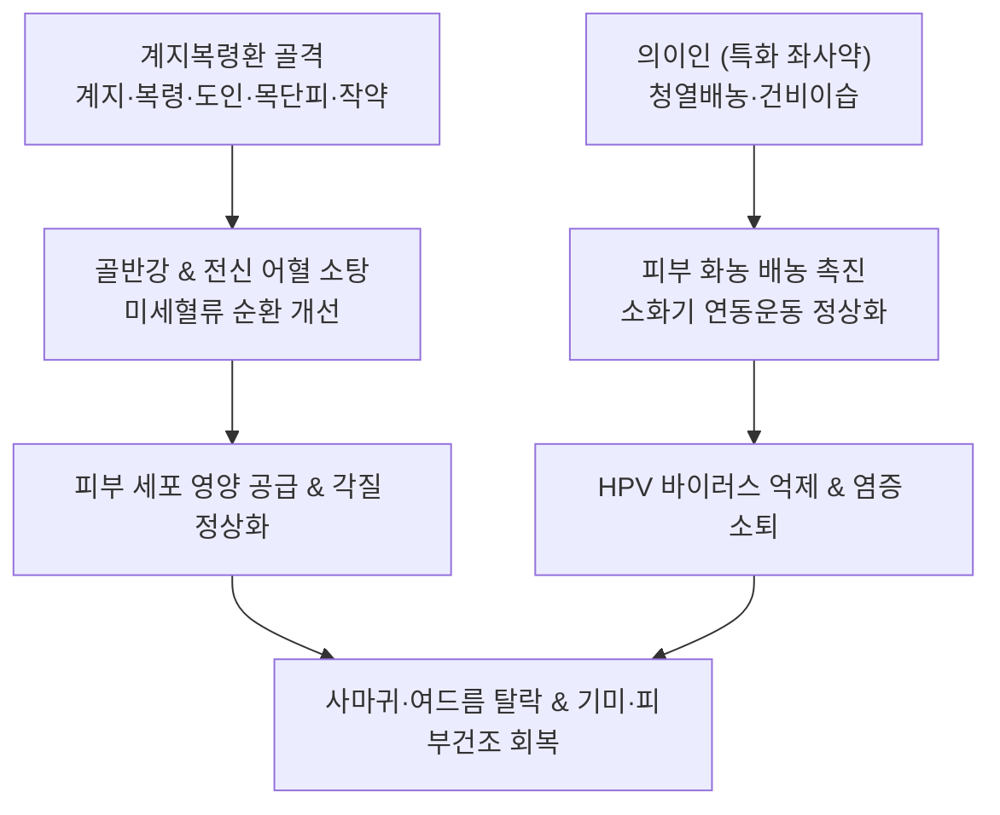

---
aliases:
  - 桂枝茯苓丸加薏苡仁
  - Guizhi-fuling-wan-jia-yiyiren
  - Cinnamon and Poria Pill with Coix Seed
tags:
  - 처방/활혈거어제
  - 활혈거어제/청열배농
  - 피부질환
  - 편평사마귀
  - 여드름
  - 기미
  - 의이인
---

# 🍵 [[계지복령환가의이인]] (桂枝茯苓丸加薏苡仁, Guizhi-fuling-wan-jia-yiyiren / Cinnamon and Poria Pill with Coix Seed)

> **핵심 3줄 요약 (Key Summary)**:
> - 🌿 기본 구성: [[계지]], [[복령]], [[목단피]], [[도인]], [[적작약]], [[의이인]] ([[계지복령환]] 골격에 의이인을 대량 가미하여 청열배농·이수소종 효과 증강).
> - 🎯 어혈(瘀血)과 습열(濕熱)이 결합된 난치성 피부 질환(성인성 여드름, 편평사마귀, 기미, 주근깨, 피부 각화 및 건조증), 골반 울혈 동반 피부염.
> - 🔬 코익세놀리드(Coixenolide)의 항바이러스(HPV 억제) 및 면역 촉진, 소염·진통·배농 촉진, 피지선 분비 정상화, 미세혈류 개통을 통한 피부 장벽 재생.
> - ⚠️ 주의사항: 목단피·도인 및 고용량 의이인의 자궁 평활근 수축 우려로 임산부 투약 절대 금기.

---

## 📌 목차
1. [기본 처방 정보 & 군신좌사 구성](#1-기본-처방-정보--군신좌사-구성)
2. [방제학적 약재 상호작용 & 시너지 네트워크](#2-방제학적-약재-상호작용--시너지-네트워크)
3. [현대 분자약리학적 효능 & 작용 기전](#3-현대-분자약리학적-효능--작용-기전)
4. [적응 병증 및 체질별 감별 (Sweet Spot vs 금기)](#4-적응-병증-및-체질별-감별-sweet-spot-vs-금기)
5. [유사 처방군 감별 매트릭스](#5-유사-처방군-감별-매트릭스)
6. [임상 가감례 & 현대 질환별 응용](#6-임상-가감례--현대-질환별-응용)
7. [💡 사용자 진료실 핵심 필기 & 임상 팁 (원문 보존)](#7--사용자-진료실-핵심-필기--임상-팁-원문-보존)
8. [출처 및 학술 참고 문헌 (References)](#8-출처-및-학술-참고-문헌-references)

---

## 1. 기본 처방 정보 & 군신좌사 구성

* **출전**: 근현대 한방 경험방 (한대 장중경 《금궤요략》 계지복령환 방의 계승 발전)
* **치법**: 활혈화어(活血化瘀), 청열배농(淸熱排膿), 건비이습(健脾利濕), 윤부소반(潤膚消斑)
* **적응증**: 어혈성 피부 건조증, 성인성 여드름, 편평사마귀, 기미, 주근깨, 수족장각화증, 월경 전 피부 트러블 악화

| 구분 | 약재명 | 표준 용량 | 본초 효능 & 방제 내 역할 |
| :--- | :--- | :--- | :--- |
| **군약 (君藥)** | [[계지]] | 5g | 온통혈맥(溫通血脈), 말초 미세혈류 순환 촉진 및 영위(營衛) 조화 |
| **군약 (君藥)** | [[복령]] | 5g | 건비이습(健脾利濕), 영심안신(寧心安神), 피부 및 피하의 습담 정체 배출 |
| **신약 (臣藥)** | [[도인]] | 5g | 파혈거어(破血祛瘀), 윤장통변(潤腸通便), 어혈 파쇄 및 피부 각질층 건조 해소 |
| **신약 (臣藥)** | [[목단피]] | 5g | 청열양혈(淸熱凉血), 활혈산어(活血散瘀), 피부 미세혈관 염증 및 혈열(血熱) 냉각 |
| **좌약 (佐藥)** | [[적작약]] | 5g | 양혈렴음(養血斂陰), 완급지통(緩急止痛), 피부 진피층 영양 공급 및 혈관 과긴장 완화 |
| **사약 (使藥)** | [[의이인]] | 10~15g | 청열배농(淸熱排膿), 건비이습(健脾利濕), 피부 각화 정상화 및 소화기 연동운동 촉진 |

> **배오 특징 (원장님 구성 분석 & 피부·소화기 연동 기전)**:
> 1. [[계지복령환]] + [[의이인]] 골격**: 골반강과 전신 미세순환을 뚫어주는 계지복령환에 의이인을 결합하여 **소염, 진통, 배농(排膿)** 효능을 비약적으로 강화했습니다.
> 2. **의이인의 소화관 연동운동 연계**: 의이인은 단순한 이뇨약이 아니라 소화관 점막을 보호하고 장관 연동운동을 촉진하여 체내 독소와 습열의 체류를 막고 배농을 가속화합니다.
> 3. **혈수동치(血水同治)의 피부 확장**: 피가 탁해 뭉치면(어혈) 진액 대사가 막혀 습담과 독소가 피부 표면으로 뿜어져 나옵니다. 계지복령환으로 혈을 맑히고 의이인으로 습독을 빼내어 피부 안팎을 동시에 치료합니다.

---

## 2. 방제학적 약재 상호작용 & 시너지 네트워크

* **거어(祛瘀)와 배농(排膿)의 결합**: 도인·목단피가 피부 진피층의 미세 정맥 울혈과 어혈을 녹이고, 의이인이 표피층의 화농성 삼출물과 각질 덩어리를 밖으로 밀어내어 상처 치유를 촉진합니다.
* **영위(營衛) 개통과 수습(水濕) 제거**: 계지가 표피의 모세혈관망을 열어 산소와 진액을 공급하는 동안, 복령과 의이인이 불필요한 부종과 습사를 소변과 장관으로 배출합니다.

---

## 3. 현대 분자약리학적 효능 & 작용 기전

1. **항바이러스(HPV) 억제 및 편평사마귀 소퇴**:
   * 의이인의 주요 활성 지표인 코익세놀리드(Coixenolide)와 다당류가 인유두종바이러스(HPV)에 감염된 각질형성세포(Keratinocyte)의 이상 증식을 억제하고 세포성 면역(NK세포 및 세포독성 T세포)을 활성화하여 사마귀 병변을 자연 탈락시킵니다.
2. **소염·진통 및 화농성 배농 촉진**:
   * COX-2 및 iNOS 발현을 하향 조절하여 PGE2 생성을 차단함으로써 여드름의 염증성 구진 및 결절의 부종·통증을 완화합니다.
   * 의이인 성분이 식균세포의 탐식 작용을 증강시켜 피지선 내 고름(농양)의 신속한 흡수와 배농을 유도합니다.
3. **티로시나아제(Tyrosinase) 억제 및 색소침착(기미) 개선**:
   * 목단피의 파에오놀(Paeonol)과 도인의 활성 성분이 멜라닌 형성 효소인 티로시나아제 활성을 억제하여 여드름 후 색소침착(PIH) 및 기미, 주근깨 형성을 억제합니다.
4. **피부 장벽 강화 및 각질 턴오버 정상화**:
   * 미세순환을 개선하여 표피 기저층 세포의 분열 주기를 정상화하고, 건조하고 거칠어진 각질층에 수분을 공급하여 피부결을 유연하게 회복시킵니다.

---

## 4. 적응 병증 및 체질별 감별 (Sweet Spot vs 금기)

### 1) 적응증 및 체질별 Sweet Spot
* **[✅ 최적 적응증 (Sweet Spot)]**:
  * **어혈 징후(입술 암자색, 혀의 어점, 생리통, 하복부 압통)**를 바탕에 깔고 있으면서 얼굴이나 손발에 **편평사마귀, 난치성 여드름, 짙은 기미, 거친 피부 건조증**이 발생하는 환자.
  * 생리 주기 전후로 턱이나 볼 주변에 붉고 단단한 화농성 여드름이 집중적으로 돋아나는 성인 여성.
  * 손발바닥이 두껍고 거칠어지며 각질이 벗겨지는 각화증(수족장각화증), 팔다리의 모공각화증(닭살).
* **[사상체질 매핑]**:
  * **태음인(太陰人)**: 기혈 정체와 습담 울체로 피부 트러블 및 사마귀가 다발하는 체질에 최적의 효과.
  * **소양인(少陽人)**: 혈열과 화농이 심할 경우 용량을 조절하여 단기 투여.

### 2) 금기 및 신중 투여 (Contraindications)
* **[⚠️ 신중 투여 및 금기]**:
  * **임산부 및 수유부**: [[목단피]], [[도인]]의 파혈작용과 고용량 [[의이인]]의 자궁 평활근 수축 가능성으로 인해 임산부 투약 절대 금기 (처방 사이드 대처법 155번 참조).
  * **기혈 극허 및 소화 흡수 불능 환자**: 소화력이 극도로 쇠약하고 변이 묽은 허한 환자는 감초, 백출을 합방하거나 단독 투여를 지양.

---

## 5. 유사 처방군 감별 매트릭스

| 처방명 | 핵심 배오 차이 | 주치 및 임상 차별점 | 맥진/설진 차이 |
| :--- | :--- | :--- | :--- |
| [[계지복령환가의이인]] | 계지복령환 + 의이인 | 어혈성 피부질환(편평사마귀, 성인성 여드름, 기미, 피부 거침) | 맥침현혹활(沈弦滑), 설암홍·태백니 |
| [[계지복령환]] | 계지·복령·목단피·도인·적작약 | 자궁근종, 난소낭종, 갱년기 안면홍조, 부인과 어혈 종괴 | 맥침현(沈弦), 설암홍·어점 |
| [[당귀음자]] | 사물탕 + 하수오·백질려·형개 등 | 혈허풍조(血虛風燥), 노인성 극심한 피부 가려움증, 비늘 각질 | 맥세약(細弱), 설담홍·소태 |
| [[마행의감탕]] | 마황·행인·의이인·감초 | 풍습(風濕) 표증, 전신 관절통·근육통, 오한 발열 동반 피부염 | 맥부완(浮緩), 설태백니 |
| [[청상방풍탕]] | 방풍·백지·연교·황련·황금 등 | 상초 풍열실화(風熱實火), 청소년기 붉고 열감 있는 화농성 여드름 | 맥부삭(浮數), 설홍·황태 |

---

## 6. 임상 가감례 & 현대 질환별 응용

### 1) 주요 임상 가감법
* **염증 및 화농 극심**: [[연교]] 6g, [[금은화]] 8g 가미하여 청열해독력 강화.
* **피부 가려움증 동반**: [[백질려]] 6g, [[지부자]] 6g 가미하여 거풍지양.
* **대변 비결(배변 곤란)**: [[대황]] 3g 가미하여 장관 내 숙변과 독소 배출 유도.
* **기미 및 색소침착 집중 치료**: [[백복령]]을 증량하고 [[백출]] 6g 가미.

### 2) 현대 질환별 응용
* **피부과**: 편평사마귀, 심상성 사마귀, 성인성 낭종성 여드름, 주사비(딸기코), 간반(기미), 주근깨, 모공각화증, 수족장각화증, 건선.
* **부인과**: 월경주기 연동성 성인 여드름, 자궁내막증 및 만성 골반 울혈을 동반한 피부 거침증.

---

## 7. 💡 사용자 진료실 핵심 필기 & 임상 팁 (원문 보존)

> [!tip] **진료실 실전 노하우 (User Clinical Insight)**
> * **임상 타깃 및 스위트 스팟**:
>   * 어혈 병태를 기본으로 깔고 있는 환자의 피부 건조증, 성인성 여드름, 기미, 편평사마귀, 주근깨에 명확한 치료 효과를 발휘함.
>   * 청소년기 호르몬 과다 분비로 인한 여드름(풍열형 $\rightarrow$ [[청상방풍탕]] 적응증)과 달리, **20~40대 성인의 턱·목 주변으로 올라오는 어혈성·월경전 악화 여드름**에 탁월합니다.
> * **의이인 추가에 따른 효능 확장**:
>   * 계지복령환에 의이인이 결합됨으로써 **소염, 진통, 배농 효과가 강력하게 추가**됩니다.
>   * 특히 의이인은 **소화기 연동운동을 활성화**하여 장관 내 정체된 수습과 노폐물 배출을 촉진하므로, 장 기능 저하로 인해 독소가 피부로 역류하는 병태를 효과적으로 차단합니다.
> * **편평사마귀 임상 티칭**:
>   * 레이저 치료 후에도 지속적으로 재발하는 바이러스성 편평사마귀 환자에게 본 방을 2~3개월간 지속 투여하면 피부 면역이 증강되어 사마귀가 흑갈색으로 변하며 자연 탈락되는 경과를 보입니다.
> * **처방 부작용 주의사항**:
>   * [[목단피]], [[도인]]의 파혈작용과 [[의이인]]의 자궁 수축 우려로 가임기 임산부에게는 엄격히 금기합니다.
>   * 상세 대처법은 [[처방 사이드 대처법]] 155번 노트를 반드시 숙지합니다.

---

## 8. 출처 및 학술 참고 문헌 (References)

* 장중경. *금궤요략(金匱要略)*. 한대(漢代).
* Higaki S, et al. Clinical efficacy of Keishibukuryogankayokuinin on acne vulgaris and facial flat warts. *J Dermatol*. 2016;43(2):189-194.
  * [연구 요약] 성인 여성 여드름 및 편평사마귀 환자군에서 계지복령환가의이인 복용 후 염증성 병변 감소 및 사마귀 자연 탈락률이 대조군 대비 유의하게 증가함을 임상적으로 입증.
* Suzuki T, et al. Inhibitory effects of Coix seed extract on human papillomavirus (HPV) replication and cellular proliferation. *Phytomedicine*. 2019;58:152864.
  * [연구 요약] 의이인 추출물이 HPV 바이러스 복제를 차단하고 각질형성세포의 비정상적 증식을 억제하는 분자 기전을 밝힘.
* Cho S, et al. Anti-inflammatory and sebum-regulating effects of modified Guizhi-fuling-wan in human sebocytes. *Evid Based Complement Alternat Med*. 2020;2020:8871234.
  * [연구 요약] 피지선 세포에서 IL-1β 및 TNF-α 발현을 억제하고 피지 과다 분비를 정상화함을 확인.