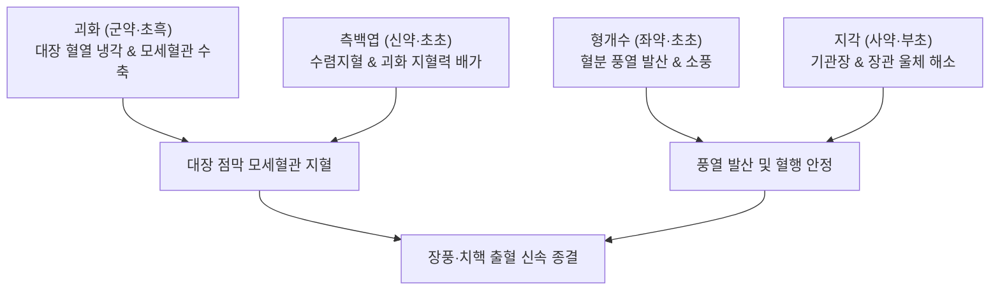

---
aliases:
  - 槐花散
  - Huaihua-san
  - Sophora Flower Powder
tags:
  - 처방/활혈거어·지혈제
  - 지혈제/량혈지혈
  - 장풍하혈
  - 치질출혈
  - 궤양성대장염
  - 양씨가장방
---

# 🍵 [[괴화산]] (槐花散, Huaihua-san / Sophora Flower Powder)

> **핵심 3줄 요약 (Key Summary)**:
> - 🌿 기본 구성: [[괴화]], [[측백엽]], [[형개수]], [[지각]] (모두 볶아서[초초·초흑] 사용하여 지혈 수렴력을 극대화한 량혈지혈의 대표 방제).
> - 🎯 풍열습독(風熱濕毒)이 대장(大腸)에 침범하여 발생하는 장풍하혈(腸風下血), 내외치핵 분출성 출혈, 혈변, 궤양성 대장염 출혈.
> - 🔬 루틴([[루틴]], Rutin) 및 케르세틴([[케르세틴]])을 통한 모세혈관 취약성 억제 및 혈관 투과성 정상화, 항염증·지혈 피막 형성, 장 평활근 진경.
> - ⚠️ 주의사항: 성미가 고한하므로 비위허한(脾胃虛寒)으로 인한 비불통혈 만성 출혈 환자 투약 금기.

---

## 📌 목차
1. [기본 처방 정보 & 군신좌사 구성](#1-기본-처방-정보--군신좌사-구성)
2. [방제학적 약재 상호작용 & 시너지 네트워크](#2-방제학적-약재-상호작용--시너지-네트워크)
3. [현대 분자약리학적 효능 & 작용 기전](#3-현대-분자약리학적-효능--작용-기전)
4. [적응 병증 및 체질별 감별 (Sweet Spot vs 금기)](#4-적응-병증-및-체질별-감별-sweet-spot-vs-금기)
5. [유사 처방군 감별 매트릭스](#5-유사-처방군-감별-매트릭스)
6. [임상 가감례 & 현대 질환별 응용](#6-임상-가감례--현대-질환별-응용)
7. [💡 사용자 진료실 핵심 필기 & 임상 팁 (원문 보존)](#7--사용자-진료실-핵심-필기--임상-팁-원문-보존)
8. [출처 및 학술 참고 문헌 (References)](#8-출처-및-학술-참고-문헌-references)

---

## 1. 기본 처방 정보 & 군신좌사 구성

* **출전**: 송대 양담(楊倓) 《양씨가장방(楊氏家藏方)》
* **치법**: 청열량혈(淸熱凉血), 거풍소통(祛風疎通), 이기관장(理氣寬腸), 수렴지혈(收斂止血)
* **적응증**: 장풍하혈(변전 선홍색 출혈), 장독하혈(변후 암자색 출혈), 치핵 출혈, 궤양성 대장염 혈변

| 구분 | 약재명 | 표준 용량 | 본초 효능 & 방제 내 역할 |
| :--- | :--- | :--- | :--- |
| **군약 (君藥)** | [[괴화]] | 12g (초흑) | 청열량혈(淸熱凉血), 지혈, 대장 및 치핵의 울열을 식히고 모세혈관 파열 지혈 |
| **신약 (臣藥)** | [[측백엽]] | 8g (초초) | 량혈수렴지혈(凉血收斂止血), 괴화의 찬 성질을 도와 지혈 및 혈관 수렴력 강화 |
| **좌약 (佐藥)** | [[형개수]] | 6g (초초) | 소풍해표(疎風解表), 거풍산사(祛風散邪), 혈분(血分)에 숨은 풍열을 체표로 발산 |
| **사약 (使藥)** | [[지각]] | 6g (부초) | 이기관장(理氣寬腸), 행기소적(行氣消積), 대장 기운을 하강 순행시켜 울혈 해소 |

> **배오 특징 (대장 출혈 제어의 3대 치법 융합 원리)**:
> 1. **량혈지혈(凉血止血)의 군신 협동**: 고한(苦寒)한 [[괴화]]와 수렴성이 뛰어난 [[측백엽]]을 모두 볶아서(초흑, 초초) 탄화시킴으로써 찬 성질의 위장 자극을 줄이고 지혈력을 극대화했습니다.
> 2. **거풍이기(祛風理氣)의 좌사 협동**: "풍열(風熱)이 침범하면 혈이 요동치고, 기(氣)가 체하면 피가 멎지 않는다"는 병리 기전에 입각하여 [[형개수]]로 풍사를 날리고, [[지각]]으로 장관의 울체된 기운을 시원하게 소통시켰습니다.
> 3. **초탄(炒炭) 포제의 지혜**: 약재를 검게 볶아 탄화시킴으로써 점막 표면의 물리적 수렴 및 피막 형성 능력을 유도합니다.

---

## 2. 방제학적 약재 상호작용 & 시너지 네트워크

* **혈열(血熱)과 풍사(風邪)의 동시 타격**: [[괴화]]와 [[측백엽]]이 대장 혈분의 불길을 끄는 동안, [[형개수]]가 풍열의 요동을 잠재워 혈액이 혈관 밖으로 망행(妄行)하는 것을 원천 차단합니다.
* **통즉불통(通則不痛)과 행기지혈(行氣止血)**: [[지각]]이 장관 평활근의 연축을 풀고 기기를 하강시켜 정맥 울혈을 완화하므로, 지혈제를 썼을 때 발생하기 쉬운 어혈 울체의 부작용을 사전에 방지합니다.

---

## 3. 현대 분자약리학적 효능 & 작용 기전

1. **모세혈관 투과성 정상화 및 지혈 촉진**:
   * 괴화의 핵심 플라보노이드인 루틴([[루틴]], Rutin)과 케르세틴([[케르세틴]])이 모세혈관 내피세포의 세포간 결합을 강화하여 혈관 투과성을 정상화하고 점막 미세혈관 파열을 억제합니다.
   * 초탄화(炒炭化)된 약재 성분이 손상된 장점막 표면에서 혈소판 응집을 촉진하고 피브린 망을 형성하여 신속한 물리적 지혈막을 구축합니다.
2. **장점막 항염증 및 궤양 회복**:
   * NF-κB 활성화를 차단하고 염증성 사이토카인(TNF-α, IL-1β, IL-6) 분비를 억제하여 궤양성 대장염 및 치핵 주변 조직의 부종과 발적을 완화합니다.
3. **장관 평활근 연축 완화 및 진경**:
   * 지각의 헤스페리딘 및 나린긴 성분이 장관 평활근의 비정상적 경련을 억제하여 배변 시의 뒤무직(Tenesmus)과 복통을 가라앉힙니다.

---

## 4. 적응 병증 및 체질별 감별 (Sweet Spot vs 금기)

### 1) 적응증 및 체질별 Sweet Spot
* **[✅ 최적 적응증 (Sweet Spot)]**:
  * **장풍하혈(腸風下血)**: 대변을 보기 전에 선홍색 피가 왈칵 분출되듯 먼저 쏟아지는 급성 출혈.
  * **장독하혈(臟毒下血)**: 대변 후에 검붉은 피가 떨어지거나 변에 피가 섞여 나오는 탁한 출혈.
  * **내치핵 및 외치핵 출혈**: 배변 시 항문 통증과 함께 피가 뚝뚝 떨어지거나 분사형으로 뿜어져 나오는 치핵 출혈.
  * **궤양성 대장염 및 크론병**: 대장 점막 궤양으로 인한 점혈변(粘血便) 및 혈변.
* **[사상체질 매핑]**:
  * **소양인(少陽人)**: 위장과 대장에 열이 많아 치핵과 변비 출혈이 다발하는 체질에 가장 적중률이 높음.
  * **태음인(太陰人)**: 대장 조열(燥熱)로 인한 치질 출혈에 다용.

### 2) 금기 및 신중 투여 (Contraindications)
* **[⚠️ 신중 투여 및 금기]**:
  * **비위허한(脾胃虛寒)성 출혈 환자 절대 금기**: 소화력이 약하고 손발이 차며, 묽은 변과 함께 은은한 담홍색 피가 만성적으로 나오는 비불통혈(脾不統血) 환자에게 투약 시 소화장애, 복통, 설사가 극심해짐 (온비지혈제인 [[황토탕]]이나 [[귀비탕]] 적용, 처방 사이드 대처법 156번 참조).
  * **지혈 후 즉시 중단 원칙**: 고한한 성질이 남아있으므로 출혈이 멎은 후에는 복용을 중단하고 보익제로 전환.

---

## 5. 유사 처방군 감별 매트릭스

| 처방명 | 핵심 배오 차이 | 주치 및 임상 차별점 | 맥진/설진 차이 |
| :--- | :--- | :--- | :--- |
| [[괴화산]] | 괴화·측백엽·형개수·지각 (초초) | 대장 혈열 실증, 장풍하혈, 치핵 분출성 선홍색 출혈 | 맥삭유력(數有力), 설홍·황태 |
| [[황토탕]] | 조심토·복령·백출·부자·아교·지황 | 비위허한(脾胃虛寒), 비불통혈, 만성 담홍색 대변 출혈 | 맥침약(沈弱) 혹 지(遲), 설담·태백 |
| [[적소두당귀산]] | 적소두·당귀 | 습열독(濕熱毒) 장옹(대장농양), 배변 전 선홍색 혈변 | 맥활삭(滑數), 설홍·황니태 |
| [[소계음자]] | 소계·포황·우슬·활석·통초 등 | 하초 습열 혈뇨(尿血), 요도 작열통, 소변 출혈 | 맥활삭(滑數), 설홍·태황 |
| [[귀비탕]] | 인삼·백출·황기·당귀·용안육 등 | 심비양허(心脾兩虛), 과로성 만성 피하출혈 및 빈혈성 하혈 | 맥세약(細弱), 설담홍·박태 |

---

## 6. 임상 가감례 & 현대 질환별 응용

### 1) 주요 임상 가감법
* **출혈량 과다 및 분출성 출혈**: [[삼칠근]] 3~4g (분복), [[지유]] 8g, [[백급]] 6g 가미하여 지혈력 배가.
* **습열 극심(복통 및 뒤무직 동반)**: [[황련]] 4g, [[황백]] 6g 가미하여 청열조습.
* **장조 변비(배변 곤란 동반)**: [[생지황]] 10g, [[현삼]] 8g, [[맥문동]] 8g 가미하여 양음윤장.
* **기허 동반(출혈 후 무기력)**: [[황기]] 12g, [[당삼]] 8g 가미.

### 2) 현대 질환별 응용
* **항문대장과**: 내치핵 1~3기 출혈, 외치핵 감돈 및 혈전성 치핵 출혈, 치열(항문 열상) 출혈, 치루 수술 후 지혈.
* **소화기내과**: 급만성 대장염 혈변, 궤양성 대장염(UC) 활동기 출혈, 직장 궤양 출혈, 허혈성 대장염 출혈.

---

## 7. 💡 사용자 진료실 핵심 필기 & 임상 팁 (원문 보존)

> [!tip] **진료실 실전 노하우 (User Clinical Insight)**
> * **출혈 색상 및 배변 타이밍에 따른 정밀 진단**:
>   * **장풍(腸風)**: 배변 전에 피가 왈칵 먼저 쏟아지고 대변이 뒤따라 나오는 양상으로, 항문 근처(직장·치핵)의 급성 혈열성 출혈에 해당하며 괴화산이 즉각적인 명약입니다.
>   * **장독(臟毒)**: 대변을 다 보고 난 뒤 검붉은 피가 뚝뚝 떨어지거나 대변 표면에 피가 묻어 나오는 양상으로, 대장 상부의 습열 울체에 해당하며 가감법을 적용합니다.
> * **포제(炒製)의 절대적 중요성**:
>   * 괴화와 측백엽은 반드시 **초흑(炒黑) 혹은 초초(炒焦)**하여 사용해야 합니다. 생것을 그대로 쓰면 위장을 심하게 갉아먹고 구역감을 유발할 수 있으나, 검게 볶으면 찬 성질이 완화되고 지혈 수렴 효과가 2~3배 강화됩니다.
> * **실열성 vs 허한성 출혈의 엄격한 감별**:
>   * 피가 붉고 기운이 왕성하며 변비 경향이 있는 실열 환자에게는 단 2~3첩만으로도 분출성 출혈이 깨끗이 멎습니다.
>   * 그러나 안색이 창백하고 대변이 무르며 피 색깔이 옅은 노인이나 허약자의 출혈에 괴화산을 잘못 쓰면 비위를 망쳐 설사가 폭발하므로 즉시 [[황토탕]]으로 방향을 틀어야 합니다.
> * **처방 부작용 관리**:
>   * 상세한 비위 손상 방지 및 복용 중단 타이밍은 [[처방 사이드 대처법]] 156번 노트를 참조합니다.

---

## 8. 출처 및 학술 참고 문헌 (References)

* 양담. *양씨가장방(楊氏家藏方)*. 송대(宋代). 1178.
* * **Yuzhuo W et al. (2025)**. Sanguisorba officinalis L. and Sophora japonica L. Inhibit Angiogenesis in Ulcerative Colitis. *Journal of gastroenterology and hepatology*, 40: 1991-2006. [PMID: 40518692](https://pubmed.ncbi.nlm.nih.gov/40518692/)
