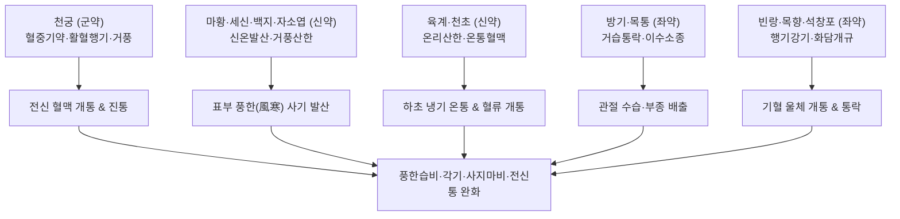

---
aliases:
  - 芎窮散
  - Xiongqiong-san
  - Cnidium Powder
tags:
  - 처방/활혈거어·지혈제
  - 활혈거어/온경통락
  - 풍한습비
  - 각기
  - 신경통
  - 화제국방
  - 동의보감
---

# 🍵 [[궁궁산]] (芎窮散, Xiongqiong-san / Cnidium Powder)

> **핵심 3줄 요약 (Key Summary)**:
> - 🌿 기본 구성: [[천궁]], [[세신]], [[마황]], [[백지]], [[자소엽]], [[천초]], [[육계]], [[방기]], [[목통]], [[빈랑]], [[목향]], [[석창포]], [[생강]], [[감초]] (혈중 기약 천궁을 필두로 거풍·산한·온경·이기·이수 약재를 총망라한 14미 온경통락 방제).
> - 🎯 풍한습(風寒濕) 사기가 경락과 혈맥에 깊이 침범하여 발생한 전신 관절통, 사지 마비 및 굴신불능, 좌골신경통, 각기(脚氣)로 인한 다리 저림·부종.
> - 🔬 페룰산 및 신남알데하이드의 말초 혈관 확장, 에페드린·메틸유제놀의 중추 및 말초 진통, 테트란드린의 칼슘 통로 차단 및 항염증·이수소종.
> - ⚠️ 주의사항: 성질이 극히 맵고 따뜻하며 조열하므로 음허화왕 환자 및 고혈압·뇌졸중 고위험군 신중 투여.

---

## 📌 목차
1. [기본 처방 정보 & 군신좌사 구성](#1-기본-처방-정보--군신좌사-구성)
2. [방제학적 약재 상호작용 & 시너지 네트워크](#2-방제학적-약재-상호작용--시너지-네트워크)
3. [현대 분자약리학적 효능 & 작용 기전](#3-현대-분자약리학적-효능--작용-기전)
4. [적응 병증 및 체질별 감별 (Sweet Spot vs 금기)](#4-적응-병증-및-체질별-감별-sweet-spot-vs-금기)
5. [유사 처방군 감별 매트릭스](#5-유사-처방군-감별-매트릭스)
6. [임상 가감례 & 현대 질환별 응용](#6-임상-가감례--현대-질환별-응용)
7. [💡 사용자 진료실 핵심 필기 & 임상 팁 (원문 보존)](#7--사용자-진료실-핵심-필기--임상-팁-원문-보존)
8. [출처 및 학술 참고 문헌 (References)](#8-출처-및-학술-참고-문헌-references)

---

## 1. 기본 처방 정보 & 군신좌사 구성

* **출전**: 송대 《태평혜민화제국방(太平惠民和劑局方)》 권일(卷一) / 조선 허준 《동의보감(東醫寶鑑)》
* **치법**: 활혈행기(活血行氣), 거풍산한(祛風散寒), 온경통락(溫經通絡), 거습소종(祛濕消腫)
* **적응증**: 풍한습비(風寒濕痺), 각기(脚氣) 충심, 사지 관절 마비 및 구급, 요각 냉통, 보행 곤란

| 구분 | 약재명 | 표준 용량 | 본초 효능 & 방제 내 역할 |
| :--- | :--- | :--- | :--- |
| **군약 (君藥)** | [[천궁]] (궁궁) | 8g | 활혈행기(活血行氣), 거풍지통(祛風止痛), 혈중 기약으로 전신 혈맥을 뚫고 풍사를 흩뜨림 |
| **신약 (臣藥)** | [[마황]] | 5g | 발한해표(發汗解表), 선폐평천, 표부(表部)의 한사(寒邪)를 땀으로 발산 |
| **신약 (臣藥)** | [[세신]] | 3g | 거풍산한(祛風散寒), 통규지통(通竅止痛), 골절 깊은 곳의 음한(陰寒)을 배출 |
| **신약 (臣藥)** | [[백지]] | 4g | 거풍산한(祛風散寒), 통규지통, 양명경 두통 및 안면·사지 근육통 완화 |
| **신약 (臣藥)** | [[자소엽]] | 4g | 발한산한(發汗散寒), 행기관중, 기표(肌表)의 풍한을 흩뜨리고 기운을 소통 |
| **신약 (臣藥)** | [[육계]] | 4g | 온통혈맥(溫通血脈), 산한지통(散寒止痛), 명문화 보강 및 하초 심층 한응 해소 |
| **신약 (臣藥)** | [[천초]] | 3g | 온중산한(溫中止寒), 제습지통(除濕止痛), 경락 내 냉습(冷濕)을 온화 |
| **좌약 (佐藥)** | [[방기]] | 4g | 거풍습(祛風濕), 지통, 이수소종(利水消腫), 관절 내 수습 정체 배출 |
| **좌약 (佐藥)** | [[목통]] | 4g | 청열이뇨(淸熱利尿), 통경하유(通經下乳), 습열을 소변으로 유도 배출 |
| **좌약 (佐藥)** | [[빈랑]] | 4g | 하기소적(下氣消積), 행기이수(行氣利水), 각기 수종을 아래로 내림 |
| **좌약 (佐藥)** | [[목향]] | 4g | 행기지통(行氣止痛), 건비소식, 기체(氣滯)를 풀어 혈행을 가속화 |
| **좌약 (佐藥)** | [[석창포]] | 4g | 개규화담(開竅化痰), 화습건위, 경락과 구규의 담탁(痰濁)을 개통 |
| **좌약 (佐藥)** | [[생강]] | 4g | 온위지구(溫胃止嘔), 발한해표, 소화기 보호 및 약력 순행 보조 |
| **사약 (使藥)** | [[감초]] | 4g | 조화제약(調和諸藥), 완급지통(緩急止痛), 강렬한 약성 조화 |

> **배오 특징 (풍한습비 전방위 격퇴 및 혈중기약 천궁의 통도 원리)**:
> 1. **혈중기약(血中氣藥) [[천궁]]을 군약으로 삼은 깊은 뜻**: "피가 맑고 순환하면 풍은 절로 사라진다(치풍선치혈 혈행풍자멸 治風先治血 血行風自滅)"는 한의학 대원칙에 따라 천궁을 수장으로 세워 혈액 순환을 주도하게 했습니다.
> 2. **3대 한사(寒邪) 제거 벨트**: 표부(마황·자소엽·백지) $\rightarrow$ 소음경 골절(세신) $\rightarrow$ 하초 혈맥(육계·천초)으로 이어지는 3단계 온경산한 네트워크를 구축했습니다.
> 3. **기수(氣水) 동시 소통**: 습사가 정체되어 붓고 저리는 각기 증상을 해결하기 위해 방기·목통으로 물길을 열고, 빈랑·목향으로 기기를 하강시켜 수종과 통증을 동시에 해소합니다.

---

## 2. 방제학적 약재 상호작용 & 시너지 네트워크

* **산한(散寒)과 이습(利濕)의 조화**: [[마황]], [[세신]], [[육계]]의 뜨거운 기운이 응어리진 한사를 녹이면, [[방기]], [[목통]], [[빈랑]]이 녹아내린 수습(水濕)을 신속히 소변으로 배출시켜 체내 부종과 염증 삼출물을 청소합니다.
* **행기(行氣)를 통한 활혈(活血)의 극대화**: [[목향]], [[빈랑]], [[석창포]]가 기기를 뚫어줌으로써 군약인 [[천궁]]의 활혈통경 효능이 전신 사지 말단까지 거침없이 도달합니다.

---

## 3. 현대 분자약리학적 효능 & 작용 기전

1. **말초 혈류량 증가 및 미세혈관 확장**:
   * 천궁의 페룰산(Ferulic acid)과 육계의 신남알데하이드(Cinnamaldehyde)가 혈관 평활근의 산화질소(NO) 생성을 촉진하여 말초 혈관을 확장하고 허혈성 신경·근육에 혈류 공급을 복원합니다.
2. **다표적 중추 및 말초 진통 작용**:
   * 세신의 메틸유제놀(Methyleugenol)과 마황의 에페드린(Ephedrine)이 척수 후각 신경세포의 통증 전달 신호를 억제하고 염증성 프로스타글란딘 합성을 차단하여 극심한 신경통을 완화합니다.
3. **칼슘 통로 차단 및 항부종·항염증**:
   * 방기의 테트란드린(Tetrandrine) 성분이 L-type 전압의존성 칼슘 통로를 차단하여 혈관 과투과성을 억제하고 염증성 부종을 신속히 소퇴시킵니다.
4. **골격근 경련 완화 및 신경근 접합부 안정화**:
   * 한랭 노출로 인해 과긴장된 사지 근육의 연축을 완화하고 관절 가동 범위를 회복시킵니다.

---

## 4. 적응 병증 및 체질별 감별 (Sweet Spot vs 금기)

### 1) 적응증 및 체질별 Sweet Spot
* **[✅ 최적 적응증 (Sweet Spot)]**:
  * **추위와 습기에 노출된 후 전신 관절과 근육이 쑤시고 뻣뻣하게 굳으며 굴신이 어려운 환자**.
  * 좌골신경통, 이상근 증후군, 요추관 협착증 등으로 인해 엉치부터 다리까지 시리고 저리며 당기는 신경통 환자.
  * 한성(寒性) 각기병으로 인해 하지에 힘이 빠지고 부으며 쥐가 나고 보행이 힘든 환자.
  * 만성 관절 류마티스 환자가 한랭기에 통증이 극심해질 때.
* **[사상체질 매핑]**:
  * **소음인(少陰人)**: 하초와 비위가 차가워 풍한습 비통이 다발하는 체질에 매우 우수한 적응증을 보임.
  * **태음인(太陰人)**: 체표 기혈 순환이 막히고 습담이 울체되어 관절이 무겁고 아플 때 가감하여 응용.

### 2) 금기 및 신중 투여 (Contraindications)
* **[⚠️ 신중 투여 및 금기]**:
  * **음허화왕(陰虛火旺) 및 혈열(血熱) 환자 절대 금기**: 몸에 열이 많고 진액이 마른 환자, 관절이 붉게 붓고 열감이 있는 열비(熱痺) 환자에게 투약 시 상화가 폭발하여 부작용 초래 (처방 사이드 대처법 157번 참조).
  * **고혈압, 심장질환자 신중 투여**: 마황과 세신이 포함되어 있으므로 심계항진 및 혈압 상승 위험을 사전에 확인.

---

## 5. 유사 처방군 감별 매트릭스

| 처방명 | 핵심 배오 차이 | 주치 및 임상 차별점 | 맥진/설진 차이 |
| :--- | :--- | :--- | :--- |
| [[궁궁산]] | 천궁 군약 + 마황·세신·육계·방기 등 14미 | 풍한습 극심한 사지 마비, 각기, 극심한 요각통 | 맥부긴(浮緊) 혹 침지(沈遲), 설담·백태 |
| [[오약순기산]] | 오약·마황·진피·백지·지각·길경 등 | 상초 기체 및 풍담 위주, 반신마비, 초기 중풍 전조 | 맥부현(浮弦), 설담홍·태백 |
| [[독활기생탕]] | 독활·상기생·두충·우슬 + 사물탕·사군자탕 | 간신부족(肝腎不足) 허증성 만성 관절통·퇴행성 관절염 | 맥세약(細弱), 설담·무태 |
| [[대강활탕]] | 강활·독활·방풍·창출 + 황금·황련 | 풍한습에 풍열(風熱)이 낀 습열비, 관절 종창 및 열감 | 맥활삭(滑數), 설홍·황니태 |
| [[소활락단]] | 천오·초오·담남성·유향·몰약·지룡 | 풍한강성 극심한 냉통, 난치성 완고한 관절 굴신불능 | 맥침긴유력(沈緊有力), 설자·백니태 |

---

## 6. 임상 가감례 & 현대 질환별 응용

### 1) 주요 임상 가감법
* **하지 부종 및 무거움 극심**: [[의이인]] 12g, [[택사]] 8g 가미하여 이수통락.
* **통증이 극심하여 쥐어짤 때**: [[유향]] 4g, [[몰약]] 4g, [[현호색]] 6g 가미하여 활혈지통 배가.
* **허약자 및 노인성 관절통**: [[황기]] 12g, [[당귀]] 8g 가미하여 기혈 보강.
* **상지·어깨 결림 우세**: [[강활]] 6g, [[계지]] 6g 가미.

### 2) 현대 질환별 응용
* **정형외과 및 류마티스내과**: 류마티스 관절염 한랭기 악화, 골관절염, 강직성 척추염, 요추관 협착증, 좌골신경통, 이상근 증후군.
* **신경과**: 말초신경병증, 비복근 경련(야간 다리 쥐남), 한랭성 안면신경마비(구안와사) 초기 경항통.

---

## 7. 💡 사용자 진료실 핵심 필기 & 임상 팁 (원문 보존)

> [!tip] **진료실 실전 노하우 (User Clinical Insight)**
> * **14미 대방의 입체적 치료 아키텍처**:
>   * 천궁·세신·마황·백지·자소엽·천초·육계·방기·목통·빈랑·목향·석창포·생강·감초로 이어지는 14가지 약재의 배오는 한의학이 풍한습 삼사를 다스리는 모든 수단을 집대성한 정교한 구성입니다.
>   * 혈액을 돌리는 [[천궁]]을 수장으로 두고, 겉과 속의 추위를 쫓는 7종의 온열약과, 관절에 고인 물을 빼내는 이수약, 기운을 소통시키는 행기약이 완벽한 시너지를 이룹니다.
> * **임상 스위트 스팟 (Sweet Spot)**:
>   * 겨울철 찬 바닥에 오래 앉아 있었거나 비바람을 맞은 뒤 허리와 다리가 얼음장처럼 차가워지면서 걸음을 걷지 못할 정도로 굳어버린 급성 요각통·좌골신경통 환자에게 신효합니다.
> * **체질 및 혈압 모니터링 필수**:
>   * [[마황]], [[세신]], [[육계]] 등 강한 온열제가 다량 함유되어 있어 복용 후 땀이 가볍게 나면서 통증이 풀려야 정격입니다. 만약 가슴이 두근거리거나 혈압이 오르는 환자는 즉시 감량하거나 투약을 중단해야 합니다.
>   * 상세 대처법은 [[처방 사이드 대처법]] 157번 노트를 참조합니다.

---

## 8. 출처 및 학술 참고 문헌 (References)

* 태평혜민화제국방편찬위원회. *태평혜민화제국방(太平惠民和劑局方)*. 송대(宋代).
* 허준. *동의보감(東醫寶鑑)*. 조선(朝鮮). 1613.
