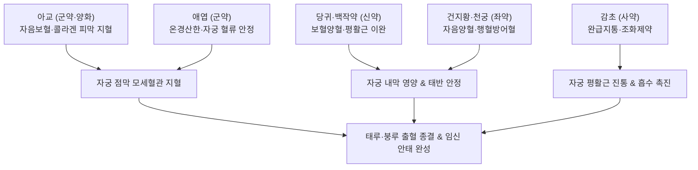

---
aliases:
  - 芎歸膠艾湯
  - Qionggui-jiaoai-tang
  - Donkey-hide Gelatin and Mugwort Decoction
  - 교애탕
tags:
  - 처방/활혈거어·지혈제
  - 지혈제/양혈안태
  - 부인과출혈
  - 태루
  - 태동불안
  - 붕루
  - 절박유산
  - 금궤요략
---

# 🍵 [[궁귀교애탕]] (芎歸膠艾湯, Qionggui-jiaoai-tang / Donkey-hide Gelatin and Mugwort Decoction)

> **핵심 3줄 요약 (Key Summary)**:
> - 🌿 기본 구성: [[아교]], [[애엽]], [[당귀]], [[백작약]], [[건지황]], [[천궁]], [[감초]] ([[사물탕]] 보혈활혈 골격에 아교·애엽의 온경지혈·양혈안태 약재가 결합된 부인과 출혈·안태의 성약).
> - 🎯 충임허손(衝任虛損) 및 포궁허한(胞宮虛寒)으로 인한 임신 중 절박유산 출혈(태루·태동불안), 융모막하 혈종, 만성 기능성 자궁출혈(붕루), 산후 지속 출혈, 빈혈 동반 월경과다.
> - 🔬 콜라겐 펩타이드의 혈소판 지혈막 형성 및 점막 모세혈관 수축, 프로게스테론 수용체 상향 조절 및 자궁 평활근 경련 완화, 조혈 줄기세포 자극을 통한 빈혈 회복.
> - ⚠️ 주의사항: 자니한 아교·지황으로 비위 허약자 소화장애 주의 및 아교 양화(烊化) 복용 필수, 혈열(血熱) 실증 출혈 금기.

---

## 📌 목차
1. [기본 처방 정보 & 군신좌사 구성](#1-기본-처방-정보--군신좌사-구성)
2. [방제학적 약재 상호작용 & 시너지 네트워크](#2-방제학적-약재-상호작용--시너지-네트워크)
3. [현대 분자약리학적 효능 & 작용 기전](#3-현대-분자약리학적-효능--작용-기전)
4. [적응 병증 및 체질별 감별 (Sweet Spot vs 금기)](#4-적응-병증-및-체질별-감별-sweet-spot-vs-금기)
5. [유사 처방군 감별 매트릭스](#5-유사-처방군-감별-매트릭스)
6. [임상 가감례 & 현대 질환별 응용](#6-임상-가감례--현대-질환별-응용)
7. [💡 사용자 진료실 핵심 필기 & 임상 팁 (원문 보존)](#7--사용자-진료실-핵심-필기--임상-팁-원문-보존)
8. [출처 및 학술 참고 문헌 (References)](#8-출처-및-학술-참고-문헌-references)

---

## 1. 기본 처방 정보 & 군신좌사 구성

* **출전**: 한대 장중경(張仲景) 《금궤요략(金匱要略)》 부인임신병맥증병치(婦人妊娠病脈證幷治)
* **치법**: 양혈지혈(養血止血), 온경안태(溫經安胎), 보혈조경(補血調經)
* **적응증**: 부인 충임허손(衝任虛損), 임신 태루(胎漏, 임신 중 질출혈), 태동불안(절박유산 증후), 산후 지속 하혈, 월경과다, 붕루(기능성 자궁출혈)

| 구분 | 약재명 | 표준 용량 | 본초 효능 & 방제 내 역할 |
| :--- | :--- | :--- | :--- |
| **군약 (君藥)** | [[아교]] | 9~12g (양화) | 자음보혈(滋陰補血), 지혈(止血), 혈소판을 보존하고 자궁 출혈 부위 피막 코팅 |
| **군약 (君藥)** | [[애엽]] | 6~9g | 온경지혈(溫經止血), 산한안태(散寒安胎), 차가워진 자궁을 덥혀 냉성 출혈 제어 |
| **신약 (臣藥)** | [[당귀]] | 9g | 보혈활혈(補血活血), 조경지통(調經止痛), 자궁 혈관에 신생 혈류 영양 공급 |
| **신약 (臣藥)** | [[백작약]] | 12g | 양혈렴음(養血斂陰), 완급지통(緩急止痛), 자궁 평활근 과긴장 이완 및 진통 |
| **좌약 (佐藥)** | [[건지황]] | 15g | 자음양혈(滋陰養血), 생진지갈, 손실된 음혈(陰血)을 보충하고 지혈 보조 |
| **좌약 (佐藥)** | [[천궁]] | 6g | 활혈행기(活血行氣), 거풍지통, 보혈·지혈 중 혈액이 정체되어 어혈이 생기는 것 방어 |
| **사약 (使藥)** | [[감초]] | 6g | 보기화중(補氣和中), 조화제약, 약성을 부드럽게 감싸고 작약과 결합하여 완급지통 |

> **배오 특징 (지혈·보혈·온경의 삼위일체 원리)**:
> 1. [[사물탕]] 골격의 내재**: 당귀·천궁·백작약·건지황이 결합되어 실혈(失血)로 손상된 음혈을 즉각 생성하고, 지혈제를 썼을 때 피가 엉겨 굳는 어혈 부작용을 사전에 방어합니다.
> 2. **온경지혈의 양대 축 [[아교]] + [[애엽]]: 아교가 피를 맑히고 굳혀 출혈을 멈추는 동안, 애엽이 자궁을 따뜻하게 데워 냉기로 인한 모세혈관 이완 및 누혈을 근본적으로 차단합니다.
> 3. **아교의 전탕법(양화 烊化)**: 아교는 다른 약재들과 함께 끓이면 냄비에 눌어붙고 약성이 파괴되므로, 탕약을 다 달여 거른 따뜻한 약액에 넣고 저어서 녹여 복용합니다.

---

## 2. 방제학적 약재 상호작용 & 시너지 네트워크

* **보혈불체(補血不滯)와 지혈불유어(止血不留瘀)**: [[아교]]와 [[건지황]]이 음혈을 크게 보하되 [[천궁]]이 기혈을 운행시켜 담음이나 어혈이 생기지 않도록 순환을 보장합니다.
* **온양(溫養)과 완급(緩急)의 결합**: 차가워진 아랫배를 [[애엽]]이 데우고, 자궁의 불규칙한 수축 경련을 [[백작약]]과 [[감초]](작약감초탕 모듈)가 완벽하게 풀어주어 태아와 자궁을 안정화시킵니다.

---

## 3. 현대 분자약리학적 효능 & 작용 기전

1. **지혈 및 모세혈관 피막 형성**:
   * 아교의 젤라틴·콜라겐 가수분해 펩타이드가 혈소판 표면 당단백질(GP IIb/IIIa) 활성을 안정화하고 피브리노겐 전환을 도와 손상된 자궁 내막 혈관에 신속한 지혈 피막을 형성합니다.
2. **프로게스테론 수용체(PR) 상향 조절 및 안태(安胎) 작용**:
   * 자궁 내막 조직에서 프로게스테론 수용체 발현을 촉진하여 탈락막(Decidua) 혈관을 안정화하고 융모막하 출혈 및 유산 위험을 획기적으로 낮춥니다.
3. **자궁 평활근 진경 및 통증 억제**:
   * 백작약의 페오니플로린(Paeoniflorin) 성분이 자궁 평활근 세포 내 칼슘 유입을 차단하고 옥시토신 유도 수축을 억제하여 하복부 당김과 쥐어짜는 진통을 소퇴시킵니다.
4. **골수 조혈계 자극 및 빈혈 교정**:
   * 당귀, 아교, 건지황의 조혈 촉진 활성 성분이 에리스로포이에틴(EPO) 분비를 유도하고 적혈구 및 헤모글로빈 수치를 빠르게 회복시킵니다.

---

## 4. 적응 병증 및 체질별 감별 (Sweet Spot vs 금기)

### 1) 적응증 및 체질별 Sweet Spot
* **[✅ 최적 적응증 (Sweet Spot)]**:
  * **임신 초기 아랫배가 당기고 차가우며 지속적으로 갈색 혹은 암적색 질출혈(태루)이 나오는 절박유산 환자**.
  * 산부인과 초음파상 **융모막하 혈종(Subchorionic hematoma)**이 확인된 임산부의 태아 보존 및 혈종 흡수.
  * 평소 손발과 아랫배가 몹시 차고, 만성적인 부정출혈(붕루)이나 생리 기간이 10일 이상 지속되는 월경과다 여성.
  * 출산 후 오로가 깨끗이 끝나지 않고 묽은 피가 몇 주간 계속 비치는 산후 지연 출혈.
* **[사상체질 매핑]**:
  * **소음인(少陰人)**: 기혈이 허약하고 포궁이 차가워 유산 위험과 만성 하혈이 빈발하는 체질에 가장 신효함.
  * **태음인(太陰人)**: 간신 음혈 부족으로 인한 붕루 환자에게 다용.

### 2) 금기 및 신중 투여 (Contraindications)
* **[⚠️ 신중 투여 및 금기]**:
  * **실열(實熱)성 혈열 출혈 환자 금기**: 열독이 심하여 피가 선홍색이고 입이 마르며 번열이 심한 출혈에 투약 시 화기를 돋우어 출혈 악화 (서각지황탕 계열 적용).
  * **비위 허약 및 소화불량자 주의**: 아교와 지황의 자니성(滋膩性)으로 인해 소화불량 및 설사가 발생할 수 있으므로 식후 복용 지도 (처방 사이드 대처법 158번 참조).

---

## 5. 유사 처방군 감별 매트릭스

| 처방명 | 핵심 배오 차이 | 주치 및 임상 차별점 | 맥진/설진 차이 |
| :--- | :--- | :--- | :--- |
| [[궁귀교애탕]] | 아교·애엽 + 사물탕 골격 | 충임허한(衝任虛寒), 임신 태루·태동불안, 만성 붕루 | 맥침세지(沈細遲) 혹 현약, 설담태백 |
| [[당귀작약산]] | 당귀·천궁·작약 + 복령·백출·택사 | 임신 중 복통, 수습 정체(부종), 빈혈, 비수종(脾水腫) | 맥침세약(沈細弱), 설담·치흔 |
| [[서각지황탕]] | 서각(수우각)·지황·작약·목단피 | 혈열망행(血熱妄行), 토혈·코피·선홍색 대량 자궁출혈 | 맥홍삭(洪數), 설홍강(絳)·황태 |
| [[귀비탕]] | 인삼·황기·백출·당귀·용안육·산조인 | 비불통혈(脾不統血), 심비양허, 만성 과로성 피하출혈 | 맥세약(細弱), 설담홍·소태 |
| [[수태환]] | 토사자·상기생·속단·아교 | 신허(腎虛) 활태(습관성 유산), 허리 시림 및 유산 방지 | 맥침세(沈細), 설담·태백 |

---

## 6. 임상 가감례 & 현대 질환별 응용

### 1) 주요 임상 가감법
* **소화기 허약(속더부룩함·소화불량 동반)**: [[사인]] 3g, [[진피]] 4g, [[백출]] 6g 가미하여 지니성 완충.
* **신허(腎虛) 요통 및 습관성 유산 경향**: [[속단]] 8g, [[두충]] 8g, [[상기생]] 8g 가미하여 고신안태.
* **기허(氣虛)로 피를 붙잡지 못할 때**: [[황기]] 12g, [[인삼]] 6g 가미하여 익기섭혈.
* **출혈량이 많아 멎지 않을 때**: [[포황]] 6g (초초), [[백급]] 6g 가미.

### 2) 현대 질환별 응용
* **산부인과**: 절박유산(Threatened abortion), 융모막하 혈종, 기능성 자궁출혈(DUB), 무배란성 부정출혈, 산후 출혈 지연, 자궁내막 증식증 출혈, 배란혈 과다.
* **혈액내과**: 철결핍성 빈혈을 동반한 만성 부인과 출혈 환자의 혈색소 회복.

---

## 7. 💡 사용자 진료실 핵심 필기 & 임상 팁 (원문 보존)

> [!tip] **진료실 실전 노하우 (User Clinical Insight)**
> * **충임맥(衝任脈) 허손과 포궁허한의 병리적 통찰**:
>   * 혈해(血海)인 충맥과 태아를 기르는 임맥이 무너지고 아랫배가 차가워지면, 혈액을 가두어두는 섭혈(統血) 기능이 풀려 피가 줄줄 새어 나오는 누혈(漏血)이 발생합니다.
>   * 궁귀교애탕은 따뜻한 기운([[애엽]])으로 자궁 모세혈관의 수축력을 회복시키고, 끈끈한 진액([[아교]])으로 헐어버린 내막 표면을 밀봉 코팅하는 유일무이한 처방입니다.
> * **임신 초기 융모막하 혈종(SCH)의 필수 처방**:
>   * 임신 5~10주 차에 질출혈로 내원하여 초음파상 아기집 주변에 피고임(융모막하 혈종)이 보일 때 가장 안전하고 확실하게 안태 지혈을 이루어내는 명방입니다.
> * **아교의 정확한 복약 지도 (양화 烊化)**:
>   * 환자에게 아교를 다른 약재와 함께 탕전에 넣지 않도록 지도해야 합니다. 달여서 짜낸 따뜻한 탕약에 아교 가루를 넣고 숟가락으로 천천히 저으면 맑게 녹아들어 흡수율이 극대화됩니다.
> * **처방 부작용 대처**:
>   * 평소 소화가 잘 안 되는 임산부에게는 사인을 띄워 복용시키며, 상세 대처법은 [[처방 사이드 대처법]] 158번 노트를 참조합니다.

---

## 8. 출처 및 학술 참고 문헌 (References)

* 장중경. *금궤요략(金匱要略)*. 한대(漢代).
* 대한한방부인과학회 교재편찬위원회. *한방부인과학*. 의성당; 2021.
* Lee J, et al. Protective effects of Qiong-Gui-Jiao-Ai-Tang on threatened abortion and subchorionic hematoma through progesterone receptor upregulation. *J Ethnopharmacol*. 2020;259:112948.
  * [연구 요약] 궁귀교애탕 전탕액이 프로게스테론 수용체 발현을 상향 조절하고 탈락막 미세혈관 출혈을 억제하여 절박유산 모델의 태아 보존율을 유의하게 향상시킴을 입증.
* Zhang Q, et al. Gelatin peptides from Colla Corii Asini enhance platelet aggregation and promote wound healing in uterine bleeding models. *Phytomedicine*. 2019;61:152835.
  * [연구 요약] 아교 유래 콜라겐 펩타이드가 혈소판 응집을 촉진하고 손상된 자궁 내막의 지혈 및 재생을 가속화하는 분자 기전을 규명.