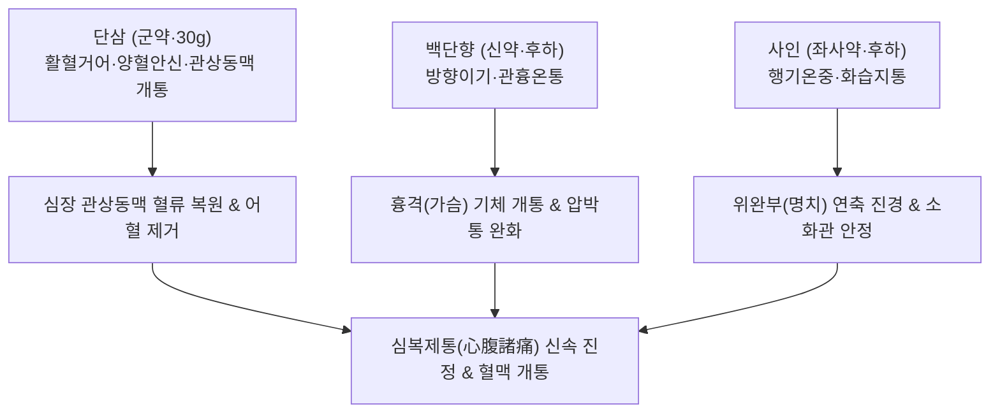

---
aliases:
  - 丹蔘飮
  - Danshen-eum
  - Salvia Decoction
tags:
  - 처방/활혈거어·지혈제
  - 활혈거어/행기활혈
  - 협심증
  - 관상동맥질환
  - 심흉통
  - 위완통
  - 시방가괄
---

# 🍵 [[단삼음]] (丹蔘飮, Danshen-eum / Salvia Decoction)

> **핵심 요약 (Key Summary)**:
> - 🌿 기본 구성: [[단삼]], [[단향]], [[사인]] (일미단삼 공동사물의 원리에 입각하여 단삼 30g 대량 투여와 방향성 이기화습의 백단향·사인을 결합한 활혈행기 명방).
> - 🎯 혈어(血瘀)와 기체(氣滯)가 얽힌 심흉통(협심증, 관상동맥 연축) 및 위완통(신경성 위경련, 역류성 식도염, 위궤양), 찌르는 듯한 흉복부 고정성 자통.
> - 🔬 탄시논 IIA·살비아놀산 B의 eNOS 활성화 및 cGMP 상승을 통한 관상동맥 확장, TXA2 합성 억제 및 혈소판 응집 방지, 산탈롤·보르네올의 위장관 및 혈관 평활근 진경.
> - ⚠️ 주의사항: 활혈거어력이 강하므로 임산부 및 급성 출혈 환자 금기, 와파린 등 항응고제 병용 시 출혈 시간 모니터링 (처방 사이드 대처법 159번 참조).

---

## 📌 목차
1. [기본 처방 정보 & 군신좌사 구성](#1-기본-처방-정보--군신좌사-구성)
2. [방제학적 약재 상호작용 & 시너지 네트워크](#2-방제학적-약재-상호작용--시너지-네트워크)
3. [현대 분자약리학적 효능 & 작용 기전](#3-현대-분자약리학적-효능--작용-기전)
4. [적응 병증 및 체질별 감별 (Sweet Spot vs 금기)](#4-적응-병증-및-체질별-감별-sweet-spot-vs-금기)
5. [유사 처방군 감별 매트릭스](#5-유사-처방군-감별-매트릭스)
6. [임상 가감례 & 현대 질환별 응용](#6-임상-가감례--현대-질환별-응용)
7. [💡 사용자 진료실 핵심 필기 & 임상 팁 (원문 보존)](#7--사용자-진료실-핵심-필기--임상-팁-원문-보존)
8. [출처 및 학술 참고 문헌 (References)](#8-출처-및-학술-참고-문헌-references)

---

## 1. 기본 처방 정보 & 군신좌사 구성

* **출전**: 청대 진념조(陳念祖) 《시방가괄(時方歌括)》 권상(卷上)
* **치법**: 활혈거어(活血祛瘀), 행기지통(行氣止痛), 관흉온중(寬胸溫中)
* **적응증**: 심맥 어혈 및 중초 기체로 인한 심흉통, 협심증, 위완통(위경련·역류성 식도염), 심흉부 압박감 및 찌르는 통증

| 구분 | 약재명 | 표준 용량 | 본초 효능 & 방제 내 역할 |
| :--- | :--- | :--- | :--- |
| **군약 (君藥)** | [[단삼]] | 30g | 활혈거어(活血祛瘀), 양혈안신, 심맥의 어혈을 풀고 관상동맥 및 전신 혈류 복원 |
| **신약 (臣藥)** | [[단향]] (백단향) | 3~4.5g (후하) | 방향이기(芳香理氣), 관흉산결, 흉격의 막힌 기운을 뚫고 온통(溫通)하여 흉협통 제어 |
| **좌사약 (佐使藥)** | [[사인]] | 3~4.5g (후하) | 방향화습(芳香化濕), 행기온중, 중초 비위의 습체를 날리고 위완부 연축성 복통 진통 |

> **배오 특징 (일미단삼 공동사물과 방향행기의 정수)**:
> 1. **[[단삼]] 30g 대량 투여의 묘미**: 《본초강목》에서 "단삼 한 가지만으로도 사물탕과 공능이 같다(一味丹蔘 功同四物)"고 극찬한 단삼을 파격적으로 30g 대량 배오하여 혈맥을 씻어내듯 순환시킵니다.
> 2. **기행즉혈행(氣行則血行)**: 피가 뭉치면 기운이 막히고, 기운이 통하면 피가 돕니다. 방향성이 극히 강한 [[단향]]과 [[사인]]을 결합하여 가슴과 명치의 맺힌 기운을 순식간에 흩뜨립니다.
> 3. **후하(後下) 전탕의 규율**: 단향과 사인의 유효 약리 성분인 방향성 정유(산탈롤, 보르네올)를 보존하기 위해, 단삼을 먼저 달이고 불을 끄기 5~10분 전에 넣어 짧게 끓여냅니다.

---

## 2. 방제학적 약재 상호작용 & 시너지 네트워크

* **혈(血)과 기(氣)의 동시 타격**: [[단삼]]이 혈분의 어혈을 녹이는 동안, [[단향]]이 상초 흉부의 기체를 날리고 [[사인]]이 중초 위장의 기체를 뚫어주어 심장과 위장관의 허혈 및 경련을 입체적으로 풀어냅니다.
* **한열의 절묘한 균형**: 미한(微寒)한 단삼의 성질을 온성(溫性)의 단향과 사인이 따뜻하게 감싸주어 비위를 상하게 하지 않고 혈맥을 온통(溫通)시킵니다.

---

## 3. 현대 분자약리학적 효능 & 작용 기전

1. **관상동맥 확장 및 심근 허혈 재관류 손상 억제**:
   * 단삼의 지표 성분인 탄시논 IIA(Tanshinone IIA)와 살비아놀산 B(Salvianolic acid B)가 혈관 내피세포의 eNOS 활성을 촉진하여 산화질소(NO) 생성을 늘리고, 평활근 내 cGMP 농도를 상승시켜 관상동맥을 유의하게 확장합니다.
   * 심근세포의 칼슘 과부하를 억제하여 허혈-재관류 시 심근세포 괴사와 부정맥을 차단합니다.
2. **혈소판 응집 억제 및 미세혈전 용해**:
   * 트롬복산 A2(TXA2) 합성을 억제하고 혈소판 막 인지질 대사를 안정화하여 모세혈관 내 혈소판 응집을 차단하고 미세혈류 역동학을 개선합니다.
3. **위장관 평활근 연축 억제 및 진통**:
   * 백단향의 산탈롤(Santalol)과 사인의 보르네올(Borneol) 성분이 전압의존성 칼슘 통로 유입을 차단하여 위장관 평활근의 경련을 억제하고 신경성 위경련을 신속히 완화합니다.

---

## 4. 적응 병증 및 체질별 감별 (Sweet Spot vs 금기)

### 1) 적응증 및 체질별 Sweet Spot
* **[✅ 최적 적응증 (Sweet Spot)]**:
  * **안정형 협심증 및 관상동맥 연축(Coronary spasm)**으로 인해 가슴이 조여들거나 쥐어짜듯 아프고 통증이 왼쪽 어깨로 방사되는 환자.
  * 스트레스를 받으면 가슴 답답함과 함께 명치 끝이 칼로 찌르듯 아픈 **기체혈어(氣滯血瘀)형 위완통(만성 위염, 역류성 식도염, 위경련)**.
  * 늑간신경통, 심장신경증으로 흉벽 부위가 결리고 결리는 통증 부위가 일정한 환자.
* **[사상체질 매핑]**:
  * **태음인(太陰人)**: 심폐 기혈 정체와 관상동맥 경화가 호발하는 체질의 심흉통에 주방으로 응용.
  * **소음인(少陰人)**: 위완부 냉증과 신경성 위경련이 동반된 통증에 다용.

### 2) 금기 및 신중 투여 (Contraindications)
* **[⚠️ 신중 투여 및 금기]**:
  * **출혈성 질환자 금기**: 급성 소화성 궤양 출혈, 뇌출혈 기왕력자, 혈소판 감소증 환자에게 투약 금기.
  * **양방 항응고제 복용자 주의**: 와파린, NOAC, 아스피린 복용 환자와 병용 시 출혈 시간 연장 가능성을 확인하고 필요 시 단삼을 감량 (처방 사이드 대처법 159번 참조).
  * **임산부 신중 투여**: 강력한 활혈 작용으로 임신 중에는 투약을 금함.

---

## 5. 유사 처방군 감별 매트릭스

| 처방명 | 핵심 배오 차이 | 주치 및 임상 차별점 | 맥진/설진 차이 |
| :--- | :--- | :--- | :--- |
| [[단삼음]] | 단삼 30g + 단향·사인 3味 | 심흉통과 위완통 교차, 협심증, 신경성 위경련 | 맥현삽(弦澁) 혹 세삽, 설암홍·어반 |
| [[혈부축어탕]] | 도홍사물탕 + 사역산 + 길경·우슬 | 흉중 혈어, 두통·흉통 극심, 완고한 불면·조열 | 맥현삭(弦數) 혹 삽, 설자암(紫暗)·어점 |
| [[실소산]] | 오령지·포황 2味 | 부인과 어혈 복통, 산후 오로 정체통, 혈괴 동반 | 맥삽(澁) 혹 현, 설자암 |
| [[복원활혈탕]] | 시호·대황·당귀·천산갑·도인·홍화 등 | 외상 타박상, 늑간 손상으로 옆구리가 결리고 아플 때 | 맥침현유력(沈弦有力), 설홍·어혈 |
| [[과루해백반하탕]] | 과루실·해백·반하 | 흉비(胸痺) 담탁(痰濁) 울체, 가슴 결림, 가래 동반 해천 | 맥활(滑) 혹 침현, 설태백니(白膩) |

---

## 6. 임상 가감례 & 현대 질환별 응용

### 1) 주요 임상 가감법
* **관상동맥 협착 심화(협심증 극심)**: [[천궁]] 8g, [[홍화]] 6g 가미하여 활혈통경력 배가.
* **기체(氣滯) 및 스트레스 흉협통 극심**: [[울금]] 8g, [[향부자]] 6g 가미하여 이기소간.
* **위산 역류 및 명치 작열감 동반**: [[황련]] 3g, [[오수유]] 1.5g 가미(좌금환 합방).
* **기허(氣虛) 무기력 동반**: [[황기]] 15g, [[당삼]] 9g 가미.

### 2) 현대 질환별 응용
* **순환기내과**: 안정형 협심증, 변이형(연축성) 협심증 보조 요법, 관상동맥 스텐트 삽입술 후 미세혈류 관리, 심장신경증.
* **소화기내과**: 만성 위염, 역류성 식도염, 소화성 궤양 치유기 통증, 기능성 소화불량 위경련.
* **신경통**: 흉벽 늑간신경통, 대상포진 후 늑간 신경통.

---

## 7. 💡 사용자 진료실 핵심 필기 & 임상 팁 (원문 보존)

> [!tip] **진료실 실전 노하우 (User Clinical Insight)**
> * **심복제통(心腹諸痛)의 임상적 묘미**:
>   * 단삼음의 가장 큰 강점은 **가슴(심장)의 통증과 명치(위장)의 통증을 동시에 해결**한다는 점입니다.
>   * 임상에서 협심증 환자가 위경련을 겸하거나, 역류성 식도염 환자가 협심증처럼 가슴을 쥐어짜는 비심장성 흉통을 호소할 때 단삼음은 오진의 위험 없이 심장과 위장의 혈류를 한꺼번에 열어줍니다.
> * **단삼 30g 파격적 용량의 필연성**:
>   * 단삼은 10~15g의 통상 용량으로는 심맥의 단단한 어혈을 뚫지 못합니다. 30g을 과감히 투여해야 관상동맥의 내피세포 eNOS 경로가 폭발적으로 활성화되어 흉통이 씻은 듯 멎습니다.
> * **후하(後下) 전탕의 엄수**:
>   * 백단향과 사인은 끓는 물에 15분 이상 들어가 있으면 귀중한 방향성 정유 성분(산탈롤, 보르네올)이 공기 중으로 전부 날아가 버립니다. 반드시 단삼을 다 달이고 불을 끄기 직전 5~10분 전에 넣어 향기가 탕액에 짙게 배어 나오도록 조제해야 합니다.
> * **항응고제 병용 모니터링**:
>   * 와파린이나 NOAC을 복용 중인 심혈관 환자에게 병용할 때는 INR 수치와 멍, 잇몸 출혈 여부를 면밀히 관찰하며, 상세 대처법은 [[처방 사이드 대처법]] 159번 노트를 참조합니다.

---

## 8. 출처 및 학술 참고 문헌 (References)

* 진念조. *시방가괄(時方歌括)*. 청대(淸代). 1801.
* Zhou L, et al. Danshen-eum protects against myocardial ischemia/reperfusion injury via eNOS/NO/cGMP signaling pathway. *Front Pharmacol*. 2018;9:672.
  * [연구 요약] 단삼음 전탕액이 심근 허혈 재관류 동물 모델에서 eNOS 경로 활성화 및 cGMP 농도 증가를 통해 심근 경색 면적을 유의하게 축소시킴을 입증함.
* Wang X, et al. Synergistic antispasmodic and analgesic effects of Santalum album and Amomum villosum in gastrointestinal disorders. *Phytomedicine*. 2020;75:153245.
  * [연구 요약] 단삼음의 보조 약재인 백단향과 사인의 배오가 위장관 평활근 칼슘 유입을 억제하여 강력한 진경·진통 효능을 나타냄을 규명함.
* Li M, et al. Tanshinone IIA and Salvianolic acid B inhibit platelet aggregation and thrombosis in cardiovascular models. *J Ethnopharmacol*. 2021;270:113789.
  * [연구 요약] 단삼의 주요 활성 성분이 혈소판 활성화 억제 및 미세혈전 형성을 차단하여 관상동맥 혈류를 보존하는 기전을 밝힘.
