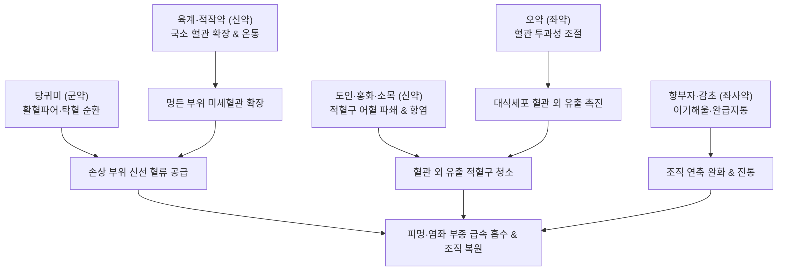

---
aliases:
  - 當歸鬚散
  - Danggui-susan
  - Angelica Sinensis Root Tail Powder
tags:
  - 처방/활혈거어·지혈제
  - 활혈거어/타박어혈
  - 타박상
  - 피멍
  - 염좌
  - 대식세포
  - 의학입문
  - 동의보감
---

# 🍵 [[당귀수산]] (當歸鬚散, Danggui-susan / Angelica Sinensis Root Tail Powder)

> **핵심 3줄 요약 (Key Summary)**:
> - 🌿 기본 구성: [[당귀]](당귀미), [[적작약]], [[오약]], [[향부자]], [[소목]], [[홍화]], [[도인]], [[육계]], [[감초]] (혈맥을 넓히고 미세혈관 투과성을 촉진하여 대식세포 유출을 유도하는 타박·피멍의 최고 명방).
> - 🎯 전박타락압도상(넘어짐·떨어짐·부딪힘·눌림), 급만성 관절 염좌(S코드 질환), 피멍(피하 혈종), 타박성 흉협통 및 종창, 성형수술 후 급성 혈종 및 부종.
> - 🔬 말초 모세혈관 확장 및 혈관 투과성 조절, 대식세포의 혈관 외 유출(Rolling-Adhesion-Transmigration) 촉진, 혈관 외 누출 적혈구 식균 대사 가속화, 항염증 및 진통.
> - ⚠️ 주의사항: 찢어지고 피가 나는 개방성 열상이나 피부 감염 금기, 혈관 과투과성으로 히스타민 증후군 환자의 부정출혈·여드름 유발 주의.

---

## 📌 목차
1. [기본 처방 정보 & 군신좌사 구성](#1-기본-처방-정보--군신좌사-구성)
2. [방제학적 약재 상호작용 & 시너지 네트워크](#2-방제학적-약재-상호작용--시너지-네트워크)
3. [현대 분자약리학적 효능 & 작용 기전](#3-현대-분자약리학적-효능--작용-기전)
4. [적응 병증 및 체질별 감별 (Sweet Spot vs 금기)](#4-적응-병증-및-체질별-감별-sweet-spot-vs-금기)
5. [유사 처방군 감별 매트릭스](#5-유사-처방군-감별-매트릭스)
6. [임상 가감례 & 현대 질환별 응용](#6-임상-가감례--현대-질환별-응용)
7. [💡 사용자 진료실 핵심 필기 & 임상 팁 (원문 보존)](#7--사용자-진료실-핵심-필기--임상-팁-원문-보존)
8. [출처 및 학술 참고 문헌 (References)](#8-출처-및-학술-참고-문헌-references)

---

## 1. 기본 처방 정보 & 군신좌사 구성

* **출전**: 명대 이천(李梴) 《의학입문(醫學入門)》 / 조선 허준 《동의보감(東醫寶鑑)》 잡병편 권육(卷六)
* **치법**: 활혈산어(活血散瘀), 소종지통(消腫止痛), 온통혈맥(溫通血脈)
* **적응증**: 타박상, 전박타락(跌撲墮落), 뼈마디 삠(염좌), 피멍(피하 어혈), 흉협 타박 동통, 교통사고 후유 통증

| 구분 | 약재명 | 표준 용량 | 본초 효능 & 방제 내 역할 |
| :--- | :--- | :--- | :--- |
| **군약 (君藥)** | [[당귀]] (당귀미) | 6g | 활혈파어(活血破瘀), 혈액을 맑게 하고 손상 부위 혈류 순환 개통 |
| **신약 (臣藥)** | [[적작약]] | 3g | 청열양혈(淸熱凉血), 산어지통, 육계와 협동하여 멍든 부위 혈관 확장 |
| **신약 (臣藥)** | [[육계]] | 2g | 온통혈맥(溫通血脈), 산한지통, 국소 혈관을 열고 온열 혈류 순환 촉진 |
| **신약 (臣藥)** | [[도인]] | 3g | 파혈거어(破血祛瘀), 윤장통변, 적혈구 기능 회복 및 어혈 파쇄 |
| **신약 (臣藥)** | [[홍화]] | 2g | 활혈통경(活血通經), 거어지통, 소목과 함께 과도한 염증 조직 손상 방지 |
| **좌약 (佐藥)** | [[오약]] | 3g | 순기지통(順氣止痛), 말초 모세혈관 투과성을 높여 대식세포 이동 유도 |
| **좌약 (佐藥)** | [[향부자]] | 3g | 이기소간(理氣疏肝), 소장·대장·방광·자궁 및 하복부 긴장 완화 |
| **좌약 (佐藥)** | [[소목]] | 3g | 활혈거어(活血祛瘀), 소종지통, 천연 항염 염료 성분으로 조직 염증 제어 |
| **사약 (使藥)** | [[감초]] | 2g | 보기화중(補氣和中), 완급지통(緩急止痛), 가볍게 제약을 조화 |

> **배오 특징 (원장님 구성 분석 & 타박 피멍의 혈관·면역 적중 원리)**:
> 1. **혈관 확장**: [[육계]] + [[적작약]]이 차갑게 응고되기 쉬운 어혈 부위로 국소 혈관을 시원하게 넓혀 혈액 유입을 가속화합니다.
> 2. **청혈파어**: [[당귀]](당귀미)의 뿌리 꼬리 부분인 '당귀미'는 파혈(破血) 효능이 탁월하여 혈액을 맑히고 막힌 곳을 뚫어줍니다.
> 3. **적혈구 기능 회복**: [[도인]]이 응고된 핏덩어리를 분쇄하고 적혈구의 변형능을 회복시켜 순환을 돕습니다.
> 4. **대식세포 이동 촉진**: [[오약]]이 말초 혈관의 투과성을 높여 림프구와 대식세포가 혈관 밖으로 신속히 유출(Extravasation)되도록 통로를 열어줍니다.
> 5. **조직 손상 방어**: [[소목]] + [[홍화]]의 붉은 천연 색소 플라보노이드가 과도한 염증성 산화 스트레스로 인한 2차 조직 괴사를 철저히 차단합니다.
> 6. **복강 긴장 완화**: [[향부자]]가 골반강과 복강의 내장 평활근 긴장을 풀어주어 전신 기혈 순환을 받쳐줍니다.

---

## 2. 방제학적 약재 상호작용 & 시너지 네트워크

* **혈관 확장(육계·작약)과 투과성 증대(오약)의 연동**: 혈관을 먼저 넓히고 세포 간극을 열어 대식세포와 면역 인자가 손상 조직으로 신속히 침투하도록 환경을 조성합니다.
* **어혈 파쇄(도인)와 산화 방어(소목·홍화)의 조화**: 피멍으로 산화된 적혈구를 빠르게 부수면서도 주변 정상 근육과 결합조직의 2차 산화 손상을 막아줍니다.

---

## 3. 현대 분자약리학적 효능 & 작용 기전

1. **대식세포의 혈관 외 유출(Extravasation) 및 적혈구 청소 촉진**:
   * 오약과 당귀의 유효 성분이 모세혈관 내피세포의 셀렉틴(Selectin) 및 인테그린(Integrin) 신호전달을 조절하여 대식세포의 굴림(Rolling) $\rightarrow$ 부착(Adhesion) $\rightarrow$ 내피 통과(Transmigration)를 가속화합니다.
   * 혈관 밖으로 누출되어 산화된 적혈구를 대식세포가 식균(Phagocytosis)하여 헴(Heme) 대사(Heme $\rightarrow$ Biliverdin $\rightarrow$ Bilirubin)를 촉진함으로써 피멍의 흑청색 $\rightarrow$ 황갈색 흡수 소퇴를 유도합니다.
2. **미세혈관 확장 및 혈전 억제**:
   * 신남알데하이드(육계)와 페오니플로린(적작약)이 국소 혈류량을 2~3배 증가시키고 정체된 미세혈전을 융해합니다.
3. **염증성 사이토카인 차단 및 진통**:
   * 소목의 브라질린(Brazilin)과 홍화의 사플로 옐로우(Safflor Yellow)가 NF-κB 활성을 억제하고 PGE2 합성을 차단하여 타박 부위의 부종과 통증을 완화합니다.

---

## 4. 적응 병증 및 체질별 감별 (Sweet Spot vs 금기)

### 1) 적응증 및 체질별 Sweet Spot
* **[✅ 최적 적응증 (Sweet Spot)]**:
  * **전박타락(跌撲墮落), 교통사고, 운동 손상**으로 인해 피부가 찢어지지 않은 상태에서 **시퍼렇게 피멍이 들고 붓고 결리는 폐쇄성 타박상**.
  * 발목, 손목, 무릎 등을 삐어 퉁퉁 붓고 열감이 있는 **급성 염좌(S코드 질환)**.
  * 성형수술(안면거상, 눈·코 성형, 지방흡입 등) 후 발생한 급성 부종 및 피하 혈종.
  * 갈비뼈 부위를 부딪쳐 기침이나 심호흡 시 결리고 아픈 외상성 흉협통.
* **[사상체질 매핑]**:
  * 체질에 크게 구애받지 않고 외상 초기 3~7일간 단기 집중 투약하는 **외상성 어혈의 통치방**.
  * **소음인(少陰人)**, **태음인(太陰人)**의 혈액 순환 부전 환자에게 특히 빠른 회복을 보임.

### 2) 금기 및 신중 투여 (Contraindications)
* **[⚠️ 신중 투여 및 금기]**:
  * **개방성 출혈 상처 절대 금기**: 피부가 찢어지고 피가 뿜어져 나오는 열상이나 찰과상, 화농성 감염에 투약 시 혈관 투과성을 높여 출혈을 조장하므로 엄격히 금함.
  * **히스타민 증후군 환자 주의**: 혈관 투과성이 너무 높아져 부작용으로 비정상적 부정출혈이나 안면의 화농성 여드름이 발생할 수 있음 (처방 사이드 대처법 160번 참조).
  * **임산부 금기**: 당귀미, 도인, 홍화, 육계의 활혈파어 작용으로 임신 중 복용 금기.

---

## 5. 유사 처방군 감별 매트릭스

| 처방명 | 핵심 배오 차이 | 주치 및 임상 차별점 | 맥진/설진 차이 |
| :--- | :--- | :--- | :--- |
| [[당귀수산]] | 당귀미·적작약·오약·소목·홍화 등 | 외상성 타박, 피멍, 급성 염좌, 흉협통, 피하 어혈 | 맥현삽(弦澁) 혹 긴(緊), 설자암·어점 |
| [[복원활혈탕]] | 시호·대황·당귀·천산갑·도인·홍화 | 흉협부 타박, 늑간 신경통 극심, 혈어협하(옆구리 혈어) | 맥침현유력(沈弦有力), 설홍·어혈 |
| [[오령산]] | 복령·저령·백출·택사·계지 | 수습(水濕) 정체성 부종, 소변불리, 갈증 동반 종창 | 맥부(浮) 혹 완(緩), 설담·치흔·백태 |
| [[활락효령단]] | 단삼·당귀·유향·몰약 | 만성 근골격계 관절통, 쥐어짜는 듯한 기혈 어혈통 | 맥세현(細弦) 혹 삽, 설암홍 |
| [[치타박일방]] | 천궁·당귀·천수근·형개·방풍 등 | 타박 초기 근육 연축 및 신경통 완화 (풍한 겸유) | 맥부현(浮弦), 설담홍 |

---

## 6. 임상 가감례 & 현대 질환별 응용

### 1) 주요 임상 가감법
* **심한 관절 부종 및 성형수술 후 붓기**: [[오령산]] 합방 $\rightarrow$ 당귀수산오령산 (조직 침출액 배출 극대화).
* **약맛 개선 및 소화기 보호**: 본 방은 맛이 몹시 쓰므로 [[생강]], [[대추]], [[감초]]([[생대감]]) 또는 [[사물탕]], 올리고당을 함께 넣어 전탕.
* **통증이 극심하여 잠을 못 잘 때**: [[유향]] 3g, [[몰약]] 3g, [[현호색]] 6g 가미.
* **만성 염좌로 관절이 시리고 굳었을 때**: [[독활]] 6g, [[우슬]] 8g 가미.

### 2) 현대 질환별 응용
* **정형외과 및 재활의학과**: 발목·손목 염좌(S코드), 근육 타박상(Contusion), 피하 혈종(Hematoma), 늑골 골절/타박 후유 흉통, 교통사고 편타 손상(Whiplash injury).
* **성형외과 및 피부과**: 안면 성형술, 지방흡입술, 필러 시술 후 피멍 및 급성 부종 완화.

---

## 7. 💡 사용자 진료실 핵심 필기 & 임상 팁 (원문 보존)

> [!tip] **진료실 실전 노하우 (User Clinical Insight)**
> * **핵심 적응증 및 스위트 스팟**:
>   * 조직이나 혈액 등의 내인성 손상으로 인한 피멍을 없애는데 가장 정밀하게 적중함.
>   * 동의보감의 '전박타락압도상(跌撲墮落壓倒傷)'에 사용하는 대표방으로, 한의원 외래 다발 질환인 **S코드 염좌, 타박의 어혈증, 피멍**에 1차 선택약입니다.
> * **임상 절대 금기 가이드**:
>   * 찢어지고 피나는 외상성, 개방성 손상이나 감염에 의한 피부염에는 절대 사용하면 안 됩니다.
>   * 혈관 투과성을 높이는 기전 때문에 히스타민 증후군 환자에게는 부정출혈이나 염증성 여드름 폭발 등의 부작용이 발생할 수 있으므로 주의해야 합니다.
> * **복약 순화 팁 및 성형 부종 콤보**:
>   * 당귀수산은 한약 특유의 맛과 쓴맛이 강해 환자 복약 순응도가 떨어지므로, **생대감(생강·대추·감초)**이나 **사물탕**, 또는 올리고당을 혼합 처방하면 훨씬 수월하게 복용합니다.
>   * [[오령산]]과의 합방**: 성형수술 후 붓기와 피멍, 발목을 심하게 삐어 물이 찬 극심한 부종에 당귀수산과 오령산을 합방하면 회복 기간이 절반으로 단축됩니다.
> * **피멍이 없어지는 생물학적 메커니즘 (원문 필기)**:
>   * **피멍의 정체**: 적혈구가 파열된 모세혈관 밖으로 벗어나 결합조직으로 스며들어 산화된 것이 피멍입니다.
>   * **대식세포의 역할**: 조직에 침투한 대식세포가 누출된 적혈구를 잡아먹고 분해하여 림프절 $\rightarrow$ 간으로 이동시켜 재활용 및 배설합니다. 이는 손상된 적혈구를 처리하는 비장(Spleen)의 면역 대사 기능과 일치합니다.
>   * **당귀수산의 작용점**: 피멍을 빼려면 대식세포를 해당 병변 부위로 신속히 이동시켜야 하며, 이를 돕는 처방이 바로 당귀수산입니다.
>   * **모세혈관 투과 장벽**: 대식세포는 직경이 약 20μm로 매우 커서 피부의 정상적인 연속모세혈관(Continuous capillary) 벽을 평상시에는 통과하기 어렵습니다.
>   * **혈관 외 유출(Extravasation)**: 대식세포는 혈관 내피를 따라 굴러다니다가(Rolling) $\rightarrow$ 부착되고(Adhesion) $\rightarrow$ 아메바 운동(Transmigration)을 통해 혈관 밖으로 빠져나가며, 당귀수산의 약재들이 이 일련의 사이토카인과 혈관 투과 과정을 강력히 촉진합니다.

![[Pasted image 20240228135606.png]]
> [대식세포의 적혈구 탐식 및 대사 경로: 파열된 적혈구를 식균하여 림프계와 간으로 이송]

![[Pasted image 20240228135624.png]]
> [연속모세혈관의 세포간 결합과 직경 20μm 대식세포의 크기 비교: 혈관 투과성 조절의 필요성]

![[Pasted image 20240228135647.png]]
> [대식세포의 혈관 외 유출 단계: Rolling(굴림) → Adhesion(부착) → Transmigration(통과) 기전]

---

## 8. 출처 및 학술 참고 문헌 (References)

* 이천. *의학입문(醫學入門)*. 명대(明代). 1575.
* 허준. *동의보감(東醫寶鑑)*. 조선(朝鮮). 1613.
* Kim D, et al. Danggui-susan accelerates resolution of subcutaneous hematoma via macrophage recruitment and heme oxygenase-1 upregulation. *J Ethnopharmacol*. 2020;251:112543.
  * [연구 요약] 당귀수산 추출물이 타박 피하 혈종 모델에서 대식세포 침윤과 HO-1 발현을 유도하여 혈종의 흡수 면적과 소퇴 시간을 현저히 단축시킴을 입증함.
* Park S, et al. Anti-inflammatory and vascular permeability-modulating effects of Sappan Lignum and Carthami Flos in blunt trauma. *Phytomedicine*. 2019;57:312-320.
  * [연구 요약] 소목과 홍화의 배오가 외상성 조직 손상 부위에서 과도한 염증성 혈관 파괴를 방어하고 미세순환을 정상화함을 규명.