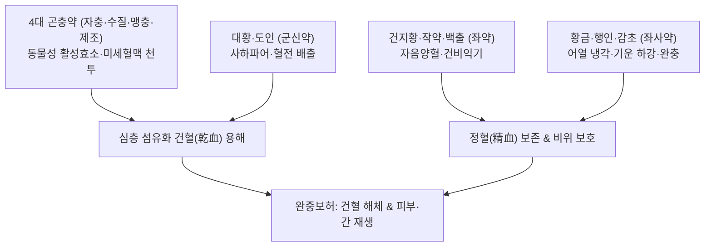

---
aliases:
  - 大黃䗪蟲丸
  - Dahuang-zhechong-wan
  - Rhubarb and Eupolyphaga Pill
tags:
  - 처방/활혈거어·지혈제
  - 활혈거어/파혈축어
  - 기부갑착
  - 간경변
  - 자궁내막증
  - 건혈
  - 충류약
  - 금궤요략
---

# 🍵 [[대황자충환]] (大黃䗪蟲丸, Dahuang-zhechong-wan / Rhubarb and Eupolyphaga Pill)

> **핵심 3줄 요약 (Key Summary)**:
> - 🌿 기본 구성: [[대황]], [[자충]], [[수질]], 맹충, [[제조]], [[도인]], [[건지황]], [[작약]], [[백출]], [[황금]], [[행인]], [[감초]] (4대 곤충 약재와 대황의 강력 파혈력에 지황·작약·백출의 보허약을 결합하여 꿀로 환을 빚은 완중보허 명방).
> - 🎯 만성 허로(虛勞)와 묵은 건혈(乾血)로 피부가 비늘처럼 벗겨지는 기부갑착(肌膚甲錯), 눈가가 검푸르게 그늘지는 양목암흑(兩目黯黑), 초기~중기 간경변증, 자궁내막증, 복강 내 완고한 종괴.
> - 🔬 히루딘의 직접적 트롬빈 억제 및 강력한 섬유소용해, TGF-β1/Smad 경로 차단을 통한 간 섬유화 및 장기 경화 역전, 미세혈관 신생 및 혈관 재관류 촉진.
> - ⚠️ 주의사항: 극렬한 충류약과 대황 배오로 임산부 복용 절대 금기, 출혈성 질환자 및 항응고제 병용 환자 출혈 징후 모니터링.

---

## 📌 목차
1. [기본 처방 정보 & 군신좌사 구성](#1-기본-처방-정보--군신좌사-구성)
2. [방제학적 약재 상호작용 & 시너지 네트워크](#2-방제학적-약재-상호작용--시너지-네트워크)
3. [현대 분자약리학적 효능 & 작용 기전](#3-현대-분자약리학적-효능--작용-기전)
4. [적응 병증 및 체질별 감별 (Sweet Spot vs 금기)](#4-적응-병증-및-체질별-감별-sweet-spot-vs-금기)
5. [유사 처방군 감별 매트릭스](#5-유사-처방군-감별-매트릭스)
6. [임상 가감례 & 현대 질환별 응용](#6-임상-가감례--현대-질환별-응용)
7. [💡 사용자 진료실 핵심 필기 & 임상 팁 (원문 보존)](#7--사용자-진료실-핵심-필기--임상-팁-원문-보존)
8. [출처 및 학술 참고 문헌 (References)](#8-출처-및-학술-참고-문헌-references)

---

## 1. 기본 처방 정보 & 군신좌사 구성

* **출전**: 한대 장중경(張仲景) 《금궤요략(金匱要略)》 혈비허로병맥증병치(血痺虛勞病脈證幷治)
* **치법**: 파혈축어(破血逐瘀), 통경활락(通經活絡), 완중보허(緩中補虛)
* **적응증**: 오로허극(五勞虛極), 건혈(乾血) 내저, 기부갑착, 양목암흑, 월경 폐색, 간비종대, 만성 간경변, 심부 혈전

| 구분 | 약재명 | 표준 용량 | 본초 효능 & 방제 내 역할 |
| :--- | :--- | :--- | :--- |
| **군약 (君藥)** | [[대황]] (증제) | 75g | 사하축어(瀉下逐瘀), 혈열(血熱)을 대소변으로 빼내고 건혈을 분해 |
| **군약 (君藥)** | [[자충]] | 100마리 | 파혈축어(破血逐瘀), 속근골, 미세혈맥 속으로 파고들어 굳은 어혈 융해 |
| **신약 (臣藥)** | [[수질]] | 100마리 | 파혈통경(破血通經), 히루딘 성분으로 혈전 형성 원천 차단 |
| **신약 (臣藥)** | 맹충 | 100마리 | 파혈소적(破血消積), 단단하게 응고된 핏덩어리 용해 |
| **신약 (臣藥)** | [[제조]] | 100마리 | 파어산결(破瘀散結), 해독지통, 경락에 맺힌 만성 적취 타파 |
| **신약 (臣藥)** | [[도인]] | 100알 | 활혈거어(活血祛瘀), 윤장통변, 충류약의 어혈 파쇄 보조 |
| **좌약 (佐藥)** | [[건지황]] | 150g | 자음양혈(滋陰養血), 공하·파혈약이 인체의 정상 정혈(精血)을 깎는 것 방어 |
| **좌약 (佐藥)** | [[작약]] | 60g | 양혈유간(養血柔肝), 완급지통, 간혈을 보하고 혈관 경련 완화 |
| **좌약 (佐藥)** | [[백출]] | 30g | 건비익기(健脾益氣), 조습이수, 비위를 보강하여 약력 수용 능력 증대 |
| **좌약 (佐藥)** | [[황금]] | 30g | 청열사화(淸熱瀉火), 어혈로 인한 혈분 울열(鬱熱) 냉각 |
| **좌약 (佐藥)** | [[행인]] | 100알 | 선폐강기(宣肺降氣), 윤장통변, 기기를 내려 어혈 배출 유도 |
| **사약 (使藥)** | [[감초]] | 45g | 보기화중(補氣和中), 조화제약, 극렬한 충류약성을 부드럽게 완충 |

> **배오 특징 (공보상겸의 극치 & 꿀환 완소징괴의 원리)**:
> 1. **건혈(乾血)을 뚫는 4대 곤충 약재**: 식물성 본초가 미치지 못하는 깊은 혈관 벽의 섬유화 찌꺼기를 동물성 곤충 약재([[자충]], [[수질]], 맹충, [[제조]])의 기민한 침투력으로 뚫고 녹여냅니다.
> 2. **공보상겸(攻補相兼)**: 파혈약 일변도로 가지 않고, [[건지황]] 150g을 주축으로 [[작약]], [[백출]], [[감초]]를 대량 결합하여 어혈을 깨뜨리면서도 혈액과 비위를 끊임없이 보충합니다.
> 3. **탕제가 아닌 환제(蜜丸)의 지혜**: 이 준열한 약재들을 탕약으로 끓여 먹이면 허약한 환자의 위장이 망가집니다. 미세하게 가루 내어 꿀로 환을 빚어 하루 3~6g씩 천천히 복용시킴으로써 '완중보허(緩中補虛)'를 실현했습니다.

---

## 2. 방제학적 약재 상호작용 & 시너지 네트워크

* **동물성 효소와 사하약의 협공**: 히루딘과 단백분해효소가 혈전을 분해하면 [[대황]]이 대변을 통해 체외로 밀어내어 어혈 독소의 재흡수를 방지합니다.
* **살얼음판을 걷는 보허(補虛) 설계**: [[건지황]]의 풍부한 진액이 충류약의 조열함을 끄고, [[백출]]과 [[감초]]가 비위를 든든히 지켜 장기 복용에도 기력이 쇠하지 않도록 떠받칩니다.

---

## 3. 현대 분자약리학적 효능 & 작용 기전

1. **직접적 트롬빈 억제 및 강력한 섬유소용해**:
   * 수질의 히루딘(Hirudin) 성분은 혈액 응고의 최종 효소인 트롬빈(Thrombin)의 활성 부위에 직접 결합하여 피브리노겐의 피브린 전환을 원천 차단합니다.
   * 곤충 추출 효소 복합체가 이미 형성된 불용성 피브린 망을 분해하여 미세순환을 재개통합니다.
2. **간 섬유화 역전 및 세포외기질(ECM) 분해**:
   * 간 성상세포(Hepatic Stellate Cell)의 활성화를 억제하고 TGF-β1/Smad 신호 전달을 차단하여 콜라겐 섬유의 과다 침착을 방어합니다.
   * 기질금속단백분해효소(MMP-2, MMP-9) 활성을 상향 조절하여 기형성된 섬유화 조직을 용해 흡수시킵니다.
3. **말초 미세혈관 신생 및 조직 재생**:
   * 혈관 내피세포 성장인자(VEGF) 발현을 유도하여 허혈 상태에 빠진 피부와 장기에 신생 모세혈관망을 재건합니다.

---

## 4. 적응 병증 및 체질별 감별 (Sweet Spot vs 금기)

### 1) 적응증 및 체질별 Sweet Spot
* **[✅ 최적 적응증 (Sweet Spot)]**:
  * **피부가 물고기 비늘처럼 거칠고 메말라 각질이 하얗게 일어나는 기부갑착(肌膚甲錯)** 환자.
  * **양쪽 눈 둘레가 퀭하게 검푸른 그늘이 지는 양목암흑(兩目黯黑)**을 보이면서 뱃속에 단단한 덩어리가 만져지는 만성 소모성 환자.
  * 만성 B·C형 간염 후유증으로 간경화로 진행 중인 초기~중기 **간경변증(Liver cirrhosis)**.
  * 골반강 내 광범위한 유착을 동반한 **난치성 자궁내막증, 거대 자궁근종, 속발성 무월경**.
* **[사상체질 매핑]**:
  * **태음인(太陰人)**: 간대폐소로 혈액이 탁해지고 묵은 어혈과 간비종대가 호발하는 체질에 가장 우수한 적응증.
  * 체질 불문하고 건혈 병태가 뚜렷할 때 완만한 환제로 용량을 엄수하여 투약.

### 2) 금기 및 신중 투여 (Contraindications)
* **[⚠️ 신중 투여 및 금기]**:
  * **임산부 및 임신 가능성 여성 절대 금기**: 유산을 일으키는 맹렬한 파혈약이 다수 포함되어 있어 절대 복용 금기 (처방 사이드 대처법 161번 참조).
  * **출혈성 경향 환자 금기**: 혈우병, 혈소판 감소증, 급성 소화성 궤양 출혈기 환자에게 투약 금지.
  * **단독 탕제 복용 금지**: 반드시 꿀로 환을 지은 제형을 사용해야 비위 손상을 막을 수 있음.

---

## 5. 유사 처방군 감별 매트릭스

| 처방명 | 핵심 배오 차이 | 주치 및 임상 차별점 | 맥진/설진 차이 |
| :--- | :--- | :--- | :--- |
| [[대황자충환]] | 4대 충류약 + 대황·도인 + 지황·백출 | 만성 허로 건혈, 기부갑착, 양목암흑, 간경변, 완중보허 | 맥침세삽(沈細澁), 설자암·어반·소태 |
| [[저당탕]] | 수질·맹충 + 대황·도인 (4味 탕제) | 급성 하초 축혈, 광증 극심, 소변자리, 단기 맹렬 파혈 | 맥침실유력(沈實有力), 설홍자·건태 |
| [[도핵승기탕]] | 도인·대황·망초·계지·감초 | 급성 실열어혈, 소복급결, 변비 현저, 여광(헛소리) | 맥침삭유력(沈數有力), 설홍·황조태 |
| [[계지복령환]] | 계지·복령·목단피·도인·작약 | 비교적 완만한 골반강 어혈, 자궁근종, 안면홍조 | 맥침현(沈弦), 설암홍·어점 |
| [[보양환오탕]] | 황기 120g + 당귀·천궁·도인·홍화·지룡 | 기허혈어(氣虛血瘀), 중풍 후유증, 반신불수, 편마비 | 맥세약(細弱) 혹 삽, 설담백·어점 |

---

## 6. 임상 가감례 & 현대 질환별 응용

### 1) 주요 임상 가감법
* **간경변 복수 동반**: 꿀환 복용과 함께 [[오령산]]이나 [[복령도인탕]]을 탕약으로 병용.
* **피부 건조 및 가려움 극심**: [[당귀음자]]를 합방하여 보혈윤부력 보강.
* **비위 허약 및 소화력 저하**: 환의 복용량을 절반으로 줄이고 [[사군자탕]] 탕약과 함께 복용.

### 2) 현대 질환별 응용
* **소화기내과**: 만성 간염 후기, 초기 및 비대상성 초기 간경변증, 비장비대(Splenomegaly), 비알코올성 지방간염(NASH) 섬유화.
* **산부인과**: 난치성 자궁내막증, 자궁선근증, 진구성 골반 유착통, 무월경.
* **피부과**: 심상성 어린선(Ichthyosis), 중증 건선, 결절성 양진.

---

## 7. 💡 사용자 진료실 핵심 필기 & 임상 팁 (원문 보존)

> [!tip] **진료실 실전 노하우 (User Clinical Insight)**
> * **'건혈(乾血)'과 기부갑착의 병리적 통찰**:
>   * 병이 오래되어 체내의 진액과 정혈이 마르면, 미세혈관 속의 피가 젤리처럼 굳어 혈관 벽에 달라붙는 '건혈(乾血)'이 됩니다.
>   * 피가 돌지 못하니 피부로 산소와 영양이 가지 못해 **피부가 뱀이나 물고기 비늘처럼 하얗게 일어나고 거칠어지는 기부갑착(肌膚甲錯)**이 생기고, 정맥 울혈로 **눈가에 푸르스름한 다크서클(양목암흑 兩目黯黑)**이 나타납니다.
> * **충류약(蟲類藥)이 아니면 풀 수 없는 영역**:
>   * 식물 뿌리나 껍질 약재는 혈류를 빠르게 할 수는 있어도, 이미 결합조직과 엉겨 붙은 만성 혈전과 섬유화 흉터를 파고들지 못합니다. 거머리, 자충, 등에, 굼벵이 같은 동물성 충류약의 효소만이 이 미세 조직을 뚫고 들어가 녹여냅니다.
> * **완중보허(緩中補虛) 복용법 엄수**:
>   * 이 약은 절대 탕약으로 달여서 한 번에 들이켜서는 안 됩니다. 꿀로 빚은 환(蜜丸)으로 만들어 식후에 미온수로 1회 3g씩 하루 2회, 몇 달에 걸쳐 가랑비에 옷 젖듯 서서히 어혈을 깎아내야 정기를 다치지 않고 난치병을 고칠 수 있습니다.
> * **출혈 모니터링 및 부작용 대처**:
>   * 강력한 항혈전 효과가 있으므로 복용 중 코피, 잇몸 출혈, 피하 멍이 드는지 수시로 체크해야 하며, 상세 대처법은 [[처방 사이드 대처법]] 161번 노트를 참조합니다.

---

## 8. 출처 및 학술 참고 문헌 (References)

* 장중경. *금궤요략(金匱要略)*. 한대(漢代).
* * **Teng Y et al. (2026)**. Multi-target mechanisms and therapeutic potential of Dahuang Zhechong pill in lower extremity peripheral artery disease: a structured narrative review. *Frontiers in pharmacology*, 17: 1766592. [PMID: 42272829](https://pubmed.ncbi.nlm.nih.gov/42272829/)
* * **Shi R et al. (2024)**. Integrating network pharmacology with microRNA microarray analysis to identify the role of miRNAs in thrombosis treated by the Dahuang Zhechong pill. *Computers in biology and medicine*, 173: 108338. [PMID: 38531252](https://pubmed.ncbi.nlm.nih.gov/38531252/)
* 대한한방내과학회 교재편찬위원회. *한방내과학: 간계내과질환*. 군자출판사; 2020.
