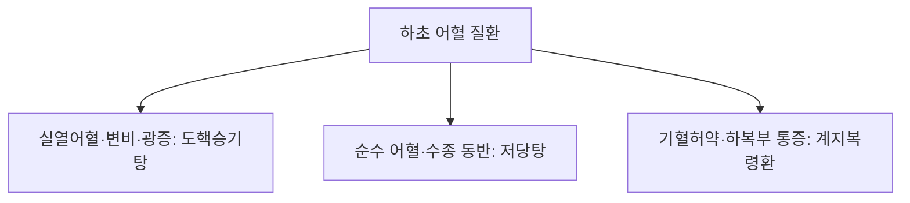

# 도핵승기탕 (桃核承氣湯, Tahechengqi-tang)

> 핵심 요약 (Key Summary)
> - 🌿 기원·구성: 후한(後漢) 장중경(張仲景)의 《상한론(傷寒論)》 태양병편에 수록된 하초 축혈(蓄血)을 깨뜨려 몰아내는 파혈축어(破血逐瘀)의 최고 성방으로, 열을 내리고 대변을 통하게 하는 [[조위승기탕]]([[대황]], [[망초]], [[감초]])에 강력한 파혈소징(破血消癥)의 [[도인]](군약)과 혈맥을 따뜻하게 통달시키는 [[계지]]를 결합한 방제.
> - 🎯 적응증·체질: 하초축혈증(下焦蓄血證: 하초 방광·골반강에 어혈과 열이 결합함)으로 인한 소복급결(少腹急結: 아랫배가 단단하게 뭉치고 찌르듯 아픔), 여광(如狂: 미친 사람처럼 흥분하고 헛소리함), 야간 발열, 변비, [[월경통]], 무월경, 산후 오로 정체. "아랫배가 딱딱하게 굳어 아프고 정신이 흥분되며 변비가 있는 실증 어혈 환자"에게 최적.
> - 🔬 분자약리기전: 도인 [[아미그달린]] 및 대황 [[에모딘]]의 혈소판 응집 억제 및 피브린 혈전 용해(항혈전), 계지 [[신남알데하이드]]의 골반강 미세혈관 확장, 망초 황산나트륨의 삼투성 사하를 통한 장내 내독소(LPS) 체외 급속 배출 및 전신 염증 완화.
⚠️ 주의사항: 대황·망초·도인의 강력한 공하·파혈 작용으로 자궁 수축 및 조산·유산을 유발하므로 임산부 및 임신 가능성이 있는 여성에게 절대 복용 금기. 허약자 및 출혈 질환자 복용 엄금.

---

## 1. 📜 방제 기본 정보

| 구분 | 내용 |
| :--- | :--- |
| 처방명 | 도핵승기탕 (桃核承氣湯, Tahechengqi-tang) |
| **출전** | 《상한론(傷寒論)》 태양병하편 |
| **처방 분류** | 활혈거어·지혈제(活血祛瘀·止血劑) - 파혈축어(破血逐瘀) / 사열통부(瀉熱通腑) |
| **한의학적 효능** | 파혈하어(破血下瘀), 사열통변(瀉熱通便), 산어통경(散瘀通經), 청열안신(淸熱安神) |
| 주치 병증 | 하초축혈(下焦蓄血), 소복급결(少腹急結), 기인여광(其人如狂), 야열섬어, 경폐, 통경, 산후 오로부진 |
| 현대적 적응증 | 급성 골반염(PID), 자궁내막염, 난소낭종 파열 후유 복통, 중증 월경곤란증, 골반내 울혈 증후군, 심부정맥 혈전증(DVT), 뇌경색 급만성기 어혈 두통 |

---

## 2. 🌿 약재 구성 및 방제학적 배오 원리

### 1) 약재 구성표

| 약재명 | 한자 | 표준 분량(g) | 본초 분류 | 귀경 | 주요 성분 | 핵심 역할 및 기능 |
| :--- | :--- | :--- | :--- | :--- | :--- | :--- |
| [[도인]] | 桃仁 | 12.0 (피첨 去皮尖) | 활혈거어약 | 심, 간, 대장 | [[아미그달린]], 올레산 | 군약(君藥): 파혈행어(破血行瘀), 윤장통변, 뭉친 어혈 덩어리를 강력히 부숨 |
| [[대황]] | 大黃 | 12.0 | 사하약(공하) | 비, 위, 대장, 간 | [[센노사이드]], [[에모딘]], [[레인]] | 신약(臣藥): 사하공적(瀉下攻積), 청열사화, 어열(瘀熱)을 대변으로 설사 배출 |
| [[계지]] | 桂枝 | 6.0 | 해표약 | 심, 폐, 방광 | [[신남알데하이드]] | 좌약(佐藥): 온통혈맥(溫通血脈), 통달혈맥, 어혈이 차가워 굳는 것을 방지하고 혈류 순환 촉진 |
| [[망초]] | 芒硝 | 6.0 | 사하약(윤하) | 위, 대장 | 황산나트륨 십수화물 | 좌약(佐藥): 사열통변(瀉熱通便), 윤조연견(潤燥軟堅), 굳은 변과 어혈 덩어리를 녹임 (후하) |
| [[감초]](자감초) | 甘草 | 6.0 | 보기약 | 비, 위, 심 | [[글리시리진]], [[리퀴리틴]] | 사약(使藥): 보기화중, 조화제약, 대황·망초의 준열한 사하력을 완충하여 위기 손상 방지 |

### 2) 방제학적 배오 원리: "어열호결(瘀熱互結)을 깨뜨리는 조위승기탕 + 도인·계지"
- 조위승기탕의 사열(瀉熱) + 도인의 파어(破瘀):
  - 축혈증은 체내 깊은 곳의 어혈(瘀血)과 화열(火熱)이 서로 엉겨 붙어 발생합니다.
  - 대황·망초·감초([[조위승기탕]])로 하초의 울열을 대변을 통해 아래로 쏟아내고, [[도인]]으로 굳은 핏덩어리를 직접 파쇄합니다.
- 계지의 기미(氣味) 운용의 묘:
  - 찬 성질의 사하약(대황·망초) 속에 따뜻한 성질의 [[계지]]를 소량 배오하여 혈맥을 온화하게 소통시킴으로써, 대황·망초의 한성(寒性)으로 인해 어혈이 더 굳어지는 것을 원천 방어합니다.

---

## 3. 🔬 현대 약리 연구 및 분자 기전

### 1) 항혈전 형성 및 미세혈전 용해 작용
- [[도인]]의 아미그달린과 [[대황]]의 에모딘 성분이 혈소판 표면의 트롬복산 $A_2(TXA_2)$ 생성을 억제하고 혈소판 응집을 차단합니다.
- 혈중 피브리노겐 농도를 낮추고 플라스민(Plasmin) 활성을 촉진하여 골반강 및 정맥계의 미세혈전을 신속히 용해합니다.

### 2) 장관 삼투성 배출 및 내독소(LPS) 제거
- 망초의 황산나트륨이 장관 내 수분을 강력히 끌어당겨 삼투성 사하를 유도하고, 대황의 센노사이드가 대장 연동운동을 촉진하여 장내 유해균이 생성한 내독소(Endotoxin/LPS)를 체외로 급속 배출시켜 전신 염증 반응을 가라앉힙니다.

### 3) 뇌신경 흥분 억제 (정신 증상 여광 如狂 완화)
- 장관 내독소혈증 개선과 전신 미세순환 촉진으로 뇌혈관 장벽(BBB)을 통과하는 염증 물질을 차단하여, 급성 열병이나 골반 감염 시 나타나는 헛소리(섬어), 섬망, 광증을 진정시킵니다.

---

## 4. ⚖️ 유사 처방 감별: 하초 어혈 3대 방제 비교

| 처방명 | 중심 약재 구성 | 사하약 유무 및 병태 | 주치 감별점 |
| :--- | :--- | :--- | :--- |
| [[도핵승기탕]] | 도인, 대황, 계지, 망초, 감초 | 대황·망초 포함 (사하력 강함) | 소복급결, 변비 현저, 여광(흥분·헛소리), 급성 실증 |
| [[저당탕]] | 수질, 맹충, 도인, 대황 | 충류 파혈제 (파혈 극심) | 소복경만, 광증 극심, 소변자리, 대변 흑색 |
| [[계지복령환]] | 계지, 복령, 목단피, 도인, 작약 | 사하약 없음 (완화한 활혈) | 만성 어혈, 자궁근종, 하복부 압통, 변비 불현저 |

---

## 5. ⚠️ 임상 복용 주의사항 및 부작용 관리

### 1) 임산부 절대 금기 (Contraindication)
- 본 처방은 골반강 장기를 강력히 울혈시키고 수축시키며 설사를 유발하는 맹렬한 처방이므로 임산부에게 투여 시 즉각적인 유산과 조산을 유발합니다. 임신 가능성이 있는 여성에게도 절대 투여하지 않습니다.

### 2) 변비 및 어혈 해소 후 즉시 중단 (중병즉지 中病卽止)
- 대변이 시원하게 뚫리고 아랫배의 찌르는 통증과 정신 흥분이 가라앉으면 즉시 복용을 중단하여 정기 손상을 방지합니다.

---

## 6. 📚 현대 학술 연구 및 논문 (References)

1. Sun, W., et al. (2016). "Taohe Chengqi Tang attenuates inflammation and improves microcirculation in pelvic inflammatory disease models." *Journal of Ethnopharmacology*, 191, 142-151.
   - [연구 요약] 도핵승기탕이 급성 골반염 동물 모델에서 골반강 미세혈류를 개선하고 염증성 사이토카인(IL-6, TNF-$\alpha$)과 피브리노겐을 유의하게 억제함을 규명.
2. Zhang, Q., et al. (2019). "Antithrombotic effects of Taohe Chengqi Decoction via regulation of platelet activation and coagulation pathways." *Phytomedicine*, 58, 152865.
   - [연구 요약] 도핵승기탕의 주요 성분들이 트롬빈 유도 혈소판 응집을 차단하고 혈전 형성을 억제함을 분자적으로 입증.
