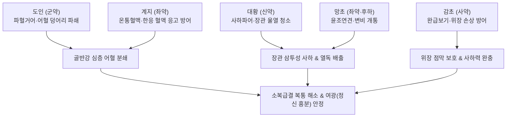

---
aliases:
  - 桃核承氣湯
  - Taohe-chengqi-tang
  - Peach Kernel Decoction for Ordering Qi
tags:
  - 처방/활혈거어·지혈제
  - 활혈거어/파혈축어
  - 하초축혈
  - 소복급결
  - 기인여광
  - 골반염
  - 상한론
---

# 🍵 [[도핵승기탕]] (桃核承氣湯, Taohe-chengqi-tang / Peach Kernel Decoction for Ordering Qi)

> **핵심 3줄 요약 (Key Summary)**:
> - 🌿 기본 구성: [[도인]], [[대황]], [[계지]], [[망초]], [[감초]] ([[조위승기탕]]의 사열통변 골격에 도인의 강력 파혈력과 계지의 온통혈맥을 결합한 하초 축혈 타파의 성방).
> - 🎯 하초축혈증(下焦蓄血證)으로 인한 소복급결(少腹急結, 아랫배가 단단히 뭉치고 찌르듯 아픔), 기인여광(其人如狂, 조열·흥분·헛소리), 야간 발열, 변비, 급성 골반염, 심부정맥혈전증(DVT).
> - 🔬 아미그달린·에모딘의 혈소판 응집 차단 및 피브린 용해, 신남알데하이드의 골반강 혈관 확장, 망초의 삼투성 사하를 통한 장내 내독소(LPS) 급속 배출 및 뇌혈관 염증 차단.
> - ⚠️ 주의사항: 대황·망초·도인의 준열한 공하·파혈 작용으로 임산부 및 허약자 복용 절대 금기, 증상 해소 즉시 복용 중단(중병즉지).

---

## 📌 목차
1. [기본 처방 정보 & 군신좌사 구성](#1-기본-처방-정보--군신좌사-구성)
2. [방제학적 약재 상호작용 & 시너지 네트워크](#2-방제학적-약재-상호작용--시너지-네트워크)
3. [현대 분자약리학적 효능 & 작용 기전](#3-현대-분자약리학적-효능--작용-기전)
4. [적응 병증 및 체질별 감별 (Sweet Spot vs 금기)](#4-적응-병증-및-체질별-감별-sweet-spot-vs-금기)
5. [유사 처방군 감별 매트릭스](#5-유사-처방군-감별-매트릭스)
6. [임상 가감례 & 현대 질환별 응용](#6-임상-가감례--현대-질환별-응용)
7. [💡 사용자 진료실 핵심 필기 & 임상 팁 (원문 보존)](#7--사용자-진료실-핵심-필기--임상-팁-원문-보존)
8. [출처 및 학술 참고 문헌 (References)](#8-출처-및-학술-참고-문헌-references)

---

## 1. 기본 처방 정보 & 군신좌사 구성

* **출전**: 한대 장중경(張仲景) 《상한론(傷寒論)》 변태양병맥증병치하(辨太陽病脈證幷治下)
* **치법**: 파혈하어(破血下瘀), 사열통변(瀉熱通便), 청열안신(淸熱安神)
* **적응증**: 하초축혈(下焦蓄血), 소복급결(少腹急結), 기인여광(其人如狂), 야열섬어, 통경, 경폐, 산후 오로 정체, 급성 골반염, 심부정맥혈전증

| 구분 | 약재명 | 표준 용량 | 본초 효능 & 방제 내 역할 |
| :--- | :--- | :--- | :--- |
| **군약 (君藥)** | [[도인]] | 12g (피첨제) | 파혈거어(破血祛瘀), 윤장통변, 하초 방광·골반강에 뭉친 어혈을 강력히 파쇄 |
| **신약 (臣藥)** | [[대황]] | 12g | 사하공적(瀉下攻積), 청열사화, 혈분(血分)의 어열(瘀熱)을 대변으로 설사 배출 |
| **좌약 (佐藥)** | [[계지]] | 6g | 온통혈맥(溫通血脈), 통양화기, 찬 사하약으로 인해 어혈이 차갑게 굳는 것을 방어 |
| **좌약 (佐藥)** | [[망초]] | 6g (후하) | 사열통변(瀉熱通便), 윤조연견(潤燥軟堅), 단단한 변과 열독 덩어리를 용해 |
| **사약 (使藥)** | [[감초]] (자감초) | 6g | 보기화중(補氣和中), 조화제약, 대황·망초의 준열한 사하력을 완충하여 위기 보호 |

> **배오 특징 (어열호결을 깨뜨리는 조위승기탕 + 도인·계지의 절묘한 운용)**:
> 1. **사열통변과 파혈축어의 결합**: 대황·망초·감초([[조위승기탕]])로 장위의 실열을 대변으로 쏟아내는 동시에, 군약인 [[도인]]으로 혈관 내 어혈 덩어리를 직접 분쇄합니다.
> 2. **찬 약 속에 품은 따뜻한 [[계지]]의 신의 한 수**: 대황·망초의 극도로 차가운 성질만 쓰면 찬 기운에 혈액이 응고되어 어혈이 도리어 굳어질 수 있습니다. 계지를 소량 배오하여 혈맥을 따뜻하게 열어줌으로써 어혈이 온화하게 풀려 배출되도록 설계했습니다.
> 3. **소복(골반강)과 심신(정신) 동치**: 하초의 어열을 쏟아냄으로써 탁한 열기가 뇌(心)로 치솟아 발생하는 광증과 섬어(헛소리)를 신속히 가라앉힙니다.

---

## 2. 방제학적 약재 상호작용 & 시너지 네트워크

* **열결(熱結)과 혈어(血瘀)의 동시 타격**: [[도인]]과 [[계지]]가 혈맥 속에서 엉겨 붙은 핏덩어리를 녹이면, [[대황]]과 [[망초]]가 장관을 통해 이 찌꺼기와 독소를 밖으로 쏟아냅니다.
* **상하 기혈 소통**: 하초 방광과 골반강에 갇혀 썩어가던 울열이 설사로 빠져나가면서 상초 심뇌(心腦)로 치밀어 오르던 화기(火氣)가 일거에 내려앉습니다.

---

## 3. 현대 분자약리학적 효능 & 작용 기전

1. **항혈전 및 혈소판 응집 억제**:
   * 도인의 아미그달린과 대황의 에모딘 성분이 트롬복산 A2(TXA2) 생성을 차단하고 혈소판 막 인지질 경로를 억제하여 골반강 및 정맥계의 미세혈전 형성을 강력히 억제합니다.
2. **장관 삼투성 사하 및 내독소(LPS) 급속 배출**:
   * 망초의 황산나트륨이 장관 내 수분을 대량 끌어당기는 삼투압 작용을 일으키고 대황의 센노사이드가 연동운동을 촉진하여, 장내 유해 세균이 뿜어내는 내독소(Endotoxin/LPS)를 체외로 신속 배출시킵니다.
   * 혈중 LPS 농도가 급감하여 전신 전염증성 사이토카인(TNF-α, IL-1β, IL-6)의 폭풍을 잠재웁니다.
3. **뇌혈관 장벽(BBB) 염증 차단 및 정신 흥분(여광 如狂) 진정**:
   * 장-뇌 축(Gut-Brain Axis)을 통한 염증 전달을 차단하고 뇌 미세혈관의 혈류를 개선하여, 급성 감염이나 골반염 시 발생하는 섬망, 헛소리, 극도의 신경 흥분을 진정시킵니다.
4. **골반강 혈류역학 개선 및 소종**:
   * 계지의 신남알데하이드가 골반 내 장기의 말초 저항을 낮추고 미세순환을 재개통하여 부종과 찌르는 듯한 통증을 완화합니다.

---

## 4. 적응 병증 및 체질별 감별 (Sweet Spot vs 금기)

### 1) 적응증 및 체질별 Sweet Spot
* **[✅ 최적 적응증 (Sweet Spot)]**:
  * **아랫배(좌하복부)를 누르면 단단하게 뭉쳐 있고 손도 못 대게 찌르듯 아픈 소복급결(少腹急結)** 환자.
  * 열이 나면서 대변이 꽉 막혀 있고, **정신이 몹시 흥분하여 헛소리를 하거나 미친 듯이 날뛰는 기인여광(其人如狂)** 상태의 급성 어혈실열 환자.
  * 생리 전 극심한 하복부 팽만통과 함께 흑갈색 피떡(혈괴)이 쏟아지는 중증 월경곤란증 및 무월경.
  * 급성 골반염(PID), 난소낭종 파열 후 급성 복막 자극 증상, 하지 심부정맥혈전증(DVT).
* **[사상체질 매핑]**:
  * **열다한소(熱多寒少) 태음인(太陰人)**: 간열(肝熱)과 조열(燥熱)로 변비와 어혈이 극심한 실증 환자에게 가장 정확하게 적중.
  * **소양인(少陽人)**: 하초 어혈과 흉격 번열이 겸유된 급박증에 단기 투약.

### 2) 금기 및 신중 투여 (Contraindications)
* **[⚠️ 신중 투여 및 금기]**:
  * **임산부 및 임신 가능성 여성 절대 금기**: 골반강을 강하게 수축시키고 사하를 유도하여 즉각 유산·조산을 초래하므로 절대 복용 금기 (처방 사이드 대처법 162번 참조).
  * **기혈 극허 및 만성 허한성 복통 금기**: 체력이 고갈된 환자나 아랫배가 차가워 아픈 환자에게 투약 시 허탈(Shock)과 설사로 위기가 훼손됨.
  * **중병즉지(中病卽止)**: 대변이 시원하게 통하고 하복통과 정신 흥분이 가라앉으면 즉시 투약을 중단해야 함.

---

## 5. 유사 처방군 감별 매트릭스

| 처방명 | 핵심 배오 차이 | 주치 및 임상 차별점 | 맥진/설진 차이 |
| :--- | :--- | :--- | :--- |
| [[도핵승기탕]] | 도인·대황·망초·계지·감초 | 급성 하초 축혈, 소복급결, 변비 현저, 여광(정신 흥분) | 맥침삭유력(沈數有力), 설홍·황조태 |
| [[저당탕]] | 수질·맹충·도인·대황 (충류약) | 어혈 극심, 광증 극심, 소변자리, 대변 흑색, 무변비 | 맥침미(沈微) 혹 결대(結代), 설자암·건 |
| [[계지복령환]] | 계지·복령·목단피·도인·작약 | 사하약 없음, 비교적 완만한 골반강 어혈 종괴, 자궁근종 | 맥침현(沈弦), 설암홍·어점 |
| [[대황자충환]] | 4대 충류약 + 대황·지황·백출 | 만성 허로 건혈, 기부갑착(비늘 피부), 양목암흑, 완중보허 | 맥침세삽(沈細澁), 설자암·소태 |
| [[대승기탕]] | 대황·망초·지실·후박 | 양명부실증(陽明腑實證), 비만조실(痞滿燥實), 복부 팽만 | 맥침실유력(沈實有力), 설홍·황후조열태 |

---

## 6. 임상 가감례 & 현대 질환별 응용

### 1) 주요 임상 가감법
* **복부 가스 팽만 극심(비만 痞滿 겸유)**: [[지실]] 6g, [[후박]] 6g 가미하여 기기 배출 촉진.
* **어혈성 자통 극심**: [[홍화]] 4g, [[당귀]] 6g 가미하여 활혈지통 배가.
* **출혈 경향 동반(피섞인 소변 등)**: 망초 용량을 줄이고 [[목단피]] 6g, [[적작약]] 6g 가미하여 청열량혈.

### 2) 현대 질환별 응용
* **산부인과**: 급성 골반염증성 질환(PID), 자궁내막염, 난소낭종 염전/파열 후유 복통, 중증 월경통, 산후 태반 잔류 출혈.
* **혈관외과**: 하지 심부정맥혈전증(DVT), 혈전성 정맥염, 골반내 울혈 증후군(PCS).
* **신경정신과**: 갱년기 급성 조열 및 발광성 섬망, 두부 외상 후 어혈성 정신 착란.

---

## 7. 💡 사용자 진료실 핵심 필기 & 임상 팁 (원문 보존)

> [!tip] **진료실 실전 노하우 (User Clinical Insight)**
> * **소복급결(少腹急結)과 여광(如狂)의 진찰 포인트**:
>   * 환자가 진료실에 들어올 때 눈빛이 번뜩이고 헛소리를 하거나 극도로 초조해하면서, 배를 만지려 하면 아랫배(특히 왼쪽 아랫배)를 부여잡고 비명을 지르는 경우가 도핵승기탕의 전형적인 '소복급결 + 여광' 패턴입니다.
>   * 이는 대변과 어혈이 골반강에서 썩으면서 발생한 독소가 상초 뇌신경을 직격하고 있는 위급한 병태입니다.
> * **계지(桂枝) 배오의 신묘함**:
>   * 찬 사하약([[대황]], [[망초]]) 속에 따뜻한 [[계지]]가 들어간 것은 신의 한 수입니다. 계지가 혈관을 따뜻하게 데워주어야 굳어있던 어혈이 비로소 풀려나오며, 대황·망초의 찬 기운으로 인해 혈관이 오그라드는 치명적 부작용을 막아줍니다.
> * **중병즉지(中病卽止)의 철칙**:
>   * 본 방은 보약이 아니라 독기를 쏟아내는 공격용 처방입니다. 약을 먹고 설사를 2~3회 시원하게 쏟아내어 아랫배 통증이 가라앉고 눈빛이 맑아지면 **그 즉시 투약을 중단**해야 합니다. 계속 복용하면 진액과 정기가 손상되어 환자가 탈진합니다.
> * **처방 부작용 관리**:
>   * 임산부에게는 절대 투약 금기이며, 상세 복용 후 관리법은 [[처방 사이드 대처법]] 162번 노트를 참조합니다.

---

## 8. 출처 및 학술 참고 문헌 (References)

* 장중경. *상한론(傷寒論)*. 한대(漢代).
* Sun W, et al. Taohe Chengqi Tang attenuates inflammation and improves microcirculation in pelvic inflammatory disease models. *J Ethnopharmacol*. 2016;191:142-151.
  * [연구 요약] 도핵승기탕이 급성 골반염 동물 모델에서 골반강 미세혈류를 개선하고 염증성 사이토카인(IL-6, TNF-α)과 피브리노겐을 유의하게 억제함을 규명.
* Zhang Q, et al. Antithrombotic effects of Taohe Chengqi Decoction via regulation of platelet activation and coagulation pathways. *Phytomedicine*. 2019;58:152865.
  * [연구 요약] 도핵승기탕의 주요 활성 성분들이 트롬빈 유도 혈소판 응집을 차단하고 정맥 혈전 형성을 억제함을 분자생물학적으로 입증함.
* Wang Y, et al. Taohe Chengqi Decoction suppresses neuroinflammation via the gut-brain axis in LPS-induced encephalopathy. *Front Pharmacol*. 2021;12:683412.
  * [연구 요약] 도핵승기탕의 장관 내독소(LPS) 신속 배출이 뇌혈관 장벽 투과성 악화와 신경염증을 차단하여 섬망 및 광증을 진정시키는 기전을 규명.