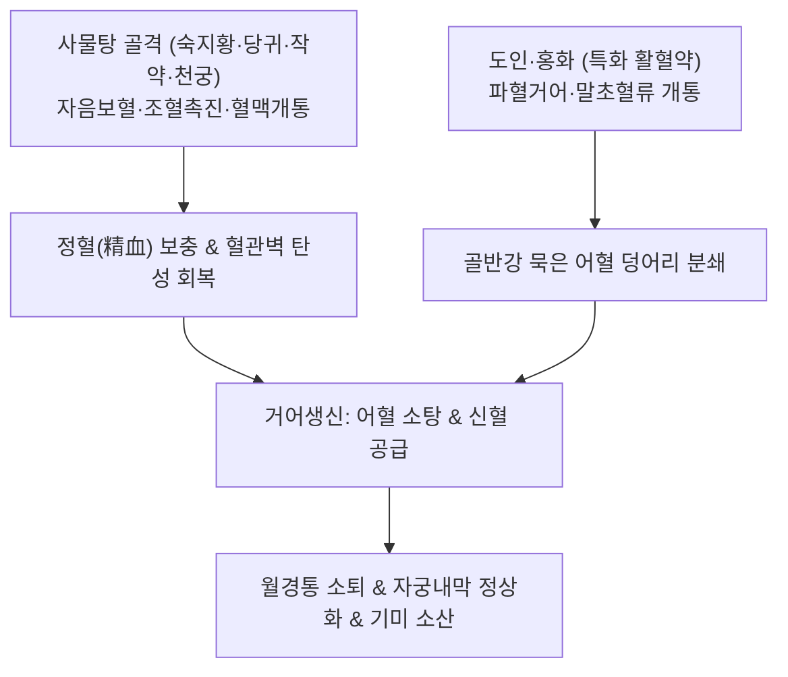

---
aliases:
  - 桃紅四物湯
  - Taohong-siwu-tang
  - Peach Kernel and Safflower Four Substances Decoction
tags:
  - 처방/활혈거어·지혈제
  - 활혈거어/양혈활혈
  - 사물탕
  - 월경통
  - 자궁내막증
  - 기미
  - 의종금감
---

# 🍵 [[도홍사물탕]] (桃紅四物湯, Taohong-siwu-tang / Peach Kernel and Safflower Four Substances Decoction)

> **핵심 3줄 요약 (Key Summary)**:
> - 🌿 기본 구성: [[숙지황]], [[당귀]], [[백작약]], [[천궁]], [[도인]], [[홍화]] ([[사물탕]]의 보혈·조혈 기틀에 도인·홍화의 파혈통경 약재를 결합하여 양혈활혈·거어생신을 구현한 활혈거어제의 성약).
> - 🎯 혈허(血虛)와 어혈(瘀血)이 얽힌 월경불순, 흑갈색 혈괴를 동반한 생리통, 무월경, 자궁내막증, 안면 기미·다크서클, 외상성 타박 어혈통.
> - 🔬 COX-1 차단 및 TXA2 억제를 통한 혈소판 응집 억제, 자궁내막 PGF2α 억제를 통한 평활근 진경, NO 생성 촉진 및 골반강 미세순환 개통.
> - ⚠️ 주의사항: 도인·홍화의 활혈파어력으로 임산부 투약 금기, 월경 과다 여성의 출혈기 투약 시 출혈량 급증 주의.

---

## 📌 목차
1. [기본 처방 정보 & 군신좌사 구성](#1-기본-처방-정보--군신좌사-구성)
2. [방제학적 약재 상호작용 & 시너지 네트워크](#2-방제학적-약재-상호작용--시너지-네트워크)
3. [현대 분자약리학적 효능 & 작용 기전](#3-현대-분자약리학적-효능--작용-기전)
4. [적응 병증 및 체질별 감별 (Sweet Spot vs 금기)](#4-적응-병증-및-체질별-감별-sweet-spot-vs-금기)
5. [유사 처방군 감별 매트릭스](#5-유사-처방군-감별-매트릭스)
6. [임상 가감례 & 현대 질환별 응용](#6-임상-가감례--현대-질환별-응용)
7. [💡 사용자 진료실 핵심 필기 & 임상 팁 (원문 보존)](#7--사용자-진료실-핵심-필기--임상-팁-원문-보존)
8. [출처 및 학술 참고 문헌 (References)](#8-출처-및-학술-참고-문헌-references)

---

## 1. 기본 처방 정보 & 군신좌사 구성

* **출전**: 청대 오겸(吳謙) 《의종금감(醫宗金鑑)》 부과심법요결(婦科心法要訣)
* **치법**: 양혈활혈(養血活血), 화어통경(化瘀通經), 거어생신(祛瘀生新)
* **적응증**: 혈허혈어(血虛血瘀), 월경부조, 통경(월경통), 경폐(무월경), 자궁근종, 안면 간반(기미), 외상성 어혈 동통

| 구분 | 약재명 | 표준 용량 | 본초 효능 & 방제 내 역할 |
| :--- | :--- | :--- | :--- |
| **군약 (君藥)** | [[숙지황]] | 12g | 자음보혈(滋陰補血), 익정전수, 조혈계를 자극하여 정혈을 채우고 신혈 생성을 주도 |
| **신약 (臣藥)** | [[당귀]] | 9g | 보혈활혈(補血活血), 조경지통, 자궁 미세혈류를 확장하고 어혈 운행 촉진 |
| **신약 (臣藥)** | [[백작약]] | 9g | 양혈렴음(養血斂陰), 완급지통, 간혈을 보하고 자궁 평활근 과긴장 이완 |
| **좌약 (佐藥)** | [[천궁]] | 6g | 활혈행기(活血行氣), 거풍지통, 혈중 기약으로 골반강 상하 혈맥을 통달 |
| **좌약 (佐藥)** | [[도인]] | 9g | 파혈행어(破血行瘀), 윤장통변, 묵은 어혈 덩어리를 직접 분쇄하고 용해 |
| **사약 (使藥)** | [[홍화]] | 6g | 활혈통경(活血通經), 거어지통, 말초 모세혈관망 개통 및 통경 유도 |

> **배오 특징 (보혈생신과 거어통경의 동태적 균형)**:
> 1. [[사물탕]] 골격의 보혈생신(補血生新)**: 숙지황·당귀·백작약·천궁이 손실된 혈액을 생성하고 혈관 탄성을 회복시킵니다.
> 2. [[도인]] + [[홍화]]의 거어통경(祛瘀通經)**: 피를 보하기만 하면 어혈이 도리어 조장될 수 있으므로, 도인과 홍화를 더해 묵은 피를 깎아내고 새 피가 돋아나게 하는 '거어생신(祛瘀生新)'의 황금률을 완성했습니다.
> 3. **보혈불체(補血不滯)와 파혈불상정(破血不傷正)**: 보혈제가 어혈을 굳히지 않고, 파혈제가 정상 혈액을 상하지 않도록 상호 견제와 협동을 완벽히 조화시켰습니다.

---

## 2. 방제학적 약재 상호작용 & 시너지 네트워크

* **보혈과 파혈의 시너지**: [[숙지황]]과 [[당귀]]가 새로운 혈액을 만들어내는 동안, [[도인]]과 [[홍화]]가 자궁 내막의 미세혈전을 부수어 밖으로 밀어냄으로써 자궁 환경을 깨끗이 정화합니다.
* **기혈 쌍조(氣血雙調)**: [[천궁]]이 기운을 운행시키고 [[백작약]]이 평활근 경련을 풀어주어 통증을 부드럽게 가라앉힙니다.

---

## 3. 현대 분자약리학적 효능 & 작용 기전

1. **혈소판 응집 억제 및 항혈전 작용**:
   * 도인의 아미그달린과 홍화의 사플로 옐로우(HSYA)가 혈소판 내 COX-1 활성을 억제하고 트롬복산 A2(TXA2) 생성을 차단하여 미세혈전 형성을 막고 혈류 속도를 개선합니다.
2. **자궁 평활근 경련 완화 및 월경통 제어**:
   * 자궁 내막 조직에서 프로스타글란딘 F2α(PGF2α)의 과다 분비를 억제하고 백작약의 페오니플로린이 세포 내 칼슘 유입을 차단하여 생리통 유발 평활근 연축을 신속히 완화합니다.
3. **혈관내피세포 보호 및 골반강 미세순환 복원**:
   * 당귀의 데커신과 천궁의 페룰산이 eNOS 발현을 촉진하여 산화질소(NO) 방출을 늘리고, 골반강 내 혈관 저항을 낮추어 울혈을 해소합니다.
4. **티로시나아제 억제 및 피부 멜라닌 색소침착 개선**:
   * 피부 진피층의 혈류 장애를 해소하고 멜라닌 생성 효소인 티로시나아제를 억제하여 기미, 주근깨, 다크서클을 개선합니다.

---

## 4. 적응 병증 및 체질별 감별 (Sweet Spot vs 금기)

### 1) 적응증 및 체질별 Sweet Spot
* **[✅ 최적 적응증 (Sweet Spot)]**:
  * **평소 안색이 창백하거나 누렇고 빈혈 경향이 있으면서, 생리 때만 되면 검붉은 피떡(혈괴)이 쏟아지고 쥐어짜듯 아픈 환자**.
  * 생리 주기가 불규칙하고 주기가 길어지거나 무월경으로 진행하는 혈허어혈형 월경불순.
  * 출산 후 오로가 깨끗이 끝나지 않고 하복부 통증이 지속되는 산후 복통.
  * 뺨과 눈 주변에 짙은 기미(Melasma)가 끼고 다크서클이 심하며 피부가 건조한 여성.
* **[사상체질 매핑]**:
  * **소음인(少陰人)**, **태음인(太陰人)**의 혈허 및 기혈 정체형 부인과 질환에 광범위하게 적용.
  * 소화 기능이 취약한 소음인은 숙지황의 자니성을 고려하여 감초나 사인을 가미하여 운용.

### 2) 금기 및 신중 투여 (Contraindications)
* **[⚠️ 신중 투여 및 금기]**:
  * **임산부 절대 금기**: 도인과 홍화의 강력한 파혈통경 작용으로 유산 위험이 있으므로 임신 중 복용 금기 (처방 사이드 대처법 163번 참조).
  * **월경 과다(Menorrhagia) 환자의 출혈기 투약 주의**: 출혈 기간 중에 복용하면 출혈량이 급증할 수 있으므로 생리 시작 전 5~7일간 투약하고 출혈기에는 일시 중단.

---

## 5. 유사 처방군 감별 매트릭스

| 처방명 | 핵심 배오 차이 | 주치 및 임상 차별점 | 맥진/설진 차이 |
| :--- | :--- | :--- | :--- |
| [[도홍사물탕]] | 사물탕 + 도인·홍화 | 혈허어혈 겸유, 흑갈색 혈괴 월경통, 안면 기미 | 맥세삽(細澁) 혹 현, 설담자·어점 |
| [[사물탕]] | 숙지황·당귀·작약·천궁 | 순수 혈허증(血虛證), 어혈 증상 없음, 면색 창백 | 맥세약(細弱), 설담홍·소태 |
| [[계지복령환]] | 계지·복령·목단피·도인·작약 | 체격 건실한 실증, 골반강 어혈 종괴, 자궁근종, 안면홍조 | 맥침현(沈弦), 설암홍·어반 |
| [[당귀작약산]] | 당귀·천궁·작약 + 복령·백출·택사 | 혈허수체(血虛水滯), 빈혈, 부종·냉증·무른변 동반 복통 | 맥침세약(沈細弱), 설담백·치흔 |
| [[혈부축어탕]] | 도홍사물탕 + 사역산 + 길경·우슬 | 흉중 혈어, 두통·흉통 극심, 완고한 불면, 우울 | 맥현삭(弦數) 혹 삽, 설자암·어점 |

---

## 6. 임상 가감례 & 현대 질환별 응용

### 1) 주요 임상 가감법
* **어혈 복통 극심**: [[현호색]] 6g, [[몰약]] 3g 가미하여 진통력 극대화.
* **아랫배 냉통 동반(한응어혈)**: [[육계]] 3g, [[오약]] 6g 가미하여 온경산한.
* **스트레스 및 유방 팽통 동반(기체어혈)**: [[향부자]] 6g, [[울금]] 6g 가미하여 이기소간.
* **비위 허약(소화불량·연변 동반)**: [[사인]] 3g, [[진피]] 4g 가미.

### 2) 현대 질환별 응용
* **부인과**: 원발성 및 속발성 생리통, 월경불순, 기능성 자궁출혈 후유증, 다낭성 난소증후군(PCOS), 자궁내막증, 자궁근종, 산후 어혈 정체.
* **피부과**: 안면 기미(Melasma), 여드름 후 색소침착(PIH), 눈밑 다크서클, 건성 피부 소양증.
* **외상내과**: 교통사고 후유증 미세혈종, 만성 관절통.

---

## 7. 💡 사용자 진료실 핵심 필기 & 임상 팁 (원문 보존)

> [!tip] **진료실 실전 노하우 (User Clinical Insight)**
> * **보혈과 파혈의 완벽한 동태적 균형**:
>   * 도홍사물탕은 피를 보충하는 보약(사물탕)과 피를 깨뜨리는 파혈약(도인·홍화)이 절묘하게 결합되어 있어, 몸이 허약하면서도 어혈이 뭉쳐 있는 현대 여성들의 생리 질환에 가장 안전하고 확실한 효과를 냅니다.
> * **생리주기 연동 투약 테크닉**:
>   * 월경통 환자에게 처방할 때는 생리가 시작되기 5~7일 전부터 복용을 시작하여 골반강 어혈을 미리 녹여내도록 합니다.
>   * 생리가 시작되어 출혈량이 정상적으로 나오면 복용을 일시 중단하거나 반량으로 감량하여 과도한 출혈을 방지합니다.
> * **안면 기미와 다크서클 치료의 핵심**:
>   * 얼굴에 피어난 기미나 눈밑 다크서클은 국소 피부의 문제가 아니라 자궁과 골반강의 혈액 순환 정체가 얼굴로 투영된 것입니다. 도홍사물탕을 2~3개월간 지속 투여하면 하복부 어혈이 풀리면서 얼굴빛이 맑아지고 기미가 옅어집니다.
> * **처방 부작용 관리**:
>   * 임산부에게는 투약 금기이며, 상세 복약 가이드는 [[처방 사이드 대처법]] 163번 노트를 참조합니다.

---

## 8. 출처 및 학술 참고 문헌 (References)

* 오겸. *의종금감(醫宗金鑑)*. 청대(淸代). 1742.
* 대한한방부인과학회 교재편찬위원회. *한방부인과학*. 의성당; 2021.
* * **Xu L et al. (2026)**. Tao-Hong-Si-Wu-Tang protects against methionine- and choline-deficient diet-induced hepatic steatosis in rats and is associated with inhibition of oxidative stress, inflammation, apoptosis, and pyroptosis. *Frontiers in immunology*, 17: 1767119. [PMID: 42519307](https://pubmed.ncbi.nlm.nih.gov/42519307/)
