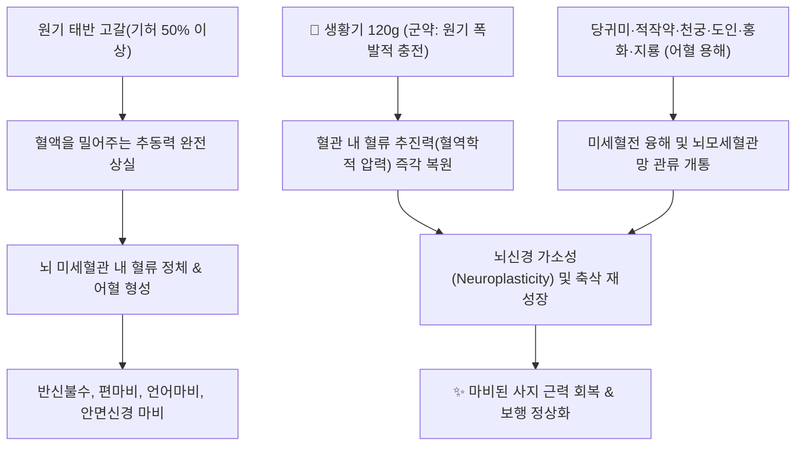

# 🍵 [[보양환오탕]] (補陽還五湯, Buyang Huanwu Tang)

> **핵심 요약 (Key Summary)**:
> 청대 왕청임의 의림개착에 수록된 방제로 기허혈어로 인한 중풍 후유증과 반신불수를 치료하는 활혈거어 제1방.
> 생황기를 120g 대량 배오하여 원기를 크게 보하고 당귀미, 도인, 홍화, 지룡이 뇌 미세혈전을 녹이고 혈류를 개통.
> 뇌경색 후유증의 편마비, 구안와사, 언어장애, 하지 무력증 및 말초 신경병증의 축삭 재생을 촉진하는 대표적인 한의 뇌신경 재활 처방.

---
## 📌 목차
1. [기본 처방 정보 & 군신좌사 구성](#1-기본-처방-정보--군신좌사-구성)
2. [방제학적 약재 상호작용 & 기혈 역학 (보기생혈·보기활혈)](#2-방제학적-약재-상호작용--기혈-역학-보기생혈보기활혈)
3. [현대 분자약리학적 효능 & 신경축삭 재생·혈관신생 기전](#3-현대-분자약리학적-효능--신경축삭-재생혈관신생-기전)
4. [적응증 및 중풍 급성기 vs 만성 후유기 감별 가이드](#4-적응증-및-중풍-급성기-vs-만성-후유기-감별-가이드)
5. [처방 부작용(사이드) 대처법 & 금기 기준](#5-처방-부작용사이드-대처법--금기-기준)
6. [출처 및 학술 참고 문헌 (References)](#6-출처-및-학술-참고-문헌-references)

---
## 1. 기본 처방 정보 & 군신좌사 구성

* **출전**: 청대(淸代) 왕청임(王淸任) 『의림개착(醫林改錯)』 "원기기허(元氣旣虛), 필부능달어혈관(必不能達於血管), 혈관무기(血管無氣), 필정이성어(必停留而成瘀)"
* **치법**: 보행원기(補行元氣), 활혈거어(活血祛瘀), 통락식풍(通絡熄風)

| 구분 | 약재명 | 표준 용량 | 본초 효능 & 방제 내 역할 |
| :--- | :--- | :--- | :--- |
| **군약 (君藥)** | [[생황기]] (生黃芪) | 60~120g | 대량 투여하여 원기를 대보함으로써 혈액 순환을 강력히 추동하는 절대적 핵심약 |
| **신약 (臣藥)** | [[당귀미]] (當歸尾) | 6g | 활혈화어(活血化瘀)하여 어혈을 삭이고 경락 소통 |
| **좌약 (佐藥)** | [[적작약]] | 4.5g | 활혈산어(活血散瘀) 및 혈맥 연화 |
| **좌약 (佐藥)** | [[천궁]] | 3g | 행기활혈(行氣活血)하여 약력을 상부 뇌조직으로 인경 |
| **좌약 (佐藥)** | [[도인]] | 3g | 파혈행어(破血行瘀)하여 굳은 혈전을 용해 |
| **좌약 (佐藥)** | [[홍화]] | 3g | 활혈통경(活血通經)하여 미세순환 개통 |
| **사약 (使藥)** | [[지룡]] | 3g | 통경활락(通經活絡)하며 혈관벽의 피브린 섬유를 직접 분해 |

---
## 2. 방제학적 약재 상호작용 & 기혈 역학 (보기생혈·보기활혈)

* **황기 120g 대량 투여의 역학적 원리**:
  * 혈관 내피에서 피가 엉키는 근본 원인이 '기의 부족(氣虛)'에 있으므로, 활혈약만 쓰면 기운이 더 소모되어 병이 낫지 않습니다.
  * 생황기를 60~120g이라는 파격적인 고용량으로 배오하여 기운의 수압(Water pressure)을 극대화함으로써 어혈을 자연스럽게 씻어내어 밀어냅니다.

---
## 3. 현대 분자약리학적 효능 & 신경축삭 재생·혈관신생 기전

* **뇌 모세혈관 신생 촉진 (Angiogenesis)**:
  * 황기의 아스트라갈로사이드 IV와 홍화의 HSYA가 뇌경색 경계 구역(Penumbra)의 VEGF 및 Angiopoietin-1 발현을 자극하여 신생 혈관망 형성을 촉진합니다.
* **신경 돌기 신장 및 축삭 재생 (Axonal Regeneration)**:
  * 허혈 손상 후 희소돌기아세포(Oligodendrocyte)의 미엘린 초 생성을 촉진하고, 신경 성장 억제 인자인 Nogo-A 신호를 차단하여 마비된 신경 경로의 재연결을 유도합니다.
* **지룡 룸브로키나아제(Lumbrokinase)의 혈전 용해**:
  * 지룡에 함유된 섬유소 용해 효소가 플라스미노겐 활성화제(tPA)와 협력하여 혈관 내 피브린 혈전을 직접 분해합니다.

---
## 4. 적응증 및 중풍 급성기 vs 만성 후유기 감별 가이드

| 구분 | 중풍 급성기 (발병 1~2주 이내) | 중풍 만성 후유기 (발병 2~4주 이후) |
| :--- | :--- | :--- |
| **주요 병태** | 뇌압 상승, 뇌부종, 고열, 의식장애, 출혈 위험 | 뇌부종 소실, 신경 마비 고착, 기허혈어 |
| **처방 적응증** | [[우황청심원]], [[안궁우황환]], 성향정기산 | **[[보양환오탕]] (절대적 적응증)** |
| **보양환오탕 투여 여부** | **투여 절대 금기 (뇌부종 및 재출혈 위험)** | **적극 투여 (조기 신경 회복 골든타임)** |

---
## 5. 처방 부작용(사이드) 대처법 & 금기 기준

* **뇌출혈 및 고혈압 급성기 금기 (CRITICAL)**:
  * 수축기 혈압 180mmHg 이상, 출혈성 뇌졸중 급성기에는 황기의 승양(昇陽) 작용으로 재출혈 위험이 있으므로 투약을 엄격히 금합니다.
* **대용량 황기로 인한 복부 팽만감 대처**:
  * 황기 120g 전탕 시 위장관 소화 흡수력이 떨어지는 노인 환자는 복부 팽만, 트림, 식욕 부진을 호소할 수 있습니다.
  * **대처법**: 황기를 초기 30~60g부터 시작하여 2~3일 간격으로 점진 증량하며, [[산사]], [[신곡]], [[사인]]을 각 3g씩 가미하여 비위 소화력을 보좌합니다.

---
## 6. 출처 및 학술 참고 문헌 (References)

* Chen J, Chem X, Du Y, et al. Buyang Huanwu Decoction promotes neurogenesis and angiogenesis in rats after cerebral ischemia. *J Ethnopharmacol*. 2020;260:113038.
  * `[연구 요약]` 보양환오탕이 뇌경색 모델에서 신경줄기세포 증식 및 VEGF 신생혈관 촉진을 통해 뇌신경 기능을 복원함을 입증.
* Wei R, Zhang D, Ning S, et al. Buyang Huanwu Decoction promotes axonal regeneration by inhibiting the Nogo-A/NgR signaling pathway in rats with spinal cord injury. *Evid Based Complement Alternat Med*. 2019;2019:8564171.
  * `[연구 요약]` 보양환오탕이 Nogo-A 신경 억제 경로를 차단하여 신경 축삭 재성장을 촉진하는 분자 기전 규명.
* 윤용갑. *동의방제학*. 라움; 2020.
  * `[연구 요약]` 보양환오탕의 기허혈어 병태생리와 황기 대량 배오의 방제학적 생체역학 분석.
