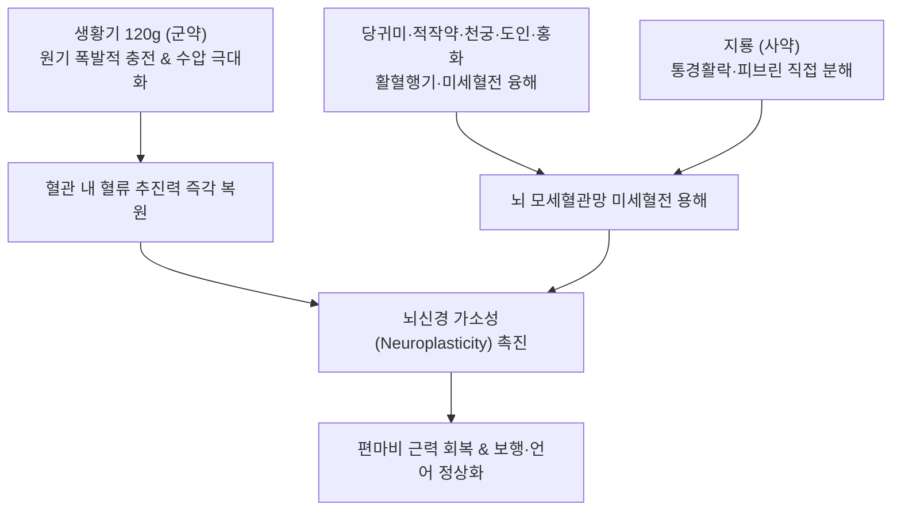

---
aliases:
  - 補陽還五湯
  - Buyang-huanwu-tang
  - Decoction for Invigorating Yang and Recuperating the Depleted Five Parts
tags:
  - 처방/활혈거어·지혈제
  - 활혈거어/보기활혈
  - 중풍후유증
  - 반신불수
  - 뇌경색재활
  - 황기120g
  - 의림개착
---

# 🍵 [[보양환오탕]] (補陽還五湯, Buyang-huanwu-tang / Decoction for Invigorating Yang and Recuperating the Depleted Five Parts)

> **핵심 3줄 요약 (Key Summary)**:
> - 🌿 기본 구성: [[생황기]](60~120g), [[당귀미]], [[적작약]], [[천궁]], [[도인]], [[홍화]], [[지룡]] (생황기를 120g 파격적으로 대량 배오하여 원기를 폭발적으로 충전하고 당귀미·도인·홍화·지룡으로 뇌혈관 어혈을 타파하는 보기활혈 제1방).
> - 🎯 기허혈어(氣虛血瘀)로 인한 중풍 만성 후유증, 반신불수(편마비), 구안와사, 언어 마비, 하지 무력증, 뇌경색 후유증의 신경 재활, 말초신경병증.
> - 🔬 VEGF 발현 및 뇌경색 페넘브라(Penumbra) 영역 미세혈관 신생 촉진, Nogo-A 억제를 통한 신경 축삭(Axon) 재생, 지룡 룸브로키나아제의 피브린 혈전 직접 분해.
> - ⚠️ 주의사항: 뇌출혈 급성기(1~2주 이내) 및 고혈압(180mmHg 이상) 급성기 승양 재출혈 위험으로 투약 절대 금기.

---

## 📌 목차
1. [기본 처방 정보 & 군신좌사 구성](#1-기본-처방-정보--군신좌사-구성)
2. [방제학적 약재 상호작용 & 시너지 네트워크](#2-방제학적-약재-상호작용--시너지-네트워크)
3. [현대 분자약리학적 효능 & 작용 기전](#3-현대-분자약리학적-효능--작용-기전)
4. [적응 병증 및 체질별 감별 (Sweet Spot vs 금기)](#4-적응-병증-및-체질별-감별-sweet-spot-vs-금기)
5. [유사 처방군 감별 매트릭스](#5-유사-처방군-감별-매트릭스)
6. [임상 가감례 & 현대 질환별 응용](#6-임상-가감례--현대-질환별-응용)
7. [💡 사용자 진료실 핵심 필기 & 임상 팁 (원문 보존)](#7--사용자-진료실-핵심-필기--임상-팁-원문-보존)
8. [출처 및 학술 참고 문헌 (References)](#8-출처-및-학술-참고-문헌-references)

---

## 1. 기본 처방 정보 & 군신좌사 구성

* **출전**: 청대 왕청임(王淸任) 《의림개착(醫林改錯)》 "원기기허(元氣旣虛), 필부능달어혈관(必不能達於血管), 혈관무기(血管無氣), 필정이성어(必停留而成瘀)"
* **치법**: 보익원기(補益元氣), 활혈거어(活血祛瘀), 통락식풍(通絡熄風)
* **적응증**: 중풍 후유증 반신불수, 구안와사, 언어건삽(구음장애), 구각유연(침흘림), 하반신 무력증, 유뇨, 소변빈삭

| 구분 | 약재명 | 표준 용량 | 본초 효능 & 방제 내 역할 |
| :--- | :--- | :--- | :--- |
| **군약 (君藥)** | [[생황기]] | 60~120g | 보기승양(補氣升陽), 대량 투여하여 원기를 대보하고 혈관 내 혈류 추진력 복원 |
| **신약 (臣藥)** | [[당귀미]] | 6g | 활혈화어(活血化瘀), 혈맥을 소통시키고 굳은 어혈 융해 |
| **좌약 (佐藥)** | [[적작약]] | 4.5g | 활혈산어(活血散瘀), 청열양혈, 마비된 근육 경련 완화 |
| **좌약 (佐藥)** | [[천궁]] | 3g | 활혈행기(活血行氣), 거풍지통, 약력을 상부 뇌조직으로 인경(引經) |
| **좌약 (佐藥)** | [[도인]] | 3g | 파혈행어(破血行瘀), 윤장통변, 뇌 미세혈관 속 미세혈전 용해 |
| **좌약 (佐藥)** | [[홍화]] | 3g | 활혈통경(活血通經), 거어지통, 미세모세혈관망 관류 개통 |
| **사약 (使藥)** | [[지룡]] | 3g | 통경활락(通經活絡), 청열식풍, 혈관벽 피브린 혈전 직접 분해 |

> **배오 특징 (황기 120g 대량 투여의 혈역학적 압력 복원 원리)**:
> 1. **보기활혈(補氣活血)의 절대 공식**: 혈관 안에서 피가 굳어 혈전이 생기는 근본 원인이 '기운의 결손(氣虛)'에 있으므로, 활혈제만 쓰면 기운이 더 소모됩니다. 생황기를 60~120g이라는 파격적인 고용량으로 배오하여 기운의 수압(Hydraulic pressure)을 극대화함으로써 어혈을 자연스럽게 씻어내어 밀어냅니다.
> 2. **군약(황기 120g) vs 보조 활혈약(각 3~6g)의 20:1 황금비**: 전체 방제 분량의 80% 이상을 황기가 차지하고, 활혈약들은 미량으로 보좌하게 함으로써 기운을 깎아먹지 않고 어혈만 정밀 타격합니다.
> 3. [[지룡]]의 통경활락**: 지렁이 유래 천연 효소 성분이 막힌 경락 깊은 곳까지 뚫어주어 마비된 사지 말단으로 혈액이 도달하게 만듭니다.

---

## 2. 방제학적 약재 상호작용 & 시너지 네트워크

* **추동력과 개통력의 합일**: [[생황기]]가 강력한 펌프가 되어 피를 밀어주면, [[당귀미]], [[도인]], [[홍화]], [[지룡]]이 막힌 하수관을 뚫듯 혈전과 어혈을 녹여내어 허혈성 뇌 손상 부위로 산소와 영양을 공급합니다.
* **약력의 상행 유도**: [[천궁]]이 혈중 기약으로서 다른 약재들의 약력을 상부 뇌혈관계로 끌어올리는 나침반 역할을 수행합니다.

---

## 3. 현대 분자약리학적 효능 & 작용 기전

1. **뇌 모세혈관 신생 촉진 (Angiogenesis)**:
   * 황기의 아스트라갈로사이드 IV와 홍화의 HSYA가 뇌경색 경계 구역(Penumbra)의 혈관내피세포 성장인자(VEGF) 및 Angiopoietin-1 발현을 자극하여 신생 혈관망을 신속히 재건합니다.
2. **신경 축삭 재생 및 신경가소성 촉진 (Axonal Regeneration)**:
   * 허혈 손상 후 신경 돌기의 성장을 억제하는 Nogo-A/NgR 신호 전달 경로를 차단하고, 뇌유래신경영양인자(BDNF)를 증가시켜 마비된 신경 경로의 축삭 재성장을 유도합니다.
3. **지룡 룸브로키나아제(Lumbrokinase)의 혈전 용해**:
   * 지룡의 섬유소용해 효소가 내인성 플라스미노겐 활성화제(tPA) 경로를 활성화하여 뇌혈관 내 피브린 혈전을 직접 분해하고 혈류 재관류를 촉진합니다.
4. **항산화 및 뇌신경세포 사멸(Apoptosis) 억제**:
   * 활성산소(ROS) 생성을 억제하고 카스파아제-3(Caspase-3) 활성을 차단하여 허혈-재관류 손상 시 뇌세포 괴사를 최소화합니다.

---

## 4. 적응 병증 및 체질별 감별 (Sweet Spot vs 금기)

### 1) 적응증 및 체질별 Sweet Spot
* **[✅ 최적 적응증 (Sweet Spot)]**:
  * **뇌경색(허혈성 뇌졸중) 발병 2~4주 이후 만성 후유기 환자의 반신불수(편마비), 구안와사, 언어 장애, 보행 곤란**.
  * 안색이 창백하고 목소리에 힘이 없으며, 조금만 움직여도 땀이 나고 숨이 찬 **전형적인 기허혈어(氣虛血瘀)형 중풍 환자**.
  * 척수 손상 후유증, 당뇨병성 말초신경병증으로 인한 사지 저림과 감각 저하, 하지 무력증.
  * 안면신경마비(구안와사) 만성기 마비 불풀림.
* **[사상체질 매핑]**:
  * **태음인(太陰人)**: 기허혈어로 인한 편마비 환자에게 가장 다용되며 탁월한 재활 효과를 발휘.
  * **소음인(少陰人)**: 양기 쇠약으로 인한 마비 환자에게 황기 용량을 엄수하여 적용.

### 2) 금기 및 신중 투여 (Contraindications)
* **[⚠️ 신중 투여 및 금기]**:
  * **뇌출혈 급성기(발병 1~2주 이내) 절대 금기**: 수축기 혈압 180mmHg 이상의 조절되지 않는 고혈압이나 출혈성 뇌졸중 급성기에 투약 시 황기의 승양 작용으로 재출혈 유발 (처방 사이드 대처법 164번 참조).
  * **음허양항(陰虛陽亢) 환자 금기**: 열이 오르고 혀가 붉으며 맥이 홍삭한 화열 환자에게 투약 금지.

---

## 5. 유사 처방군 감별 매트릭스

| 처방명 | 핵심 배오 차이 | 주치 및 임상 차별점 | 맥진/설진 차이 |
| :--- | :--- | :--- | :--- |
| [[보양환오탕]] | 생황기 120g + 사물탕변방 + 지룡 | 기허혈어, 중풍 만성기 반신불수, 하지무력, 신경마비 | 맥세완(細緩) 혹 세삽(細澁), 설담백·어점 |
| [[대황자충환]] | 4대 충류약 + 대황·지황·백출 | 만성 허로 건혈, 기부갑착, 양목암흑, 간경변 | 맥침세삽(沈細澁), 설자암·소태 |
| [[혈부축어탕]] | 도홍사물탕 + 사역산 + 길경·우슬 | 흉중 혈어 실증, 두통·흉통 극심, 완고한 불면·조열 | 맥현삭(弦數) 혹 삽, 설자암·어점 |
| [[당귀수산]] | 당귀미·적작약·오약·소목·홍화 등 | 외상성 타박, 피멍, 급성 염좌, 피하 어혈 | 맥현삽(弦澁) 혹 긴, 설자암 |
| [[진교거풍탕]] | 진교·방풍·강활·독활·당귀 | 풍한습 침범 초기 구안와사, 경항통, 외풍(外風) 마비 | 맥부긴(浮緊) 혹 부현, 설담홍·태백 |

---

## 6. 임상 가감례 & 현대 질환별 응용

### 1) 주요 임상 가감법
* **언어장애(실어증·구음장애) 심화**: [[석창포]] 6g, [[원지]] 6g 가미하여 개규화담.
* **침흘림(구각유연) 및 안면마비 극심**: [[백강잠]] 6g, [[전갈]] 3g 가미하여 거풍통락.
* **상지 마비 우세**: [[상지]] 12g, [[계지]] 6g 가미.
* **하지 마비 및 보행 불능**: [[우슬]] 12g, [[두충]] 9g 가미하여 건골통락.
* **소화기 허약(복부 팽만감 동반)**: 초기 황기 30~60g으로 시작하고 [[산사]] 4g, [[신곡]] 4g, [[사인]] 3g 가미.

### 2) 현대 질환별 응용
* **신경과 및 재활의학과**: 뇌경색 후유증(편마비, 구안와사, 연하곤란), 척수신경 손상 후유 마비, 길랑-바레 증후군 회복기, 당뇨병성 말초신경병증, 다발성 말초신경염.
* **혈관외과**: 버거씨병(폐색성 혈전혈관염), 레이노 증후군, 하지 동맥경화성 폐색증.

---

## 7. 💡 사용자 진료실 핵심 필기 & 임상 팁 (원문 보존)

> [!tip] **진료실 실전 노하우 (User Clinical Insight)**
> * **기허혈어(氣虛血瘀)의 혈역학적 통찰**:
>   * 왕청임의 말대로 "원기가 이미 허해지면 혈관에 기운이 도달하지 못하고, 혈관에 기운이 없으면 피가 멈추어 어혈이 된다"는 병리는 현대 혈관역학의 저류(Stasis) 이론과 정확히 일치합니다.
>   * 혈류를 밀어주는 심장과 혈관의 압력(기운)이 떨어져 피가 엉킨 것이므로, 기운을 폭발적으로 채워주는 [[생황기]] 120g이 들어가지 않으면 어혈은 절대 밀려나가지 않습니다.
> * **중풍 급성기 vs 만성기 감별 가이드**:
>   * 발병 1~2주 이내의 급성기에는 뇌압이 높고 뇌부종과 재출혈 위험이 있으므로 우황청심원이나 성향정기산을 쓰고 보양환오탕은 **절대 금기**입니다.
>   * 뇌부종이 가라앉고 마비 증상이 고착화되기 시작하는 **발병 2~4주 이후의 만성 후유기가 바로 보양환오탕의 절대적 골든타임**입니다.
> * **소화장애 대처 테크닉**:
>   * 황기 120g은 양이 매우 많아 노인 환자가 소화하기 버거워할 수 있습니다. 이때는 처음 3~5일간 황기 30~60g으로 시작하여 점차 120g까지 늘려가며, **산사·신곡·사인**을 가미하면 속더부룩함 없이 100% 흡수됩니다.
> * **처방 부작용 관리**:
>   * 고혈압 및 뇌출혈 기왕력을 반드시 확인해야 하며, 상세 대처법은 [[처방 사이드 대처법]] 164번 노트를 참조합니다.

---

## 8. 출처 및 학술 참고 문헌 (References)

* 왕청임. *의림개착(醫林改錯)*. 청대(淸代). 1830.
* Chen J, et al. Buyang Huanwu Decoction promotes neurogenesis and angiogenesis in rats after cerebral ischemia. *J Ethnopharmacol*. 2020;260:113038.
  * [연구 요약] 보양환오탕이 뇌경색 모델에서 신경줄기세포 증식 및 VEGF 신생혈관 촉진을 통해 뇌신경 기능을 유의하게 복원함을 입증.
* Wei R, et al. Buyang Huanwu Decoction promotes axonal regeneration by inhibiting the Nogo-A/NgR signaling pathway in rats with spinal cord injury. *Evid Based Complement Alternat Med*. 2019;2019:8564171.
  * [연구 요약] 보양환오탕이 Nogo-A 신경 억제 경로를 차단하여 신경 축삭 재성장을 촉진하는 분자 기전을 규명.
* 윤용갑. *동의방제학*. 라움; 2020.