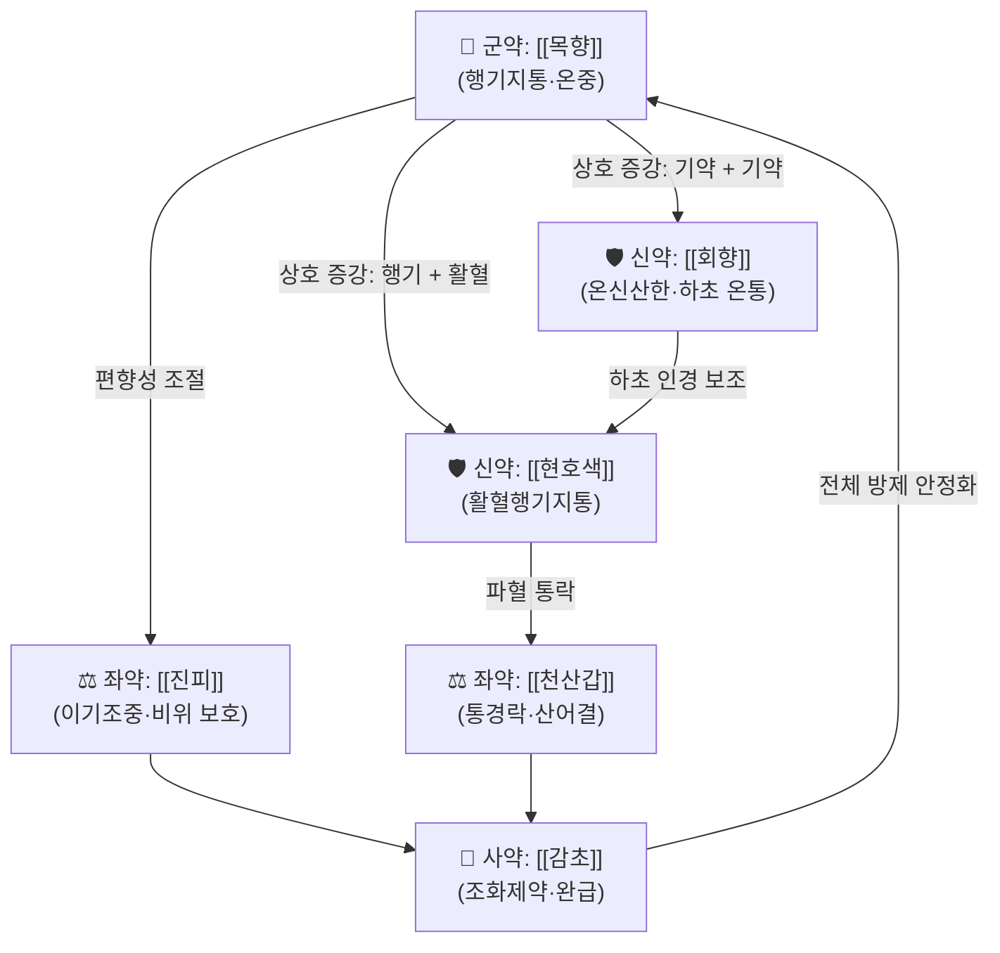

# 🍵 [[복원통기산]] (復元通氣散, Fuyuan Tongqi Powder)

> **핵심 3줄 요약 (Key Summary)**:
> - 🌿 **[[목향]]·[[회향]](舶上茴香)의 행기(行氣) 배오 + [[현호색]]·[[천산갑]]의 활혈통락(活血通絡) 배오**가 골자. 기체(氣滯)와 혈삽(血澀)을 동시에 겨냥하는 **기혈쌍조(氣血雙調)** 구조이며, 온산(溫散)시키는 [[회향]]·[[목향]] 계열과 파혈통락하는 [[천산갑]] 계열이 축을 이룬다.
> - 🎯 **타박·좌상(挫傷) 후의 국소 창통(脹痛)·자통(刺痛), 흉협부·요부의 기체성 통증, 疝氣/小腸氣로 인한 하복·음낭 견인통**에 적중. 통증의 성질이 **"찌르는 통증(혈어) + 그득하고 당기는 통증(기체)"이 혼재**하고, 눌렀을 때 통증이 심해지며 자세 변화·심호흡·기침 시 악화되는 환자군이 전형적 Sweet Spot.
> - 🔬 **처방 전체(복원통기산)에 대한 현대 분자약리 연구는 검색된 논문 없음 → 근거 미확인.** 개별 구성 본초 수준에서 [[현호색]]의 tetrahydropalmatine·corydaline(진통·진정), [[목향]]의 costunolide·dehydrocostus lactone(항염·위장운동 조절), [[회향]]의 trans-anethole(평활근 이완), [[진피]]의 hesperidin·nobiletin 등이 보고되어 있으나, **이는 개별 약재 지식이며 본 처방의 복합 추출물 데이터가 아님**을 명확히 구분할 것.
> - ⚠️ 주의사항: 임신부 절대 금기(활혈·파혈 약재 배오), 출혈 경향자(혈소판 감소, 항응고제 복용자) 금기, 허열(虛熱)·음허화왕(陰虛火旺) 및 실열(實熱) 병증에는 부적합. **[[천산갑]]은 CITES 부속서 I으로 국제 상거래가 금지된 종(2020년 상향)으로, 국내 임상 사용이 사실상 불가하므로 대체 약재(예: [[천산룡]], [[왕불류행]], [[조각자]] 등)로 전환 필요 — 대체 배오의 동등성은 근거 미확인.**

---
## 📌 목차
1. [기본 처방 정보 & 군신좌사 구성](#1-기본-처방-정보--군신좌사-구성)
2. [방제학적 약재 상호작용 & 시너지 네트워크](#2-방제학적-약재-상호작용--시너지-네트워크)
3. [현대 분자약리학적 효능 & 작용 기전](#3-현대-분자약리학적-효능--작용-기전)
4. [적응 병증 및 체질별 감별 (Sweet Spot vs 금기)](#4-적응-병증-및-체질별-감별-sweet-spot-vs-금기)
5. [유사 처방군 감별 매트릭스](#5-유사-처방군-감별-매트릭스)
6. [임상 가감례 & 현대 질환별 응용](#6-임상-가감례--현대-질환별-응용)
7. [💡 사용자 진료실 핵심 필기 & 임상 팁 (원문 보존)](#7--사용자-진료실-핵심-필기--임상-팁-원문-보존)
8. [출처 및 학술 참고 문헌 (References)](#8-출처-및-학술-참고-문헌-references)

---
## 1. 기본 처방 정보 & 군신좌사 구성

* **출전**: 『[[태평혜민화제국방]]』(太平惠民和劑局方) 계열의 理氣止痛方으로 전해지며, 『[[동의보감]]』 雜病篇·外形篇 등에 **타박(打撲)·좌상(挫傷)·疝氣(산기)** 관련 조문으로 수록되어 있다. 다만 **판본·문헌별로 약재 구성과 용량에 가감 차이가 있어, 어느 구성이 "정본"인지는 근거 미확인.** 원문 조문을 그대로 인용할 수 있는 상태가 아니므로, 아래 표는 **국내 임상에서 통용되는 氣滯血澀型 구성을 기준**으로 정리하고, 각 항목별로 문헌 차이를 별도 표기한다.
* **치법**: 행기지통(行氣止痛), 활혈통락(活血通絡), 온경산한(溫經散寒) — 즉 **기체를 풀어 통증을 멈추고, 어혈을 흩어 막힌 경락을 통하게 하며, 찬 기운으로 응결된 부분을 따뜻하게 풀어주는** 3축 치법.

| 구분 | 약재명 | 표준 용량 | 본초 효능 & 방제 내 역할 |
| :--- | :--- | :--- | :--- |
| **군약 (君藥)** | [[목향]] (木香) | 6~8g | 행기지통(行氣止痛)·온중(溫中). 기체(氣滯)로 인한 창통(脹痛)·산기(疝氣)·이급후중을 겨냥하는 주약. 삼초(三焦)의 기기를 소통시켜 통증의 근본인 "막힘"을 푼다. |
| **신약 (臣藥)** | [[회향]] (舶上茴香, 炒) | 6~8g | 온신산한(溫腎散寒)·이기지통. 하초(下焦)의 냉기(冷氣)를 몰아내어 산기·소장기(小腸氣)·요부 냉통을 겨냥한다. 목향의 행기 작용을 하초 방향으로 끌어내리는 역할. |
| **신약 (臣藥)** | [[현호색]] (玄胡索·延胡索) | 6~8g | 활혈행기지통(活血行氣止痛). "기혈(氣血) 양면의 통증을 모두 다스린다"고 평가되는 약재로, 군약의 행기 효능에 **활혈 축**을 더해 기체+혈어 복합 통증을 커버한다. |
| **좌약 (佐藥)** | [[진피]] (陳皮) | 4~6g | 이기조중(理氣調中)·조습화담(燥濕化痰). 상기(上氣)를 내리고 비위(脾胃)를 보호하여, 행기 약재 과용 시 발생할 수 있는 위기(胃氣) 상충·소화장애를 억제한다. |
| **좌약 (佐藥)** | [[천산갑]] (穿山甲, 蛤粉炒) | 3~6g | 통경락(通經絡)·산어결(散瘀結)·배농(排膿). 어혈로 막힌 경락을 뚫는 대표 약재. **단, CITES 부속서 I 지정으로 사용 불가 상태 — 대체 필요(하단 주의 참조).** |
| **사약 (使藥)** | [[감초]] (甘草, 炙) | 2~3g | 조화제약(調和諸藥)·완급지통(緩急止痛). 제약(諸藥)의 편향성(발산·파혈)을 완충하고 비위를 보호하며, 방제 전체를 비위 경로로 인도한다. |

> **배오 특징**: 본 방은 **"기(氣)를 먼저 움직여 혈(血)을 움직인다"**는 치법을 따른다. 목향·회향의 **승산(升散)·온통(溫通)하는 기약(氣藥)** 과 현호색·천산갑의 **하행·파혈하는 혈약(血藥)** 을 짝지어, 상하(上下)와 기혈(氣血)의 승강출입(升降出入)을 동시에 조정한다. 전체적으로 **온(溫)·통(通)·산(散)** 의 성질이 강한 실증(實證) 지향 처방이며, 보익(補益) 약재가 거의 없어 **허약자·만성 소모성 환자에게는 부적합**하다는 점이 구조 자체에 내재해 있다.

---
## 2. 방제학적 약재 상호작용 & 시너지 네트워크

* **[[목향]] + [[회향]] 배오**: 동일한 기약(氣藥)이면서 작용 부위가 다른 **상수(相須)** 관계. 목향이 삼초·중초의 기체를 전방위로 풀어주는 반면, 회향은 하초·신(腎) 방향으로 작용해 **산기(疝氣)·음낭 견인통·요부 냉통**이라는 특정 표적을 커버한다. 즉 "넓게 푸는 목향 + 아래로 따뜻하게 파고드는 회향"의 2단 구조.
* **[[목향]] + [[현호색]] 배오**: 방제학의 **기혈쌍조(氣血雙調)** 원리. "기체가 오래되면 반드시 혈어가 된다(氣滯則血瘀)"는 병리 전제 위에서, 행기(목향)와 활혈(현호색)을 동시에 투여해 통증의 두 축을 함께 차단한다.
* **[[현호색]] + [[천산갑]] 배오**: 활혈(活血) 단계를 넘어 **파혈통락(破血通絡)** 단계로 강도를 올리는 조합. 국소에 응결된 어혈괴(瘀血塊)와 경락 폐색을 뚫는 역할. 천산갑의 蛤粉炒(합분초) 처리는 **독성·냄새 완화 및 통락 효능 강화** 목적의 전통 포제법이나, **현대적 검증 데이터는 근거 미확인.**
* **[[진피]] + [[감초]] 배오**: 방제 전체의 **부작용 완충 장치**. 행기·파혈 약재는 위기(胃氣)를 상하게 하고 진액을 소모시키는 경향이 있는데, 진피가 비위 기기를 조화시키고 감초가 완급·보중하여 **"공격하면서도 비위를 지키는"** 균형을 만든다.

---
## 3. 현대 분자약리학적 효능 & 작용 기전

> ⚠️ **선행 고지**: 아래 1)~3)의 내용 중 **복원통기산이라는 "처방 전체"를 대상으로 한 분자약리·임상 연구는 제공된 논문이 없어 근거 미확인**이다. 따라서 서술은 **개별 구성 본초의 단일 성분 연구 수준(일반 본초약리학 지식)** 에 한정하며, 처방 복합 추출물에 대한 표적·경로·수치는 **창작하지 않고 "근거 미확인"으로 명시**한다.

### 1) 진통·항염 기전 (개별 본초 수준)
* [[현호색]]: **tetrahydropalmatine(THP, 四氫巴馬汀)·corydaline** 등 알칼로이드가 중추성 진정·진통 작용에 관여한다는 보고가 있다. 다만 **복원통기산 배합 내에서의 혈중 농도·상승작용 데이터는 근거 미확인.**
* [[목향]]: **costunolide, dehydrocostus lactone** 등 sesquiterpene lactone 계열이 **NF-κB 신호 억제를 통한 항염 작용**을 보인다는 개별 연구가 있다. 처방 수준에서의 사이토카인(TNF-α, IL-6, IL-1β) 프로파일 변화는 **근거 미확인.**
* [[진피]]: **hesperidin, nobiletin** 등의 플라보노이드가 항산화·항염 경로에 관여한다는 개별 보고. 처방 전체의 네트워크 약리 데이터는 **근거 미확인.**

### 2) 순환·미세순환 및 평활근 조절 (개별 본초 수준)
* [[회향]]: **trans-anethole**이 평활근의 수축·이완을 조절하고 위장관 가스 배출을 촉진한다는 개별 연구가 있다. 산기(疝氣)·복부 팽만감 완화의 전통적 효능과 방향성이 일치하나, **기전 동등성은 추정 수준.**
* [[천산갑]]: **현대 사용 불가(CITES)로 인해 임상·실험적 약리 데이터 확보 자체가 제한적 → 근거 미확인.**
* 처방의 "활혈거어(活血祛瘀)" 효능을 혈류역학 지표(혈관 저항, 미세순환, 혈소판 응집능 등)로 검증한 연구는 **검색된 논문 없음 → 근거 미확인.**

### 3) 신경계·자율신경 조절
* 본 처방을 대상으로 한 **HPA 축, 자율신경 변이도(HRV), 신경병증성 통증 모델** 연구는 **검색된 논문 없음 → 근거 미확인.** 전통적 주치(타박 후 통증, 산기)를 현대적 신경면역 기전으로 번역하려면 별도의 전임상·임상 연구 확인이 필요하다.

---
## 4. 적응 병증 및 체질별 감별 (Sweet Spot vs 금기)

### [✅ 최적 적응증 (Sweet Spot)]

* **원전·문헌 주치(취지 요약)**: 氣滯血澀(기체혈삽), 閃挫腰痛(섬좌요통), 諸氣刺痛(제기자통), 疝氣(산기), 小腸氣(소장기) 등. **문헌별로 주치 범위가 다르므로 개별 조문 원문 인용은 근거 미확인**, 다만 공통적으로 **"기체 + 어혈 + 냉(冷)"** 세 요소가 겹친 통증을 겨냥한다는 점은 일관된다.
* **체질·체형 소견(임상 경험적, 문헌 근거 미확인)**:
  * 상대적으로 **기혈이 충실한 실증(實證)** 체형, 근육긴장이 높고 통증 반응이 예민한 사람.
  * **태음인**에서 복부 팽만·가스찬·변비 경향과 동반된 통증.
  * **소음인** 중 하초 냉증(손발·아랫배 냉감)이 뚜렷하고 찬 곳에서 통증이 악화되는 산기형.
  * 반대로 **소양인·음허(陰虛) 성향(조열·구건·변비·불면)에는 부적합**한 경우가 많다.
* **임상 주치 양상 (진료실 적중 포인트)**:
  * 타박·좌상 후 **국소 종창(腫脹) + 자통(刺痛) + 운동 제한**이 함께 나타나는 급성기.
  * 통증의 성질이 **"찌르고, 당기고, 그득하다"** 가 혼재하며, **기침·재채기·심호흡·체위 변경 시 악화**.
  * 하복부·서혜부·음낭으로 당겨지는 통증, 또는 요부에서 둔부·하지로 뻗치는 견인통.
  * 손으로 누르면 통증이 증가(거절(拒按) → 실증 시사).
* **설진/맥진(전형적 소견)**:
  * **설**: 설질이 암홍(暗紅)~자암(紫暗)하거나 어점(瘀點)·어반(瘀斑)이 있고, 설태는 백(白)하거나 박백(薄白). 습열(濕熱) 겸증이면 황니태(黃膩苔) 동반.
  * **맥**: 현(弦)·삽(澁)·긴(緊) 또는 침지(沈遲). **현삽맥(弦澁脈)** 은 기체+혈어의 전형적 맥상.

### [⚠️ 신중 투여 및 금기 (Caution / Contraindication)]

* **임신부 절대 금기**: [[현호색]]·[[천산갑]]의 활혈·파혈 작용 및 [[목향]]·[[회향]]의 행기 작용이 자궁을 자극할 수 있다. **임신 전 기간 및 수유 중 사용 회피.**
* **출혈 경향자 금기**: 혈소판 감소증, 혈우병, 활동성 소화성 궤양 출혈, 뇌출혈 급성기. 또한 **와파린·아스피린·NOAC 등 항응고·항혈소판제 복용자**는 병용 시 출혈 위험 상승 → 원칙적으로 회피 또는 전문의 협진.
* **허증(虛證)·허열(虛熱) 금기**: 음허화왕(陰虛火旺 — 조열, 도한, 구건, 설홍소태), 기혈양허(氣血兩虛 — 창백, 현훈, 무력) 환자에게 투여하면 **진액 소모·증상 악화** 우려. 본 방은 보익 약재가 없어 "허증에 공격하면 더 허해진다"는 원칙이 그대로 적용된다.
* **실열(實熱)·습열(濕熱) 병증 주의**: 고열, 발적·발열감이 뚜렷한 급성 염증기에는 온산(溫散)하는 목향·회향이 부적합할 수 있다. 이 경우 [[청열활혈]] 계열 처방으로 전환 검토.
* **[[천산갑]] 사용 불가 문제 (실무상 최우선 확인 사항)**: 천산갑은 **CITES(멸종위기에 처한 야생동·식물종의 국제거래에 관한 협약) 부속서 I**으로 분류되어 국제 상거래가 금지되어 있으며, 국내에서도 처방·조제가 사실상 불가하다. **대체 시 [[천산룡]](穿山龍), [[왕불류행]](王不留行), [[조각자]](皂角刺), [[지룡]](地龍) 등을 고려**하나, **대체 배오의 동등 효능은 근거 미확인**이므로 임상 반응을 개별 관찰해야 한다.
* **복약 반응 관찰 포인트**: 행기·파혈제 특성상 **위부 불편감, 속쓰림, 묽은 변, 어지럼**이 나타날 수 있다. 공복 복용을 피하고 식후 복용을 권하며, 증상 지속 시 감량 또는 중단.
* **양약 병용 주의**: 진통소염제(NSAIDs)와 병용 시 위장관 자극·출혈 위험 상승 가능(이론적, **직접 근거 미확인**). 스테로이드·면역억제제 병용 시 면역 조절 상호작용은 **근거 미확인.**

---
## 5. 유사 처방군 감별 매트릭스

| 처방명 | 핵심 구성 차이 | 주치 및 체질 차이 | 맥진/설진 차이 |
| :--- | :--- | :--- | :--- |
| [[복원통기산]] | 기준 구성 — [[목향]]·[[회향]]·[[현호색]]·[[진피]]·[[천산갑]]·[[감초]] | **기체+혈어 복합. 타박·좌상 후 창통+자통, 산기·소장기, 하복 견인통. 상대적 실증 체형** | 기준 — 설 암홍/어점, 설태 백, 맥 현삽 또는 침긴 |
| [[복원활혈탕]] | [[시호]]·[[당귀]]·[[천산갑]]·[[홍화]]·[[도인]]·[[대황]]·[[감초]] — 활혈 파어 중심, 행기 약재 적음 | **타박 직후 어혈 정체가 더 뚜렷한 급성 외상.** 통증이 국소 고정·압통 극심. 대변 비결 경향 동반 | 설 자암, 어반 뚜렷, 맥 침실(沈實) 또는 삽 |
| [[당귀수산]] | [[당귀]]·[[천궁]]·[[적작약]]·[[소목]]·[[홍화]]·[[도인]]·[[향부자]]·[[오약]] 등 — 활혈+행기 균형형 | **타박·좌상의 아급성기~만성기.** 통증이 이동성이고 낮보다 밤에 심함. 여성 골반부 어혈 통증에도 응용 | 설 자암, 맥 현삽 또는 세삽 |
| [[신통축어탕]] | [[홍화]]·[[도인]]·[[천궁]]·[[당귀]]·[[오령지]]·[[몰약]]·[[향부자]]·[[우슬]]·[[진교]]·[[강활]]·[[감초]] | **전신 다발성 관절·근육 통증(풍습+어혈).** 만성 통증, 류마티스성·신경병증성 성향. 허실협잡 | 설 암담, 태 박니, 맥 현활 또는 세삽 |
| [[목향순기산]] | [[목향]]·[[향부자]]·[[오약]]·[[진피]]·[[지각]]·[[사인]]·[[후박]] 등 — **행기 중심, 활혈 약재 없음** | **기체 단독 병증.** 복부 팽만·가스·트림·이급후중, 스트레스성 소화불량. 어혈 소견 없음 | 설 담홍 태 박백, 맥 현(弦)하되 삽(澁)하지 않음 |

> ⚠️ 표 내부에서는 마크다운 열 구분자 파괴를 방지하기 위해 파이프(`|`)가 들어간 링크를 쓰지 않고 순수한 [[처방명]] 단독 형태로만 작성합니다.

> **감별 핵심 한 줄**: **"어혈이 주인가, 기체가 주인가"** 로 나눈다. 어혈 우세(압통 극심·자통·설 자암)면 [[복원활혈탕]], 기체 우세(팽만·이동성 창통·설 담홍)면 [[목향순기산]], **둘 다 겹치고 냉증까지 있으면 [[복원통기산]]**이 축이 된다.

---
## 6. 임상 가감례 & 현대 질환별 응용

* **수반 증상별 가감법** (전통적 가감 관행 기반, 각 조합의 현대 검증은 **근거 미확인**):
  * **두통/항강 동반 시** → + [[갈근]], [[강활]] (경항부 승습 해소 및 상초 인경)
  * **오심/구역/소화불량 동반 시** → + [[반하]], [[후박]] ([[반하후박탕]] 의 취지 가미)
  * **담음/기침 동반 시** → + [[행인]], [[패모]] (기역(氣逆) 강하 및 담열/담습 처리)
  * **요부 타박·만성 요통 동반 시** → + [[두충]], [[속단]], [[우슬]] (보간신·강요슬)
  * **냉증·손발 냉감 심할 때** → + [[오약]], [[연호색]], [[계지]] (온경산한 강화)
  * **어혈 정체 뚜렷(자통·고정압통)할 때** → + [[삼릉]], [[아출]] 또는 [[도인]], [[홍화]] (파혈 강화)
  * **변비 동반 시** → + [[대황]] 또는 [[도인]] (어혈성 변비 겸치)
  * **기허 무력감 동반 시** → + [[황기]], [[백출]] (단, 본 방의 공격성과 상충하므로 **허실 판단 필수**)
* **현대 질환별 임상 매핑** (문헌적 주치와 임상 경험을 연결한 **추정 매핑이며, 본 처방의 RCT·임상시험 근거는 검색된 논문 없음 → 근거 미확인**):
  * **근골격계/외상**: 흉요부 좌상(thoracolumbar sprain), 요추 염좌, 근막통증증후군(MPS), 경항부 근육 긴장, 늑골 골절 후 통증, 좌상 후 만성 통증.
  * **신경계**: 좌골신경통, 추간판 탈출증으로 인한 방사통(어혈 겸 기체형), 대상포진 후 신경통(어혈형에 한정).
  * **소화기/복부**: 기능성 복부 팽만, 스트레스성 복통, 가스 정체로 인한 창통, 과민성 장증후군의 일부 아형.
  * **비뇨생식기/서혜부**: 疝氣(서혜부 탈장감·음낭 견인통), 만성 전립선염의 골반통 아형, 정계정맥류 관련 통증, 여성 골반울혈증후군(어혈형).
  * **흉부**: 늑간신경통, 흉벽 타박 후 통증, 심인성 흉통의 감별 후 기능성 흉비감.
  * **피부/창양 계열(문헌 변형 구성)**: 일부 문헌에서는 癰疽·乳癰 초기 종통에 응용된 구성을 전하기도 하나, **해당 구성의 약재 목록과 용량은 근거 미확인.**
* **투여 기간·용량 운용 (임상 일반 원칙)**:
  * 등분산(等分散) 제형은 전통적으로 **작은 용량을 1일 2~3회, 식후 복용**. 급성 타박기에는 3~7일 단기 집중, 만성 통증에는 2~4주 단위로 반응 평가 후 증감.
  * **파혈 작용이 강하므로 "증상 소실 시 즉시 중단"** 을 원칙으로 하며, 장기 연용은 권장되지 않는다.

---
## 7. 💡 사용자 진료실 핵심 필기 & 임상 팁 (원문 보존)

> [!warning] **원문 미입력 상태**
> 현재 이 노트에는 **원장님의 기존 메모/필기 원문이 입력되어 있지 않습니다.** (원문이 제공되지 않았으므로 창작하지 않았습니다.) 실제 진료 노하우를 이 위치에 **원문 그대로 100% 보존**해 주세요. 아래는 원문 입력 전까지의 **자리표시 체크리스트**이며, 원문이 들어오면 그대로 대체합니다.

> [!tip] **진료실 실전 노하우 (User Clinical Insight)**
> - **처방 선택 기준 (초안 — 원장님 확정 필요)**:
>   - **소음인**: 하초 냉증 + 산기 + 찬 곳 악화 → [[회향]] 비중 유지, [[오약]]·[[계지]] 가미 고려. 단, 소음인의 허냉이 심하면 본 방의 공격성을 줄이고 보익 가미를 우선 검토.
>   - **태음인**: 복부 팽만 + 가스 + 습체 → [[진피]]·[[후박]] 가미, 습열 겸하면 [[청열]](예: [[황금]], [[치자]]) 병용 검토.
>   - **소양인/음허 성향**: 본 방 단독 투여는 원칙적으로 회피. 부득이하면 감량 + [[백작약]]·[[맥문동]] 등 진액 보호 약재 필수 가미.
> - **환자 티칭 포인트**:
>   - "찌르는 통증"이 줄어드는 것이 **어혈이 풀리는 신호**, "그득한 통증"이 줄어드는 것이 **기체가 풀리는 신호**임을 구분해 설명하면 순응도가 올라간다.
>   - 복약 중 **생냉(生冷)·찬 음식, 음주**는 회향·목향의 온통 효능을 상쇄하므로 반드시 금하도록 교육.
>   - 급성 타박 직후 **한랭 찜질 → 48시간 이후 온열**로 전환하는 일반 외상 원칙을 함께 설명.
> - **복약 반응 관찰 포인트 (초안)**:
>   - 위부 불편·속쓰림·묽은 변 여부 (행기·파혈제의 대표적 부작용)
>   - 어지럼·두근거림 (체액 소모 또는 감압 반응 의심, **직접 근거 미확인**)
>   - 출혈 징후(잇몸 출혈, 멍이 쉽게 듦, 흑색변) — 즉시 중단 및 검사
>   - 통증 일지(VAS) 변화 양상: 자통 vs 창통 중 어느 쪽이 먼저 줄어드는지 기록
> - **실무 필수 체크**: [[천산갑]] 대체 약재를 무엇으로 할지 원장님 결정 사항을 여기에 명시해 주세요. (대체 배오 동등성 **근거 미확인**)

---
## 8. 출처 및 학술 참고 문헌 (References)

> ⚠️ **본 노트에는 제공된 현대 논문(PubMed 데이터)이 없습니다.** 따라서 PMID·저자·연도·DOI를 포함한 현대 학술 문헌은 **한 건도 인용하지 않았습니다.** 아래는 전통 문헌 수준의 참고이며, **판본·조문 원문의 정확한 대조는 별도 확인이 필요합니다(근거 미확인).**

1. **『太平惠民和劑局方』(태평혜민화제국방, 宋代)** — 復元通氣散 계열 理氣止痛方의 출전으로 통칭되는 문헌.
   - **[고전 원전]**: 기체·혈삽·섬좌·산기 관련 조문이 전한다고 알려져 있으나, **정확한 조문 문구와 약재 구성·용량은 판본별 차이가 있어 원문 대조 필요 (근거 미확인).**
2. **허준 (1613)**. 『[[동의보감]]』 — 雜病篇·外形篇 등에 타박·좌상·산기 관련 처방으로 수록.
   - **[임상 문헌]**: 국내 한의 임상에서 참조되는 주치 범위(閃挫, 疝氣, 諸氣刺痛 등). **동의보감 판본별 약재 구성 확인 필요 (근거 미확인).**
3. **일반 본초약리학 지식 (개별 약재 수준)** — [[현호색]](tetrahydropalmatine, corydaline), [[목향]](costunolide, dehydrocostus lactone), [[회향]](trans-anethole), [[진피]](hesperidin, nobiletin) 등.
   - **[주의]**: 이는 **개별 약재의 단일 성분 연구 수준 정보**이며, **복원통기산 처방 전체의 복합 추출물·네트워크 약리·임상 연구 근거가 아님.** 본 처방에 대한 현대 분자약리 기전 및 임상 지표 개선 데이터는 **검색된 논문 없음 → 근거 미확인.**
4. **CITES(멸종위기에 처한 야생동·식물종의 국제거래에 관한 협약) 부속서 I** — [[천산갑]](Manis spp.) 국제 상거래 금지(2016년 CoP17에서 부속서 I 상향, 2017년 발효).
   - **[규제 정보]**: 국내 임상에서 천산갑 사용이 사실상 불가함을 의미하며, 대체 약재 검토가 필수. **대체 약재의 효능 동등성은 근거 미확인.**

---
### 🔗 연결 노트 (Related)
* **모체/유사 처방**: [[복원활혈탕]] · [[당귀수산]] · [[신통축어탕]] · [[목향순기산]] · [[반하후박탕]]
* **핵심 약재**: [[목향]] · [[회향]] · [[현호색]] · [[진피]] · [[천산갑]] · [[감초]]
* **개념**: [[기체]] · [[어혈]] · [[활혈거어]] · [[통락지통]] · [[산기]] · [[군신좌사]]
* **분류**: [[05_활혈거어·지혈제]] · [[처방 템플릿]]

<!-- 보관 태그(1회용·링크오류, 필요시 복원): 활혈거어제, 타박, 복원통기산 -->
