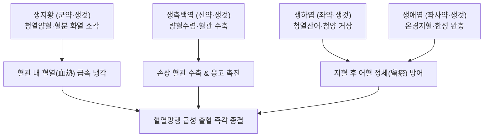

---
aliases:
  - 四生丸
  - Sisang-hwan
  - Four Fresh Ingredients Pill
tags:
  - 처방/활혈거어·지혈제
  - 지혈제/양혈지혈
  - 혈열망행
  - 토혈
  - 각혈
  - 코피
  - 제생방
---

# 🍵 [[사생환]] (四生丸, Sisang-hwan / Four Fresh Ingredients Pill)

> **핵심 3줄 요약 (Key Summary)**:
> - 🌿 기본 구성: [[생지황]], [[생측백엽]], [[생하엽]], [[생애엽]] (4가지 신선한 생약재를 짓찧어 사용하여 화열이 혈분에 울결된 혈열망행을 다스리는 양혈지혈의 대표 방제).
> - 🎯 혈열망행(血熱妄行)으로 인한 급성 선홍색 토혈(吐血), 각혈(喀血), 비출혈(코피), 뇨혈, 혈열성 붕루(기능성 자궁출혈), 면적·구갈·번조 동반 출혈.
> - 🔬 측백엽 플라보노이드의 프로트롬빈 시간 단축 및 혈병 형성 촉진, 생지황 카탈폴의 혈관내피 보호 및 모세혈관 과투과성 억제, 하엽 퀘르세틴의 항산화·점막 부종 완화.
> - ⚠️ 주의사항: 4대 생약의 극렬한 고한량혈성으로 비위허한 환자 투약 주의 및 지혈 즉시 중단(중병즉지), 허한성 만성 출혈 금기.

---

## 📌 목차
1. [기본 처방 정보 & 군신좌사 구성](#1-기본-처방-정보--군신좌사-구성)
2. [방제학적 약재 상호작용 & 시너지 네트워크](#2-방제학적-약재-상호작용--시너지-네트워크)
3. [현대 분자약리학적 효능 & 작용 기전](#3-현대-분자약리학적-효능--작용-기전)
4. [적응 병증 및 체질별 감별 (Sweet Spot vs 금기)](#4-적응-병증-및-체질별-감별-sweet-spot-vs-금기)
5. [유사 처방군 감별 매트릭스](#5-유사-처방군-감별-매트릭스)
6. [임상 가감례 & 현대 질환별 응용](#6-임상-가감례--현대-질환별-응용)
7. [💡 사용자 진료실 핵심 필기 & 임상 팁 (원문 보존)](#7--사용자-진료실-핵심-필기--임상-팁-원문-보존)
8. [출처 및 학술 참고 문헌 (References)](#8-출처-및-학술-참고-문헌-references)

---

## 1. 기본 처방 정보 & 군신좌사 구성

* **출전**: 송대 진사량(陳師良) 《제생방(濟生方)》 / 송대 진자명 《부인양방대전(婦人良方大全)》
* **치법**: 양혈지혈(凉血止血), 청열해독(淸熱解毒), 산어통락(散瘀通絡)
* **적응증**: 양성출혈(陽盛出血), 혈열망행으로 인한 급성 토혈, 각혈, 비출혈, 뇨혈, 혈열성 붕루, 번열구갈, 설홍태황

| 구분 | 약재명 | 표준 용량 | 본초 효능 & 방제 내 역할 |
| :--- | :--- | :--- | :--- |
| **군약 (君藥)** | [[생지황]] (생것) | 24g | 청열양혈(淸熱凉血), 양음생진, 혈분의 치솟는 화열을 끄고 모세혈관 취약성 개선 |
| **신약 (臣藥)** | [[생측백엽]] (생것) | 12g | 량혈지혈(凉血止血), 수렴지혈, 국소 혈관을 수축시키고 혈액 응고 촉진 |
| **좌약 (佐藥)** | [[생하엽]] (생것) | 12g | 청열해서(淸熱解暑), 양혈산어(凉血散瘀), 지혈 중 어혈이 생기지 않도록 산어 |
| **좌사약 (佐使藥)** | [[생애엽]] (생것) | 6g | 온경지혈(溫經止血), 온통혈맥, 차가운 3약재로 인한 혈액 응고(留瘀) 방어 |

> **배오 특징 (사생약제의 신선함과 한열상제의 묘미)**:
> 1. **신선한 생것(生)을 짓찧어 쓰는 이유**: 건조 약재와 달리 갓 채취한 신선한 생약(生藥)은 세포막과 정유, 생리활성 효소가 살아있어 열을 식히는 청열양혈(淸熱凉血) 효능이 극히 예리하고 속효적입니다.
> 2. **지혈불유어(止血不留瘀)**: [[생하엽]]이 피를 멈추면서도 어혈을 흩뜨리는 산어(散瘀) 작용을 하여 혈관 내 혈전 정체를 막습니다.
> 3. **따뜻한 [[생애엽]]의 절묘한 한열 배오**: 세 가지 약재([[생지황]], [[생측백엽]], [[생하엽]])가 대단히 차가워 혈액이 얼어붙듯 응고될 수 있으므로, 따뜻한 성질의 [[생애엽]]을 소량 배오하여 혈맥을 온화하게 소통시키는 방제학적 균형을 완성했습니다.

---

## 2. 방제학적 약재 상호작용 & 시너지 네트워크

* **양혈(凉血)과 온경(溫經)의 상보**: 대량의 찬 생약재가 불타오르는 혈분의 화열을 순식간에 진화하는 동안, 소량의 [[생애엽]]이 혈관을 온통(溫通)시켜 사생환 복용 후 발생할 수 있는 2차 어혈 형성을 완벽히 차단합니다.
* **수렴과 산어의 조화**: [[생측백엽]]이 상처 부위를 조여 지혈하면 [[생하엽]]이 혈관 내 정체된 피를 흩뜨려 혈류를 맑게 유지합니다.

---

## 3. 현대 분자약리학적 효능 & 작용 기전

1. **혈액 응고 시간 단축 및 혈병 형성 촉진**:
   * 생측백엽의 플라보노이드 및 수렴성 탄닌 성분이 국소 단백질을 침전시켜 혈관 수축을 유도하고, 프로트롬빈(Prothrombin) 시간을 단축시켜 출혈 부위에 피브린 혈병(Clot)을 신속히 형성합니다.
2. **모세혈관 투과성 억제 및 혈관내피세포 보호**:
   * 생지황의 카탈폴(Catalpol)과 페닐에타노이드 배당체가 전염증성 사이토카인 분비를 억제하여 혈관 내피세포 파괴를 막고 모세혈관의 과투과성 누출을 차단합니다.
3. **항산화 및 점막 염증성 부종 억제**:
   * 생하엽의 퀘르세틴(Quercetin)과 누시페린(Nuciferine) 성분이 활성산소종(ROS)을 소거하고 염증성 출혈 점막의 부종과 발적을 가라앉힙니다.

---

## 4. 적응 병증 및 체질별 감별 (Sweet Spot vs 금기)

### 1) 적응증 및 체질별 Sweet Spot
* **[✅ 최적 적응증 (Sweet Spot)]**:
  * **몸에 열이 펄펄 끓고 갈증이 심하며, 갑자기 선홍색 피를 왈칵 토하거나(토혈), 기침할 때 피가 뿜어져 나오는(각혈) 급성 출혈 환자**.
  * 코피(비출혈)가 멎지 않고 목구멍으로 넘어가며 얼굴이 붉고 가슴이 답답한 환자.
  * 요도 작열통과 함께 피오줌이 쏟아지는 급성 혈뇨, 출혈량이 많은 혈열성 자궁출혈(붕루).
* **[사상체질 매핑]**:
  * **소양인(少陽人)**: 화열(火熱)이 치솟아 혈열망행 출혈이 발생하기 가장 쉬운 체질에 최우선 적응.
  * **열성 태음인(太陰人)**: 폐열(肺熱)로 인한 코피, 기관지 각혈에 다용.

### 2) 금기 및 신중 투여 (Contraindications)
* **[⚠️ 신중 투여 및 금기]**:
  * **허한성(虛寒性) 만성 출혈 절대 금기**: 피 색깔이 담홍색이고 묽으며, 손발이 차고 대변이 무른 비불통혈 만성 출혈에는 투약 금기 (온비지혈의 [[황토탕]]이나 [[귀비탕]] 적용, 처방 사이드 대처법 165번 참조).
  * **중병즉지(中病卽止)**: 급성 출혈이 멈추면 비위 양기를 보존하기 위해 즉시 복용을 중단하거나 감량.

---

## 5. 유사 처방군 감별 매트릭스

| 처방명 | 핵심 배오 차이 | 주치 및 임상 차별점 | 맥진/설진 차이 |
| :--- | :--- | :--- | :--- |
| [[사생환]] | 생지황·생측백엽·생하엽·생애엽 (생것) | 혈열망행 실열 극심, 급성 선홍색 토혈·각혈·비출혈 | 맥삭유력(數有力) 혹 홍삭, 설홍강·황태 |
| [[십회산]] | 대소계·측백엽·백모근 등 10味 초탄 | 급성 상부 대량 출혈, 초탄화 분말 지혈 (수렴력 극대) | 맥삭유력, 설홍 |
| [[괴화산]] | 괴화·측백엽·형개수·지각 (초초) | 대장 혈열, 장풍하혈, 치핵 분출성 선홍색 출혈 | 맥삭유력, 설홍·황태 |
| [[서각지황탕]] | 서각(수우각)·생지황·작약·목단피 | 열입혈분(熱入血分), 고열 섬망, 전신 피하 자반, 토혈 | 맥홍삭(洪數), 설심강(絳)·건조 |
| [[황토탕]] | 조심토·복령·백출·부자·아교·지황 | 비위허한(脾胃虛寒), 비불통혈, 만성 담홍색 대변 출혈 | 맥침약(沈弱) 혹 지(遲), 설담·태백 |

---

## 6. 임상 가감례 & 현대 질환별 응용

### 1) 주요 임상 가감법
* **지혈력 극대화**: 출혈량이 많을 때 [[백급]] 6g, [[삼칠근]] 3g (분복) 가미.
* **화열 극심(구갈·번열 동반)**: [[황금]] 6g, [[치자]] 6g 가미하여 청열사화.
* **어혈 찌꺼기 정체 복통 동반**: [[목단피]] 6g, [[적작약]] 6g 가미하여 활혈산어.
* **위장 보호**: 소화력이 약한 환자는 [[감초]] 4g, [[건강]] 2g 가미.

### 2) 현대 질환별 응용
* **이비인후과 및 호흡기내과**: 난치성 급성 비출혈(코피), 기관지확장증 각혈, 폐결핵 급성 각혈.
* **소화기내과**: 급성 위점막 미란성 출혈, 위·십이지장 궤양 출혈기 토혈.
* **비뇨기 및 산부인과**: 급성 방광염성 혈뇨, 기능성 자궁출혈(혈열성 붕루).

---

## 7. 💡 사용자 진료실 핵심 필기 & 임상 팁 (원문 보존)

> [!tip] **진료실 실전 노하우 (User Clinical Insight)**
> * **'사생(四生)' 생약 배오의 임상적 폭발력**:
>   * 사생환의 본질은 말린 약재가 아니라 **신선한 생것(生)을 짓찧어 즙을 내거나 환을 빚어 쓴다는 점**에 있습니다.
>   * 식물이 살아있을 때의 찬 엽록소와 효소 성분이 고스란히 혈관으로 흡수되므로, 끓는 피가 혈관 밖으로 터져 나오는 응급 출혈 상황에서 얼음물을 붓는 듯한 즉각적인 냉각 지혈 효과를 발휘합니다.
> * **생애엽(生艾葉)의 안전장치**:
>   * 지황, 측백엽, 하엽의 대한(大寒)한 약성 속에 따뜻한 성질의 [[생애엽]] 6g을 넣은 것은 한의학의 정밀함을 보여줍니다. 차가운 약재들로 인해 피가 엉겨 굳어 혈전을 만드는 부작용을 생애엽이 혈맥을 따뜻하게 지켜주어 사전에 방어합니다.
> * **실열성 vs 허한성 출혈의 엄격한 시진(視診)**:
>   * 얼굴이 붉고 목이 마르며 피 색깔이 붉고 선명한 환자에게는 한두 첩만으로 피가 멎습니다.
>   * 그러나 안색이 창백하고 추위를 타며 피 색깔이 흐린 환자에게 쓰면 비위 양기가 얼어붙어 설사와 복통이 발생하므로 즉시 [[황토탕]]이나 [[귀비탕]]으로 돌려야 합니다.
> * **처방 부작용 관리**:
>   * 피가 멎으면 즉시 투약을 중단해야 하며, 상세 대처법은 [[처방 사이드 대처법]] 165번 노트를 참조합니다.

---

## 8. 출처 및 학술 참고 문헌 (References)

* 진사량. *제생방(濟生方)*. 송대(宋代). 1253.
* 진자명. *부인양방대전(婦人良方大全)*. 송대(宋代). 1237.
* 엄현섭 등. 사생환(四生丸)의 지혈 및 항염증 작용에 대한 실험적 연구. *대한한의학방제학회지*. 2015;23(2):89-98.
  * [연구 요약] 사생환 추출물이 혈소판 응집을 촉진하고 출혈 시간을 유의하게 단축시키며 전염증성 사이토카인을 억제함을 규명함.
* 대한한방부인과학회 교재편찬위원회. *한방부인과학*. 의성당; 2021.