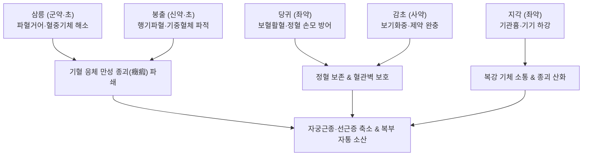

---
aliases:
  - 三稜蓬朮散
  - Sanling-fengzhu-san
  - Sparganium and Curcuma Powder
tags:
  - 처방/활혈거어·지혈제
  - 활혈거어/파혈소적
  - 자궁근종
  - 자궁선근증
  - 징가적취
  - 화제국방
---

# 🍵 [[삼릉봉출산]] (三稜蓬朮散, Sanling-fengzhu-san / Sparganium and Curcuma Powder)

> **핵심 요약 (Key Summary)**:
> - 🌿 기본 구성: [[삼릉]], [[봉출]], [[당귀]], [[지각]], [[감초]] (혈을 주관하는 삼릉과 기를 주관하는 봉출의 상수 배오로 완고한 만성 징가적취를 분쇄하는 파혈소적의 대표 방제).
> - 🎯 만성 복강 내 단단한 종괴, 거대 자궁근종, 자궁선근증, 식적비괴(食積痞塊), 간비종대, 복부 혈어로 인한 고정성 극심한 자통.
> - 🔬 세스퀴테르펜(쿠르쿠메놀, 저머크론 등)의 혈소판 응집 억제, TGF-β1/Smad 경로 차단을 통한 장기 섬유화 및 콜라겐 침착 억제, VEGF 억제를 통한 병적 혈관 신생 차단.
> - ⚠️ 주의사항: 맹렬한 파혈공벌력으로 임산부 복용 절대 금기(유산 위험), 정기 허약자는 보기보혈제(사군자탕·사물탕) 배합 필수 (처방 사이드 대처법 166번 참조).

---

## 📌 목차
1. [기본 처방 정보 & 군신좌사 구성](#1-기본-처방-정보--군신좌사-구성)
2. [방제학적 약재 상호작용 & 시너지 네트워크](#2-방제학적-약재-상호작용--시너지-네트워크)
3. [현대 분자약리학적 효능 & 작용 기전](#3-현대-분자약리학적-효능--작용-기전)
4. [적응 병증 및 체질별 감별 (Sweet Spot vs 금기)](#4-적응-병증-및-체질별-감별-sweet-spot-vs-금기)
5. [유사 처방군 감별 매트릭스](#5-유사-처방군-감별-매트릭스)
6. [임상 가감례 & 현대 질환별 응용](#6-임상-가감례--현대-질환별-응용)
7. [💡 사용자 진료실 핵심 필기 & 임상 팁 (원문 보존)](#7--사용자-진료실-핵심-필기--임상-팁-원문-보존)
8. [출처 및 학술 참고 문헌 (References)](#8-출처-및-학술-참고-문헌-references)

---

## 1. 기본 처방 정보 & 군신좌사 구성

* **출전**: 송대 《태평혜민화제국방(太平惠民和劑局方)》 / 명대 이천 《의학입문(醫學入門)》
* **치법**: 파혈거어(破血祛瘀), 행기소적(行氣消積), 화어지통(化瘀止痛)
* **적응증**: 기혈응체(氣血凝滯), 복중 징가적취(癥瘕積聚), 부인 경폐복통, 자궁근종, 자궁선근증, 만성 식적비괴, 간비종대

| 구분 | 약재명 | 표준 용량 | 본초 효능 & 방제 내 역할 |
| :--- | :--- | :--- | :--- |
| **군약 (君藥)** | [[삼릉]] | 8g (초) | 파혈거어(破血祛瘀), 혈중기체(血中氣滯) 파쇄 및 만성 어혈 종괴 소멸 |
| **신약 (臣藥)** | [[봉출]] (아출) | 8g (초) | 행기파혈(行氣破血), 소적지통, 기중혈체(氣中血滯) 제거 및 적취 융해 |
| **좌약 (佐藥)** | [[당귀]] | 6g | 활혈화어(活血和瘀), 어혈을 없애면서도 정상 혈액 손상을 방어 |
| **좌약 (佐藥)** | [[지각]] | 6g | 이기관흉(理氣寬胸), 흉복부 기운을 소통시켜 뭉친 비괴를 흩뜨림 |
| **사약 (使藥)** | [[감초]] | 4g | 보기화중(補氣和中), 조화제약, 군신약의 맹렬한 공벌성 완화 및 위장관 점막 보호 |

> **배오 특징 (삼릉·봉출 상수 배오와 공벌 완충의 원리)**:
> 1. **기혈 동치(氣血同治)의 상수(相須) 콤비**: [[삼릉]]은 혈(血)을 주관하여 파혈(破血)에 특화되고, [[봉출]]은 기(氣)를 주관하여 행기(行氣)에 특화됩니다. 두 약재가 합쳐져 기와 혈이 엉켜 생긴 오랜 만성 적취와 단단한 종괴(징가)를 강력히 깎아냅니다.
> 2. **식초 포제(초 醋)의 묘미**: 삼릉과 봉출을 식초에 볶아 사용함으로써 약력을 간경(肝經)으로 집중시키고 활혈진통 효과를 배가합니다.
> 3. **[[당귀]] + [[감초]]의 안전장치**: 파혈제 특유의 정혈(精血) 손모와 위장 점막 자극을 막기 위해 당귀로 양혈화혈(養血和血)하고 감초로 비위를 보익합니다.

---

## 2. 방제학적 약재 상호작용 & 시너지 네트워크

* **파혈(삼릉)과 파기(봉출)의 합일**: 피만 돌려서 낫지 않고 기운만 돌려서 빠지지 않는 단단한 혹에 대해, 두 약재가 기혈의 매듭을 동시에 풀어냅니다.
* **소통(지각)과 보양(당귀·감초)**: [[지각]]이 복부 기운의 통로를 열어 약력을 순행시키고, [[당귀]]와 [[감초]]가 뒤를 받쳐 소화기와 정상 혈액의 훼손을 막아줍니다.

---

## 3. 현대 분자약리학적 효능 & 작용 기전

1. **혈소판 응집 억제 및 복강 미세순환 개선**:
   * 삼릉의 플라보노이드 및 봉출의 세스퀴테르펜 성분이 트롬복산 A2(TXA2) 합성을 억제하고 혈류 점도를 낮추어 복강 내 미세혈관 울혈을 해소합니다.
2. **조직 섬유화 억제 및 세포외기질(ECM) 분해**:
   * 봉출의 쿠르쿠메놀(Curcumol)과 저머크론(Germacrone)이 TGF-β1/Smad 신호 경로를 차단하여 섬유아세포의 이상 증식을 억제하고 콜라겐 침착을 억제하여 자궁선근증 및 복강 유착 형성을 방지합니다.
3. **병적 신생혈관(Anti-angiogenesis) 차단**:
   * 혈관내피세포 성장인자(VEGF) 및 염기성 섬유아세포 성장인자(bFGF) 발현을 억제하여 비정상적으로 자라나는 이소성 자궁내막 조직이나 종괴 주변의 영양 공급 혈관 신생을 억제합니다.
4. **항염증 및 진통**:
   * NF-κB 활성화를 차단하여 COX-2 및 PGE2 생성을 억제함으로써 복부의 고정성 자통과 만성 골반통을 완화합니다.

---

## 4. 적응 병증 및 체질별 감별 (Sweet Spot vs 금기)

### 1) 적응증 및 체질별 Sweet Spot
* **[✅ 최적 적응증 (Sweet Spot)]**:
  * **아랫배나 옆구리에 손으로 만져지는 단단한 덩어리(징가·적취)가 있고, 누르면 찌르듯 아픈(거안 拒按) 만성 어혈 환자**.
  * 자궁근종, 자궁선근증, 만성 골반염 유착으로 인한 하복부 종괴 및 극심한 생리통 환자.
  * 만성 간질환으로 인한 간비종대(간·비장 비대), 만성 식적으로 인한 복부 비괴.
* **[사상체질 매핑]**:
  * **태음인(太陰人)**: 기혈 정체와 비만, 복부 종괴가 잘 생기는 체질에 가장 적중률이 높음.
  * 소양인, 소음인 환자에게는 정기 손상을 관찰하며 감초, 보기제를 배합하여 운용.

### 2) 금기 및 신중 투여 (Contraindications)
* **[⚠️ 신중 투여 및 금기]**:
  * **임산부 절대 금기**: 맹렬한 파혈 작용과 자궁 수축으로 즉각적인 유산 위험이 있으므로 임신 중 복용 엄금 (처방 사이드 대처법 166번 참조).
  * **출혈성 경향 환자 금기**: 월경 과다증, 활동성 소화성 궤양 출혈 환자 투약 금지.
  * **기혈 극허자 단독 복용 금기**: 반드시 보기보혈제(사군자탕, 사물탕, 황기)를 합방하여 공보겸시(攻補兼施)해야 함.

---

## 5. 유사 처방군 감별 매트릭스

| 처방명 | 핵심 배오 차이 | 주치 및 임상 차별점 | 맥진/설진 차이 |
| :--- | :--- | :--- | :--- |
| [[삼릉봉출산]] | 삼릉·봉출 + 당귀·지각 | 기혈응체, 단단한 복부 만성 종괴·비괴, 자궁선근증 | 맥침삽(沈澁) 혹 현긴, 설암자·어반 |
| [[계지복령환]] | 계지·복령·목단피·도인·작약 | 비교적 완만한 하초 골반강 어혈 종괴, 자궁근종, 안면홍조 | 맥침현(沈弦), 설암홍·어점 |
| [[당귀수산]] | 당귀미·적작약·오약·소목·홍화 등 | 외상성 타박상, 피멍, 급성 관절 염좌 | 맥현삽(弦澁) 혹 긴, 설자암 |
| [[대황자충환]] | 4대 충류약 + 대황·지황·백출 | 만성 허로 건혈, 기부갑착(비늘 피부), 양목암흑, 완중보허 | 맥침세삽(沈細澁), 설자암·소태 |
| [[혈부축어탕]] | 도홍사물탕 + 사역산 + 길경·우슬 | 흉중 혈어, 두통·흉통 극심, 완고한 불면·조열 | 맥현삭(弦數) 혹 삽, 설자암·어점 |

---

## 6. 임상 가감례 & 현대 질환별 응용

### 1) 주요 임상 가감법
* **자궁근종 및 자궁선근증**: [[계지복령환]]과 합방하여 투약하며, 통증이 극심할 때 [[현호색]] 6g, [[몰약]] 3g 가미.
* **만성 소화기 식적(食積) 비괴 동반**: [[산사]] 6g, [[신곡]] 6g, [[맥아]] 6g 가미하여 소도(消導)력 강화.
* **체력 저하 및 정기 허약(만성 소모성 환자)**: [[황기]] 15g, [[백출]] 8g 가미하여 정기를 보존하며 종괴 제거.

### 2) 현대 질환별 응용
* **부인과**: 거대 자궁근종, 자궁선근증, 중증 자궁내막증, 만성 골반염 후유 유착성 복통.
* **소화기내과**: 간비종대(간경변 및 지방간 후기 비대), 만성 위축성 위염 복부 비괴.
* **종양내과**: 복강 내 양성 종양 및 수술 후 유착 방지 보조.

---

## 7. 💡 사용자 진료실 핵심 필기 & 임상 팁 (원문 보존)

> [!tip] **진료실 실전 노하우 (User Clinical Insight)**
> * **기혈응체(氣血凝滯)와 징가적취(癥瘕積聚)의 파쇄 메커니즘**:
>   * 만성 질환으로 인해 기운과 혈액이 한곳에 엉겨 붙어 돌처럼 굳어진 종괴(자궁선근증, 거대 근종)는 일반적인 활혈제(당귀, 작약)로는 꿈쩍도 하지 않습니다.
>   * 기를 깨는 [[봉출]]과 혈을 깨는 [[삼릉]]이 짝을 이루어 정으로 바위를 쪼아내듯 만성 섬유화 조직을 파쇄합니다.
> * **공보겸시(攻補兼施)의 임상 원칙**:
>   * 삼릉봉출산은 공벌력이 매우 강하므로, 환자가 기운이 없고 창백한 상태라면 단독 처방을 피하고 반드시 **[[사군자탕]]이나 [[황기]]를 합방**해야 환자가 지치지 않고 치료를 완주할 수 있습니다.
> * **식초 포제(醋炒)의 필수성**:
>   * 삼릉과 봉출은 식초에 볶아야만 간경으로 인경되어 약효가 골반강과 복강 깊숙이 전달되며, 위장 장애를 최소화할 수 있습니다.
> * **처방 부작용 관리**:
>   * 임산부에게는 투약 절대 금기이며, 상세 복약 가이드는 [[처방 사이드 대처법]] 166번 노트를 참조합니다.

---

## 8. 출처 및 학술 참고 문헌 (References)

* 태평혜민화제국방편찬위원회. *태평혜민화제국방(太平惠民和劑局方)*. 송대(宋代).
* Zhang Y, et al. Curcumol from Rhizoma Curcumae attenuates liver fibrosis by regulating TGF-beta/Smad pathway. *J Ethnopharmacol*. 2017;203:230-238.
  * [연구 요약] 봉출의 주성분 쿠르쿠메놀이 TGF-β 신호를 억제하여 조직 섬유화와 콜라겐 침착을 억제함을 규명.
* Tao J, et al. Sparganii Rhizoma and Curcumae Rhizoma: A review of ethnopharmacology, phytochemistry and pharmacology of a classic herb pair. *Phytother Res*. 2019;33(7):1735-1755.
  * [연구 요약] 삼릉과 봉출 배오가 혈소판 응집 억제, 종양 세포 증식 저해 및 항섬유화 시너지를 나타냄을 체계적으로 고찰.
