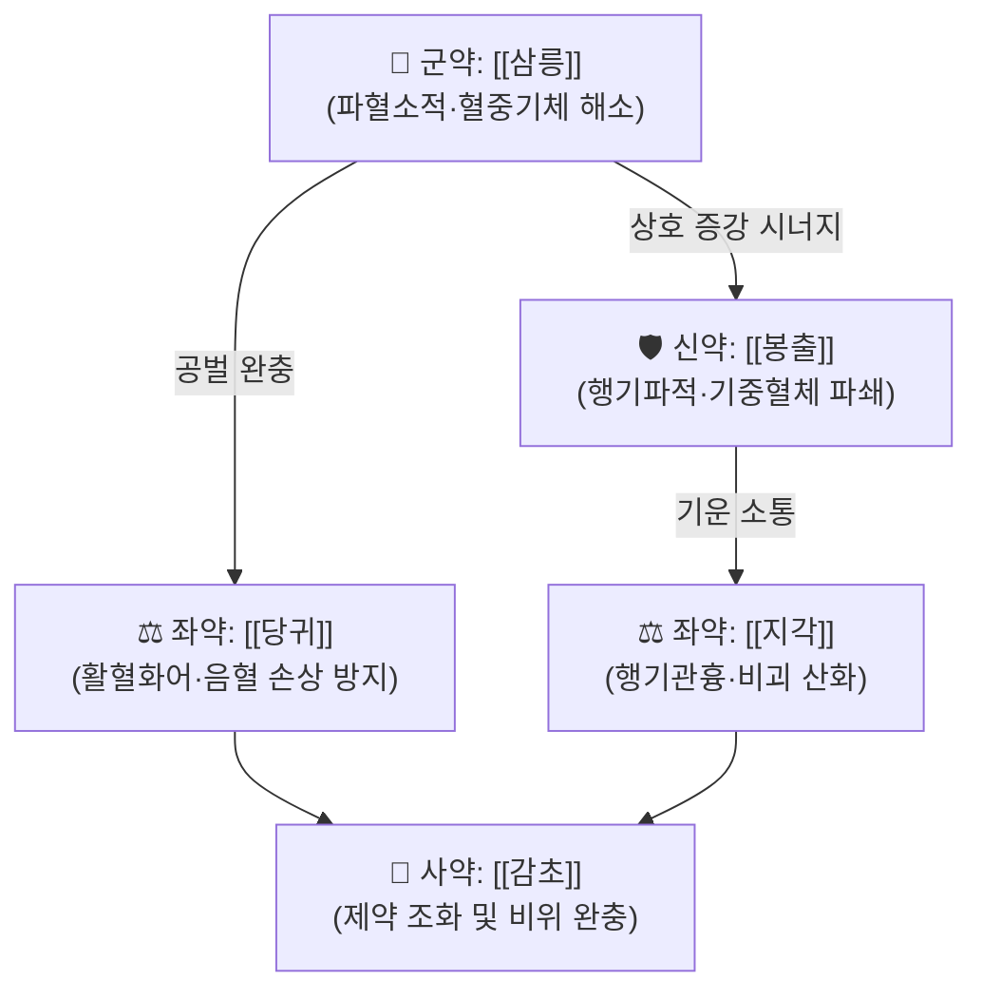

# 🍵 [[삼릉봉출산]] (三稜蓬朮散, Sanling Fengzhu San)

> **핵심 3줄 요약 (Key Summary)**:
> - 🌿 [[삼릉]]과 [[봉출]](아출)을 군약으로 하여 기혈(氣血)의 응체와 징가적취(癥瘕積聚)를 강력하게 파쇄하는 파혈행기(破血行氣)의 대표 방제.
> - 🎯 만성 복강내 종괴, 자궁근종, 자궁내막증, 식적비괴(食積痞塊) 및 복부 혈어(血瘀)로 인한 극심한 고정성 자통 환자에게 활용.
> - 🔬 세스퀴테르펜 성분(쿠르쿠메놀, 저머크론 등)의 혈소판 응집 억제, 섬유화 억제, VEGF 억제 및 종양 미세환경 개선 작용.
> - ⚠️ 주의사항: 파혈 공벌력이 극렬하므로 임산부 절대 복용 금기(유산 위험), 정기(正氣)가 허약한 자는 보기제 합방 필수.

---

## 📌 목차
1. [기본 처방 정보 & 군신좌사 구성](#1-기본-처방-정보--군신좌사-구성)
2. [방제학적 약재 상호작용 & 시너지 네트워크](#2-방제학적-약재-상호작용--시너지-네트워크)
3. [현대 분자약리학적 효능 & 작용 기전](#3-현대-분자약리학적-효능--작용-기전)
4. [적응 병증 및 체질별 감별 (Sweet Spot vs 금기)](#4-적응-병증-및-체질별-감별-sweet-spot-vs-금기)
5. [유사 처방군 감별 매트릭스](#5-유사-처방군-감별-매트릭스)
6. [임상 가감례 & 현대 질환별 응용](#6-임상-가감례--현대-질환별-응용)
7. [출처 및 학술 참고 문헌 (References)](#7-출처-및-학술-참고-문헌-references)

---

## 1. 기본 처방 정보 & 군신좌사 구성

| 구분 | 약재명 | 용량(비율) | 본초 효능 & 방제 내 역할 |
| :--- | :--- | :--- | :--- |
| **군약 (君藥)** | [[삼릉]] | 8g | 파혈거어(破血祛瘀), 혈중기체(血中氣滯) 파쇄 및 적취 소멸 |
| **신약 (臣藥)** | [[봉출]] | 8g | 행기파혈(行氣破血), 소적지통(消積止痛), 기중혈체(氣中血滯) 제거 |
| **좌약 (佐藥)** | [[당귀]] | 6g | 활혈화어(活血和瘀), 어혈을 없애면서도 새로운 혈액 생성을 돕고 혈관 손상 방어 |
| **좌약 (佐藥)** | [[지각]] | 6g | 이기관흉(理氣寬胸), 기의 승강을 원활히 하여 뭉친 적괴(積塊)를 흩뜨림 |
| **사약 (使藥)** | [[감초]] | 4g | 제약 조화, 군신약의 맹렬한 파벌성 완화 및 위장관 점막 보호 |

---

## 2. 방제학적 약재 상호작용 & 시너지 네트워크

* **삼릉 + 봉출 상수(相須) 배오**: [[삼릉]]은 혈(血)을 주관하여 파혈(破血)에 특화되고, [[봉출]]은 기(氣)를 주관하여 행기(行氣)에 특화되므로, 두 약재가 합쳐져 기혈(氣血)이 엉켜 생긴 오랜 만성 적취와 징가(단단한 종괴)를 강력히 깎아냅니다.
* **당귀·감초의 완충 기전**: 파혈제 특유의 정혈(精血) 손모와 위장 점막 손상을 막기 위해 [[당귀]]로 양혈화혈(養血和血)하고 [[감초]]로 비위를 보익합니다.

---

## 3. 현대 분자약리학적 효능 & 작용 기전

* **혈소판 응집 억제 및 미세순환 개선**:
  * 삼릉의 플라보노이드 및 봉출의 세스퀴테르펜 성분이 트롬복산 $A_2$($TXA_2$) 합성을 억제하고 혈류 점도를 낮추어 복강 내 미세혈관 울혈을 해소합니다.
* **섬유화 억제 및 세포외기질(ECM) 분해**:
  * TGF-$\beta1$/Smad 신호 경로를 차단하여 섬유아세포의 비정상적 증식을 억제하고, 콜라겐 침착을 줄여 자궁선근증 및 복강 유착 형성을 방지합니다.
* **신생혈관 억제(Anti-angiogenesis)**:
  * VEGF 및 bFGF의 전사 발현을 억제하여 비정상적으로 증식하는 이소성 자궁내막 조직이나 종괴 주변의 혈관 신생을 억제합니다.

---

## 4. 적응 병증 및 체질별 감별 (Sweet Spot vs 금기)

### [✅ 최적 적응증 (Sweet Spot)]
* **적응 병증**: 자궁근종, 자궁선근증, 만성 골반염으로 인한 하복부 종괴, 간비종대(肝脾腫大), 식적성 복부 비괴.
* **설진·맥진**: 혀 가장자리에 어반(瘀斑, 자흑색 반점)이 완연하고 설태는 후니하며, 맥상은 침삽(沈澁)하거나 현긴(弦緊)한 실증(實證) 어혈 환자.
* **복진 소견**: 하복부나 늑골 아래에 손으로 만져지는 단단한 저항감과 압통(거안, 拒按).

### [⚠️ 신중 투여 및 금기 (Caution / Contraindication)]
* **임산부 절대 금기**: 강력한 자궁 수축 및 파혈 작용으로 태아 유산 위험.
* **출혈성 경향자 금기**: 월경 과다 환자, 소화성 궤양 출혈기, 혈우병 등 출혈 질환자.
* **기혈허약자 신중 투여**: 몸이 몹시 마르고 기력이 쇠약한 환자는 단독 복용 시 정기가 손상되므로 반드시 [[사군자탕]]이나 [[사물탕]] 등 보기보혈제를 배합하여 공보겸시(攻補兼施)해야 함.

---

## 5. 유사 처방군 감별 매트릭스

| 처방명 | 핵심 구성 차이 | 주치 병증 차이 | 설진/맥진 감별 |
| :--- | :--- | :--- | :--- |
| [[삼릉봉출산]] | 삼릉, 봉출, 당귀, 지각 | 기혈응체, 단단한 복부 만성 종괴·비괴 | 설암자 어반, 맥침삽·현 |
| [[계지복령환]] | 계지, 복령, 목단피, 도인, 작약 | 하초 어혈, 월경불순, 골반염, 어혈성 요통 | 설자(紫), 맥침현·미삽 |
| [[당귀수산]] | 당귀, 적작약, 오약, 향부자, 소목, 홍화 | 급성 외상, 타박상, 염좌, 피하 출혈 | 설태박백, 맥현삽 |
| [[혈부축어탕]] | 도홍사물탕 + 사역산 + 길경, 우슬 | 흉중혈어(胸中血瘀), 완고한 두통, 가슴 답답함 | 설자어, 맥현삽 |

---

## 6. 임상 가감례 & 현대 질환별 응용

* **자궁근종 및 자궁선근증**: [[계지복령환]]과 합방하여 투약하며, 통증이 심할 경우 [[현호색]], [[몰약]]을 가미.
* **식적(食積) 및 소화기 종괴**: 복부 팽만과 소화불량이 동반되면 [[산사]], [[신곡]], [[맥아]]를 각 6g 가미하여 소도(消導)력 증강.
* **체력 저하 및 정기 허약**: 만성 소모성 상태에서는 [[황기]], [[백출]]을 각 8g 가미하여 정기를 보호하면서 어혈을 깎아냄.

---

## 7. 출처 및 학술 참고 문헌 (References)

1. Zhang, Y., et al. (2017). "Curcumol from Rhizoma Curcumae attenuates liver fibrosis by regulating TGF-beta/Smad pathway." *Journal of Ethnopharmacology*, 203, 230-238.
   - [연구 요약] 봉출(아출)의 주성분 쿠르쿠메놀이 TGF-beta 신호를 억제하여 조직 섬유화와 콜라겐 침착을 억제함을 증명.
2. Tao, J., et al. (2019). "Sparganii Rhizoma and Curcumae Rhizoma: A review of ethnopharmacology, phytochemistry and pharmacology of a classic herb pair." *Phytotherapy Research*, 33(7), 1735-1755.
   - [연구 요약] 삼릉과 봉출 배오가 혈소판 응집 억제, 종양 세포 증식 저해 및 항섬유화 시너지를 나타냄을 체계적으로 고찰.
