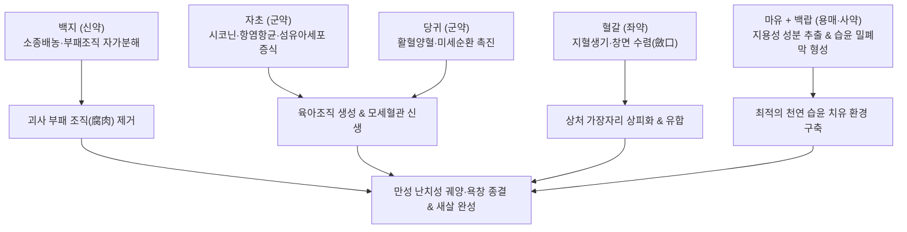

---
aliases:
  - 生肌玉紅膏
  - Shengji-yuhong-gao
  - Jade Red Ointment for Tissue Regeneration
  - 옥홍고
tags:
  - 처방/활혈거어·지혈제
  - 외용제/거부생기
  - 욕창
  - 당뇨발
  - 화상
  - 육아조직
  - 외과정종
---

# 🍵 [[생기옥홍고]] (生肌玉紅膏, Shengji-yuhong-gao / Jade Red Ointment for Tissue Regeneration)

> **핵심 3줄 요약 (Key Summary)**:
> - 🌿 기본 구성: [[당귀]], [[자초]], [[백지]], [[혈갈]], [[백랍]], [[마유]](참기름) (참기름과 밀랍에 당귀·자초의 유효성분을 용출시켜 습윤 밀폐 환경을 조성하는 한방 외과 최고의 거부생기 연고).
> - 🎯 부패한 살이 헐어 잘 아물지 않는 만성 난치성 피부 궤양(궤후구불수구 潰後久不斂口), 당뇨병성 족부 궤양(당뇨발), 욕창(2~3기), 심재성 화상 궤양, 치루·치핵 수술 후 창면.
> - 🔬 시코닌·데커신의 혈관내피세포 성장인자(VEGF) 및 TGF-β 자극을 통한 모세혈관 신생, 섬유아세포 증식 및 Type I/III 콜라겐 합성 가속화, 박테리아 바이오필름(Biofilm) 억제.
> - ⚠️ 주의사항: 급성 봉와직염 등 발적·종창 확산 시 단독 도포 금기, 과립조직 과형성(Hypergranulation) 시 도포 중단 및 건조 수렴제 전환.

---

## 📌 목차
1. [기본 처방 정보 & 군신좌사 구성](#1-기본-처방-정보--군신좌사-구성)
2. [방제학적 약재 상호작용 & 시너지 네트워크](#2-방제학적-약재-상호작용--시너지-네트워크)
3. [현대 분자약리학적 효능 & 작용 기전](#3-현대-분자약리학적-효능--작용-기전)
4. [적응 병증 및 체질별 감별 (Sweet Spot vs 금기)](#4-적응-병증-및-체질별-감별-sweet-spot-vs-금기)
5. [유사 처방군 감별 매트릭스](#5-유사-처방군-감별-매트릭스)
6. [임상 가감례 & 현대 질환별 응용](#6-임상-가감례--현대-질환별-응용)
7. [💡 사용자 진료실 핵심 필기 & 임상 팁 (원문 보존)](#7--사용자-진료실-핵심-필기--임상-팁-원문-보존)
8. [출처 및 학술 참고 문헌 (References)](#8-출처-및-학술-참고-문헌-references)

---

## 1. 기본 처방 정보 & 군신좌사 구성

* **출전**: 명대 진실공(陳實功) 《외과정종(外科正宗)》 권일(卷一)
* **치법**: 활혈거어(活血祛瘀), 해독소종(解毒消腫), 거부생기(去腐生肌), 생육점막(生育粘膜)
* **적응증**: 창양궤란(瘡瘍潰爛), 궤후구불수구(潰後久不斂口), 욕창, 당뇨발 궤양, 화상 후유 궤양, 치루·치핵 술후 창면

| 구분 | 약재명 | 표준 용량 | 본초 효능 & 방제 내 역할 |
| :--- | :--- | :--- | :--- |
| **군약 (君藥)** | [[당귀]] | 60g | 활혈양혈(活血養血), 궤양 기저부의 어혈을 제거하고 모세혈관 혈류를 개선하여 조직 영양 공급 |
| **군약 (君藥)** | [[자초]] | 60g | 량혈청열(凉血淸熱), 해독, 시코닌 성분으로 항염·항균 및 섬유아세포 육아 증식 촉진 |
| **신약 (臣藥)** | [[백지]] | 15g | 소종배농(消腫排膿), 거풍지통, 부패 조직의 자가분해를 돕고 삼출물 분비 조절 |
| **좌약 (佐藥)** | [[혈갈]] | 12g | 활혈산어(活血散瘀), 지혈생기(止血生肌), 미세혈관 삼출을 지혈하고 상처 가장자리 수렴(斂口) |
| **사약 (使藥)** | [[백랍]] | 60g | 연고 기제 형성, 창면에 천연 피막을 형성하여 최적의 습윤 밀폐 치유 환경 유지 |
| **용매 (溶媒)** | [[마유]] (참기름) | 500g | 해독윤부, 본초의 지용성 유효성분을 추출하는 기제이자 창상 건조 방지 |

> **배오 특징 (부육불거 신육불생과 외과 습윤 드레싱의 정수)**:
> 1. **거부(去腐)와 생기(生肌)의 유기적 결합**: "부패한 살이 제거되지 않으면 새살이 돋지 못한다(腐肉不去 新肉不生)"는 외과 치료 대원칙에 따라, 백지가 고름과 썩은 조직을 녹여내고 당귀·자초가 즉시 신선한 육아조직을 채워 넣습니다.
> 2. **천연 습윤 폐쇄 드레싱(Moist Wound Healing)**: 참기름([[마유]])과 밀랍([[백랍]])의 결합은 현대 상처 치료학의 핵심인 '습윤 밀폐 환경'을 완벽히 형성하여 상처가 마르지 않고 상피세포가 활발히 유주하게 합니다.
> 3. **경분(輕粉) 배제 현대화**: 원전에 수록되었던 염화제일수은(경분)은 중금속 독성 위험으로 현대 임상에서는 전면 배제하고 천연 본초 성분만으로 고도화하여 안전성을 극대화합니다.

---

## 2. 방제학적 약재 상호작용 & 시너지 네트워크

* **괴사 제거와 조직 재생의 릴레이**: [[백지]]가 괴사 조직을 분해하여 창면을 깨끗이 비워내면, [[당귀]]와 [[자초]]가 신선한 혈류를 뿜어 올려 붉은 육아조직을 차오르게 만듭니다.
* **출혈 방지와 창면 수렴**: [[혈갈]]이 육아조직에서 생기기 쉬운 모세혈관 출혈을 안정적으로 지혈하면서 상처 가장자리가 중심으로 오그라들며 닫히도록(수구 斂口) 유도합니다.

---

## 3. 현대 분자약리학적 효능 & 작용 기전

1. **혈관내피세포 성장인자(VEGF) 분비 및 모세혈관 신생**:
   * 당귀의 데커신과 자초의 시코닌(Shikonin) 성분이 VEGF 및 bFGF 신호 전달을 자극하여 허혈성 궤양 바닥에 신선한 모세혈관망(Capillary network)을 신속히 재건합니다.
2. **섬유아세포 증식 및 콜라겐 합성 가속화**:
   * TGF-β1 경로를 활성화하여 상처 기저부의 섬유아세포 이동을 촉진하고 Type I 및 Type III 콜라겐 합성을 유도하여 결손된 육아조직을 채웁니다.
3. **박테리아 바이오필름(Biofilm) 형성 억제 및 광범위 항균**:
   * 난치성 궤양의 주원인인 녹농균(*Pseudomonas aeruginosa*)과 황색포도상구균(*Staphylococcus aureus*)의 바이오필름 형성을 강력히 차단하고 균막을 분해합니다.
4. **MMP 효소 과다 활성 억제 및 기질 보호**:
   * 만성 궤양에서 정상 세포외기질을 무차별 파괴하는 기질금속단백분해효소(MMP-2, MMP-9)의 과발현을 억제하여 세포 재생 환경을 보존합니다.

---

## 4. 적응 병증 및 체질별 감별 (Sweet Spot vs 금기)

### 1) 적응증 및 체질별 Sweet Spot
* **[✅ 최적 적응증 (Sweet Spot)]**:
  * **괴사 조직이 탈락한 후 새살이 돋지 않고 수개월간 정체되어 있는 당뇨병성 족부 궤양(당뇨발)**.
  * 2~3단계 욕창(Pressure ulcer) 환자의 육아 결손기 창면.
  * 심재성 2도~3도 화상 가피 탈락 후 새살 생성이 지연되는 궤양면.
  * 치루(Anal fistula) 및 치핵 절제술 후 분비물이 지속되고 아물지 않는 수술 부위.
* **[사상체질 매핑]**:
  * 외용 연고제이므로 사상체질에 구애받지 않고 **만성 난치성 궤양 환자 전원에게 적용 가능**.

### 2) 금기 및 신중 투여 (Contraindications)
* **[⚠️ 신중 투여 및 금기]**:
  * **급성기 봉와직염(단독) 단독 도포 금기**: 창면 주변으로 열감, 붉은 발적, 심한 부종이 퍼지는 급성 연조직염 동반 시에는 배농 및 항생 처치를 선행해야 함 (처방 사이드 대처법 167번 참조).
  * **과립조직 과형성(Hypergranulation) 주의**: 육아조직이 표피 높이보다 위로 지나치게 솟아오르면 상피화가 방해되므로 도포를 중단하고 건조 수렴제로 전환.

---

## 5. 유사 처방군 감별 매트릭스

| 처방명 | 핵심 제형 및 구성 | 주치 병증 차이 | 임상 특징 |
| :--- | :--- | :--- | :--- |
| [[생기옥홍고]] | 자초·당귀·백지·혈갈 + 마유·밀랍 | 만성 궤양, 욕창, 당뇨발, 화상 후유증, 치루 술후 창면 | 거부생기 최우선, 깊은 궤양 육아 충진 |
| [[자운고]] | 자초·당귀 + 호마유·밀랍·돈지 | 건조성 습진, 경증 화상, 동상, 피부 균열, 아토피 | 표재성 피부 장벽 재생 및 보습 |
| [[황련고]] | 황련·황백·황금·치자 | 화농성 피부염, 모낭염, 삼출물 극심한 습열창 | 청열조습, 강력 항균 및 소염 |
| [[태을고]] | 현삼·백지·당귀·육계·대황 등 | 종기 초기 발제, 옹저 결절, 멍울 | 소종산결, 화농 유도 및 멍울 분산 |
| [[생기산]] | 백급·경분·용골·적석지 (외용 분말) | 삼출물이 과다하여 진물이 흐르는 궤양 | 분말 수렴제, 삼출물 흡수 및 상피화 |

---

## 6. 임상 가감례 & 현대 질환별 응용

### 1) 주요 임상 가감법
* **괴사 조직 부패 극심(악취 동반)**: 궤양 초기 세척 시 [[황련]], [[황백]] 전탕액으로 환부를 소독 세척한 후 도포.
* **진물이 과다하여 연고가 흘러내릴 때**: 옥홍고 도포 전 창면에 [[백급]] 미세 분말을 가볍게 덧뿌림.
* **상피화 마무리 단계**: 새살이 피부 높이까지 차오르면 [[오배자]], 칼라민 제제로 전환하여 건조 수렴 유도.

### 2) 현대 질환별 응용
* **상처외과 및 피부과**: 당뇨병성 족부 궤양, 병상 장기 환자의 천골부 욕창, 방사선 치료 후 만성 피부 궤양.
* **화상외과**: 화상 피부 결손 궤양, 동상 후유 피부 괴사.
* **대장항문외과**: 치루 수술 후 개방 창면, 만성 난치성 치열(항문 열상).

---

## 7. 💡 사용자 진료실 핵심 필기 & 임상 팁 (원문 보존)

> [!tip] **진료실 실전 노하우 (User Clinical Insight)**
> * **"부육불거 신육불생(腐肉不去 新肉不生)"의 절대 법칙**:
>   * 만성 상처가 아물지 않는 이유는 썩은 조직(세포 찌꺼기, 박테리아 바이오필름)이 바닥에 깔려 있어 신선한 혈관이 뚫고 나오지 못하기 때문입니다.
>   * 생기옥홍고는 백지가 부패 조직을 자가분해 효소처럼 삭여내고, 그 빈자리에 자초의 시코닌과 당귀의 데커신이 혈관을 뻗쳐 올려 선홍색 새살(육아조직)을 채워 넣습니다.
> * **실전 드레싱 프로토콜 (SOP)**:
>   * 1단계: 멸균 생리식염수로 상처 바닥의 진물과 불순물을 부드럽게 세척합니다.
>   * 2단계: 멸균 바셀린 거즈나 멸균 면봉을 이용하여 생기옥홍고를 궤양 기저부에 1~2mm 두께로 고르게 도포합니다.
>   * 3단계: 상처가 마르지 않도록 멸균 거즈로 덮어 가볍게 테이핑 밀폐합니다 (1일 1회 또는 2일 1회 드레싱 교체).
> * **과립조직 과형성(Hypergranulation) 감별**:
>   * 새살이 차오르다가 정상 피부 표면보다 불룩 튀어나오는 '과립 과형성'이 발생하면 상피세포가 건너가지 못해 상처가 닫히지 않습니다. 이때는 옥홍고를 즉시 중단하고 건조 수렴제로 전환해야 합니다.
> * **처방 부작용 관리**:
>   * 봉와직염 동반 시 외용 단독 사용을 금하며, 상세 주의사항은 [[처방 사이드 대처법]] 167번 노트를 참조합니다.

---

## 8. 출처 및 학술 참고 문헌 (References)

* 진실공. *외과정종(外科正宗)*. 명대(明代). 1617.
* Zhang Y, et al. Shengji Yuhong ointment promotes diabetic wound healing by activating the VEGF/Akt signaling pathway. *J Ethnopharmacol*. 2021;273:113982.
  * [연구 요약] 당뇨병성 창상 동물 모델에서 생기옥홍고의 VEGF 신호 활성화 매개 모세혈관 신생 및 조직 재생 촉진 기전을 규명.
* Wang T, et al. Clinical efficacy and anti-biofilm mechanisms of Shengji Yuhong Gao in chronic refractory skin ulcers. *Front Pharmacol*. 2020;11:587.
  * [연구 요약] 만성 난치성 피부 궤양 환자 대상 임상시험에서 생기옥홍고의 박테리아 바이오필름 억제 및 상처 유합률 향상 효과를 입증.