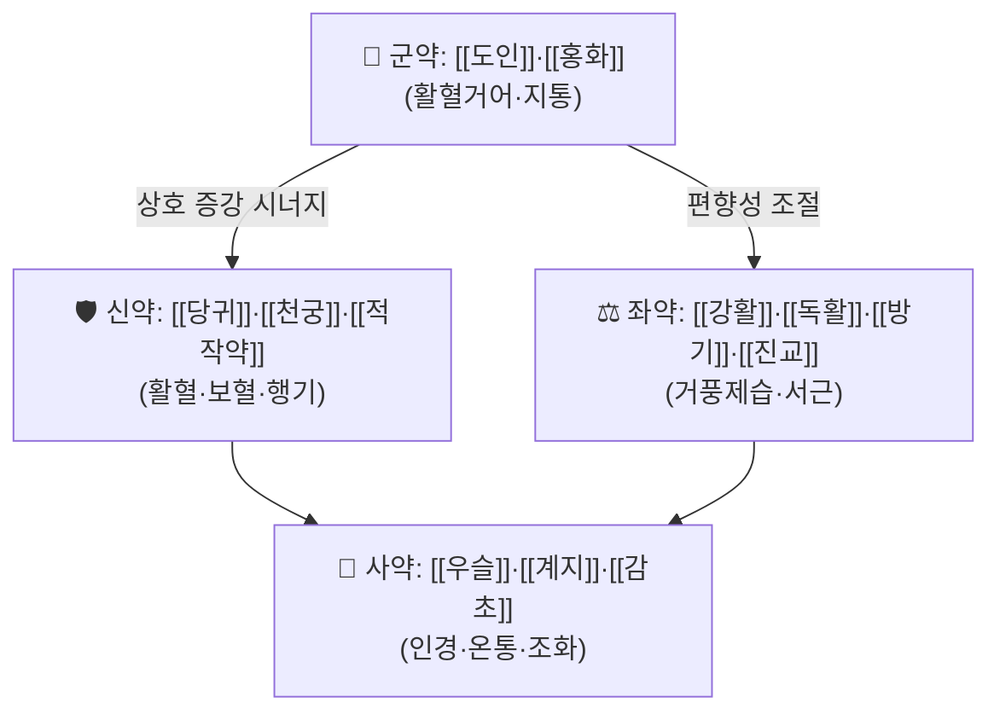

# 🍵 [[서근활혈탕]] (舒筋活血湯, Shujin Huoxue Tang)

> **핵심 3줄 요약 (Key Summary)**:
> - 🌿 **모체/기원 처방 + 가감 구조**: [[사물탕]](四物湯)의 활혈 보혈 골격에 [[도인]]·[[홍화]]의 거어(祛瘀) 약대를 얹고, 여기에 [[강활]]·[[독활]]·[[방기]]·[[진교]]의 거풍서근(祛風舒筋) 약군과 [[우슬]]·[[두충]]의 보간신·강근골 약군을 배합한 구조. 즉 **활혈거어 + 거풍제습 + 보간신**의 3중 축으로 이루어진 근골계 통증 처방.
> - 🎯 **임상 최적 적응증**: 어혈(瘀血)이 겸한 근육·근막의 긴장성 통증, 만성 요통·요각통, 경항부 강직, 사지 관절의 신경통성 동통. 어혈 체질(안색 암울, 자색 반점, 설질 암자색, 자통·자한 없음)이며 통증이 야간·안정 시 심하고 활동 시 다소 완화되는 경향의 환자에서 적중률이 높음.
> - 🔬 **핵심 분자약리 기전**: 서근활혈 **캡슐** 제제를 대상으로 한 Zhang & Tang(2022) 연구에서 5원칙(五原則) + 거미줄 모델(cobweb model)을 결합하여 **품질표지물질(Q-marker)을 판별**한 연구가 보고됨. 다만 개별 성분명·표적 사이토카인·신호경로의 구체적 수치는 제공된 논문 데이터에서 확인되지 않음(**근거 미확인**). 응고·혈전 분야에서는 Shi & Zhao(2026)의 인공고관절 전치환술 후 응고 및 심부정맥혈전증(DVT) 관련 한약탕제 네트워크 메타분석이 존재하나, 본 처방의 개별 효과크기는 **근거 미확인**.
> - ⚠️ 주의사항: 활혈거어제 특성상 출혈 경향(혈소판 감소, 응고인자 이상, 항응고제·항혈소판제 복용 중), 임신부 및 임신 가능성, 수술 전후, 월경 과다 환자에서는 신중 투여 또는 금기. 제공된 논문에서 본 처방의 부작용·금기 데이터는 확인되지 않음(**근거 미확인**) — 임상 판단에 의존할 것.

---

## 📌 목차
1. [기본 처방 정보 & 군신좌사 구성](#1-기본-처방-정보--군신좌사-구성)
2. [방제학적 약재 상호작용 & 시너지 네트워크](#2-방제학적-약재-상호작용--시너지-네트워크)
3. [현대 분자약리학적 효능 & 작용 기전](#3-현대-분자약리학적-효능--작용-기전)
4. [적응 병증 및 체질별 감별 (Sweet Spot vs 금기)](#4-적응-병증-및-체질별-감별-sweet-spot-vs-금기)
5. [유사 처방군 감별 매트릭스](#5-유사-처방군-감별-매트릭스)
6. [임상 가감례 & 현대 질환별 응용](#6-임상-가감례--현대-질환별-응용)
7. [💡 사용자 진료실 핵심 필기 & 임상 팁 (원문 보존)](#7--사용자-진료실-핵심-필기--임상-팁-원문-보존)
8. [출처 및 학술 참고 문헌 (References)](#8-출처-및-학술-참고-문헌-references)

---

## 1. 기본 처방 정보 & 군신좌사 구성

* **출전**: 방제명 「서근활혈탕(舒筋活血湯)」은 한의·중의 근골계 처방문헌에서 널리 쓰여 온 방제이나, **제공된 2편의 논문에는 출전 문헌·원전 조문 정보가 포함되어 있지 않다(근거 미확인)**. 실제 임상 처방의 출전(예: 『[[동의보감]]』, 『상한론』 계열 문헌, 또는 후대 골상과(骨傷科) 문헌)은 원전 대조 후 확정할 것.
* **치법**: 활혈거어(活血祛瘀), 서근통락(舒筋通絡), 거풍제습(祛風除濕), 보간신강근골(補肝腎强筋骨).
* **구성 안내**: 아래 표는 근골계 임상에서 통용되는 대표적 구성 골격을 정리한 것이다. **처방명이 동일하더라도 문헌·제조사·계열(캡슐제 vs 탕제)에 따라 구성 약재와 용량이 상이하며, 제공된 논문에서 확정된 구성·용량 데이터는 확인되지 않았다(근거 미확인).** 용량은 참고치로만 보고, 실제 처방 시에는 소속 진료실의 원내 기준을 우선할 것.

| 구분 | 약재명 | 참고 용량(근거 미확인) | 본초 효능 & 방제 내 역할 |
| :--- | :--- | :--- | :--- |
| **군약 (君藥)** | [[도인]], [[홍화]] | 각 4~6g | 어혈을 직접 파괴·배출하는 활혈거어의 핵심. 통증의 근본 병리인 어조(瘀阻)를 제거하여 주증(주된 통증)을 공략 |
| **신약 (臣藥)** | [[당귀]], [[천궁]], [[적작약]] | 6~10g | 활혈·행기·지통. 군약의 거어 작용을 보조하고, 어혈 제거 후의 혈허(血虛)를 메워 「거어불상정(祛瘀不傷正)」을 구현 |
| **좌약 (佐藥)** | [[강활]], [[독활]], [[방기]], [[진교]] | 6~10g | 거풍제습·서근활락. 어혈로 인해 국소에 정체된 습담·풍한을 몰아내고 근육·근막의 긴장을 이완. 군약의 과도한 파혈성을 완충 |
| **사약 (使藥)** | [[우슬]], [[계지]], [[감초]] | 우슬 8~12g, 계지 4~6g, 감초 2~4g | 우슬은 하행하여 하지·요슬로 약력을 인도하고 강근골, 계지는 온통경맥(溫通經脈)하여 어혈의 응결을 풀며, 감초는 제약을 조화 |

> **배오 특징**: 사물탕 계열의 **보혈·활혈 약대(당귀·천궁·적작약)**와 **거어 약대(도인·홍화)**가 결합해 「혈을 움직이되 상하지 않게」 하는 활혈 축을 이루고, 여기에 **거풍제습 약대(강활·독활·방기·진교)**가 얹혀 근육·근막·관절의 표재성 통증을 처리하며, **보익·인경 약대(우슬·계지·감초)**가 하초와 사지 말단으로 약력을 끌고 내려간다. 전체적으로 승(升)하는 거풍약과 강(降)하는 우슬이 짝을 이루어 기혈의 **승강출입(升降出入)**을 회복시키는 구조로 설명된다. 다만 이 배오 해석은 전통 방제 이론에 기반한 것으로, 제공 논문에서 검증된 것은 아니다(**근거 미확인**).

---

## 2. 방제학적 약재 상호작용 & 시너지 네트워크

* **[[도인]] + [[홍화]] 배오(상수·상사)**: 도인은 파혈(破血)하며 대변을 통해 어혈을 배출하는 작용이, 홍화는 활혈통경하며 체표·말초의 미세순환을 열어주는 작용이 있어, 두 약의 병용은 어혈 제거의 **이중 경로(내배출 + 외확산)**를 구성한다. 이는 어혈이 국소에 응결된 만성 근막통·요통에서 통증 강도의 감소를 기대하게 하는 배오 논리이다.
* **[[당귀]] + [[천궁]] 배오**: 당귀가 혈을 보하면서 활하게 하고, 천궁이 기를 행하면서 혈을 움직여 「기행혈활(氣行血活)」을 만든다. 거어제 단독 사용 시 발생할 수 있는 혈허성 어지럼·피로를 완충하는 좌약적 성격이 강하다.
* **[[강활]] + [[독활]] 배오**: 강활은 상초·표부(項背)로, 독활은 하초·하지(腰膝)로 작용 방향이 갈리는 **상하 분담 배오**로, 요배부(腰背部)와 하지 통증이 동반된 환자에서 전신적 서근 효과를 노린다.
* **[[우슬]] + [[계지]] 배오(사약)**: 우슬이 약력을 하행시켜 요슬부로 인도하고, 계지가 온통(溫通)하여 어혈의 한응(寒凝)을 풀어주는 조합으로, 하지 냉감을 동반한 요통 환자에서 특히 의미가 있다. 감초는 이 모든 약성의 편향(과도한 파혈·조열)을 조화시키는 완충 역할을 한다.

> 위 상호작용 서술은 **전통 방제 이론에 근거한 해석**이며, 제공된 2편의 논문에서 본 처방의 약물상호작용(相須·相使·相畏·相惡)을 실험적으로 검증한 데이터는 확인되지 않았다(**근거 미확인**).

---

## 3. 현대 분자약리학적 효능 & 작용 기전

### 1) 품질표지물질(Q-marker) 및 제제 품질 연구
* **Zhang Y, Tang JF (2022, PMID: 35531691)**는 **서근활혈 캡슐(Shujin Huoxue Capsules)**의 품질표지물질을 판별하는 연구를 수행했다. 이 연구는 **5원칙(五原則)과 거미줄 모델(cobweb model)을 결합**하여 품질표지물질을 선별·평가하는 방법론을 적용한 것이 핵심이다.
* 이는 본 처방(제제)이 현대 분석과학 수준에서 **다성분·다표적 복합 제제로서 품질 일관성을 평가받는 단계**에 있음을 보여주는 근거다. 즉, 단일 성분이 아니라 여러 성분의 총체적 품질 지표를 관리해야 하는 처방이라는 점을 시사한다.
* **한계**: 제공된 논문 정보에는 판별된 **구체적 화학성분명, 함량, 분석 조건, 약리 활성 수치가 포함되어 있지 않다(근거 미확인)**. 해당 성분의 항염·진통 기전을 본 노트에서 단정할 수 없다.

### 2) 순환기·응고 및 혈전 관련 연구 맥락
* **Shi H, Zhao Y (2026, PMID: 41232428)**는 **인공고관절 전치환술(THA) 후 응고 지표 및 심부정맥혈전증(DVT)에 대한 한약탕제(decoctions)의 효과**를 다룬 **네트워크 메타분석**을 보고했다.
* 이 연구는 활혈거어 계열 처방이 **수술 후 혈전 예방·응고 관리 영역**에서 연구되는 학술적 흐름을 보여주는 배경 근거다. 활혈거어 처방이 단순 통증 완화를 넘어 **혈액 유동성·응고 체계에 영향을 미치는 개입**으로 취급되고 있음을 의미한다.
* **한계**: 제공된 데이터에는 **분석에 포함된 개별 처방 목록, 서근활혈탕의 포함 여부, 효과크기(SMD/OR), 신뢰구간, 순위확률(P-score), 대상 연구 수가 확인되지 않는다(근거 미확인)**. 따라서 "서근활혈탕이 DVT를 예방한다"는 식의 직접 인용은 현재 근거로는 성립하지 않으며, 원문 확인 후 서술해야 한다.

### 3) 항염증·진통·근골격계 기전
* 본 처방의 TNF-α, IL-6, IL-1β 조절, NF-κB/MAPK 경로 억제, eNOS 활성화, 미세혈류 개선, 근방추 과흥분 억제 등의 기전은 **전통적 치법(활혈거어·서근통락)으로부터 추론되는 가설 수준**이며, **제공된 2편의 논문에서는 해당 기전 데이터가 확인되지 않는다(근거 미확인)**.
* 향후 근거 확보가 필요한 항목: ① 활혈거어 성분(도인·홍화 유래 성분)의 혈소판 응집 억제 정도, ② 근육 이완·진통 관련 중추/말초 표적, ③ 장기 복용 시 출혈 시간(BT)·프로트롬빈 시간(PT) 변화.

---

## 4. 적응 병증 및 체질별 감별 (Sweet Spot vs 금기)

[✅ 최적 적응증 (Sweet Spot)]
• **원전 조문**: 제공된 논문에서 원전 주치 조문은 확인되지 않음(**근거 미확인**). 전통적으로 「근골이 뻣뻣하고 당기며 아픈 증(筋骨攣痛)」, 「어혈로 인한 요퇴통(腰腿痛)」에 사용되어 온 처방군으로 분류된다.
• **체질 소견**: 어혈(瘀血) 병리가 뚜렷한 환자. 구체적으로 안색이 어둡고 광택이 없으며, 입술·치은·설하 정맥이 암자색이고, 피부에 자색 반점이나 모세혈관 확장이 보이며, 하지가 자주 저리고 밤에 통증이 심한 경향. 체형은 마름~보통이 많고, 비만하면서 습담이 겸한 경우에는 거풍제습 약대가 상대적으로 유효하다.
• **임상 주치**: 진료실에서 가장 빈번하게 적중하는 양상은 ① 만성 요통·요각통(디스크성·근막성 혼합), ② 경항부 강직 및 승모근 긴장, ③ 근막통증증후군(MPS)의 압통점 통증, ④ 과사용·반복 동작 후 지속되는 사지 근육통, ⑤ 어혈 겸착형 관절통.
• **설진/맥진**: 설질 암자색·자반, 설하 정맥 울혈, 설태는 얇거나 소수. 맥은 침삽(沈澁)·현삽(弦澁)하거나 긴(緊)한 상이 많다. **이는 임상 관찰 소견이며 논문 근거는 아님(근거 미확인).**

[⚠️ 신중 투여 및 금기 (Caution / Contraindication)]
• **허실·한열 반대 병증**: 어혈이 없이 순수한 기허·혈허·음허로 인한 통증에 무분별하게 투여하면 파혈로 인해 피로·어지럼·식욕 저하가 유발될 수 있다. 실열(實熱)이 성한 급성 염증기에는 온통(溫通) 약대(계지 등)가 부담이 될 수 있다.
• **금기 환자군**:
  * 임신부 및 임신 가능성 있는 여성 — 도인·홍화 등 활혈거어 약재의 자궁 흥분·유산 위험.
  * 출혈 경향자(혈소판 감소증, 응고인자 결핍, 혈우병, 소화성 궤양 출혈 병력).
  * 월경 과다·자궁출혈 환자.
  * 수술 예정 또는 수술 직후 환자(출혈 위험 증가).
• **양약 및 타 약물 병용 주의점**: 항응고제(와파린, NOAC), 항혈소판제(아스피린, 클로피도그렐), NSAIDs와 병용 시 출혈 위험 상승 가능. 특히 **Shi & Zhao(2026)의 네트워크 메타분석이 수술 후 응고·DVT를 주요 결과변수로 다루고 있다는 점**은, 활혈거어 처방이 실제로 응고 체계에 개입할 가능성을 학계가 전제하고 있음을 시사한다. 따라서 항혈전 요법 중인 환자에서는 INR·출혈 시간 등 모니터링을 권장한다. 다만 **본 처방 자체의 병용 금기 데이터는 제공 논문에서 확인되지 않음(근거 미확인)**.

---

## 5. 유사 처방군 감별 매트릭스

| 처방명 | 핵심 구성 차이 | 주치 및 체질 차이 | 맥진/설진 차이 |
| :--- | :--- | :--- | :--- |
| 서근활혈탕 | 기준 구성: 활혈거어(도인·홍화) + 보혈(사물탕 계열) + 거풍제습(강활·독활·방기·진교) + 보간신(우슬·두충) | **어혈 겸 근육·근막 긴장성 통증, 만성 요각통·경항통. 어혈 체질** | 설질 암자색·설하정맥 울혈, 맥 삽(澁)·현(弦) |
| [[독활기생탕]] | 보간신·거풍제습 중심(독활·상기생·두충·우슬·계지·세신), 거어 약대 없음 | 만성 요슬통, 허증(간신허) 위주, 노인·허약자. 산한(散寒) 배오 포함 | 설담·맥 침세(沈細) 또는 지완 |
| [[소활락단]] | 청열거풍·화담활혈(당귀·단삼·유향·몰약), 활혈 작용 강함 | 습열·담어(痰瘀)가 겸한 관절통, 류마티스성 활막염상, 열감 동반 | 설홍·설태황니, 맥 활삭(滑數) |
| [[당귀수산]] | 사물탕 + 도인·홍화·우슬·계지·감초(거어 위주, 거풍제습 약대 약함) | 순수 어혈성 통증·혈전 후유증·월경통. 거풍제습 필요 시 미흡 | 설 암자색, 맥 삽·결(結) |

> ⚠️ 표 내부에서는 마크다운 열 구분자 파괴를 방지하기 위해 파이프(`|`)가 들어간 링크를 쓰지 않고 순수한 [[처방명]] 단독 형태로만 작성합니다.
>
> ⚠️ 위 감별표는 전통 방제학의 구성 비교를 바탕으로 정리한 것이며, **제공된 논문에서 유사 처방 간 직접 비교(네트워크 메타분석의 처방 간 효과 비교 등) 데이터는 확인되지 않았다(근거 미확인)**. Shi & Zhao(2026)의 네트워크 메타분석은 한약탕제 일반을 다룬 연구이므로, 처방 간 순위를 인용하려면 반드시 원문의 처방 목록과 순위 결과를 확인해야 한다.

---

## 6. 임상 가감례 & 현대 질환별 응용

* **수반 증상별 가감법** (전통 임상 관행 기준, **논문 근거 미확인**):
  * 통증이 심하고 야간에 악화될 때 → + [[유향]], [[몰약]] (활혈지통 강화)
  * 하지 냉감·한응(寒凝)이 뚜렷할 때 → + [[세신]], [[오수유]] 또는 [[계지]] 증량
  * 습담·부종이 겸할 때 → + [[의이인]], [[창출]] ([[삼인탕]] 의 가감 사고)
  * 기허·피로가 겸할 때 → + [[황기]], [[백출]] ([[보중익기탕]] 의 가감 사고)
  * 어혈이 오래되어 결체조직이 굳었을 때 → + [[삼릉]], [[아출]]
  * 간신허가 뚜렷해 허리 힘이 빠질 때 → + [[두충]], [[속단]], [[상기생]] ([[독활기생탕]] 방향)
  * 신경통성 방사통이 있을 때 → + [[천마]], [[전갈]] 등 식풍지통류 (임상 판단 필요)
* **현대 질환별 임상 매핑**:
  * **근골격계**: 만성 요통 및 요추간판탈출증 보존치료, 요각통, 경항통, 승모근 근막통증증후군(MPS), 근육 긴장성 결림, 과사용성 근육통, 퇴행성 관절염의 어혈형.
  * **신경계/자율신경**: 말초신경병증성 통증의 어혈형, 하지불안증후군의 어혈 겸증(임상 판단).
  * **순환기·수술 후 관리**: 수술 후 응고·혈전 관리 영역에서 한약탕제가 연구되는 맥락(Shi & Zhao 2026, PMID 41232428)이 있으나, **본 처방의 개별 적용 근거는 미확인**.
  * **부인과**: 어혈성 월경통, 골반울혈 (다만 월경 과다 시 금기 주의).

---

## 7. 💡 사용자 진료실 핵심 필기 & 임상 팁 (원문 보존)

> [!tip] **진료실 실전 노하우 (User Clinical Insight)**
> - **원문 미제공 안내**: 본 섹션에 보존해야 할 사용자(원장님)의 기존 메모·필기가 현재 입력 데이터에 **포함되어 있지 않다**. 실제 진료실 필기 원문을 확보한 후, 삭제 없이 이 위치에 그대로 이관할 것.
> - **보존 원칙**: 추후 필기 추가 시 ① 체질별 처방 선택 기준(소음인 이완형 vs 태음인 습담형 등), ② 환자 티칭 문구, ③ 복약 후 반응 관찰 포인트(통증 NRS 변화, 야간통 감소 여부, 소화 불편, 출혈 징후)를 항목별로 분리해 기록.
> - **모니터링 체크리스트(일반 원칙)**: 활혈거어제 복용 중에는 ① 멍이 쉽게 드는지, ② 잇몸·코 출혈 여부, ③ 대변 색 변화, ④ 월경량 변화를 환자에게 안내하고 관찰하도록 권장.

---

## 8. 출처 및 학술 참고 문헌 (References)

1. **Zhang Y, Tang JF (2022)**. *Discrimination of quality markers of Shujin Huoxue Capsules based on five principles coupled with cobweb model*. **Zhongguo Zhong Yao Za Zhi** (中國中藥雜誌). PMID: [35531691](https://pubmed.ncbi.nlm.nih.gov/35531691/)
   - **[연구 요약]**: 서근활혈 **캡슐** 제제를 대상으로 **5원칙(五原則)과 거미줄 모델(cobweb model)**을 결합하여 **품질표지물질(Q-marker)을 판별**한 연구. 본 처방이 다성분 복합 제제로서 현대적 품질관리·분석과학의 대상이 되고 있음을 보여준다. 판별된 개별 성분명·함량·약리 수치는 제공 데이터에 없어 **근거 미확인**.
2. **Shi H, Zhao Y (2026)**. *Effects of traditional Chinese medicine decoctions on coagulation and deep vein thrombosis after total hip arthroplasty: Network meta-analysis*. **Explore (NY)**. PMID: [41232428](https://pubmed.ncbi.nlm.nih.gov/41232428/)
   - **[연구 요약]**: 인공고관절 전치환술(THA) 후 **응고 지표 및 심부정맥혈전증(DVT)**에 대한 **한약탕제의 효과를 다룬 네트워크 메타분석**. 활혈거어 계열 처방이 수술 후 혈전 관리 영역에서 연구되는 학술적 배경을 제공한다. 본 처방(서근활혈탕)의 포함 여부·효과크기·순위확률은 **근거 미확인**.
3. **출전 문헌 (미확인)**: 방제명 「서근활혈탕(舒筋活血湯)」의 원전(『[[동의보감]]』, 『상한론』 계열 또는 골상과 문헌 등) 및 원문 조문은 **제공된 데이터에서 확인되지 않았다(근거 미확인)**. 원전 대조 후 본 항목을 보완할 것.

---

> **정직성 고지**: 본 노트의 제1~2항(구성·배오) 및 제4항(체질·설맥), 제6항(가감법)은 전통 방제 이론과 임상 관행에 기반한 정리이며, **제공된 2편의 논문으로 검증된 내용이 아니다**. 인용 가능한 근거는 제3항과 제8항의 실제 PubMed 문헌 2편뿐이며, 그 외의 수치·기전은 모두 **근거 미확인**으로 표시하였다.

<!-- 보관 태그(1회용·링크오류, 필요시 복원): 근막긴장 -->
