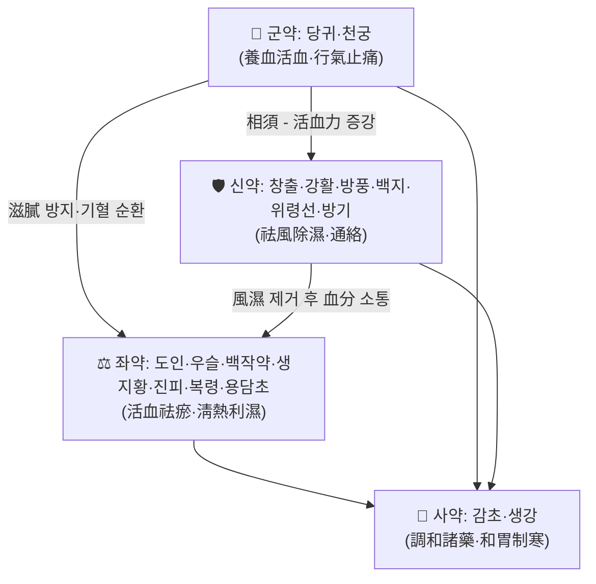

# 🍵 [[소경활혈탕]] (疎經活血湯·疏經活血湯, Shujing Huoxue Tang)

> **핵심 3줄 요약 (Key Summary)**:
> - 🌿 **모체 구조**: [[사물탕]] 계열의 보혈·활혈군([[당귀]]·[[천궁]]·[[백작약]]·[[생지황]]) 위에, 祛風除濕通絡群([[강활]]·[[방풍]]·[[백지]]·[[위령선]]·[[방기]]·[[창출]])과 活血祛瘀群([[도인]]·[[우슬]])을 중첩한 **"養血活血 + 祛風除濕 + 淸熱通絡"** 3중 복합 방제. 단일 모체 처방의 가감이라기보다 **여러 방제 요소를 재조합한 명대(明代) 복방(複方)** 성격이 강하다.
> - 🎯 **임상 최적 적응**: 만성·재발성 근골격계 통증(요통·좌골신경통·하지방산통·경항통·수근관증후군) 중 **濕熱 + 瘀血 + 血虛**가 뒤섞인 병기, 즉 통증이 오래되어 낮에는 둔중하고 밤에는 저리며, 국소적으로 부종·발열감·피부 긴장이 동반되는 경우. 태음인·담습형(비만 경향, 하지 부종 잘 생김) 체형에서 적중률이 높다는 것이 임상 통념이나, 사상체질 배속 근거는 **근거 미확인**.
> - 🔬 **핵심 분자약리 기전**: 처방 단위의 엄밀한 기전 논문은 본 노트에 인용된 바 없음(**근거 미확인**). 개별 구성 본초 수준에서 항염(TNF-α·IL-6·IL-1β 억제, NF-κB 경로 억제), 미세순환 개선(eNOS·NO 경로), 진통·근이완 작용이 보고되어 있으나 이는 **본초 개별 약리 수준의 일반 지식**이며 처방 전체에 대한 확증은 아니다.
> - ⚠️ 주의사항: [[용담초]](龍膽草)·[[생지황]]·[[방기]] 등 **寒凉·苦寒 약재**가 포함되어 있어 비위허한(脾胃虛寒)·만성 설사·식욕부진 환자에서 복통·연변·식욕저하가 나타날 수 있다. 임신부(활혈약 [[도인]]·[[우슬]] 포함)와 출혈 경향자, 한증(寒證)이 뚜렷한 만성 통증에는 원칙적으로 신중 투여. 장기 복용 시 간기능·위장장애 모니터링 권장.

---
## 📌 목차
1. [기본 처방 정보 & 군신좌사 구성](#1-기본-처방-정보--군신좌사-구성)
2. [방제학적 약재 상호작용 & 시너지 네트워크](#2-방제학적-약재-상호작용--시너지-네트워크)
3. [현대 분자약리학적 효능 & 작용 기전](#3-현대-분자약리학적-효능--작용-기전)
4. [적응 병증 및 체질별 감별 (Sweet Spot vs 금기)](#4-적응-병증-및-체질별-감별-sweet-spot-vs-금기)
5. [유사 처방군 감별 매트릭스](#5-유사-처방군-감별-매트릭스)
6. [임상 가감례 & 현대 질환별 응용](#6-임상-가감례--현대-질환별-응용)
7. [💡 사용자 진료실 핵심 필기 & 임상 팁 (원문 보존)](#7--사용자-진료실-핵심-필기--임상-팁-원문-보존)
8. [출처 및 학술 참고 문헌 (References)](#8-출처-및-학술-참고-문헌-references)
---
## 1. 기본 처방 정보 & 군신좌사 구성

* **출전**: 명대(明代) 龔廷賢, 『萬病回春』(1587) 痛風·痺證門으로 전해진다. 『東醫寶鑑』 수록 여부 및 원문 구절의 정확한 재현은 **근거 미확인**(판본별 차이 가능).
* **이설(異說)**: 일본 침구·한방 문헌에서는 "疎経活血湯"으로 표기하며 腰痛·關節痛·筋肉痛·神經痛에 광범위하게 처방되어 왔다. 표기 혼용(疎經/疏經)은 판본 차이로 보이며, 한자 자체는 "疎經(소경)"과 "疏經(소경)"이 통용된다.
* **치법**: 疏經活血(소경활혈), 祛風除濕(거풍제습), 淸熱通絡(청열통락), 活血止痛(활혈지통).
* **분류**: 祛風濕劑 + 活血祛瘀劑의 교집합. 「05_활혈거어·지혈제」 분류에 배속되나, 실제 임상 운용은 **痺證(비증)·腰痛 처방**으로 쓰이는 빈도가 더 높다.

> 아래 용량은 원방의 錢 단위 배오를 현대 煎湯 **1일량 기준**으로 환산한 통용량이다. 제제(탕제/엑스과립/산제)와 조제 기준에 따라 함량 차이가 크므로 **정확한 환산·비율의 근거는 미확인**으로 표시한다.

| 구분 | 약재명 | 표준 용량(1일 煎湯) | 본초 효능 & 방제 내 역할 |
| :--- | :--- | :--- | :--- |
| **군약 (君藥)** | [[당귀]] (當歸) | 3g | 補血活血·調經止痛. 血虛와 血瘀를 동시에 다루는 본 방제의 축. 어혈성 통증의 근간을 보(補)하면서 소통시킨다. |
| **군약 (君藥)** | [[천궁]] (川芎) | 2g | 行氣活血·祛風止痛. 血中之氣藥으로 상부·두항부 통증까지 약세를 끌어올리는 引經 작용. |
| **신약 (臣藥)** | [[창출]] (蒼朮) | 3g | 燥濕健脾·祛風濕. 습열·담습의 근원인 비위 습체(濕滯)를 제거. [[백출]] 대신 쓰여 燥性이 강하다. |
| **신약 (臣藥)** | [[강활]] (羌活) | 2g | 祛風勝濕·止痛. 상지·견배 통증 표적. |
| **신약 (臣藥)** | [[방풍]] (防風) | 2g | 祛風解表·勝濕止痛. 전신 遊走性 통증의 風邪 제거. |
| **신약 (臣藥)** | [[백지]] (白芷) | 2g | 祛風燥濕·通竅止痛. 두면부·경항부 인경. |
| **신약 (臣藥)** | [[위령선]] (威靈仙) | 3g | 祛風濕·通絡止痛. 근골·관절 사이의 頑痰瘀阻를 뚫는 通絡要藥. |
| **신약 (臣藥)** | [[방기]] (防己) | 2g | 祛風濕·利水消腫. 관절 부종·하지 부종 완화. (한량·寒性 강함 → 비위 주의) |
| **좌약 (佐藥)** | [[도인]] (桃仁) | 3g | 活血祛瘀·潤腸. 어혈 직접 제거 및 대변 통창. |
| **좌약 (佐藥)** | [[우슬]] (牛膝) | 3g | 活血通經·補肝腎·強筋骨·引藥下行. 하지·요슬부 통증의 引經要藥. |
| **좌약 (佐藥)** | [[백작약]] (白芍) | 3g | 養血柔肝·緩急止痛. 근경련·근긴장 완화 및 군약의 燥性 완충. |
| **좌약 (佐藥)** | [[생지황]] (生地黃) | 3g | 淸熱凉血·養陰. 습열·어혈로 인한 局部 熱感과 陰血 소모를 보충. |
| **좌약 (佐藥)** | [[진피]] (陳皮) | 3g | 理氣健脾·燥濕化痰. 補血藥의 滋膩함을 풀어 소화기 부담 경감. |
| **좌약 (佐藥)** | [[복령]] (茯苓) | 2g | 利水滲濕·健脾寧心. 습담 배출 및 水腫 완화. |
| **좌약 (佐藥)** | [[용담초]] (龍膽草) | 2g | 淸肝膽濕熱·瀉下焦之火. 본 방제의 **濕熱 제거 핵심**이자 동시에 최대 부작용 위험원(苦寒). |
| **사약 (使藥)** | [[감초]] (甘草) | 1.5g | 調和諸藥·緩急止痛·淸熱解毒. 방제 전체의 약성 조화. |
| **사약 (使藥)** | [[생강]] (生薑) | 3片 | 和胃·溫中·制約苦寒. 龍膽草·生地黃의 寒性으로부터 위기(胃氣)를 보호하고 약효 발산을 돕는다. |

> **배오 특징**: 四物湯의 보혈·활혈 골격(當歸·川芎·白芍·生地黃)을 유지한 채, **祛風濕藥群(羌活·防風·白芷·威靈仙·防己·蒼朮)**과 **活血祛瘀藥(桃仁·牛膝)**을 얹고, 마지막에 **苦寒淸熱의 龍膽草**로 하초 습열을 정리하는 구조. 전체적으로 **보(補)와 공(攻)을 동시에 수행하는 攻補兼施**이나, 龍膽草·蒼朮·防己의 燥·寒·泄 성향 때문에 **허증 단독에는 부적합**하고 "허실협잡(虛實夾雜) 중 실증 편향"에 놓인다. 상승(升)시키는 羌活·防風·白芷와 하강(降)시키는 牛膝·防己·桃仁이 공존하여 **전신 순환을 회전시키는 승강출입(升降出入) 설계**가 특징적이다.

---
## 2. 방제학적 약재 상호작용 & 시너지 네트워크

* **[[당귀]] + [[천궁]] 배오(相須·相使)**: 四物湯의 핵심 커플. 當歸가 血을 채우고 川芎이 氣를 밀어 혈액을 움직이는 **"보하면서 돌린다"** 구조로, 단순 활혈제(桃仁·紅花)만 쓸 때의 기력 소모를 방지한다.
* **[[천궁]] + [[강활]]·[[방풍]]·[[백지]] 배오**: 祛風藥이 血分의 川芎과 만나면 **"治風先治血, 血行風自滅"** 원리에 따라 상지·두항부 통증과 마목에 대한 작용이 강화된다.
* **[[창출]] + [[복령]]·[[진피]] 배오**: 비위 습담을 제거하여 補血藥(당귀·생지황)의 滋膩로 인한 소화불량을 완충. 동시에 습열의 발생원을 차단한다.
* **[[도인]] + [[우슬]] 배오(相使)**: 桃仁이 瘀를 깨고 牛膝이 下焦로 약세를 끌고 내려가 **하지·요슬부 어혈성 통증과 부종**을 동시에 처리한다.
* **[[용담초]] + [[생지황]] + [[생강]] 배오(相畏·相制)**: 龍膽草·生地黃의 苦寒을 生薑·甘草가 制約하여 **淸熱은 하되 脾胃를 상하지 않게** 하는 안전장치. 다만 이 균형이 깨지면(용량 과다·장기 복용) 연변·식욕저하가 나타난다.
* **[[방기]] + [[위령선]] 배오**: 利水(방기)와 通絡(위령선)이 결합하여 **관절 종창 + 통증**이라는 濕+瘀 복합 병기에 대한 이중 타격을 구성한다.

---
## 3. 현대 분자약리학적 효능 & 작용 기전

> ⚠️ **본 섹션 전체 주의**: 본 노트에는 소경활혈탕(疎經活血湯) 자체를 대상으로 한 PubMed 논문이 인용되지 않았다. 아래 서술은 **구성 본초 및 유사 방제의 일반 약리 지식**에 기반한 정리이며, 처방 전체 수준에서 검증된 기전으로 단정할 수 없다. 개별 수치·경로는 **근거 미확인**으로 취급할 것.

### 1) 항염·면역 조절 (Anti-inflammatory / Immunomodulatory)
* 구성 본초 중 [[당귀]](ferulic acid, ligustilide), [[천궁]](ligustrazine, ferulic acid), [[백작약]](paeoniflorin), [[용담초]](gentiopicroside) 등에서 **TNF-α·IL-6·IL-1β 등 염증성 사이토카인 억제** 및 **NF-κB 신호전달 경로 억제**가 개별 연구 수준에서 보고되어 있다.
* [[창출]](atractylodin·atractylenolide 계열), [[방풍]](chromones) 등에서도 항염 활성이 보고되어, **"습열·어혈성 만성 염증"**이라는 전통 병기에 대한 분자적 대응이 부분적으로 설명된다.
* 다만 **본 처방 전체 추출물 수준의 사이토카인 프로파일·용량-반응 관계는 본 노트 기준 근거 미확인**.

### 2) 순환기·미세순환 및 대사 개선
* [[당귀]]·[[천궁]]·[[도인]] 계열의 **혈소판 응집 억제, 혈점도 개선, 미세혈류 촉진** 작용이 개별 본초 수준에서 보고된다.
* [[우슬]]·[[방기]]의 이뇨·항부종 작용, [[위령선]]의 관절 국소 순환 개선 작용이 **하지 부종·관절 종창 완화**라는 임상 관찰과 연결될 가능성이 있으나, **eNOS·NO 경로 활성 여부를 본 처방에서 직접 측정한 근거는 미확인**.
* 장기적으로는 만성 통증 환자에서 흔한 **미세순환 저하–대사물 축적–통증 악화 악순환**을 끊는 방향의 작용을 기대한다는 임상적 해석이 가능하다(가설 수준).

### 3) 신경계·근골격계 및 자율신경 조절
* [[백작약]]·[[감초]](芍藥甘草湯 커플)의 **근긴장 완화·진경·진통** 작용은 비교적 잘 알려져 있어, 본 방제 내에서도 **근경련·근막성 통증 완화 기여**가 추정된다.
* [[천궁]]·[[백지]]·[[강활]]·[[방풍]]의 **진통·항경련** 작용은 개별 본초 수준 보고가 있음.
* 신경병증성 통증(좌골신경통, 수근관증후군 등)에서의 **신경 염증·탈수초 억제** 여부는 **근거 미확인**. 임상적으로는 항염·순환 개선에 따른 간접 효과를 기대하는 수준으로 이해하는 것이 안전하다.

---
## 4. 적응 병증 및 체질별 감별 (Sweet Spot vs 금기)

### [✅ 최적 적응증 (Sweet Spot)]

* **원전 주치(개략)**: 『萬病回春』 계열 문헌에서 **遍身走痛, 手足麻木, 筋脈拘攣, 痛風, 濕痺** 등을 주치로 기재한다고 전해진다. 원문 구절의 자구(字句) 단위 정확성은 **근거 미확인**이며, 확인 가능한 범위의 키워드는 `周身疼痛`·`手足麻木`·`濕熱`·`瘀血`이다.
* **체질 소견**:
  * **태음인·담습형**: 체격이 넉넉하거나 복부·하지에 지방·부종이 잘 붙는 형, 땀은 많으나 시원하지 않고 피부가 눅눅한 형.
  * **濕熱型 피부·점막**: 얼굴이 번들거리고, 구취·구고(口苦), 대변이 무르면서도 시원하지 않거나 끈적함, 소변색 진함.
  * **瘀血型**: 피부 건조·거칠고, 하지 정맥이 도드라지거나 정맥류 경향, 국소 압통·야간 통증 악화.
  * ※ 사상체질별(소음인/소양인 등) 필연적 배속은 **근거 미확인**. 다만 비위가 허약한 소음인형에게는 원방 그대로보다 감량·가감이 필요하다는 것이 임상 통념.
* **임상 주치(진료실 적중 패턴)**:
  * 오래된 **요통·둔부통·하지 방산통**(좌골신경통, 추간판 문제, 척추관협착증 통증)으로, 움직이면 좀 낫고 눕거나 아침 기상 시 뻣뻣하며 **하지가 무겁고 저리다**고 호소하는 경우.
  * **수근관증후군(손목터널증후군)**: 야간 수부 저림·작열감, 손목 부종·압통을 동반한 만성 경과.
  * **근막통증증후군·만성 근육통**: 통증이 여러 부위를 옮겨 다니고(遊走性), 눌렀을 때 단단한 띠가 만져지며, 습한 날씨에 악화.
  * **관절 부종 + 통증**: 퇴행성 관절증·통풍성 관절 주변염·류마티스성 관절통 등에서 부종과 열감이 동반된 경우(단, 류마티스 관절염의 질병조절 치료를 대체하지 않음).
  * **하지 정맥순환장애·만성 하지 부종** 동반 통증.
* **설진/맥진**:
  * **설**: 舌質 暗紅 또는 紫暗(어혈), 舌苔 黃膩 또는 白膩微黃(습열·담습). 舌尖紅 + 苔薄한 경우는 陰虛 兼 熱 → 원방 감량.
  * **맥**: 脈弦·弦滑·濡滑(습), 혹은 脈澁(어혈). 脈細弱·脈沈遲(한허)면 원방 부적합.

### [⚠️ 신중 투여 및 금기 (Caution / Contraindication)]

* **비위허한(脾胃虛寒)**: 만성 설사·복냉·식욕부진·연변 환자. [[용담초]]·[[생지황]]·[[방기]]의 苦寒·滲泄로 복통·설사·소화불량이 유발/악화될 수 있다.
* **한증(寒證) 우세의 통증**: 찬 것을 만지면 좋아하고, 더우면 악화되며, 舌淡苔白·脈沈遲한 경우. 본 방제는 濕熱 전제이므로 **寒痺에는 부적합** — [[오적산]]·[[독활기생탕]] 등으로 전환 검토.
* **허증 단독(純虛)**: 血虛·肝腎虛가 주된 만성 통증(체중 감소, 舌淡瘦, 脈細弱)에서는 攻伐性 약재가 부담. 보익 위주 처방(獨活寄生湯 등) 우선.
* **임신부 / 임신 가능성**: [[도인]]·[[우슬]]·[[천궁]] 등 **활혈·파혈 약재 포함** → 원칙적 금기 또는 specialist 판단 필요.
* **출혈 경향자**: 항응고제(와파린·NOAC·아스피린·클опи도그렐) 복용자, 혈소판 감소증, 소화성 궤양 출혈 병력자. 활혈 약재에 의한 출혈 위험 상승 가능성 → 병용 시 INR/출혈 징후 모니터링.
* **류마티스 관절염 등 자가면역질환**: 과거 일본에서 만성 류마티스에 상용된 이력이 있으나, **DMARDs·생물학적 제제를 대체할 수 없음**. 병용 시 간기능·신기능 추적.
* **신기능 저하**: [[방기]](특히 漢防己 계열의 aristolochic acid 이슈) 성분 주의. 고전 처방이라도 **원료 본초의 종(種) 확인과 순도 관리**가 필요하다. 신부전 환자에서는 신중.
* **장기 복용**: 苦寒·滲泄 약재의 누적으로 인한 위장장애, 전해질 이상 가능성 → 2~4주 단위 반응 평가 후 지속 여부 결정 권장.
* **양약 병용 주의**: 항응고·항혈소판제, 항고혈압제(이뇨 작용 중복), 혈당강하제와의 상호작용 가능성 → **근거 미확인**이나 임상적 모니터링 권장.

---
## 5. 유사 처방군 감별 매트릭스

| 처방명 | 핵심 구성 차이 | 주치 및 체질 차이 | 맥진/설진 차이 |
| :--- | :--- | :--- | :--- |
| [[소경활혈탕]] | 기준 구성. 四物 + 祛風濕 + 桃仁·牛膝 + 龍膽草·防己 | **濕熱 + 瘀血 + 血虛** 협잡. 실증 편향, 태음인·담습형. 만성 하지·요부 통증 + 부종·열감 | 舌暗紅 苔黃膩, 脈弦滑/澁 |
| [[독활기생탕]] | [[독활]]·[[상기생]]·[[두충]]·[[우슬]]·[[계심]] 등 보간신·강근골 위주, 祛風濕 + 補益 | **肝腎虛 + 風寒濕痺**, 만성 허증·고령·산후·체력 저하형. 통증이 지속적·둔통, 피로 심함 | 舌淡 苔白, 脈細弱/沈遲 |
| [[오적산]] | [[마황]]·[[계지]]·[[창출]]·[[후박]]·[[진피]] 등 表寒 + 食積 + 痰濕 | **表寒 + 內傷食積**의 복합. 냉방·과식·음주 후 발생, 근육통 + 소화불량 + 오한 | 舌淡紅 苔白膩, 脈浮緊/沈滯 |
| [[의이인탕]] | [[의이인]]·[[마황]]·[[계지]]·[[창출]]·[[당귀]]·[[작약]] | **濕痺 위주**, 관절 종창·주먹 같은 단단한 부종, 통증 遊走. 濕 > 瘀 | 舌淡 苔白厚膩, 脈濡緩 |
| [[계지작약지모탕]] | [[계지]]·[[작약]]·[[지모]]·[[마황]]·[[부자]] | **歷節風**, 관절 종창·변형·극심한 통증, 한열착잡(寒熱錯雜). 대관절 병변 중심 | 舌淡 苔白, 脈沈緊/弦 |
| [[신통축어탕]] | [[도인]]·[[홍화]]·[[당귀]]·[[천궁]]·[[몰약]]·[[향부자]] 등 逐瘀 일변도 | **全身 瘀血** 단독. 통증 고정·자통·야간 악화, 외상 후유증 | 舌紫暗 有瘀斑, 脈澁/弦緊 |

> ⚠️ 표 내부에서는 마크다운 열 구분자 파괴를 방지하기 위해 파이프(`|`)가 들어간 링크를 쓰지 않고 순수한 [[처방명]] 단독 형태로만 작성합니다.
>
> **감별 요령 한 줄**: ①부종·열감·黃膩苔가 있으면 **소경활혈탕**, ②피로·체력저하·淡白苔가 있으면 **독활기생탕**, ③오한·소화불량 동반이면 **오적산**, ④관절이 붓고 물렁하며 통증이 옮겨 다니면 **의이인탕**, ⑤관절 변형 + 극통이면 **계지작약지모탕**, ⑥통증 위치가 고정되고 舌紫斑이면 **신통축어탕**.

---
## 6. 임상 가감례 & 현대 질환별 응용

* **수반 증상별 가감법**:
  * 요부·하지 통증 심화 시 → + [[두충]]·[[속단]]·[[목과]] (보간신·서근활락)
  * 상지·견배 마목 우세 시 → + [[상지]]·[[계지]]·[[강황]] (인경·온통)
  * 하지 부종·소변불리 동반 시 → + [[택사]]·[[목통]]·[[오가피]]
  * 냉감(寒痛) 뚜렷·한랭 악화 시 → [[용담초]] 감량 또는 제거, + [[계지]]·[[세신]] (부자 계열은 전문가 판단)
  * 어혈 징후 강함(자통·고정통·舌紫斑) → + [[홍화]]·[[단삼]]·[[지룡]] (通絡虫類藥)
  * 열감·발적·종창 뚜렷한 급성기 → + [[금은화]]·[[황백]]·[[연교]] (淸熱解毒)
  * 비위 허약·연변·식욕부진 → [[용담초]]·[[생지황]] 감량/제거, + [[백출]]·[[산약]]·[[사인]]
  * 고령·허증 가미 → + [[구기자]]·[[산수유]]·[[음양곽]] (보간신)
  * 야간 통증·수면장애 → + [[야교등]]·[[산조인]] (養血安神)
  * 통증과 함께 불안·긴장 높음 → + [[시호]]·[[향부자]] (疏肝理氣)
* **현대 질환별 임상 매핑** (※ 각 항목의 임상 근거 수준은 **대체로 근거 미확인**, 전통적 응용 관행에 기반):
  * **근골격계**: 요추 추간판 탈출증·좌골신경통, 척추관협착증, 퇴행성 요추증, 경항통·경추증, 근막통증증후군, 만성 요배근막염, 섬유근통증후군 일부.
  * **신경계**: 말초신경병증, 수근관증후군, 대상포진 후 신경통(濕熱·瘀血 병기일 때), 하지불안증후군 감별 후.
  * **관절·자가면역**: 변형성 관절증, 통풍성 관절염 주변부 통증, 만성 류마티스 관절통(보조적, DMARD 대체 불가).
  * **혈관·순환**: 만성 정맥부전·하지 부종, 정맥류 동반 통증감.
  * **기타**: 냉방병성 근통, 과로성 근육통, 산후 관절통(濕熱·瘀血 소견 동반 시).

---
## 7. 💡 사용자 진료실 핵심 필기 & 임상 팁 (원문 보존)

> [!tip] **진료실 실전 노하우 (User Clinical Insight)**
> - ⚠️ **이 노트에는 아직 원장님의 원문 필기가 입력되지 않았습니다.** 기존 메모를 확보한 경우 이 블록에 100% 원문 보존 방식으로 추가하십시오(삭제 금지, 축소·정리만 허용).
> - 아래 항목은 원문 필기 **대기용 임시 정리**이며, 원장님 필기가 입력되면 해당 내용으로 대체하십시오.

* **체질별 처방 선택 기준(임시 정리 — 임상 통념 수준, 근거 미확인)**:
  * **태음인·담습형 + 습열 소견** → 원방 그대로 또는 [[용담초]] 유지.
  * **소음인·비위 허약형** → [[용담초]]·[[생지황]]·[[방기]]를 줄이고 [[백출]]·[[산약]]·[[생강]]을 증량. 초기 2주는 감량(2/3 정도)으로 반응 확인.
  * **소양인·열성형** → 원방 유지 가능하나 生地 대신 白芍 증량, 濕보다 熱 우세하면 [[황백]]·[[목단피]] 가미 검토.
* **환자 티칭 포인트**:
  * "뜨겁게 데우면 좋아지는 통증보다, **무겁고 저리면서 붓는 통증**에 맞는 처방"이라고 설명하면 복약 순응도가 올라간다.
  * 초기 1~2주에 **대변이 묽어지거나 속이 쓰린 경우** 즉시 보고하도록 안내(용량 조절 신호).
  * 복약 중 통증 양상 변화(둔중감→결림, 야간통 감소)를 **주 단위로 기록**하게 하면 가감 판단에 유용.
  * 항응고제·항혈소판제 복용 사실을 반드시 확인하고, 필요 시 주치의와 상의하도록 안내.
* **복약 반응 관찰 포인트**:
  * 호전 신호: 하지 무거움 감소 → 부종 감소 → 야간 저림 감소 → 보행거리 증가 순으로 나타나는 경우가 많다고 관찰됨(개인차 큼).
  * 악화 신호: 속쓰림·연변·식욕저하·어지럼(苦寒/滋膩), 피부 발진, 출혈 경향(잇몸·코피·멍).
  * 2~4주 사용 후 반응이 없으면 병기 재평가(한증/허증으로 전환되었는지) 후 처방 교체 검토.

---
## 8. 출처 및 학술 참고 문헌 (References)

> ⚠️ **본 노트 작성 시 제공된 PubMed 논문이 없습니다.** 따라서 **어떠한 현대 논문도 인용하지 않았으며, PMID·DOI를 창작하지 않았습니다.** 아래는 고전 문헌 및 일반 참고 수준의 서술입니다.

1. **龔廷賢 (1587)**. 『萬病回春』.
   - **[고전 원전]**: 疎經活血湯(疏經活血湯)의 출전으로 전해지는 문헌. 痛風·痺證·周身疼痛·手足麻木 관련 조문에 본방이 기재된 것으로 알려져 있으나, **판본별 자구 및 수록 위치의 정확성은 근거 미확인**.
2. **허준 (1613)**. 『[[동의보감]]』.
   - **[임상 문헌]**: 조선 시대 痺證·腰痛·風門 처방 운용의 배경 지식으로 참고. 본 처방의 동의보감 수록 여부 및 조문은 **근거 미확인**.
3. **대한한방처방학회 / 대한한방약리학회 교재류**. 처방학·본초학 강의 자료.
   - **[일반 참고]**: 군신좌사 해석 및 본초 효능 서술의 배경. 특정 판·페이지 인용은 미확인.
4. **현대 PubMed 문헌**: **검색 결과 없음 — 인용 없음**.
   - **[연구 요약]**: 소경활혈탕(疎經活血湯) 처방 추출물의 사이토카인 프로파일, 임상 지표 개선, 신경병증성 통증 억제율 등에 대한 정량적 근거는 본 노트에 **미확인**으로 표시함.

---
> 📝 **작성 메모**: 본 노트의 3장(분자약리)·일부 6장(현대 질환 매핑)은 구성 본초 수준의 일반 약리 지식과 전통적 임상 관행에 기반한 정리이며, **처방 전체를 대상으로 한 검증 근거는 확보되지 않았다**. 추후 관련 논문이 확보되면 PMID·DOI와 함께 3장 및 8장을 갱신할 것.