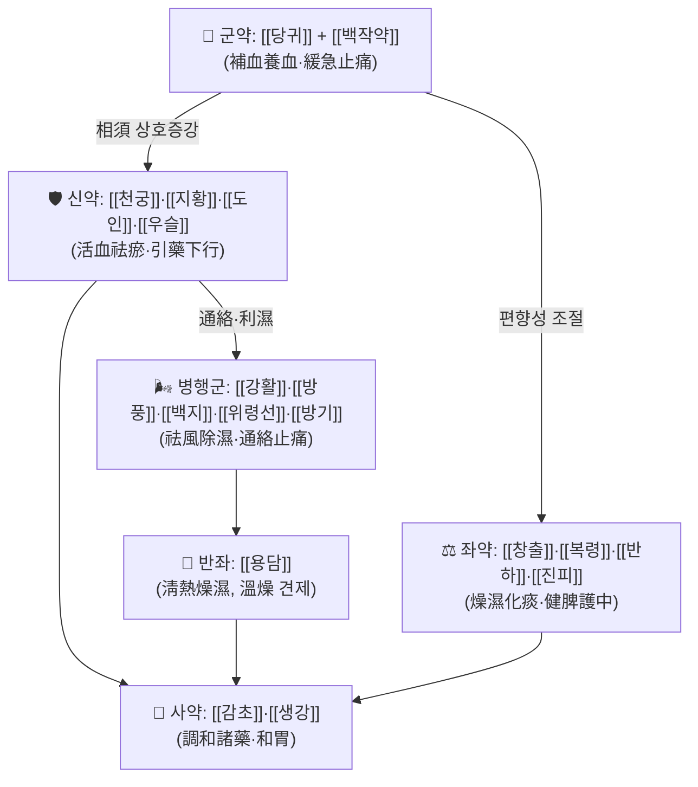

# 🍵 [[소경활혈탕]] (疏經活血湯, Shujing Huoxue Tang / Sokyeong Hwalhyeol-tang)

> **핵심 3줄 요약 (Key Summary)**:
> - 🌿 **[[사물탕]] 골격 + 거풍제습·활혈거어 약군의 복합 배오**: 보혈(補血)의 [[당귀]]·[[백작약]]·[[천궁]]·[[지황]]에 활혈거어(活血祛瘀)의 [[도인]]·[[우슬]], 거풍승습(祛風勝濕)의 [[강활]]·[[방풍]]·[[백지]]·[[위령선]]·[[방기]], 조습화담(燥濕化痰)의 [[창출]]·[[복령]]·[[반하]]·[[진피]], 그리고 소량의 [[용담]]으로 청열(淸熱)을 겸하는 **18味 대복합 방제**. 즉 "補血 + 活血 + 祛風濕 + 化痰 + 淸熱"을 한 처방에 압축한 **만성 근골격계 통증 전용 복합 처방**이다.
> - 🎯 **임상 최적 적응증**: 만성 요통·둔통·하지 방사통(좌골신경통), 저림·당김·탄력 저하를 동반한 관절통·근육통. 체격은 중등도 이상(마르지 않음), 근긴장이 있고 누르면 아픈 **어혈(瘀血) + 습담(濕痰) 겸 거풍(祛風) 표상**이 겹친 환자. 진료실에서는 "허리에서 다리로 내려가는 저림 + 눌러서 아픈 근육 + 찬바람에 심해짐" 조합에서 적중률이 높다(개별 임상 체감도이며 정량 근거는 미확인).
> - 🔬 **핵심 분자약리 기전**: 본 처방 자체를 대상으로 한 PubMed 검색 결과가 **없음** → 처방 단위 기전은 **근거 미확인**. 다만 구성 본초 개별 수준에서는 항염증(TNF-α·IL-6·IL-1β 조절), 미세순환 개선, 진통·근이완 작용이 보고된 바 있으나, 이는 **본초 단독 연구 수준**이며 본 처방의 복합 추출물 효능으로 일반화할 수 없다.
> - ⚠️ 주의사항: 소량의 [[용담]](苦寒)으로 인한 위장장애·식욕저하·설사, [[도인]]·[[우슬]]의 활혈 작용으로 인한 **임신부·출혈 경향자 금기**, 허약·한성(寒性) 체질에서의 장기 투여 주의. [[감초]] 배오로 인한 가성 알도스테론증(부종·혈압상승·저칼륨) 및 타 약물 병용 시 주의.

---
## 📌 목차
1. [기본 처방 정보 & 군신좌사 구성](#1-기본-처방-정보--군신좌사-구성)
2. [방제학적 약재 상호작용 & 시너지 네트워크](#2-방제학적-약재-상호작용--시너지-네트워크)
3. [현대 분자약리학적 효능 & 작용 기전](#3-현대-분자약리학적-효능--작용-기전)
4. [적응 병증 및 체질별 감별 (Sweet Spot vs 금기)](#4-적응-병증-및-체질별-감별-sweet-spot-vs-금기)
5. [유사 처방군 감별 매트릭스](#5-유사-처방군-감별-매트릭스)
6. [임상 가감례 & 현대 질환별 응용](#6-임상-가감례--현대-질환별-응용)
7. [💡 사용자 진료실 핵심 필기 & 임상 팁 (원문 보존)](#7--사용자-진료실-핵심-필기--임상-팁-원문-보존)
8. [출처 및 학술 참고 문헌 (References)](#8-출처-및-학술-참고-문헌-references)

---
## 1. 기본 처방 정보 & 군신좌사 구성

* **출전**: 명대(明代) 공정현(龔廷賢) 『**萬病回春**』(1587)｡ 痛風(통풍·전신 관절통) 문에서 "遍身骨節疼痛(전신 골절 동통)" 및 經絡不通·瘀血痺痛을 주치로 수록된 처방으로 알려져 있다. **『[[동의보감]]』 수록 여부 및 조문 각주는 근거 미확인**(확인 필요).
  * ※ 일본에서는 『萬病回春』 계열 방제가 캄포제제로 정형화되어 **疎経活血湯(소케이캇케츠토)** 로 유통되며, 좌골신경통·요통의 대표 처방으로 자리잡았다. **일본 캄포 처방집과 국내 처방집 간 약재 구성·용량에 차이가 있을 수 있음(근거 미확인, 처방집별 대조 필요)**.
* **치법**: **活血祛瘀(활혈거어), 疏經通絡(소경통락), 祛風除濕(거풍제습), 養血止痛(양혈지통)**, 겸하여 化痰·淸熱.
  * 한마디로 **"經絡을 막고 있는 風·濕·痰·瘀를 풀어내면서, 그 바탕이 되는 血虛를 보하는"** 標本兼治(표본겸치) 구조이다.
* **분류**: 05_활혈거어·지혈제 (통증·근골격계 응용군)
* **전체 처방 규모**: 18味, 일일 총량 약 30g 내외(아래 용량은 일본 캄포제제 기준 환산값이며, 국내 임상 처방에서는 관례적으로 1첩 용량을 더 크게 잡는 경우가 많음).

| 구분 | 약재명 | 표준 용량 | 본초 효능 & 방제 내 역할 |
| :--- | :--- | :--- | :--- |
| **군약 (君藥)** | [[당귀]] (當歸) | 2.0 (임상 4~6g) | 補血活血·調經止痛. 血虛를 채우면서 동시에 어혈을 흩는 **혈액 이중 조절의 중심**. 본 처방의 四物湯 골격을 대표하며, 血行 개선과 진통의 주축을 담당한다. |
| **군약 (君藥)** | [[백작약]] (白芍藥) | 2.5 (임상 4~6g) | 養血斂陰·柔肝·緩急止痛. 근육의 긴장·경련을 풀어 **"당기는 통증(攣痛)"** 을 직접 완화. 甘草와 배합 시 芍藥甘草湯 類의 緩急 작용을 방제 내부에 내장한다. |
| **신약 (臣藥)** | [[천궁]] (川芎) | 2.0 | 活血行氣·祛風止痛. 血中之氣藥으로서 **기혈 동시 순환**을 유도하고, 두통·항강 등 상부 통증까지 커버. 四物湯의 行血 축. |
| **신약 (臣藥)** | [[지황]] (生地黃/熟地黃) | 2.0 | 滋陰補血·凉血. 血虛 바탕을 보강하되, 凉性으로 燥性 약물(羌活·蒼朮·白芷)의 편향을 눌러준다. |
| **신약 (臣藥)** | [[도인]] (桃仁) | 1.5 | 活血祛瘀·潤腸通便. 어혈성 통증의 핵심 표적 약재. 血滯를 직접 깨뜨린다. |
| **신약 (臣藥)** | [[우슬]] (牛膝) | 1.5 | 活血通經·補肝腎·强筋骨·引藥下行. **"下로 끌어내리는" 引經藥**으로 하지·요부 병소에 약효를 집중시킨다. |
| **좌약 (佐藥)** | [[강활]] (羌活) | 1.5 | 祛風勝濕·散寒止痛. 상부·배부(肩背) 風濕 통증 표적. |
| **좌약 (佐藥)** | [[방풍]] (防風) | 1.5 | 祛風解表·勝濕止痛. 전신의 風을 흩어 관절 주유 통증 완화. |
| **좌약 (佐藥)** | [[백지]] (白芷) | 1.5 | 祛風散寒·燥濕止痛·通鼻竅. 頭面·前頭部 통증 및 습담 제거. |
| **좌약 (佐藥)** | [[위령선]] (威靈仙) | 1.5 | 祛風濕·通絡止痛. **"十二經絡을 주유한다"** 고 표현되는 通絡 약재로, 관절 운동 제한·저림에 배오. |
| **좌약 (佐藥)** | [[방기]] (防己) | 1.5 | 祛風濕·利水消腫. 하지 부종·무거움, 관절 삼출감 완화. |
| **좌약 (佐藥)** | [[창출]] (蒼朮) | 2.0 | 燥濕健脾·祛風發汗. 습담의 근원인 脾를 조습하여 몸의 重着感(무거움)을 개선. ※ 국내 처방집에서는 [[백출]]로 대체· 혼용되는 경우가 있음(처방집별 차이, 확인 필요). |
| **좌약 (佐藥)** | [[복령]] (茯苓) | 2.0 | 利水滲濕·健脾寧心. 습을 소변으로 배출하고 脾胃 보호. |
| **좌약 (佐藥)** | [[반하]] (半夏) | 2.0 | 燥濕化痰·降逆止嘔. 담음(痰飮)이 근골에 몰린 상태를 겨냥. |
| **좌약 (佐藥)** | [[진피]] (陳皮) | 2.0 | 理氣健脾·燥濕化痰. 기체(氣滯)로 인한 순환 정체를 개선하고 滋膩한 當歸·地黃의 체기(滯氣)를 방지. |
| **좌약 (佐藥)** | [[용담]] (龍膽) | 1.0 | 淸熱燥濕·瀉肝膽火. **소량**을 써서 濕熱을 제거하고 羌活·防風·蒼朮의 溫燥 편향을 중화하는 **反佐 약재**. |
| **사약 (使藥)** | [[감초]] (甘草) | 1.0 | 調和諸藥·緩急止痛·補脾和中. 芍藥과 배합해 止痛, 전 약재의 독성·자극 완충. |
| **사약 (使藥)** | [[생강]] (生薑) | 1.0 | 發散風寒·和胃止嘔·制半夏毒. 半夏·陳皮와 함께 위기(胃氣)를 지키며 약성을 전달. |

> **배오 특징**: 본 처방은 **四物湯(당귀·백작약·천궁·지황)을 君·臣 축으로 깔고**, 그 위에 ①거풍제습군(강활·방풍·백지·위령선·방기·창출), ②화담이기군(반하·진피·복령), ③활혈거어군(도인·우슬), ④청열반좌약(용담), ⑤조화군(감초·생강)을 적층한 **다층 복합 구조**이다.
> 승강(升降)의 관점에서 보면, 羌活·防風·白芷·蒼朮은 **升散(위로 뻗어 風濕을 흩음)**, 牛膝·防己·茯苓은 **降利(아래로 濕을 내림)** 하여 升降의 균형을 이루고, 龍膽의 苦寒이 溫燥의 과열을 식히는 **寒熱 평형**을 갖춘다. 즉 **"막힌 곳을 뚫되(疏經通絡), 깎아내지 않고(不傷正), 속을 지키는(護脾胃)"** 설계 철학이 반영된 처방이다.

---
## 2. 방제학적 약재 상호작용 & 시너지 네트워크

* **[[당귀]] + [[백작약]] 배오**: 相須(상수) 관계. 當歸가 血을 動하게 하고 白芍이 血을 收하게 하는 **一動一收**의 조합으로, 血을 움직이되 소모시키지 않는다. 白芍 + 甘草는 방제 내부에 芍藥甘草湯的 緩急止痛 작용을 내장하여 **근긴장·경련성 통증**을 겨냥한다.
* **[[천궁]] + [[당귀]] + [[도인]] + [[우슬]] 배오**: 相使 관계. 川芎의 行氣活血이 當歸·桃仁의 祛瘀를 밀어주고, 牛膝이 이를 下焦·腰膝으로 끌고 내려간다. 즉 **"활혈(活血) → 유도(引經) → 침착(病所)"** 의 3단 경로를 형성한다.
* **[[창출]] + [[복령]] + [[반하]] + [[진피]] 배오**: 二陳湯類의 化痰 조합. 人參·白朮이 없는 대신 蒼朮로 脾를 燥하게 하여, **담습(痰濕)이 많고 몸이 무거운 환자**에게 적합하도록 설계되었다. 동시에 當歸·地黃의 滋膩로 인한 胃滯를 방지하는 **부작용 완충 장치** 역할을 겸한다.
* **[[강활]] + [[방풍]] + [[백지]] 배오**: 羌活湯類의 祛風 삼합. 風寒濕邪가 肌表·經絡에 남아 있는 **"찬바람 맞으면 심해지는 통증"** 의 표적이다.
* **[[위령선]] + [[방기]] + [[우슬]] 배오**: 通絡 + 利水 + 下行. 하지의 무거움·부종·저림이라는 **水濕 + 瘀血 혼합 병리**에 대한 직접적 대응군이다.
* **[[용담]] (소량) + [[감초]]·[[생강]] 배오**: 苦寒의 龍膽이 溫燥 약군의 편향을 누르고, 甘草·生薑이 그 苦寒이 胃를 상하게 하는 것을 **선제적으로 차단**하는 조합. **"燥하지도, 차지도 않게"** 만드는 미세 조정 장치이다.

---
## 3. 현대 분자약리학적 효능 & 작용 기전

> ⚠️ **중요 고지**: 아래 내용은 **본 처방(疏經活血湯)에 대한 PubMed 검색 결과가 존재하지 않아**, 처방 단위의 분자약리 기전·임상 지표는 **근거 미확인**이다. 이하 서술은 ①한방 병리 추론, ②**구성 본초 개별 수준의 일반 약리 지식**, ③인접 처방군(四物湯·二陳湯 등)의 문헌적 유추에 근거한 것으로, **반드시 "처방 = 개별 본초의 단순 합"이 아님**을 전제로 읽어야 한다. 수치·유의성 있는 결과는 제시하지 않는다.

### 1) 항염증·면역 조절 (본초 개별 수준, 처방 차원 근거 미확인)
* 구성 본초 중 [[당귀]]·[[천궁]]·[[백작약]]·[[방풍]] 등의 개별 추출물에서 **NF-κB 신호전달 억제, COX-2/iNOS 발현 저하, TNF-α·IL-6·IL-1β 등 염증성 사이토카인 감소**가 보고된 바 있다(개별 본초 연구 수준).
* [[용담]]의 苦寒 성분(iridoid 계열)은 濕熱 상태의 염증 반응 억제와 관련하여 연구된 바 있다.
* **처방 복합 추출물에서의 재현성·임상적 유효성은 근거 미확인.**

### 2) 순환기·미세순환 및 대사 개선 (본초 개별 수준, 처방 차원 근거 미확인)
* [[도인]]·[[우슬]]·[[천궁]]·[[당귀]] 계열은 전통적으로 **活血化瘀 = 미세순환 개선**으로 해석되며, 혈소판 응집 억제·혈류 개선 방향의 개별 연구가 존재한다.
* [[복령]]·[[방기]]·[[창출]]의 利水滲濕 작용은 이뇨·부종 감소 및 조직 내 수분 정체 완화와 연결지어 설명된다.
* **eNOS 활성화, 혈관 평활근 이완, 미토콘드리아 에너지 대사 정상화 등 구체 경로는 본 처방에 대해 근거 미확인**이며, 타 처방·단일 화합물 데이터로부터의 유추에 해당한다.

### 3) 신경계·근골격계 및 진통 기전 (본초 개별 수준, 처방 차원 근거 미확인)
* [[백작약]]의 paeoniflorin, [[감초]]의 glycyrrhizin 계열 화합물은 **진경·진통·근이완** 방향의 개별 연구가 다수 존재하며, 이는 임상적으로 "당기는 통증 완화"에 대응하는 것으로 해석된다.
* [[강활]]·[[방풍]]·[[백지]]의 祛風止痛 작용은 말초 신경 흥분 억제·항염증 통증 경로와 연결지어 설명된다.
* **근방추 과흥분 억제, HPA축 항상성 회복, 신경병증성 통증 표적(P2X, TRP 채널 등) 조절은 본 처방에 대해 근거 미확인.**

### 4) 위장관·대사 부작용 관련 (주의 관점)
* [[용담]]의 苦寒 성분은 개별 수준에서 위점막 자극·분비 촉진과 관련될 수 있어, **위장허약자에서 식욕저하·속쓰림·묽은 변**이 나타날 수 있다. 이는 처방 자체의 알려진 임상적 주의점으로 취급한다(정량 근거 미확인).
* [[감초]]의 glycyrrhizin은 장기·대량 투여 시 **가성 알도스테론증(저칼륨혈증·부종·혈압상승)** 위험과 관련되므로, 고혈압·부종·신장질환 환자에서 주의한다.

---
## 4. 적응 병증 및 체질별 감별 (Sweet Spot vs 금기)

### [✅ 최적 적응증 (Sweet Spot)]

* **원전·전통 주치**: 遍身骨節疼痛(전신 골절 동통), 痛風, 經絡不通, 瘀血로 인한 痺痛, 腰脚疼痛, 四肢麻木.
* **핵심 병리 3요소**: **瘀血(어혈) + 濕痰(습담) + 風濕(풍습)** 의 3중 겹침. 이 세 가지가 하나라도 뚜렷하지 않으면 본 처방의 적중률이 떨어진다.

| 감별 축 | Sweet Spot 소견 |
| :--- | :--- |
| **통증 양상** | 쑤시고 찌르는 통증 + **저림·당김·무거움**이 혼재. 누르면 아픈 압통점(근경결)이 뚜렷함. |
| **부위** | **요부 → 둔부 → 하지 후면/외측 방사**(좌골신경통 패턴), 또는 전신 관절 주유. |
| **악화 인자** | **찬바람·습기·저기압**에 악화, 아침에 뻣뻣함, 움직이면 다소 완화. |
| **체격·체질** | 중등도 이상 체격, 근육량이 유지된 편, **태음인 경향**이 많음(비만~표준). 마르고 창백한 少陰人 虛寒에는 부적합한 경우가 많다. |
| **피부·색** | 안색이 어둡거나 唇色·舌下靜脈이 瘀暗, 하지 피부 건조·각질. |
| **동반 증상** | 하지 부종·무거움, 어깨 결림, 소화는 비교적 양호하거나 다소 더부룩함, 변비 경향(桃仁). |
| **설진** | 설질 淡暗~暗紅, 舌下絡脈 瘀滯, 苔 白膩 또는 微黃膩. |
| **맥진** | 弦·緊·澁 계열(긴장·정체), 또는 沈細. **맥이 弦緊하면서 눌러서 저항이 있는 실증~중간증**에서 적합. |

* **임상 주치(진료실 최빈 적중 상황)**: ① 만성 요통·둔통 환자로 **다리 저림과 눌러서 아픈 근육**이 동반된 경우, ② 근골격계 통증이 오래되어 **"낫다가 안 낫다가" 반복**하며 어혈 소견이 있는 경우, ③ 관절통에 **부종·무거움**이 겸해 있는 경우, ④ 한방 초진에서 **한열이 뚜렷하지 않고 복합적인 애매한 통증**에 폭넓게 대응해야 할 때.

### [⚠️ 신중 투여 및 금기 (Caution / Contraindication)]

| 구분 | 내용 |
| :--- | :--- |
| **임신부** | **금기에 준함**. [[도인]]·[[우슬]] 등 활혈거어 약재가 자궁 흥분·출혈 위험과 연결될 수 있음(개별 본초 수준의 통설). |
| **출혈 경향자** | 혈소판 감소, 항응고제 복용 중, 소화관 궤양 출혈 병력, 수술 전후 → 활혈 약군으로 인해 **신중 투여 또는 회피**. |
| **虛寒·허약자 (少陰人 경향)** | 面色蒼白·손발 냉·식욕부진·軟便·脈沈弱한 경우, 苦寒의 龍膽과 淸利하는 防己·茯苓 조합이 **기를 더 소모**시킬 수 있음. 이 경우 [[독활기생탕]]·[[보중익기탕]] 계열이 우선. |
| **濕熱이 극심한 급성 실증** | 고열·관절 紅腫熱痛·발열이 뚜렷한 급성 류마티스 활성기에는 부적합. [[계지작약지모탕]]·[[백호가계지탕]] 계열 고려. |
| **소화기 허약자** | [[용담]]의 苦寒으로 **식욕저하·속쓰림·묽은 변**이 나타날 수 있음. 초기부터 용량을 줄이거나 龍膽을 빼고 투여하는 운용이 필요할 수 있음(임상 관행, 정량 근거 미확인). |
| **[[감초]] 관련** | 장기 투여 시 저칼륨혈증·부종·혈압상승. **고혈압·부종·신장질환·심부전 환자 주의**. |
| **양약 병용** | 항응고제(와파린 등)·항혈소판제와 병용 시 출혈 위험 증가 가능성 → **근거 미확인이나 원칙적 주의**, 반드시 복용 중임을 확인. |
| **한열 반대 병증** | 無汗 高熱 등 表實 熱證, 또는 심한 陰虛火旺에는 溫燥 약군이 해로울 수 있음. |

---
## 5. 유사 처방군 감별 매트릭스

| 처방명 | 핵심 구성 차이 | 주치 및 체질 차이 | 맥진/설진 차이 |
| :--- | :--- | :--- | :--- |
| [[소경활혈탕]] | 기준 구성 (四物 + 祛風濕 + 化痰 + 活血 + 少量 龍膽) | **瘀血 + 濕痰 + 風濕 복합, 실증~중간증, 태음인 경향**, 만성 요통·좌골신경통·관절통 | 苔 白膩/微黃膩, 脈 弦緊·澁 |
| [[독활기생탕]] | 八珍類 補益 + 祛風濕 (獨活·桑寄生·杜仲·牛膝·細辛 등) | **肝腎虛·氣血虛 바탕의 만성 요통·관절통**, 허증 우세, 노인·산후·허약자 | 苔 薄白, 脈 沈細弱 |
| [[계지작약지모탕]] | 桂枝·芍藥·知母·麻黃·附子·白朮 | **관절 腫熱·변형, 류마티스 활성기**, 만성 痺證에 寒熱錯雜 | 苔 薄黃, 脈 弦·浮緊 |
| [[오적산]] | 平胃散 + 二陳湯 + 麻黃·桂枝·當歸·川芎·白芷 등 | **요통 + 寒證·냉증·소화불량 복합**, 태음인 특화, 감모 겸 요통 | 苔 白厚膩, 脈 沈緩·弦 |
| [[당귀수산]] | 歸鬚·桃仁·紅花·大黃·赤芍 등 활혈 위주 | **어혈 단독, 胸脅·腹 자통·변비**, 실증 급성 | 苔 黃, 脈 實·澁 |

> ⚠️ 표 내부에서는 마크다운 열 구분자 파괴를 방지하기 위해 파이프(`|`)가 들어간 링크를 쓰지 않고 순수한 [[처방명]] 단독 형태로만 작성합니다.

**감별 요점 정리**
* **허증이 뚜렷하면 → [[독활기생탕]]**, 실증·복합·어혈담습이면 → **[[소경활혈탕]]**.
* **열감·종창이 뚜렷하면 → [[계지작약지모탕]]**, 냉증·소화 문제 겸하면 → **[[오적산]]**.
* **어혈이 단독 병리이고 변비·자통이 뚜렷하면 → [[당귀수산]]**, 어혈 + 담습 + 풍습의 복합이면 → **[[소경활혈탕]]**.

---
## 6. 임상 가감례 & 현대 질환별 응용

### 1) 수반 증상별 가감법 (전통적 가감 관행, 정량 근거 미확인)

* **하지 저림·방사통 심함** → + [[계지]]·[[속단]]·[[두충]], [[우슬]]·[[위령선]] 증량
* **찬바람·냉기에 통증 악화, 손발 냉** → + [[부자]]·[[세신]]·[[계지]] ([[계지작약지모탕]] 방향으로 이동)
* **관절 紅腫熱痛·열감** → + [[황백]]·[[지모]]·[[의이인]], [[용담]]·[[방기]] 증량
* **부종·무거움 심함** → + [[택사]]·[[의이인]]·[[목통]]
* **어혈 소견 뚜렷(舌下瘀血·자통)** → + [[홍화]]·[[단삼]]·[[목단피]]
* **소화불량·더부룩함·식욕저하** → [[용담]] 감량 또는 제거, + [[사인]]·[[향부자]]·[[백출]]
* **변비 동반** → + [[대황]](소량)·[[화마인]], [[도인]] 증량
* **두통·항강 동반** → + [[갈근]]·[[만형자]]·[[천마]]
* **야간 통증·불면 동반** → + [[야교등]]·[[산조인]]
* **신허 요통(허리 힘없음)** → + [[두충]]·[[속단]]·[[구기자]]·[[산수유]]

### 2) 현대 질환별 임상 매핑

| 계통 | 임상 응용 영역 | 비고 |
| :--- | :--- | :--- |
| **근골격계** | 요추 추간판 탈출증(디스크), 척추관 협착증, 만성 요통, 좌골신경통, 둔근·대퇴 근막통증증후군(MPS), 근긴장·경결, 변형성 관절증, 경항통·어깨결림 | 본 처방의 **1차 적응 영역**. 특히 방사통 + 어혈 소견 조합 |
| **신경계** | 말초신경병증, 대상포진 후 신경통, 당뇨병성 말초신경병증(저림), 불현성 신경 압박 | 저림·마목(麻木) 중심. 단독보다 가감·병용이 일반적 |
| **류마티스·자가면역** | 류마티스 관절염, 강직성 척추염, 건선 관절염의 만성·비활성기 | 급성 활성기(紅腫熱痛·발열)에는 부적합 |
| **순환기·기타** | 하지 정맥 순환장애감, 냉방병, 하지 부종, 산후 관절통, 교통사고 후유증(편타성 손상) | 어혈 + 습 + 풍 조합에서 응용 |
| **이비인후·기타** | 만성 비염·후각 저하 등에 응용된 예가 있음 | **근거 미확인**, 참고 수준 |

> ※ 위 매핑은 전통적 응용 범위와 임상 관행에 근거한 것이며, **본 처방에 대한 PubMed 검색 결과가 없으므로 특정 질환에 대한 유효성은 근거 미확인**이다.

---
## 7. 💡 사용자 진료실 핵심 필기 & 임상 팁 (원문 보존)

> [!tip] **진료실 실전 노하우 (User Clinical Insight)**
> - **(원문 없음)** 현재 이 노트에 연결된 사용자 기존 메모/필기가 확인되지 않았습니다. 실제 진료 필기, 체질별 선택 기준, 환자 티칭 문구, 복약 반응 관찰 포인트를 확인한 후 **삭제 없이 그대로 이 블록에 보존**해 주세요.
> - 이후 필기 추가 시 이 콜아웃 블록을 유지하고 하위 항목으로 이어서 기록합니다.

**📎 실전 선택 기준 초안 (검증 전 가설, 실제 사용자 필기로 대체 필요)**
* **태음인 + 실증~중간증 + 만성 요통·하지 저림** → [[소경활혈탕]] 우선 고려, [[독활기생탕]] 가감 검토.
* **소음인 + 냉증·식욕부진 + 요통** → [[소경활혈탕]] 단독보다 [[오적산]]·[[독활기생탕]] 우선.
* **환자 티칭 포인트**: ① 찜질·온욕은 찬 통증에는 유효하나 급성 열감 시 금지, ② 복용 중 **속쓰림·묽은 변**이 나타나면 즉시 보고, ③ 항응고제 복용 사실 반드시 고지.
* **관찰 포인트**: 초기 1~2주 내 **수면 중 통증·아침 강직감** 변화, 하지 저림의 빈도 변화, 소화 반응(식욕·변 상태).

---
## 8. 출처 및 학술 참고 문헌 (References)

> ⚠️ **PubMed 검색 결과 없음**: 본 처방(疏經活血湯 / 소경활혈탕)에 대해 제공된 **실제 PubMed 논문 데이터가 존재하지 않습니다.** 따라서 **어떤 논문도 인용하지 않았으며**, PMID·DOI·저자·연도를 임의로 생성하지 않았습니다.

1. **龔廷賢 (공정현) (1587)**. 『**萬病回春**』.
   - **[고전 원전]**: 痛風·遍身骨節疼痛·經絡不通 관련 조문에서 疏經活血湯의 구성 및 주치가 유래한 것으로 전해진다. **원문 조문의 정확한 문구·판본 대조는 근거 미확인**(확인 필요).
2. **許浚 (허준) (1613)**. 『**東醫寶鑑**』.
   - **[임상 문헌]**: 痺證·腰痛·痛風 처방군의 국내 임상 계보를 확인하기 위한 참조. **본 처방의 동의보감 수록 여부 및 수록 위치는 근거 미확인**(확인 필요).
3. **일본 캄포 처방집(疎経活血湯) 계열 문헌**.
   - **[참고 문헌]**: 일본에서 정형화된 疎経活血湯의 18味 구성·용량 및 좌골신경통·요통 응용 근거. **국내 처방집과의 구성 차이(蒼朮↔白朮, 紅花 포함 여부 등)는 처방집별 대조 필요, 근거 미확인.**
4. **(추가 예정)** 추후 PubMed·KCI·OASIS 등에서 본 처방 관련 논문을 확인한 경우, **연구 요약과 함께 이 목록에 추가**한다.
   - **[연구 요약]**: (미확인 — 논문 확보 후 기재)

---

### 🔎 보완 필요 항목 체크리스트
- [ ] 『萬病回春』 원문 조문 및 疏經活血湯 원구성 확정 (현재 처방집별 차이 존재)
- [ ] 『東醫寶鑑』 수록 여부 및 국내 처방집(방약합편 등)과의 구성 대조
- [ ] 蒼朮 / 白朮 사용 관행 차이, 紅花 포함 여부 확인
- [ ] PubMed·KCI에서 본 처방 RCT·기전 논문 검색 후 References 및 3장 기전 보강
- [ ] 사용자 진료실 필기 원문 확보 후 7장 보존 블록 채우기
- [ ] 국내 임상에서의 1첩 실제 용량(환산 g) 확정