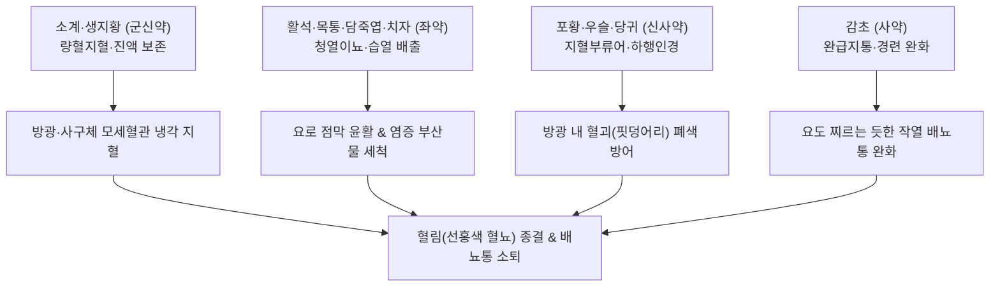

---
aliases:
  - 小薊飲子
  - Xiaoji-yinzi
  - Cephalanoplos Decoction
  - 소계음
tags:
  - 처방/활혈거어·지혈제
  - 지혈제/양혈지혈
  - 혈림
  - 혈뇨
  - 방광염
  - 요로결석
  - 제생방
---

# 🍵 [[소계음자]] (小薊飲子, Xiaoji-yinzi / Cephalanoplos Decoction)

> **핵심 3줄 요약 (Key Summary)**:
> - 🌿 기본 구성: [[소계]], [[생지황]], [[포황]], [[우슬]], [[활석]], [[목통]], [[담죽엽]], [[치자]], [[당귀]], [[감초]] (양혈지혈의 소계·지황·포황에 이뇨통림의 활석·목통·죽엽·치자를 결합한 비뇨기 출혈의 대표 성약).
> - 🎯 하초 열결(熱結)로 인한 혈림(血淋, 요로감염 혈뇨), 요로결석으로 인한 선홍색 혈뇨, 급성 방광염·요도염의 배뇨 시 작열통 및 찌르는 듯한 삽통(澁痛).
> - 🔬 소계 아피게닌 및 포황 플라보노이드의 모세혈관 수축 및 출혈 시간 단축, 요로계 평활근 연축 완화, 요로병원성 대장균(UPEC) 억제 및 방광 상피세포 보호.
> - ⚠️ 주의사항: 성질이 고한하고 이뇨력이 강하므로 비신허한(脾腎虛寒)성 무통성 만성 요혈 금기.

---

## 📌 목차
1. [기본 처방 정보 & 군신좌사 구성](#1-기본-처방-정보--군신좌사-구성)
2. [방제학적 약재 상호작용 & 시너지 네트워크](#2-방제학적-약재-상호작용--시너지-네트워크)
3. [현대 분자약리학적 효능 & 작용 기전](#3-현대-분자약리학적-효능--작용-기전)
4. [적응 병증 및 체질별 감별 (Sweet Spot vs 금기)](#4-적응-병증-및-체질별-감별-sweet-spot-vs-금기)
5. [유사 처방군 감별 매트릭스](#5-유사-처방군-감별-매트릭스)
6. [임상 가감례 & 현대 질환별 응용](#6-임상-가감례--현대-질환별-응용)
7. [💡 사용자 진료실 핵심 필기 & 임상 팁 (원문 보존)](#7--사용자-진료실-핵심-필기--임상-팁-원문-보존)
8. [출처 및 학술 참고 문헌 (References)](#8-출처-및-학술-참고-문헌-references)

---

## 1. 기본 처방 정보 & 군신좌사 구성

* **출전**: 송대 엄용화(嚴用和) 《제생방(濟生方)》 / 한대 화타 《중장경(中藏經)》
* **치법**: 량혈지혈(凉血止血), 청열통림(淸熱通淋), 활혈소어(活血消瘀)
* **적응증**: 하초열결(下焦熱結), 요중대혈(尿中帶血), 혈림(血淋), 배뇨 삽통(澁痛), 요도 작열감, 구갈면적, 설홍태황

| 구분 | 약재명 | 표준 용량 | 본초 효능 & 방제 내 역할 |
| :--- | :--- | :--- | :--- |
| **군약 (君藥)** | [[소계]] | 15g | 량혈지혈(凉血止血), 산어소종, 하초 비뇨기의 혈열을 끄고 모세혈관 수축 지혈 |
| **신약 (臣藥)** | [[생지황]] | 20g | 청열양혈(淸熱凉血), 양음생진, 화열로 손상된 진액을 돕고 소계의 지혈 보조 |
| **신약 (臣藥)** | [[포황]] (초) | 9g | 수렴지혈(收斂止血), 화어지통, 지혈하되 어혈이 생기지 않게 방어 |
| **신약 (臣藥)** | [[우슬]] | 9g | 활혈거어(活血祛瘀), 인혈하행(引血下行), 요로 어혈을 풀고 약력을 하초로 인경 |
| **좌약 (佐藥)** | [[활석]] | 12g | 이뇨통림(利尿通淋), 청열해서, 요로 점막을 매끄럽게 윤활하고 결석 배출 촉진 |
| **좌약 (佐藥)** | [[목통]] | 6g | 청열이수(淸熱利水), 소장과 방광의 습열을 소변으로 배출 |
| **좌약 (佐藥)** | [[담죽엽]] | 6g | 청심강화(淸心降火), 이뇨통림, 심화(心火)를 아래로 내려 소변으로 배설 |
| **좌약 (佐藥)** | [[치자]] | 9g | 사화제번(瀉火除煩), 청열이습, 삼초의 습열을 끄고 모세혈관 투과성 억제 |
| **사약 (使藥)** | [[당귀]] | 6g | 양혈화혈(養血和血), 활혈행기, 지혈 중 혈액 정체로 인한 어혈 형성 방어 |
| **사약 (使藥)** | [[감초]] | 6g | 보기화중(補氣和中), 조화제약, 작약/활석과 협동하여 요로 평활근 경련 완급지통 |

> **배오 특징 (양혈지혈과 이뇨청열의 융합 & 지혈부류어 원리)**:
> 1. **피를 식히고 물길을 여는 콤비네이션**: [[소계]]·[[생지황]]이 불타는 하초 혈분을 냉각시켜 피를 멎게 하고, [[활석]]·[[목통]]·[[담죽엽]]·[[치자]]가 소변길을 열어 염증과 피찌꺼기를 씻어냅니다.
> 2. **지혈부류어(止血不留瘀)**: 지혈제만 쓰면 방광과 요도에 핏덩어리가 엉겨 붙어 소변길이 막히는 2차 폐색이 발생합니다. 이에 [[포황]], [[우슬]], [[당귀]]를 배오하여 피를 멈추면서도 핏덩어리를 녹여 배출시키는 안전장치를 구축했습니다.
> 3. **심(心)과 소장(小腸)의 동시 사화**: 담죽엽과 목통이 심화를 꺼 소장과 방광으로 열이 전달되는 병리 경로를 차단합니다.

---

## 2. 방제학적 약재 상호작용 & 시너지 네트워크

* **지혈과 세척의 조화**: 모세혈관을 수축시켜 출혈을 잡는 동안, 이뇨제들이 소변량을 늘려 요로 상피에 달라붙은 세균과 염증 산물을 물리적으로 씻어냅니다.
* **인혈하행(引血下行)**: [[우슬]]이 상충하는 열기를 하초로 끌어내려 약력을 방광과 요도로 집중시킵니다.

---

## 3. 현대 분자약리학적 효능 & 작용 기전

1. **지혈 촉진 및 모세혈관 수축**:
   * 소계의 아피게닌(Apigenin)과 포황의 플라보노이드 성분이 모세혈관의 저항성을 높이고 출혈 시간을 단축시켜 방광 점막 및 사구체 출혈을 신속히 지혈합니다.
2. **요로계 평활근 진경 및 배뇨통 완화**:
   * 활석과 감초 배오 성분이 방광 배뇨근 및 요도 평활근의 과도한 수축 경련을 억제하여 찌르는 듯한 배뇨통과 잔뇨감을 완화합니다.
3. **항균 및 요로병원성 대장균(UPEC) 부착 억제**:
   * 치자의 제니포시드(Geniposide)와 목통 추출물이 요로감염의 주원인인 UPEC의 요로 상피세포 부착을 차단하고 세균 증식을 억제합니다.
4. **방광 상피세포 보호 및 항염증**:
   * NF-κB 염증 신호를 차단하여 방광 조직 내 TNF-α, IL-1β, IL-6 발현을 억제하고 출혈로 손상된 점막의 재생을 촉진합니다.

---

## 4. 적응 병증 및 체질별 감별 (Sweet Spot vs 금기)

### 1) 적응증 및 체질별 Sweet Spot
* **[✅ 최적 적응증 (Sweet Spot)]**:
  * **소변을 볼 때 요도가 불에 타는 듯 화끈거리고 찌르듯 아프면서 선홍색 피가 섞여 나오는 혈림(血淋, 급성 방광염·요도염)**.
  * 요로결석(신장·요관·방광 결석)으로 인해 점막이 긁혀 발생하는 급성 혈뇨 및 산통(Colic).
  * 소변이 자주 마려우나(빈뇨) 막상 보려면 찔끔거리고 다 보고 나서도 덜 본 것 같은 잔뇨감과 아랫배 팽만통.
* **[사상체질 매핑]**:
  * **소양인(少陽人)**: 하초 방광으로 화열이 치솟아 방광염과 혈뇨가 호발하는 체질에 가장 적중률이 높음.
  * **열성 태음인(太陰人)**: 습열 울체로 인한 요로결석 및 혈뇨에 다용.

### 2) 금기 및 신중 투여 (Contraindications)
* **[⚠️ 신중 투여 및 금기]**:
  * **허한성(虛寒性) 무통성 혈뇨 절대 금기**: 소변에 통증 없이 피만 비치고, 안색이 창백하며 허리가 시리고 맥이 침세한 만성 신허·비허 혈뇨에는 투약 금기 (지백지황환이나 귀비탕으로 선회, 처방 사이드 대처법 168번 참조).
  * **지혈 후 즉시 중단 원칙**: 고한하고 이뇨력이 강하므로 혈뇨가 멎고 배뇨통이 잡히면 즉시 투약을 중단하여 비신 양기를 보존.

---

## 5. 유사 처방군 감별 매트릭스

| 처방명 | 핵심 배오 차이 | 주치 및 임상 차별점 | 맥진/설진 차이 |
| :--- | :--- | :--- | :--- |
| [[소계음자]] | 소계·생지황·포황·우슬·활석 등 | 하초 열결 혈림, 선홍색 혈뇨, 요로결석성 출혈, 배뇨 삽통 | 맥삭(數) 혹 활삭, 설홍·태황 |
| [[팔정산]] | 구맥·편축·차전자·대황 등 8味 | 순수 습열림(濕熱淋), 고열, 농뇨, 배뇨불통, 혈뇨 불현저 | 맥침활삭(沈滑數), 설홍·황니태 |
| [[도적산]] | 목통·생지황·죽엽·감초 | 심화(心火) 망행, 구설생창(혓바늘), 소변 황적(黃赤), 경증 | 맥세삭(細數), 설첨홍·박태 |
| [[사생환]] | 생지황·생측백엽·생하엽·생애엽 | 급성 상부 대출혈(토혈, 각혈, 코피), 전신 혈열망행 | 맥홍삭(洪數), 설홍강·황태 |
| [[지백지황환]] | 육미지황환 + 지모·황백 | 만성 음허화왕(陰虛火旺), 무통성 요혈, 조열도한 | 맥세삭(細數), 설홍·소태 |

---

## 6. 임상 가감례 & 현대 질환별 응용

### 1) 주요 임상 가감법
* **요로결석 산통 극심**: [[금전초]] 20g, [[해금사]] 12g 가미하여 배석(排石)력 극대화.
* **혈뇨 출혈량 과다**: [[백모근]] 15g, [[삼칠근]] 3g (분복) 가미.
* **염증 및 부종 심화**: [[포공영]] 12g, [[연교]] 8g 가미하여 청열해독.
* **기허(氣虛) 동반(배뇨 후 기운 빠짐)**: [[황기]] 12g 가미하여 익기섭혈.

### 2) 현대 질환별 응용
* **비뇨의학과**: 급성 방광염, 요도염, 신우신염 급성기 혈뇨, 요로결석증(방광·요관 결석), 출혈성 방광염.
* **신장내과**: 사구체신염 초기 혈뇨, IgA 신병증 활동기 혈뇨 보조 치료.

---

## 7. 💡 사용자 진료실 핵심 필기 & 임상 팁 (원문 보존)

> [!tip] **진료실 실전 노하우 (User Clinical Insight)**
> * **혈림(血淋)과 통증의 임상적 직관**:
>   * 소변에 피가 나올 때 **"통증이 있는가, 없는가?"**가 처방 선택의 절대 기준입니다.
>   * 배뇨 시 찌르는 듯 아프고 불에 덴 듯 화끈거리며 피가 섞여 나오는 것은 100% 실열(實熱)성 혈림이므로 소계음자가 정곡을 찌릅니다. 반면 통증 없이 피만 비치는 것은 암이나 만성 신허이므로 정밀 검사와 보익제가 필요합니다.
> * **'지혈부류어(止血不留瘀)'의 방제학적 묘미**:
>   * 방광염이나 요로결석 환자에게 무턱대고 수렴성 지혈제만 쓰면 방광 안에 핏덩어리(혈병)가 생겨 요도를 틀어막는 치명적인 급성 요폐(Urinary retention)가 올 수 있습니다.
>   * 소계음자는 포황, 우슬, 당귀가 피를 멎게 하면서도 핏덩어리가 엉기지 않게 삭여서 소변으로 매끄럽게 흘려보내므로 요폐 걱정 없이 안심하고 쓸 수 있습니다.
> * **처방 부작용 관리**:
>   * 약성이 매우 차가우므로 혈뇨가 멎으면 바로 복용을 멈추어야 하며, 상세 대처법은 [[처방 사이드 대처법]] 168번 노트를 참조합니다.

---

## 8. 출처 및 학술 참고 문헌 (References)

* 엄용화. *제생방(濟生方)*. 송대(宋代). 1253.
* 대한한방내과학회 교재편찬위원회. *한방내과학: 간계내과질환*. 군자출판사; 2020.
* * **Yu H et al. (2025)**. Exploring the molecular mechanism of Xiao Ji (Cirsium setosum) in treating bladder cancer using network pharmacology and molecular docking. *Asian biomedicine : research, reviews and news*, 19: 94-105. [PMID: 40575382](https://pubmed.ncbi.nlm.nih.gov/40575382/)
* * **Zou L et al. (2025)**. Exudate management nonwovens loaded with Cirsium japonicum DC extract for enhanced hemostatic and wound healing. *Colloids and surfaces. B, Biointerfaces*, 252: 114673. [PMID: 40198962](https://pubmed.ncbi.nlm.nih.gov/40198962/)
