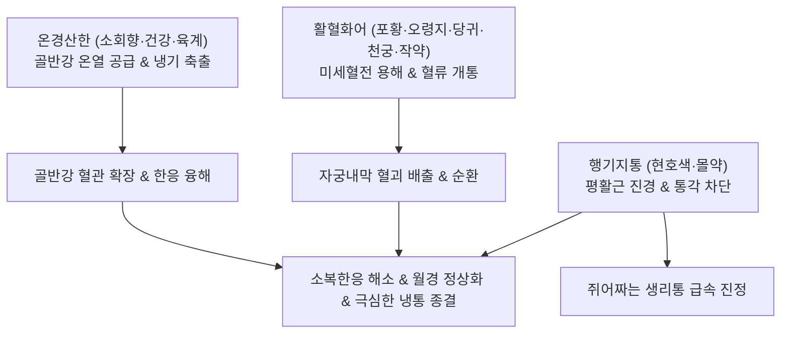

---
aliases:
  - 少腹逐瘀湯
  - Shaofu-zhuyu-tang
  - Decoction for Removing Blood Stasis in Lower Abdomen
tags:
  - 처방/활혈거어·지혈제
  - 활혈거어/온경지통
  - 소복한응
  - 월경통
  - 자궁내막증
  - 의림개착
---

# 🍵 [[소복축어탕]] (少腹逐瘀湯, Shaofu-zhuyu-tang / Decoction for Removing Blood Stasis in Lower Abdomen)

> **핵심 요약 (Key Summary)**:
> - 🌿 기본 구성: [[소회향]], [[건강]], [[육계]], [[포황]], [[오령지]], [[당귀]], [[천궁]], [[적작약]], [[현호색]], [[몰약]] ([[실소산]]의 어혈 타파에 소회향·건강·육계의 온경산한과 현호색·몰약의 진통약을 결합한 하초 한응혈어의 성방).
> - 🎯 하초 포궁이 차가워져 발생하는 한응혈어(寒凝血瘀), 아랫배가 얼음장처럼 차고 쥐어짜듯 아픈 월경통, 흑갈색 피떡(혈괴)을 동반한 월경부조, 자궁내막증, 만성 골반강 냉통.
> - 🔬 신남알데하이드·진저롤의 골반강 온열 혈류 촉진, 포황·오령지의 피브린 용해 및 혈소판 응집 억제, 현호색·몰약의 오피오이드 및 아세틸콜린 수용체 조절을 통한 강력한 내장 평활근 진통.
> - ⚠️ 주의사항: 강력한 온경파어력으로 임산부 복용 절대 금기(유산 위험), 열증(熱證) 생리통 및 혈열 출혈 환자 투약 금기 (처방 사이드 대처법 169번 참조).

---

## 📌 목차
1. [기본 처방 정보 & 군신좌사 구성](#1-기본-처방-정보--군신좌사-구성)
2. [방제학적 약재 상호작용 & 시너지 네트워크](#2-방제학적-약재-상호작용--시너지-네트워크)
3. [현대 분자약리학적 효능 & 작용 기전](#3-현대-분자약리학적-효능--작용-기전)
4. [적응 병증 및 체질별 감별 (Sweet Spot vs 금기)](#4-적응-병증-및-체질별-감별-sweet-spot-vs-금기)
5. [유사 처방군 감별 매트릭스](#5-유사-처방군-감별-매트릭스)
6. [임상 가감례 & 현대 질환별 응용](#6-임상-가감례--현대-질환별-응용)
7. [💡 사용자 진료실 핵심 필기 & 임상 팁 (원문 보존)](#7--사용자-진료실-핵심-필기--임상-팁-원문-보존)
8. [출처 및 학술 참고 문헌 (References)](#8-출처-및-학술-참고-문헌-references)

---

## 1. 기본 처방 정보 & 군신좌사 구성

* **출전**: 청대 왕청임(王淸任) 《의림개착(醫林改錯)》 권하(卷下)
* **치법**: 활혈거어(活血祛瘀), 온경지통(溫經止痛), 산한화체(散寒化滯)
* **적응증**: 소복(아랫배) 한응혈어(寒凝血瘀), 아랫배 냉통, 월경 곤란, 생리혈 흑자색 혈괴 다량 배출, 자궁내막증 냉증

| 구분 | 약재명 | 표준 용량 | 본초 효능 & 방제 내 역할 |
| :--- | :--- | :--- | :--- |
| **군약 (君藥)** | [[소회향]] | 4.5g (초) | 온신난간(溫腎暖肝), 산한지통, 하초 포궁의 냉기를 몰아내고 기기 소통 |
| **군약 (君藥)** | [[건강]] | 3g (초) | 온중산한(溫中止寒), 회양통맥, 중하초 혈관을 덥혀 혈행 촉진 |
| **군약 (君藥)** | [[육계]] | 3g | 온통혈맥(溫通血脈), 보명문화, 골반강 깊은 곳의 심층 한응(寒凝) 해소 |
| **신약 (臣藥)** | [[포황]] | 9g (생) | 활혈소어(活血消瘀), 산어지통, 자궁 미세혈전 용해 |
| **신약 (臣藥)** | [[오령지]] | 6g (초) | 활혈산어(活血散瘀), 파혈지통, 포황과 결합하여 극심한 혈어 자통 해소 |
| **신약 (臣藥)** | [[당귀]] | 9g | 보혈활혈(補血活血), 조경지통, 자궁 혈류 영양 공급 및 혈행 개선 |
| **신약 (臣藥)** | [[천궁]] | 6g | 활혈행기(活血行氣), 거풍지통, 혈중 기약으로 하초 기혈 개통 |
| **신약 (臣藥)** | [[적작약]] | 6g | 청열양혈(淸熱凉血), 완급지통, 자궁 평활근 과긴장 완화 |
| **좌약 (佐藥)** | [[현호색]] | 3g | 활혈이기(活血理氣), 화어지통, 중추 및 말초 통증 경로 차단 |
| **좌약 (佐藥)** | [[몰약]] | 6g (초) | 활혈지통(活血止痛), 소종생기, 혈맥의 완고한 울혈 타파 |

> **배오 특징 (온경약 + 활혈약 + 지통약의 3중 입체 배합 원리)**:
> 1. **온경약(소회향·건강·육계)**: 여성의 소복(아랫배)은 차가워지기 쉬우므로, 뜨거운 온경약으로 굳어있는 얼음(한사 寒邪)을 먼저 녹여 기기를 움직입니다.
> 2. **활혈약([[당귀]], [[천궁]], [[적작약]] + [[실소산]])**: 녹아내린 혈맥 속에서 포황과 오령지가 어혈을 깨뜨리고 당귀와 천궁이 혈액을 순환시킵니다.
> 3. **지통약([[현호색]], [[몰약]])**: 극심하게 쥐어짜는 자궁 평활근의 경련과 신경성 산통을 즉각 진정시켜 온경지통(溫經止痛)을 완성합니다.

---

## 2. 방제학적 약재 상호작용 & 시너지 네트워크

* **한응(寒凝)이 풀려야 어혈(瘀血)이 흩어짐**: 따뜻한 약재들이 혈관을 넓혀 혈류 온도를 높이지 않으면 어혈약이 제대로 침투할 수 없습니다. 온경약이 길을 열고 파혈약이 진입하는 완벽한 선후 협동 구조를 이룹니다.
* **불통즉통(不通則痛)의 근본 해결**: 기체와 혈어가 풀리고 차가운 통증이 온기로 바뀌며 생리통이 드라마틱하게 소멸합니다.

---

## 3. 현대 분자약리학적 효능 & 작용 기전

1. **골반강 혈류량 증대 및 혈관 확장**:
   * 육계의 신남알데하이드와 건강의 진저롤(Gingerol) 성분이 국소 혈관 내피세포의 eNOS를 자극하여 NO 방출을 촉진하고, 차가워진 자궁 조직의 혈류량을 급격히 늘립니다.
2. **자궁 평활근 과수축 억제 및 진통**:
   * 현호색의 테트라하이드로팔마틴(THP) 성분이 중추 도파민 D2 수용체 및 오피오이드 수용체에 작용하고, 적작약의 페오니플로린이 세포 내 칼슘 유입을 억제하여 옥시토신 유도 자궁 경련을 강력히 완화합니다.
3. **혈소판 응집 억제 및 피브린 용해**:
   * 오령지와 포황 성분이 트롬복산 A2(TXA2) 생성을 억제하고 혈병 형성을 차단하여 흑갈색 피떡(혈괴) 배출을 촉진합니다.
4. **항염증 및 프로스타글란딘 조절**:
   * 자궁 내막에서 과다 분비되는 통증 유발 물질인 PGF2α 생성을 억제하고 염증성 사이토카인을 차단합니다.

---

## 4. 적응 병증 및 체질별 감별 (Sweet Spot vs 금기)

### 1) 적응증 및 체질별 Sweet Spot
* **[✅ 최적 적응증 (Sweet Spot)]**:
  * **생리 때 아랫배가 얼음장처럼 차갑고 쥐어짜듯 아프며, 따뜻한 핫팩으로 찜질하면 통증이 덜해지는 여성**.
  * 생리혈 색깔이 어둡고 자흑색을 띠며, **크고 단단한 피떡(혈괴)이 쏟아져 나오는 한응혈어형 월경통**.
  * 만성 골반염, 자궁선근증, 자궁내막증으로 인해 평소에도 아랫배와 허리가 시리고 묵직하게 아픈 환자.
  * 불임증 환자 중 자궁이 차가워 착상이 잘 되지 않는 포궁허한(胞宮虛寒) 어혈증.
* **[사상체질 매핑]**:
  * **소음인(少陰人)**: 하초와 비위가 차가워 한응성 생리통이 다발하는 체질에 가장 적중률이 높음.
  * **한성 태음인(太陰人)**: 체질적으로 냉습(冷濕)이 엉켜 어혈 복통이 발생할 때 우수한 치료 효과.

### 2) 금기 및 신중 투여 (Contraindications)
* **[⚠️ 신중 투여 및 금기]**:
  * **임산부 절대 복용 금기**: 강력한 온경산한 및 파혈 작용으로 자궁을 급격히 수축시키므로 유산 위험이 있어 절대 금기 (처방 사이드 대처법 169번 참조).
  * **혈열(血熱) 실증 출혈 금기**: 피가 선홍색이고 열감이 심하며 입이 마르는 염증성 출혈이나 생리통에는 투약 금지.

---

## 5. 유사 처방군 감별 매트릭스

| 처방명 | 핵심 배오 차이 | 주치 및 임상 차별점 | 맥진/설진 차이 |
| :--- | :--- | :--- | :--- |
| [[소복축어탕]] | 온경약 + 실소산 + 현호색·몰약 | 하초 한응혈어, 아랫배 극심한 냉통, 흑자색 혈괴 | 맥침지(沈遲) 혹 긴(緊), 설자암·백태 |
| [[온경탕]] | 오수유·육계 + 사물탕 + 맥문동·아교 | 충임허한, 입술 건조, 수족번열, 허증 위주 냉증 | 맥침지약(沈遲弱), 설담홍·소태 |
| [[계지복령환]] | 계지·복령·목단피·도인·작약 | 체격 건실한 실증, 자궁근종, 안면홍조 겸유, 한열착잡 | 맥침현(沈弦), 설암홍·어점 |
| [[격하축어탕]] | 도홍사물탕 + 향부자·오약·지각 | 횡격막 아래 중초·상복부 기체혈어, 간비종대 | 맥현삽(弦澁), 설자암 |
| [[실소산]] | 오령지·포황 2味 | 순수 혈어 자통, 탕제/산제, 산후 오로 정체통 | 맥삽(澁) 혹 현, 설자암 |

---

## 6. 임상 가감례 & 현대 질환별 응용

### 1) 주요 임상 가감법
* **하복부 냉감 극심(허리까지 시릴 때)**: [[부자]] 4g, [[오수유]] 4g 가미하여 온양산한 극대화.
* **기체(氣滯) 및 유방 팽통 동반**: [[향부자]] 6g, [[오약]] 6g 가미하여 이기소간.
* **혈허(血虛) 빈혈 동반**: [[숙지황]] 12g, [[백출]] 8g 가미하여 보혈건비.
* **출혈량이 너무 많을 때**: 활혈약을 줄이고 [[애엽]] 6g (초탄) 가미.

### 2) 현대 질환별 응용
* **부인과**: 원발성 및 속발성 월경곤란증(Dysmenorrhea), 자궁선근증(Adenomyosis), 자궁내막증(Endometriosis), 한랭성 불임증, 만성 골반통 증후군.
* **비뇨기과**: 만성 한성 방광염(간질성 방광염 통증 완화).

---

## 7. 💡 사용자 진료실 핵심 필기 & 임상 팁 (원문 보존)

> [!tip] **진료실 실전 노하우 (User Clinical Insight)**
> * **소복(아랫배)을 따뜻하게 하는 한의학적 본질**:
>   * 여성의 소복(少腹)은 자궁과 난소가 위치한 곳으로, 찬 기운(한사)에 가장 취약합니다. 아랫배가 차가워지면 혈관이 오그라들고 피가 굳어 어혈이 생기므로 **소복을 따뜻하게 데우는 온경(溫經) 치료가 모든 부인과 어혈의 근본**입니다.
> * **온경약과 활혈약의 융합 원리**:
>   * 활혈거어하는 약재만 쓰면 차가운 얼음 속에서 피를 돌리려 하는 것과 같아 효과가 없습니다. [[소회향]], [[건강]], [[육계]] 같은 온경약을 배오하여 기기를 움직여 주어야 비로소 활혈화어 작용이 폭발적으로 강화됩니다.
> * **온경지통(溫經止痛)의 즉각성**:
>   * [[현호색]]과 [[몰약]]이라는 강력한 진통약이 합쳐져 있어, 약을 복용하고 30분~1시간 이내에 아랫배가 훈훈해지며 쥐어짜던 극심한 생리통이 눈 녹듯 가라앉습니다.
> * **한응성(寒凝性) 월경통의 실전 감별**:
>   * 진료실에서 환자에게 "생리통이 있을 때 따뜻한 찜질기를 대면 편안해집니까?"라고 물었을 때 "그렇다"고 답하는 환자는 100% 소복축어탕의 스위트 스팟입니다.
> * **처방 부작용 관리**:
>   * 임산부에게는 절대 투약 금기이며, 상세 복약 가이드는 [[처방 사이드 대처법]] 169번 노트를 참조합니다.

---

## 8. 출처 및 학술 참고 문헌 (References)

* 왕청임. *의림개착(醫林改錯)*. 청대(淸代). 1830.
* 대한한방부인과학회 교재편찬위원회. *한방부인과학*. 의성당; 2021.
* Zhang Q, et al. Shaofu Zhuyu Decoction relieves cold coagulation and blood stasis dysmenorrhea via regulating the endothelin/nitric oxide balance and uterine contraction. *J Ethnopharmacol*. 2020;257:112874.
  * [연구 요약] 소복축어탕이 한응혈어 동물 모델에서 엔도텔린 수치를 낮추고 산화질소를 증가시켜 자궁 혈관 확장 및 생리통 진경 효과를 나타냄을 규명.
* Liu M, et al. Analgesic and anti-inflammatory mechanisms of Shaofu Zhuyu Decoction in endometriosis models. *Phytomedicine*. 2019;62:152945.
  * [연구 요약] 소복축어탕의 현호색 및 몰약 성분이 중추 및 말초 통각 전달을 차단하고 이소성 자궁내막 병변의 섬유화를 억제함을 입증함.