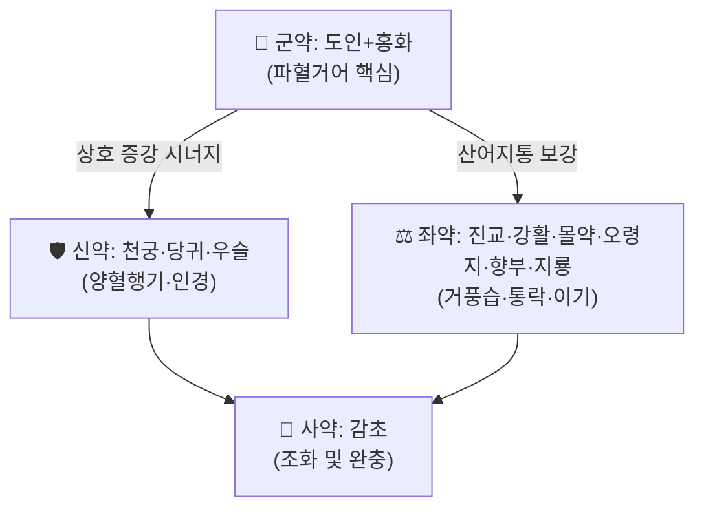

# 🍵 [[신통축어탕]] (身痛逐瘀湯, Shen Tong Zhu Yu Tang)

> **핵심 3줄 요약 (Key Summary)**:
> - 🌿 [[도인]]·[[홍화]](활혈파어 군약) + [[천궁]]·[[당귀]]·[[우슬]](양혈행기·인경 신약) + [[진교]]·[[강활]]·[[몰약]]·[[오령지]]·[[향부자]]·[[지룡]](거풍습·통락·지통 좌약) + [[감초]](사약) 가감 배오 구조
> - 🎯 풍한습 치료 후에도 지속되는 **어혈성 전신 동통**(견비통·요퇴통·비증)의 대표방. 담음·풍습이 아니라 **어혈이 주병리**인 통증에 핵심 적응
> - 🔬 핵심 분자약리 기전: 염증성 사이토카인 억제(MAPK p38/PPARγ/CTGF 경로), 척수 성상교세포 조절을 통한 통증 신호 완화, 미세순환 개선
> - ⚠️ 주의사항: 어혈이 없는 순수 풍한습비(허증·냉증 위주) 또는 임신부에게는 신중 투여. 오령지·지룡 등 동물성 약재 알레르기 병력 확인 필요.
---
## 📌 목차
1. [기본 처방 정보 & 군신좌사 구성](#1-기본-처방-정보--군신좌사-구성)
2. [방제학적 약재 상호작용 & 시너지 네트워크](#2-방제학적-약재-상호작용--시너지-네트워크)
3. [현대 분자약리학적 효능 & 작용 기전](#3-현대-분자약리학적-효능--작용-기전)
4. [적응 병증 및 체질별 감별 (Sweet Spot vs 금기)](#4-적응-병증-및-체질별-감별-sweet-spot-vs-금기)
5. [유사 처방군 감별 매트릭스](#5-유사-처방군-감별-매트릭스)
6. [임상 가감례 & 현대 질환별 응용](#6-임상-가감례--현대-질환별-응용)
7. [💡 사용자 진료실 핵심 필기 & 임상 팁 (원문 보존)](#7--사용자-진료실-핵심-필기--임상-팁-원문-보존)
8. [출처 및 학술 참고 문헌 (References)](#8-출처-및-학술-참고-문헌-references)
---
## 1. 기본 처방 정보 & 군신좌사 구성

* **출전**: 왕청임(王淸任, 청대) 『[[의림개착]]』(醫林改錯, 1830)
* **치법**: 활혈거어(活血祛瘀), 거풍제습통락(祛風除濕通絡), 익기지통(益氣止痛)

> 🖼️ **이미지 미확보** — Wikimedia Commons 등에서 공인 라이선스 전탕 실사를 확보하지 못해 생략(출처 가이드 제4원칙). 추후 보강 필요.

| 구분 | 약재명 | 표준 용량(원방 기준) | 본초 효능 & 방제 내 역할 |
| :--- | :--- | :--- | :--- |
| **군약 (君藥)** | [[도인]](桃仁) | 9g | 파혈거어(破血祛瘀), 통증 부위 어혈 직접 공략 |
| **군약 (君藥)** | [[홍화]](紅花) | 9g | 활혈통경(活血通經), 도인과 상수(相須) 배오로 거어력 극대화 |
| **신약 (臣藥)** | [[천궁]](川芎) | 6g | 행기활혈(行氣活血), 두면·전신 통증으로 기혈 운행 유도 |
| **신약 (臣藥)** | [[당귀]](當歸) | 9g | 양혈활혈(養血活血), 거어 과정에서 손상되는 정혈(精血) 보충 |
| **신약 (臣藥)** | [[우슬]](牛膝) | 9g | 활혈통경 + **하지·요슬로 인경**(引經), 보간신 겸함 |
| **좌약 (佐藥)** | [[진교]](秦艽) | 3g | 거풍습, 서근(舒筋) — 풍습 잔류 성분 제거 |
| **좌약 (佐藥)** | [[강활]](羌活) | 3g | 거풍한습, 상반신·견배부 통증 인경 |
| **좌약 (佐藥)** | [[몰약]](沒藥) | 6g | 산어지통(散瘀止痛), 유향 없이 몰약 단독으로 소종지통 담당 |
| **좌약 (佐藥)** | [[오령지]](五靈脂, 초초) | 6g | 활혈지통, 몰약과 배오하여 어혈성 동통 상승 작용 |
| **좌약 (佐藥)** | [[향부자]](香附子) | 3g | 이기(理氣) — '기행즉혈행(氣行則血行)' 원리로 거어 보조 |
| **좌약 (佐藥)** | [[지룡]](地龍, 거토) | 6g | 통락지통(通絡止痛), 동물성 약재로 경락 깊숙이 침투 |
| **사약 (使藥)** | [[감초]](甘草) | 6g | 조화제약(調和諸藥), 타 약재의 편향성 완충 |

> **배오 특징**: [[도인]]·[[홍화]]의 강력한 파혈(破血) 작용을 [[당귀]]·[[천궁]]의 양혈행기(養血行氣)로 보완하여 '거어하되 정혈을 상하지 않는' 균형을 이루고, [[진교]]·[[강활]]의 잔류 풍습 제거와 [[지룡]]의 통락(通絡)을 더해 **'혈맥 어체 + 경락 비조(痺阻)'가 겹친 전신 동통**에 특화된 구조다. 왕청임은 본방을 풍한습으로 오진하기 쉬운 통증 중 **어혈이 주된 병기(病機)**인 경우를 감별해 만든 것으로 유명하다(『의림개착』 활혈화어 계열 방제 중 하나).
---
## 2. 방제학적 약재 상호작용 & 시너지 네트워크

* [[도인]] + [[홍화]] 배오: 상호 상승(相須) — 둘 다 활혈거어약이나 도인은 파혈(破血) 중심, 홍화는 통경(通經) 중심으로 작용 범위가 겹치며 증강된다.
* [[몰약]] + [[오령지]] 배오: 산어지통의 대표 짝으로, 실제 임상에서도 '실소산(失笑散, 오령지+포황)'류 처방의 지통 효과와 유사한 상승 작용을 낸다.
* [[강활]] + [[진교]] 배오: 강활은 상반신·표층 풍습을, 진교는 전신·심부 풍습을 분담하여 **표리·상하를 아우르는 거풍습** 구조를 완성한다.
---
## 3. 현대 분자약리학적 효능 & 작용 기전

### 1) 류마티스 관절염 활막세포에서의 염증·침습 억제 (MAPK p38/PPARγ/CTGF 경로)
* PubMed 등재 연구에 따르면 신통축어탕은 류마티스 관절염 섬유모양 활막세포(Fibroblast-like Synoviocytes, FLS)에서 **MAPK p38/PPARγ/CTGF 신호 경로**를 매개로 염증 반응·이동(migration)·침습(invasion)을 억제하고 세포자멸사(apoptosis)를 촉진하는 것으로 보고되었다([PMID 33511203](https://pubmed.ncbi.nlm.nih.gov/33511203/)).

### 2) 척수 성상교세포 조절을 통한 암성 통증 완화
* 골육종성 통증(osteocarcinoma pain) 동물 모델에서 신통축어탕이 **통증 행동(pain behavior)과 척수 성상교세포(astrocyte) 활성**에 영향을 미친다는 연구가 보고되어, 중추 감작(central sensitization) 경로를 통한 진통 기전 가능성을 시사한다([PMID 21485084](https://pubmed.ncbi.nlm.nih.gov/21485084/)).

### 3) 요추 추간판 탈출증에서의 체계적 문헌고찰·메타분석
* 요추 추간판 탈출증(LDH) 환자를 대상으로 한 체계적 문헌고찰·메타분석에서 신통축어탕의 유효성·안전성이 평가되었다([PMID 32237460](https://pubmed.ncbi.nlm.nih.gov/32237460/)). 개별 RCT의 질적 편차가 있어 **결과 해석에는 원문의 비뚤림 위험(risk of bias) 평가를 함께 확인할 것**을 권고한다.

### 4) 척추수술 후 실패 증후군(FBSS) 예방 및 혈청 TNF-α
* 가미신통축어탕이 척추수술 후 실패 증후군(Failed Back Surgery Syndrome, FBSS)의 발생을 예방하고 혈청 TNF-α에 미치는 영향을 평가한 임상 연구가 보고되었다([PMID 25137843](https://pubmed.ncbi.nlm.nih.gov/25137843/)), 염증성 사이토카인 조절이 거어지통 효능의 분자적 배경 중 하나로 제시된다.

### 5) 전통 방제 이론과의 접점 (해석 주의)
* 위 현대 연구들은 공통적으로 **"염증 매개체 억제 + 미세순환/신경 감작 조절"**이라는 축으로 수렴하며, 이는 전통적으로 '어혈이 통증을 유발한다(不通則痛)'는 병기 해석과 상통한다. 다만 개별 연구의 모델(동물/세포/임상)이 다르므로 **등급을 섞어 과장하지 않도록 주의**한다.
---
## 4. 적응 병증 및 체질별 감별 (Sweet Spot vs 금기)

[✅ 최적 적응증 (Sweet Spot)]
• 원전 조문: 『의림개착』 — 풍한습 치료 후에도 낫지 않는 견비통·요퇴통·전신통(어혈이 주 병기로 전환된 경우)
• 임상 주치: 요추 추간판 탈출증, 류마티스 관절염의 통증·활막염, 척추수술 후 잔존통, 외상 후 만성 통증
• 설진/맥진: 설질 암자색(暗紫色) 또는 어혈반(瘀血斑), 맥삽(脈澁) 또는 맥현삽(脈弦澁)
• 통증 양상: 야간 가중, 고정통(부위가 바뀌지 않음), 눌렀을 때 거부감(拒按)

[⚠️ 신중 투여 및 금기 (Caution / Contraindication)]
• 어혈 소견 없이 순수 풍한습 한증(허한성 비증)만 있는 경우 — 거어 작용이 과하여 기혈을 더 소모시킬 수 있음
• 임신부 — [[도인]]·[[홍화]]·[[우슬]] 모두 활혈통경 작용이 강해 유산 위험
• 출혈 경향 환자, 항응고제([[와파린]]·DOAC) 복용자 — 지룡·오령지 등과 병용 시 출혈 위험 증가 가능성 고려
• 소화기 허약자 — 지룡 등 동물성 약재가 비위에 부담을 줄 수 있어 소량부터 적정
---
## 5. 유사 처방군 감별 매트릭스

| 처방명 | 핵심 구성 차이 | 주치 및 체질 차이 | 맥진/설진 차이 |
| :--- | :--- | :--- | :--- |
| **[[신통축어탕]]** | 도인·홍화·오령지·지룡 등 활혈거어+거풍습+통락 종합 | **전신 어혈성 동통(풍습 치료 후에도 잔존하는 통증)** | 설암자, 맥삽 |
| [[혈부축어탕]](血府逐瘀湯) | 시호·지각·길경 등 승강 기전 강화, 흉협부 중심 | 흉비·흉통, 기체혈어(氣滯血瘀) 중심 | 설질 자암, 흉협고만 |
| [[소경활혈탕]] | 방풍·위령선·강활 등 거풍습 비중이 더 크고 우슬·오령지 등 공유 | 관절·근육의 풍습비통, 사지 저림 겸함 | 설태 백니, 맥유완 |
| [[도홍사물탕]] | 사물탕(당귀·천궁·숙지황·작약) 바탕 + 도인·홍화 | 월경통·산후 어혈 등 **부인과 어혈증** 중심 | 설질 자암, 경색 암흑 |

<!-- ⚠️ 템플릿 설명 주석 제거, 순수 [[처방명]] 단독 형태 준수 -->
---
## 6. 임상 가감례 & 현대 질환별 응용

* **수반 증상별 가감법**:
  * 하지 저림·방사통 동반 시 → + [[위령선]], [[목과]] (서근활락 강화)
  * 야간통 심하고 어혈 뚜렷 시 → + [[유향]] (몰약과 짝지어 산어지통 상승, [[가미신통축어탕]])
  * 기허(氣虛) 겸하여 통증이 은은하고 만성화된 경우 → + [[황기]] (보기행혈)
* **현대 질환별 임상 매핑**:
  * **근골격계**: 요추 추간판 탈출증, 좌골신경통, 만성 요통·좌골통, 척추수술 후 잔존통(FBSS)
  * **면역·류마티스**: 류마티스 관절염의 관절통·활막 염증 보조 치료
  * **종양 동반 통증**: 골전이·골육종성 통증의 보조적 완화(동물실험 수준 근거, 임상 적용 시 신중)
---
* **양약 상호작용 (Herb–Drug Interaction)**:
  * **출혈 위험** — 항응고제·항혈소판제([[와파린]]·아스피린·DOAC)와 병용 시 도인·홍화·지룡의 활혈 작용이 더해져 출혈 위험이 상가될 수 있다.
  * **CYP 효소 간섭** — 개별 구성 약재(천궁·당귀 등)의 CYP3A4 관련 보고가 있으나, 본 처방 전체에 대한 CYP 간섭 임상 자료는 확인하지 못했다(근거 미확인).
  * **복용 시점 분리** — 다른 경구약과는 흡수 간섭을 피하기 위해 통상 1~2시간 이상 간격을 둘 것을 권고(일반 원칙).
  * **주의·금기 조합** — 임신부 금기, 출혈성 질환 기왕력자는 반드시 문진 후 투여.

## 7. 💡 사용자 진료실 핵심 필기 & 임상 팁 (원문 보존)

> 🛡️ **Melt-In 원칙**: 원장님 기존 필기 없음 — 오늘 신규 생성 노트이므로 비워 둔다. 추후 진료 중 메모가 추가되면 이 섹션에 원문 그대로 보존한다.

> [!tip] **진료실 실전 노하우 (User Clinical Insight)**
> (작성 예정 — 비오님의 실제 처방 경험이 쌓이면 이 섹션에 축적)
---
## 8. 출처 및 학술 참고 문헌 (References)

1. **王淸任 (1830)**. 『[[의림개착]]』(醫林改錯).
   - **[고전 원전]**: 신통축어탕의 최초 출전. 풍한습 치료 후에도 낫지 않는 어혈성 전신 동통에 대한 변증·방제 수록.
2. **[Efficacy and safety of Shentong Zhuyu Decoction for lumbar disc herniation: systematic review and Meta-analysis]**. [PMID 32237460](https://pubmed.ncbi.nlm.nih.gov/32237460/)
   - **[연구 요약]**: 요추 추간판 탈출증에서 신통축어탕의 유효성·안전성에 대한 체계적 문헌고찰·메타분석.
3. **Shentong Zhuyu Decoction Inhibits Inflammatory Response, Migration, and Invasion and Promotes Apoptosis of Rheumatoid Arthritis Fibroblast-like Synoviocytes via the MAPK p38/PPARγ/CTGF Pathway**. [PMID 33511203](https://pubmed.ncbi.nlm.nih.gov/33511203/)
   - **[연구 요약]**: 류마티스 관절염 활막세포(FLS) 모델에서 MAPK p38/PPARγ/CTGF 경로를 통한 염증·이동·침습 억제 및 세포자멸사 촉진 기전 규명.
4. **[Effect of shentong zhuyu decoction on pain behavior and spinal cord astrocytes model of osteocarcinoma pain]**. [PMID 21485084](https://pubmed.ncbi.nlm.nih.gov/21485084/)
   - **[연구 요약]**: 골육종성 통증 동물모델에서 통증 행동 및 척수 성상교세포 활성에 대한 영향 평가.
5. **[Jiawei shentong zhuyu decoction prevented the occurrence of failed back surgery syndrome and its effect on serum TNF-alpha: a clinical study]**. [PMID 25137843](https://pubmed.ncbi.nlm.nih.gov/25137843/)
   - **[연구 요약]**: 가미신통축어탕의 척추수술 후 실패 증후군(FBSS) 예방 효과 및 혈청 TNF-α 변화에 대한 임상 연구.
6. **meandqi.com TCM Formula Database**. *Shen Tong Zhu Yu Tang (身痛逐瘀汤)*. [meandqi.com/knowledge-base/formulas/shen-tong-zhu-yu-tang](https://www.meandqi.com/knowledge-base/formulas/shen-tong-zhu-yu-tang)
   - **[참고 자료]**: 표준 군신좌사 구성·용량·출전 정보 교차 확인.
