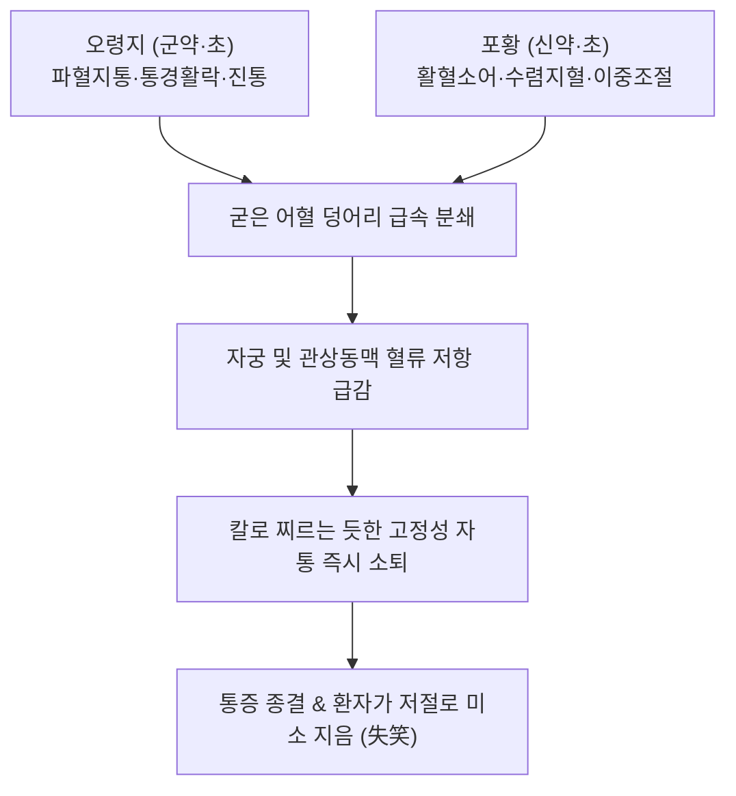

---
aliases:
  - 失笑散
  - Shixiao-san
  - Lost Smile Powder
tags:
  - 처방/활혈거어·지혈제
  - 활혈거어/활혈지통
  - 생리통
  - 산후복통
  - 협심증
  - 화제국방
---

# 🍵 [[실소산]] (失笑散, Shixiao-san / Lost Smile Powder)

> **핵심 3줄 요약 (Key Summary)**:
> - 🌿 기본 구성: [[오령지]], [[포황]] (오령지의 파혈지통과 포황의 활혈·지혈 이중 조절이 결합되어 아픔에 일그러진 얼굴이 웃음을 되찾게 한다는 실소산).
> - 🎯 혈어(血瘀)로 인한 극심한 찌르는 듯한 고정성 자통, 원발성·속발성 월경통, 산후 오로 정체 복통, 자궁근종 자통, 협심증(흉비 심통), 만성 위완자통.
> - 🔬 우르솔산·이소람네틴의 트롬복산 A2 억제를 통한 강력한 혈소판 응집 차단 및 혈전 용해, 브라디키닌·PGE2 차단을 통한 척수 통각 신호 차단, 자궁 평활근 연축 완화.
> - ⚠️ 주의사항: 강력한 파혈축어 작용으로 임산부 복용 절대 금기(유산 위험), 오령지의 특유 비린내로 위장 약한 자 초오령지 포전 전탕 필수.

---

## 📌 목차
1. [기본 처방 정보 & 군신좌사 구성](#1-기본-처방-정보--군신좌사-구성)
2. [방제학적 약재 상호작용 & 시너지 네트워크](#2-방제학적-약재-상호작용--시너지-네트워크)
3. [현대 분자약리학적 효능 & 작용 기전](#3-현대-분자약리학적-효능--작용-기전)
4. [적응 병증 및 체질별 감별 (Sweet Spot vs 금기)](#4-적응-병증-및-체질별-감별-sweet-spot-vs-금기)
5. [유사 처방군 감별 매트릭스](#5-유사-처방군-감별-매트릭스)
6. [임상 가감례 & 현대 질환별 응용](#6-임상-가감례--현대-질환별-응용)
7. [💡 사용자 진료실 핵심 필기 & 임상 팁 (원문 보존)](#7--사용자-진료실-핵심-필기--임상-팁-원문-보존)
8. [출처 및 학술 참고 문헌 (References)](#8-출처-및-학술-참고-문헌-references)

---

## 1. 기본 처방 정보 & 군신좌사 구성

* **출전**: 송대 《태평혜민화제국방(太平惠民和劑局方)》
* **치법**: 활혈거어(活血祛瘀), 산결지통(散結止痛)
* **적응증**: 어혈정체(瘀血停滯)로 인한 심복자통, 산후 악로부진(惡露不盡), 월경 곤란, 부정 자궁출혈(누혈), 흉협동통, 위완자통

| 구분 | 약재명 | 표준 용량 | 본초 효능 & 방제 내 역할 |
| :--- | :--- | :--- | :--- |
| **군약 (君藥)** | [[오령지]] | 6g (초) | 활혈산어(活血散瘀), 파혈지통, 혈맥 속 굳은 어혈을 깨뜨리고 국소 혈류 개통 |
| **신약 (臣藥)** | [[포황]] | 6g (초) | 수렴지혈(收斂止血), 활혈소어, 어혈을 녹이면서도 출혈을 멎게 하는 이중 조절 |

> **배오 특징 (2미 배오의 극치 & 지혈활혈 이중 조절의 원리)**:
> 1. **통증에 일그러진 자가 웃음을 되찾음(失笑)**: 단 두 가지 본초만으로 얽혀있는 어혈 덩어리를 즉각 분쇄하여, 극심한 통증으로 신음하던 환자가 약을 먹고 저절로 미소를 짓게 된다는 데서 유래했습니다.
> 2. **포황의 활혈과 지혈 이중성**: 생포황(生蒲黃)은 혈전을 녹이고 활혈소어하는 힘이 강하고, 초포황(炒蒲黃)은 지혈 수렴력이 강하여, 자궁 내 정체된 어혈 피떡은 녹여 내보내면서도 새로운 출혈은 즉각 지혈합니다.
> 3. **초오령지(醋炒)의 포전(布煎) 테크닉**: 오령지 특유의 누린내를 없애고 약효를 간경으로 모으기 위해 식초로 볶아 쓰며, 탕약 전탕 시 미세한 포황 가루와 함께 베주머니(포전 布煎)에 넣어 달입니다.

---

## 2. 방제학적 약재 상호작용 & 시너지 네트워크

* **파어(破瘀)와 지혈(止血)의 상보**: [[오령지]]가 굳은 피를 깨뜨려 길을 열면, [[포황]]이 그 뒤를 따라 혈관을 안정화시켜 피가 헛되이 새어나가지 않도록 단속합니다.
* **약간의 산제(散劑) 복용법**: 가루 내어 1회 6g씩 따뜻한 청주나 식초 탄 물에 타서 복용하면 약력이 위장관에서 혈맥으로 순식간에 흡수되어 통증을 신속히 제어합니다.

---

## 3. 현대 분자약리학적 효능 & 작용 기전

1. **혈소판 응집 억제 및 혈전 용해**:
   * 포황의 이소람네틴(Isorhamnetin) 배당체와 오령지의 우르솔산(Ursolic acid) 성분이 트롬복산 A2(TXA2) 합성을 억제하고 프로스타사이클린(PGI2) 생성을 촉진하여 혈소판 활성화를 억제하고 혈관 내 미세혈전을 융해합니다.
2. **염증성 통각 신경 신호 차단**:
   * 브라디키닌(Bradykinin), 히스타민, 프로스타글란딘 E2(PGE2)의 국소 방출을 차단하여 척수 신경 후각으로 전달되는 통각 신호를 신속히 억제합니다.
3. **자궁 평활근 경련성 연축 완화**:
   * 자궁 내막의 국소 허혈과 PGF2α 과다 분비로 인한 자궁 평활근의 병적 수축을 정상화시켜 월경통의 급격한 완화를 유도합니다.
4. **관상동맥 저항 감소 및 심근 보호**:
   * 협심증 환자에서 관상동맥 연축을 완화하고 혈관 저항을 낮추어 심근 산소 소비량을 줄이고 흉통 발작 빈도를 감소시킵니다.

---

## 4. 적응 병증 및 체질별 감별 (Sweet Spot vs 금기)

### 1) 적응증 및 체질별 Sweet Spot
* **[✅ 최적 적응증 (Sweet Spot)]**:
  * **칼로 찌르는 듯이 아프고 통증 부위가 손바닥으로 누를 수 없을 만큼 고정된 극심한 어혈 자통(刺痛)** 환자.
  * 생리 시작과 함께 아랫배가 쥐어짜듯 아프며, 검붉은 피떡이 쏟아져 나와야 통증이 약간 가벼워지는 **원발성·속발성 월경통**.
  * 출산 후 오로가 시원하게 나오지 않고 덩어리가 져 아랫배가 당기고 아픈 **산후 오로 정체통**.
  * 협심증 환자 중 가슴이 조여들고 찌르는 듯한 흉통이 등이나 어깨로 방사되는 흉비 심통.
* **[사상체질 매핑]**:
  * 체질을 불문하고 **어혈성 자통의 응급 지통제**로 광범위하게 응용.

### 2) 금기 및 신중 투여 (Contraindications)
* **[⚠️ 신중 투여 및 금기]**:
  * **임산부 절대 복용 금기**: 강력한 파혈축어 작용으로 자궁을 수축시켜 유산을 유발하므로 임신 중 투약 절대 금기 (처방 사이드 대처법 170번 참조).
  * **기혈 극허(極虛)성 은은한 통증 금기**: 만성 피로로 은은하게 아픈 허증 통증에는 투약하지 않으며, 필요 시 보혈제(사물탕, 황기)를 배합.

---

## 5. 유사 처방군 감별 매트릭스

| 처방명 | 핵심 배오 차이 | 주치 및 임상 차별점 | 맥진/설진 차이 |
| :--- | :--- | :--- | :--- |
| [[실소산]] | 오령지·포황 2味 | 순수 어혈 자통, 산후 오로 복통, 생리통, 협심증 지통 | 맥삽(澁) 혹 현(弦), 설자암·어점 |
| [[소복축어탕]] | 온경약 + 실소산 + 현호색·몰약 | 하초 한응혈어, 아랫배 극심한 냉통, 흑자색 피떡 | 맥침지(沈遲) 혹 긴, 설자암·백태 |
| [[단삼음]] | 단삼 30g + 단향·사인 | 심흉통과 위완통 동치, 협심증, 신경성 위경련 | 맥현삽(弦澁), 설암홍·어반 |
| [[도핵승기탕]] | 도인·대황·망초·계지·감초 | 급성 하초 축혈, 소복급결, 변비 현저, 여광(정신 착란) | 맥침삭유력(沈數有力), 설홍·황조태 |
| [[당귀수산]] | 당귀미·적작약·오약·소목·홍화 등 | 외상성 타박상, 피멍, 급성 관절 염좌 | 맥현삽(弦澁) 혹 긴, 설자암 |

---

## 6. 임상 가감례 & 현대 질환별 응용

### 1) 주요 임상 가감법
* **통증이 극심하여 견딜 수 없을 때**: [[현호색]] 6g, [[몰약]] 3g 가미하여 지통력 배가.
* **생리불순 및 혈허 동반**: [[사물탕]]을 합방하여 보혈활혈 유도.
* **아랫배가 얼음처럼 차가울 때**: [[소복축어탕]]으로 전환하거나 [[육계]] 3g, [[건강]] 3g 가미.
* **협심증 심흉통**: [[단삼]] 15g, [[천궁]] 6g 가미.

### 2) 현대 질환별 응용
* **부인과**: 원발성 월경곤란증, 자궁내막증, 자궁선근증, 산후 자궁 수축 부진 및 오로 정체통, 기능성 부정출혈.
* **순환기내과**: 안정형 및 불안정형 협심증 흉통 완화, 심근경색 회복기 흉부 압박통.
* **소화기내과**: 위·십이지장 궤양의 고정성 자통, 만성 위염성 위완통.

---

## 7. 💡 사용자 진료실 핵심 필기 & 임상 팁 (원문 보존)

> [!tip] **진료실 실전 노하우 (User Clinical Insight)**
> * **"실소(失笑)"라는 이름에 담긴 임상적 감동**:
>   * 방제 이름 그대로 통증으로 얼굴을 잔뜩 찌푸리고 울부짖던 환자가 약을 복용하고 잠시 후 통증이 감쪽같이 사라져 **허탈할 정도로 실소를 터뜨린다**는 고전의 묘사는 결코 과장이 아닙니다.
>   * 혈액이 응고되어 신경을 찌르는 급성 어혈 통증에 있어 실소산의 진통 속효성은 양방 NSAIDs에 필적합니다.
> * **포제 및 전탕 노하우 (오령지 비린내 차단)**:
>   * 오령지는 날다람쥐 분변이라 특유의 동물성 비린 맛이 강합니다. 반드시 **식초로 볶은 초오령지(醋炒)**를 사용해야 하며, 전탕 시에는 미세한 포황 가루와 함께 촘촘한 베주머니(포전 布煎)에 싸서 달여야 맑고 깨끗한 탕액이 나와 환자가 거부감 없이 복용합니다.
> * **포황의 이중 조절 임상 활용**:
>   * 생리통 환자에게 처방할 때는 생포황과 초포황을 절반씩 섞어 쓰면, 자궁 안에 맺힌 피떡은 녹여 내보내고 출혈량은 적정 수준으로 단속하는 최상의 결과를 얻을 수 있습니다.
> * **처방 부작용 관리**:
>   * 임산부에게는 절대 투약 금기이며, 상세 복용 가이드는 [[처방 사이드 대처법]] 170번 노트를 참조합니다.

---

## 8. 출처 및 학술 참고 문헌 (References)

* 태평혜민화제국방편찬위원회. *태평혜민화제국방(太平惠民和劑局方)*. 송대(宋代).
