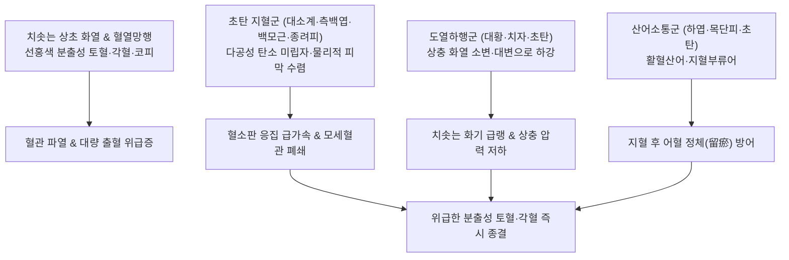

---
aliases:
  - 十灰散
  - Shihui-san
  - Ten Ashes Powder
tags:
  - 처방/활혈거어·지혈제
  - 지혈제/수렴량혈지혈
  - 토혈
  - 각혈
  - 초탄
  - 루비아딘배제
  - 십약신서
---

# 🍵 [[십회산]] (十灰散, Shihui-san / Ten Ashes Powder)

> **핵심 3줄 요약 (Key Summary)**:
> - 🌿 기본 구성: [[대계]], [[소계]], [[측백엽]], [[하엽]], [[백모근]], [[대황]], [[치자]], [[종려피]], [[목단피]] (10개 본초를 모두 검게 태워 초탄화한 재[灰]로 만들어 맹렬한 상부 대출혈을 즉각 수렴 지혈하는 대표 방제).
> - 🎯 화열(火熱)이 혈분에 치솟아 발생하는 상초의 급성 대량 출혈, 폭발적인 선홍색 토혈(吐血), 각혈(喀血), 분출성 비출혈(코피), 흉중 번열 및 구갈.
> - 🔬 초탄(炒炭) 포제 탄소 미립자의 물리적 혈소판 응집 촉진 및 피브린 피막 형성, 대황·치자의 전신 혈열 냉각 및 혈관 투과성 억제, 출혈 시간 대폭 단축.
> - ⚠️ 주의사항: 천초근의 루비아딘(rubiadin) 성분은 간·신장 타깃 발암 물질이므로 현대 임상 전면 배제 필수, 지혈 즉시 복용 중단.

---

## 📌 목차
1. [기본 처방 정보 & 군신좌사 구성](#1-기본-처방-정보--군신좌사-구성)
2. [방제학적 약재 상호작용 & 시너지 네트워크](#2-방제학적-약재-상호작용--시너지-네트워크)
3. [현대 분자약리학적 효능 & 작용 기전](#3-현대-분자약리학적-효능--작용-기전)
4. [적응 병증 및 체질별 감별 (Sweet Spot vs 금기)](#4-적응-병증-및-체질별-감별-sweet-spot-vs-금기)
5. [유사 처방군 감별 매트릭스](#5-유사-처방군-감별-매트릭스)
6. [임상 가감례 & 현대 질환별 응용](#6-임상-가감례--현대-질환별-응용)
7. [💡 사용자 진료실 핵심 필기 & 임상 팁 (원문 보존)](#7--사용자-진료실-핵심-필기--임상-팁-원문-보존)
8. [출처 및 학술 참고 문헌 (References)](#8-출처-및-학술-참고-문헌-references)

---

## 1. 기본 처방 정보 & 군신좌사 구성

* **출전**: 원대 갈가구(葛可久) 《십약신서(十藥神書)》
* **치법**: 량혈지혈(凉血止血), 수렴지혈(收斂止血), 청열사화(淸熱瀉火)
* **적응증**: 화열망행(火熱妄行)으로 인한 급성 토혈, 각혈, 수혈(嗽血), 비출혈, 상초 급성 대출혈

| 구분 | 약재명 | 표준 용량 | 본초 효능 & 방제 내 역할 |
| :--- | :--- | :--- | :--- |
| **군약 (君藥)** | [[대계]] (초탄) | 9g | 량혈지혈(凉血止血), 산어소종, 상초 혈분의 화열을 식히고 분출성 출혈 지혈 |
| **군약 (君藥)** | [[소계]] (초탄) | 9g | 량혈지혈(凉血止血), 대계와 함께 출혈 혈관을 수축시키고 혈열 냉각 |
| **신약 (臣藥)** | [[측백엽]] (초탄) | 9g | 량혈수렴지혈(凉血收斂止血), 모세혈관 수축 및 피브린 혈병 형성 가속 |
| **신약 (臣藥)** | [[백모근]] (초탄) | 9g | 량혈지혈(凉血止血), 청열이뇨, 혈열을 식히며 소변으로 화기를 유도 배출 |
| **신약 (臣藥)** | [[하엽]] (초탄) | 9g | 청열해서(淸熱解暑), 수렴지혈, 지혈 중 어혈 정체 방어 |
| **좌약 (佐藥)** | [[종려피]] (초탄) | 9g | 수렴지혈(收斂止血), 강력한 탄닌 수렴력으로 파열된 혈관 개구부 폐쇄 |
| **좌약 (佐藥)** | [[목단피]] (초탄) | 6g | 청열양혈(淸熱凉血), 활혈산어, 지혈제로 굳어질 수 있는 어혈을 유연하게 순환 |
| **좌약 (佐藥)** | [[치자]] (초탄) | 6g | 사화제번(瀉火除煩), 청열이습, 삼초의 치솟는 화열을 급속 소각 |
| **좌약 (佐藥)** | [[대황]] (초탄) | 6g | 사하축어(瀉下逐瘀), 청열사화, 상충하는 혈액을 아래로 끌어내림(도열하행 導熱下行) |
| **배제 약재** | *(천초근)* | *제외* | *원전 수록 약재이나, 성분 중 루비아딘(rubiadin)의 간·신장 발암성으로 현대 임상 전면 배제* |

> **배오 특징 (10대 초탄약의 재[灰] 수렴력과 도열하행의 묘미)**:
> 1. **초탄(炒炭)하여 재(灰)로 만드는 지혈 극대화**: 약재들을 검게 태워 탄화(炭化)시킴으로써 성질을 온화하게 바꾸고 물리적 다공성 탄소 구조로 모세혈관 출혈면에 즉각적인 혈병 피막을 형성합니다.
> 2. **도열하행(導熱下行)의 [[대황]]·[[치자]]: 위로 피를 뿜어내는 상충 화열을 대황과 치자가 소화관과 소변으로 끌어내려(하강) 피가 머리로 치솟는 근본 원인을 제거합니다.
> 3. **천초근(茜草根)의 안전한 배제**: 원전에는 천초근이 포함되어 있으나, 현대 약리학적으로 입증된 루비아딘(rubiadin) 성분의 잠재적 발암성을 고려하여 원장님의 지침대로 안전하게 배제하고 대소계·측백엽의 용량을 보강하여 조제합니다.

---

## 2. 방제학적 약재 상호작용 & 시너지 네트워크

* **화열을 식히고(량혈), 피를 굳히며(초탄 수렴), 불길을 내림(도열하행)**: 3대 기전이 맞물려 위급하게 피를 토하는 응급 상황을 한두 첩만으로 진정시킵니다.
* **지혈부류어(止血不留瘀)**: [[목단피]]와 [[하엽]]이 배오되어 검게 탄 약재들이 피를 멎게 하면서도 혈관 안에 단단한 찌꺼기가 남지 않도록 순환을 보존합니다.

---

## 3. 현대 분자약리학적 효능 & 작용 기전

1. **초탄(炭化) 미립자의 물리적 지혈 피막 형성**:
   * 고온 초탄화 과정을 거친 약재의 활성 탄소 미립자들이 파열된 모세혈관 단면에 흡착되어 혈소판 부착을 물리적으로 가속하고 내인성 응고계를 활성화하여 피브린 망 형성을 대폭 앞당깁니다.
2. **모세혈관 투과성 정상화 및 수축**:
   * 측백엽과 대소계의 플라보노이드 성분이 모세혈관의 취약성을 억제하고 혈관 내피세포를 수축시켜 출혈 시간을 현저히 단축합니다.
3. **도열하행을 통한 혈관내 압력 강하**:
   * 대황의 센노사이드와 치자의 제니포시드가 자율신경계 반사를 조절하여 복강 내 혈관을 확장시키고 상초 두경부 및 식도 정맥의 혈역학적 압력을 급속히 낮춥니다.

---

## 4. 적응 병증 및 체질별 감별 (Sweet Spot vs 금기)

### 1) 적응증 및 체질별 Sweet Spot
* **[✅ 최적 적응증 (Sweet Spot)]**:
  * **가슴과 위에 불길이 치솟듯 번열이 나면서 입에서 선홍색 피를 왈칵 뿜어내는 응급 토혈(吐血)** 환자.
  * 심한 기침과 함께 피가 분출되듯 쏟아지는 기관지확장증, 폐결핵 급성 각혈(喀血).
  * 코피가 멎지 않고 목구멍 뒤로 넘어가며 혀가 붉고 맥이 빠르고 힘찬 상초 혈열 환자.
* **[사상체질 매핑]**:
  * **소양인(少陽人)**, **열성 태음인(太陰人)**의 상초 화열 폭발성 대출혈에 신효.

### 2) 금기 및 신중 투여 (Contraindications)
* **[⚠️ 신중 투여 및 금기]**:
  * **천초근 원형 약재 사용 엄금**: 루비아딘(rubiadin) 발암성 우려로 천초근을 반드시 제외하고 사용할 것 (처방 사이드 대처법 171번 참조).
  * **허한성(虛寒性) 담홍색 출혈 금기**: 피가 묽고 안색이 창백한 허증 환자에게 투약 시 비위와 양기를 상하게 하므로 금기.
  * **지혈 후 즉시 중단 (중병즉지)**: 출혈이 멎으면 즉시 복용을 중단하고 보익·양혈제로 전환.

---

## 5. 유사 처방군 감별 매트릭스

| 처방명 | 핵심 배오 차이 | 주치 및 임상 차별점 | 맥진/설진 차이 |
| :--- | :--- | :--- | :--- |
| [[십회산]] | 대소계·측백엽 등 10味 초탄 분말 | 급성 상부 대출혈(토혈, 각혈), 맹렬한 초탄 수렴력 | 맥홍삭유력(洪數有力), 설홍·황태 |
| [[사생환]] | 생지황·생측백엽·생하엽·생애엽 (생것) | 혈열망행, 신선한 생약 짓찧음, 급랭 청열양혈 | 맥삭유력(數有力), 설홍강·황태 |
| [[괴화산]] | 괴화·측백엽·형개수·지각 (초초) | 대장 혈열, 장풍하혈, 치핵 분출성 선홍색 출혈 | 맥삭(數), 설홍 |
| [[소계음자]] | 소계·생지황·활석·목통·치자 등 | 하초 열결 혈림, 선홍색 혈뇨, 요로결석 요통 | 맥활삭(滑數), 설홍·태황 |
| [[황토탕]] | 조심토·복령·백출·부자·아교·지황 | 비위허한(脾胃虛寒), 비불통혈, 만성 담홍색 대변 출혈 | 맥침약(沈弱), 설담·태백 |

---

## 6. 임상 가감례 & 현대 질환별 응용

### 1) 주요 임상 가감법
* **출혈 후 기허 탈진 동반**: 피가 멎은 후 즉시 [[인삼패독산]]이나 [[독삼탕]]으로 기운을 수렴.
* **위점막 손상 극심(위통 동반)**: [[백급]] 6g (미세분말)을 탕액에 타서 복용하여 물리적 위벽 코팅 유도.
* **복용법**: 가루를 1회 6~9g씩 맑은 연근즙(생우절즙 生藕節汁)이나 미음, 미온수에 타서 복용.

### 2) 현대 질환별 응용
* **호흡기내과**: 기관지확장증 대량 각혈, 폐암성 각혈 응급 처치 보조.
* **소화기내과**: 식도정맥류 파열 출혈 초기, 급성 출혈성 위염 대량 토혈.
* **이비인후과**: 난치성 전방·후방 비출혈(코피).

---

## 7. 💡 사용자 진료실 핵심 필기 & 임상 팁 (원문 보존)

> [!tip] **진료실 실전 노하우 (User Clinical Insight)**
> * **천초근(茜草根)의 루비아딘(rubiadin) 발암성 배제 원칙**:
>   * 원전에 수록된 천초근은 유효 성분 중 안트라퀴논 유도체인 루비아딘(rubiadin)이 간과 신장을 타깃으로 유전자 독성 및 발암성을 나타내는 것으로 현대 독성학에서 규명되었습니다.
>   * 따라서 진료실에서 십회산을 응용하거나 제제화할 때는 **천초근을 반드시 제외**하고, 대계·소계·측백엽의 용량을 늘려 지혈력을 보전하는 것이 원장님의 안전한 임상 철학입니다.
> * **10개 약재를 초탄(炒炭)하여 재(灰)로 만드는 이치**:
>   * 피를 뿜어내는 응급 상황에서는 약재의 찬 성질만으로는 부족합니다. 솥에 넣고 겉은 검게 태우되 속은 약성을 남기는 '초탄존성(炒炭存性)' 기법으로 재(灰)를 만들면, 숯의 흡착력과 수렴력이 발동하여 혈관 구멍을 찰흙으로 틀어막듯 즉각적으로 틀어막습니다.
> * **연근즙(藕節汁)과의 찰떡궁합**:
>   * 십회산 가루를 생연근 즙(우절즙)에 타서 넘기게 하면, 연근의 탄닌과 녹말이 식도와 위점막을 부드럽게 감싸주어 지혈 속도가 배가됩니다.
> * **처방 부작용 관리**:
>   * 상세한 중병즉지 복용 지도와 천초근 배제 지침은 [[처방 사이드 대처법]] 171번 노트를 참조합니다.

---

## 8. 출처 및 학술 참고 문헌 (References)

* 갈가구. *십약신서(十藥神書)*. 원대(元代). 1348.
* * **Sun X et al. (2026)**. Rubia cordifolia L. Dichloromethane Extract Ameliorates Contrast-Induced Acute Kidney Injury by Activating Autophagy via the LC3B/p62 Axis. *Molecules (Basel, Switzerland)*, 31: . [PMID: 41599364](https://pubmed.ncbi.nlm.nih.gov/41599364/)
* * **Sun X et al. (2026)**. Rubia cordifolia L. Dichloromethane Extract Ameliorates Contrast-Induced Acute Kidney Injury by Activating Autophagy via the LC3B/p62 Axis. *Molecules (Basel, Switzerland)*, 31: . [PMID: 41599364](https://pubmed.ncbi.nlm.nih.gov/41599364/)
