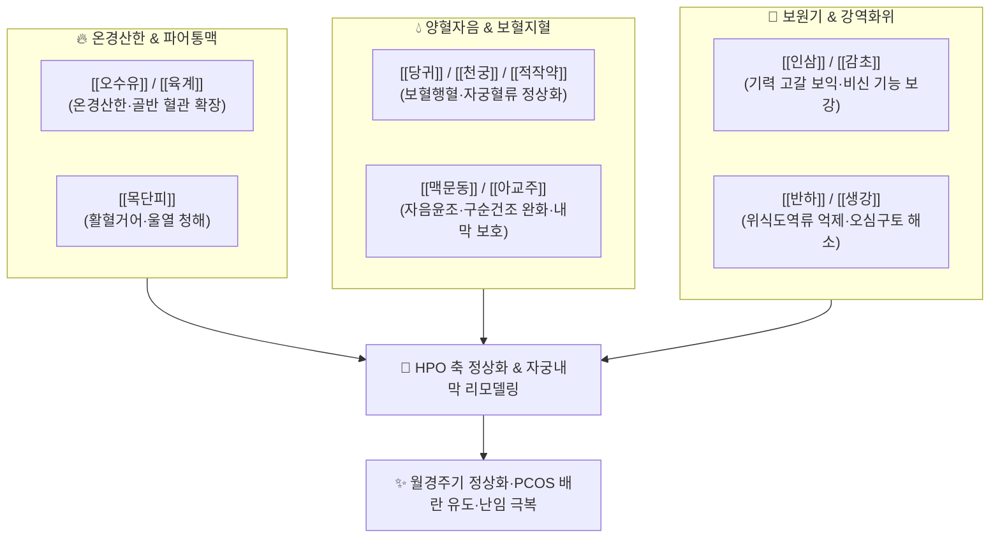

---
aliases:
  - 溫經湯
  - Wenjing-tang
  - Unkei-to
tags:
  - 처방/활혈거어·지혈제
  - 활혈거어/온경산한
  - 충임허한
  - 다낭성난소증후군
  - 금궤요략
---

# 🍵 [[온경탕]] (溫經湯, Wenjing-tang / Unkei-to)

> **핵심 3줄 요약 (Key Summary)**:
> - 🌿 기본 구성: [[오수유]], [[육계]], [[당귀]], [[천궁]], [[적작약]], [[맥문동]], [[아교주]], [[인삼]], [[반하]], [[생강]], [[목단피]], [[감초]] ([[사물탕]] + [[생맥산]]에 온경산한의 오수유·육계, 온위화담의 반하·생강 및 청열활혈의 목단피를 결합한 한열병용의 대방).
> - 🎯 뱃살 있는 여성의 여름철 더위 먹은 듯 식은땀, 나른하고 축 처짐, 소화불량(GERD), 수족냉증과 상열감, 구순건조, [[생리통]], [[생리불순]], [[난임]], [[다낭성 난소 증후군]](PCOS) 및 황체기능부전.
> - 🔬 시상하부-뇌하수체-난소축(HPO Axis) 기능 정상화, 혈관 내피세포 eNOS 활성화를 통한 골반강 혈류 급증, 인슐린 저항성 완화 및 난포 성숙 유도.
> - ⚠️ 주의사항: 순수 화농성·염증성 여드름 질환 단독 투여 절대 금기(열독 폭발), 목단피 함유로 가임기 임신 테스트 필수.

---

## 📌 목차
1. [기본 처방 정보 & 군신좌사 구성](#1-기본-처방-정보--군신좌사-구성)
2. [방제학적 약재 상호작용 & 시너지 네트워크](#2-방제학적-약재-상호작용--시너지-네트워크)
3. [현대 분자약리학적 효능 & 작용 기전](#3-현대-분자약리학적-효능--작용-기전)
4. [적응 병증 및 체질별 감별 (Sweet Spot vs 금기)](#4-적응-병증-및-체질별-감별-sweet-spot-vs-금기)
5. [유사 처방군 감별 매트릭스](#5-유사-처방군-감별-매트릭스)
6. [임상 가감례 & 현대 질환별 응용](#6-임상-가감례--현대-질환별-응용)
7. [💡 사용자 진료실 핵심 필기 & 임상 팁 (원문 보존)](#7--사용자-진료실-핵심-필기--임상-팁-원문-보존)
8. [출처 및 학술 참고 문헌 (References)](#8-출처-및-학술-참고-문헌-references)

---

## 1. 기본 처방 정보 & 군신좌사 구성

* **출전(出典)**: 《금궤요략(金匱要略)》 권하 부인잡병맥증병치
* **치법(治法)**: 온경산한(溫經散寒), 거어양혈(祛瘀養血), 자음청열(滋陰淸熱)
* **주치(主治)**: 충임허한(衝任虛寒), 어혈조체로 인한 월경부조, 붕루, 하복냉통, 구순건조(口脣乾燥), 야열발열(夜熱發熱), 난임증

| 구분 | 약재명 | 표준 용량 | 본초 효능 & 방제 내 역할 |
| :--- | :--- | :--- | :--- |
| **군약 (君藥)** | [[오수유]] | 6g | 온신산한(溫腎散寒), 온경지통, 강역지구, 하초의 음한을 몰아냄 |
| **군약 (君藥)** | [[육계]] (또는 [[계지]]) | 4g | 온통혈맥(溫通血脈), 조양화기, 혈관 평활근 이완 및 골반 혈류 개통 |
| **신약 (臣藥)** | [[당귀]] | 8g | 보혈활혈(補血活血), 행혈지통, 자궁 평활근 수축력 및 혈류 조절 |
| **신약 (臣藥)** | [[천궁]] | 6g | 활혈행기(活血行氣), 거풍지통, 당귀와 협력하여 혈중 기포를 뚫음 |
| **신약 (臣藥)** | [[적작약]] | 6g | 양혈거어(養血祛瘀), 완급지통, 혈맥 울체 완화 및 진통 |
| **좌약 (佐藥)** | [[맥문동]] | 10g | 자음윤조(滋陰潤燥), 청심제번, 온조(溫燥) 약재의 열독 완충 |
| **좌약 (佐藥)** | [[아교주]] | 6g | 보혈지혈(補血止血), 자음윤폐, 충임맥을 튼튼히 하여 부정출혈 지혈 |
| **좌약 (佐藥)** | [[인삼]] | 6g | 대보원기(大補元氣), 건비익위, 충임맥의 생화지원을 보강 |
| **좌약 (佐藥)** | [[반하]] | 8g | 조습화담(燥濕化痰), 강역지구, 비위 정체 수습 및 담음 구토 억제 |
| **좌약 (佐藥)** | [[생강]] | 6g | 온중화위(溫中和胃), 산한해표, 반하의 독성 제어 및 소화력 보조 |
| **좌약 (佐藥)** | [[목단피]] | 6g | 청열량혈(淸熱凉血), 활혈화어, 어혈로 인한 울열(鬱熱) 해소 |
| **사약 (使藥)** | [[감초]] | 4g | 보기화중(補氣和中), 제약조화, 자음보혈 및 진통 완충 작용 |

> **배오 특징**:
> 1. **다중 복합 방제의 정수**: [[사물탕]](당귀·천궁·작약) + [[생맥산]](인삼·맥문동) + 온위화담(반하·생강) + 온경활혈(오수유·육계·목단피) + 자음지혈(아교주) 구조가 유기적으로 융합된 고도 처방입니다.
> 2. **한열병용(寒熱竝用)과 수렴·소통의 조화**: [[오수유]]·[[육계]]의 강력한 온열지성으로 자궁의 오랜 냉기를 흩뜨리는 동시에, [[맥문동]]·[[아교주]]·[[목단피]]의 자음량혈 약재가 배합되어 온열약이 음혈을 말리지 않도록(상음, 傷陰) 보호합니다.
> 3. **하초냉증(下焦冷症)과 상초허열(上焦虛熱) 동시 제어**: 아랫배와 손발은 얼음장처럼 차면서도 입술과 입안이 바짝 마르고 저녁마다 열감이 뜨는 상열하한(上熱下寒)의 병리적 모순을 완벽히 해결합니다.

---

## 2. 방제학적 약재 상호작용 & 시너지 네트워크

* **오수유 + 육계 + 반하의 온위강역 배오**: 하초의 한습 담음이 위로 치밀어 올라 발생하는 소화불량, 위식도역류(GERD), 오심구토를 아래로 끌어내리고 복강 동맥 혈류량을 직접적으로 증가시킵니다.
* **당귀 + 아교주 + 맥문동의 자음양혈 배오**: 만성 어혈로 인해 신생 혈액이 생성되지 못하고 말라붙은 혈맥을 적셔주어, 자궁내막의 기저층 혈관망을 증식시키고 구순건조를 개선합니다.

---

## 3. 현대 분자약리학적 효능 & 작용 기전

* **시상하부-뇌하수체-난소축(HPO Axis) 기능 정상화 및 배란 촉진**:
  * 혈중 황체형성호르몬(LH)과 난포자극호르몬(FSH) 분비의 펄스성 박동을 정상화하여, [[다낭성 난소 증후군]](PCOS) 환자에서 미성숙 난포 축적을 억제하고 우성 난포의 성숙 및 배란을 유도합니다.
  * 과립막세포의 아로마타제(Aromatase) 효소 활성을 회복시켜 안드로겐 과다 상태를 에스트라디올($E_2$) 생성 상태로 전환합니다.
* **골반강 미세혈관 확장 및 자궁내막 혈류량 증대**:
  * 신남알데하이드(Cinnamaldehyde, [[육계]])와 에보디아민(Evodiamine, [[오수유]])이 혈관 내피세포의 eNOS 인산화를 촉진하여 일산화질소(NO) 생성을 유도, 골반강 동맥 저항지수(RI)를 낮추고 자궁내막 혈류를 급증시킵니다.
* **인슐린 저항성 완화 및 대사 이상 개선**:
  * 비만형 PCOS 환자에서 간세포 및 골격근의 AMPK 경로를 활성화하여 인슐린 민감성을 향상시키고 유리지방산 축적을 억제합니다.
* **골다공증 및 골밀도 감소 억제**:
  * 에스트로겐 수용체($ER\alpha, ER\beta$) 조절을 통해 파골세포의 분화를 억제하고 조골세포 증식을 촉진하여 난소기능저하에 따른 골감소증을 방어합니다.

---

## 4. 적응 병증 및 체질별 감별 (Sweet Spot vs 금기)

### [✅ 최적 적응증 (Sweet Spot)]
* **체질 및 체형**: 복부비만(뱃살)이 있거나 체격이 어느 정도 있으면서도, 속은 몹시 냉하고 기력이 축 처진 소음인·태음인 계열 여성.
* **핵심 증상**:
  * 아랫배와 손발은 얼음처럼 차가운데 얼굴이나 가슴으로는 허열(상열감)이 뜨는 증상.
  * 입술이 트고 바짝 마르며(구순건조), 늦은 오후나 밤마다 손바닥·발바닥이 화끈거림(수족번열).
  * 소화불량, 위식도역류(GERD), 더위 먹은 듯 식은땀이 나고 일할 의욕이 전혀 없는 상태.
* **부인과 질환**: [[다낭성 난소 증후군]](PCOS), 희발월경, 무월경, 원인불명 난임, 황체기능부전, 갱년기 장애.

### [⚠️ 신중 투여 및 금기 (Caution / Contraindication)]
* **임신 초기 신중 투여**: [[목단피]] 및 [[오수유]]의 활혈파어 작용이 있으므로, 임신이 확인된 여성에게는 유산 위험에 주의하여 신중 투여하거나 감량해야 함.
* **실열성(實熱性) 여드름 환자 절대 금기**: 열독(熱毒)이 왕성하여 발생하는 붉고 화농성인 여드름 질환 환자에게 온경탕을 쓰면 온열약의 성질로 인해 염증이 폭발적으로 악화됨.
* **음허화왕(陰虛火旺) 실열증**: 하초 냉증 없이 체내 진액이 완전히 고갈되어 순수한 열증만 나타나는 환자에게는 투여 금기.

---

## 5. 유사 처방군 감별 매트릭스

| 처방명 | 핵심 배오 차이 | 주치 및 임상 차별점 | 맥진/설진 차이 |
| :--- | :--- | :--- | :--- |
| [[온경탕]] | 오수유, 육계 + 사물탕 + 생맥산 + 반하 | 상열하한, 구순건조, PCOS, 뱃살 비만, 난임 | 설담암태백, 설변어반, 맥침지약 혹 맥허삭 |
| [[계지복령환]] | 계지, 복령, 도인, 목단피, 작약 | 골반강 실증 어혈 덩어리, 자궁근종, 자궁내막증 | 설암자, 어점, 맥침삽 혹 현삭 (체력 충실) |
| [[소복축어탕]] | 소회향, 포강, 육계 + 활혈통경약 | 하복부 극심한 한체어혈 산통, 찌르는 듯한 월경통 | 설자암태백, 맥침긴 혹 침현 (한냉 우세) |
| [[당귀작약산]] | 당귀, 작약, 천궁 + 복령, 백출, 택사 | 혈허기근 + 수습정체, 전신 부종, 어지럼증 | 설담반흔설, 태백니, 맥현세 혹 침완 (습성 우세) |

---

## 6. 임상 가감례 & 현대 질환별 응용

* **어혈 복통이 극심한 경우**: [[현호색]], [[몰약]]을 가하여 활혈산어 지통 효과 강화.
* **출혈이 멎지 않고 지속되는 붕루(崩漏)**: [[포황탄]], [[애엽탄]]을 가하여 온경지혈력 보강.
* **기허증이 두드러져 극도로 무기력한 경우**: [[황기]] 15g을 증량 배합하여 보기승양.
* **현대 질환 응용**:
  * [[다낭성 난소 증후군]](PCOS)**: 메트포르민(Metformin)과 병용하거나 단독 투여하여 배란율 개선 및 인슐린 저항성 완화.
  * **체외수정(IVF) 보조요법**: 자궁내막 두께가 얇고 혈류가 불량한 난임 환자에게 이식 전 투여하여 착상 성공률 제고.
  * **폐경 전후 갱년기 증후군**: 안면홍조와 야간 발한이 있으면서도 하복부와 발이 시린 상열하한성 혈관운동 증상 완화.

---

## 7. 💡 사용자 진료실 핵심 필기 & 임상 팁 (원문 보존)

> [!tip] **진료실 실전 노하우 (User Clinical Insight)**
> * **임상 핵심 환자상 (Sweet Spot Patient)**:
>   * 뱃살 있는 여성의 여름철 더위 먹은 듯이 식은땀 나고, 축 늘어지고, 숨쉬는 것도 답답하고, 일 할 힘도 없고, 쳐지고 소화도 안되고(GERD), 손발과 아랫배 차고, 냉 있고 생리불순, 난임이 있는 경우에 사용
>   * 체격이 통통하거나 뱃살이 잡히는 여성 환자군(`#뚱뚱증`)에서 기력 저하와 하초 냉증이 복합된 전형적인 적응증입니다.
> * [[다낭성 난소 증후군]](PCOS) 실전 운용**:
>   * 비만으로 인해 생리불순, 무월경, 여드름이 발생하고 대사질환이 동반된 PCOS 환자에게 탁월한 효능을 발휘합니다.
>   * **주의**: 비만성 PCOS 환자에게 수반되는 대사성 여드름에는 반응이 좋으나, **일반적인 염증성·화농성 여드름 질환 자체를 치료할 목적으로 온경탕을 사용하면 피부 열독이 폭발하여 상태가 매우 나빠지므로 절대 금기**입니다.
> * **호르몬제 병용 요법**:
>   * 난소 장애, 황체기능부전, 난소기능부전 환자에게 산부인과 호르몬제(프로게스테론, 배란유도제 등)와 병용 투여 시 상호 보완 시너지가 큽니다.
> * **임상 진단 팁 (피부와 자궁내막의 상관성)**:
>   * **여성 피부를 통해 자궁내막 상태 확인**: 피부에 염증이 많고 각질이나 트러블이 만연한 상태라면 골반강 순환 장애로 인해 자궁내막 환경 역시 불량하고 어혈과 염증성 노폐물이 정체되어 있을 가능성이 매우 높습니다.
> * **가임기 여성 임신 확인 필수**:
>   * 처방 내에 [[목단피]]가 포함되어 있으므로, 가임기 여성 환자가 월경 예정일이 지났거나 임신 가능성이 있는 경우 반드시 임신 테스트기를 확인한 후 투약해야 합니다.

---

## 8. 출처 및 학술 참고 문헌 (References)

1. 장중경(張仲景), 《금궤요략(金匱要略)》 권하 부인잡병맥증병치: "問曰: 婦人年五十所, 病下利數十日不止, 暮卽發熱, 少腹裏急, 腹滿, 手掌煩熱, 脣口乾燥, 何也? 師曰: 此病屬帶下. 何以故? 曾經半産, 瘀血在少腹不去. 何以知之? 其證脣口乾燥, 故知之. 當以溫經湯主之."
2. 전국한의과대학 방제학교수 공편저, 《방제학》, 영림사.
3. Ushiroyama, T., et al. (2001). "Clinical efficacy of Wen-Jing-Tang (Unkei-to) on endocrine and ovulatory functions in women with polycystic ovary syndrome." *The American Journal of Chinese Medicine*, 29(03n04), 485-494.
   - [연구 요약] 온경탕 투여가 PCOS 환자의 비정상적인 LH 분비를 유의하게 억제하고 혈중 에스트로겐 수치를 정상화하여 높은 배란 유도율을 기록함을 임상 검증.
4. Sun, Y. L., et al. (2019). "Therapeutic effects of Wenjing Decoction on cold-coagulation and blood-stasis primary dysmenorrhea through regulating uterine blood flow and VEGF/eNOS signaling pathways." *Journal of Ethnopharmacology*, 243, 112089.
   - [연구 요약] 한체어혈성 월경통 모델에서 온경탕이 자궁내막 VEGF 및 eNOS 경로를 활성화하여 자궁 혈류 저항을 유의하게 개선함을 분자적으로 입증.