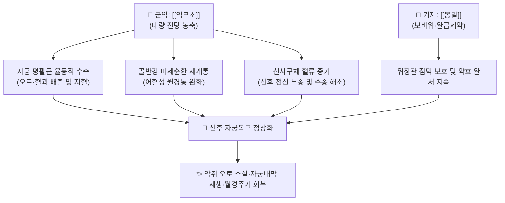

---
aliases:
  - 益母草膏
  - Yimucao-gao
  - Motherwort Paste
tags:
  - 처방/활혈거어·지혈제
  - 활혈거어/활혈조경
  - 산후오로
  - 자궁복구부전
  - 본초강목
---

# 🍵 [[익모초고]] (益母草膏, Yimucao-gao / Motherwort Paste)

> **핵심 3줄 요약 (Key Summary)**:
> - 🌿 기본 구성: [[익모초]], [[봉밀]](꿀) 또는 [[홍당]] ([[익모초]] 신선품을 대량 장시간 농축 전탕하여 꿀과 함께 졸여낸 활혈조경·거어생신의 대표 부인과 고제).
> - 🎯 산후 오로부진(惡露不盡), 악취 나는 검붉은 혈괴 배출, 자궁복구 부전(하복 팽만 둔통), 어혈성 [[생리통]], 월경과소, 산후 전신 부종, 소파수술 후 자궁 회복.
> - 🔬 레오누린(Leonurine) 및 스타키드린의 자궁 평활근 $\alpha_1$-수용체 자극 및 옥시토신양 율동적 수축 유도, 트롬복산 억제를 통한 미세혈전 방지, VEGF 매개 자궁내막 재생 촉진.
> - ⚠️ 주의사항: 강력한 자궁 수축 유발로 임산부 복용 절대 금기(유산 위험), 복용 초기 일시적 후진통(훗배앓이) 사전 안내 필수.

---

## 📌 목차
1. [기본 처방 정보 & 군신좌사 구성](#1-기본-처방-정보--군신좌사-구성)
2. [방제학적 약재 상호작용 & 시너지 네트워크](#2-방제학적-약재-상호작용--시너지-네트워크)
3. [현대 분자약리학적 효능 & 작용 기전](#3-현대-분자약리학적-효능--작용-기전)
4. [적응 병증 및 체질별 감별 (Sweet Spot vs 금기)](#4-적응-병증-및-체질별-감별-sweet-spot-vs-금기)
5. [유사 처방군 감별 매트릭스](#5-유사-처방군-감별-매트릭스)
6. [임상 가감례 & 현대 질환별 응용](#6-임상-가감례--현대-질환별-응용)
7. [💡 사용자 진료실 핵심 필기 & 임상 팁 (원문 보존)](#7--사용자-진료실-핵심-필기--임상-팁-원문-보존)
8. [출처 및 학술 참고 문헌 (References)](#8-출처-및-학술-참고-문헌-references)

---

## 1. 기본 처방 정보 & 군신좌사 구성

* **출전(出典)**: 《본초강목(本草綱目)》, 《수세보원(壽世保元)》 권오
* **치법(治法)**: 활혈조경(活血調經), 거어생신(祛瘀生新), 이수소종(利水消腫), 양혈청열(養血淸熱)
* **주치(主治)**: 산후 오로부진, 혈훈(血暈), 어혈성 하복냉통, 월경부조, 붕루 및 산후 부종

| 구분 | 약재명 | 표준 용량 | 본초 효능 & 방제 내 역할 |
| :--- | :--- | :--- | :--- |
| **군약 (君藥)** | [[익모초]] | 500g (신선품 혹 건품 대량) | 활혈조경, 거어생신, 이수소종, 자궁 평활근의 율동적 수축 촉진 |
| **좌사약 (佐使藥)** | [[봉밀]](꿀) 또는 [[홍당]](흑설탕) | 적량 (약 100~150g) | 건비화위(健脾和胃), 완급지통, 쓴맛 교정 및 유효 성분의 완만 지속 방출 |

> **배오 특징**:
> 1. **단미 대량 고제(膏劑) 추출의 묘**: 단일 약재의 성미가 한쪽에 치우치지 않도록 신선한 [[익모초]]를 장시간 농축 전탕하여 맑은 고(淸膏)로 만든 후, 정제된 [[봉밀]]을 가하여 조제함으로써 위장관 자극을 최소화하고 복약 순응도를 극대화했습니다.
> 2. **거어생신(祛瘀生新)의 온건성**: [[익모초]]는 파혈(破血)하지 않으면서도 어혈을 부드럽게 몰아내고 신생 정혈(正血)을 손상시키지 않는 독보적인 활혈 약재로, 산후 기혈이 극도로 쇠약해진 산모의 어혈증에 가장 안전하게 투여할 수 있습니다.
> 3. **활혈(活血)과 이수(利水)의 유기적 병행**: 골반강 내 혈액 정체를 풀어주는 동시에 신장의 수분 대사를 활성화하여 산후에 흔히 동반되는 하체 및 전신 부종을 신속히 배출합니다.

---

## 2. 방제학적 약재 상호작용 & 시너지 네트워크

* **익모초 알칼로이드와 당분의 복합체 형성**: 꿀([[봉밀]])의 포도당·과당 성분이 고미(苦味) 알칼로이드의 점막 자극을 완충하여 공복 복용 시에도 속쓰림을 유발하지 않으며, 소화관 내 체류 시간을 늘려 자궁 수축 작용을 일정하게 유지시킵니다.
* **혈관 확장과 평활근 수축의 조화**: 골반강 혈관은 확장시켜 울혈을 해소하는 반면, 자궁 체부 근육은 강하게 수축시켜 혈관 파열 부위를 압박 지혈하는 이중 기전을 나타냅니다.

---

## 3. 현대 분자약리학적 효능 & 작용 기전

* **자궁 평활근의 율동적 수축 및 자궁복구 촉진**:
  * 주성분인 레오누린(Leonurine)과 스타키드린(Stachydrine)이 자궁 평활근 세포막의 $\alpha_1$-아드레날린 수용체를 자극하여 $IP_3/Ca^{2+}$ 신호전달 경로를 활성화, 세포외 칼슘 유입 및 근소포체 칼슘 방출을 통해 옥시토신과 유사한 규칙적 수축을 유도합니다.
* **항혈전 및 미세순환 장애 개선**:
  * 트롬복산 $A_2$($TXA_2$) 합성을 억제하고 혈관내피 프로스타사이클린($PGI_2$) 분비를 촉진하여 혈소판 응집을 막고 미세혈전증을 예방합니다.
* **자궁내막 상피화 및 혈관신생 촉진**:
  * 저산소 유도인자($HIF-1\alpha$) 및 혈관내피세포성장인자(VEGF) 분비를 조절하여 분만 후 또는 소파술 후 박리된 자궁내막 기저층의 상처 치유와 기질 재건을 촉진합니다.
* **이수소종(利水消腫) 및 신기능 보호**:
  * 신혈류량을 증가시키고 신원(Nephron)의 나트륨 배설을 촉진하여 수분 저류로 인한 산후 부종을 완화합니다.

---

## 4. 적응 병증 및 체질별 감별 (Sweet Spot vs 금기)

### [✅ 최적 적응증 (Sweet Spot)]
* **적응 병증**:
  * 산후 오로부진(惡露不盡): 분만 후 수주일이 지나도 흑갈색 악취 나는 분비물이나 핏덩어리가 지속적으로 배출되는 경우.
  * 자궁복구 부전(Subinvolution of Uterus): 아랫배가 묵직하게 부풀어 있고 누르면 둔통이 느껴지며 자궁 수축이 지연된 상태.
  * 어혈성 [[생리통]]: 월경 첫날부터 검붉은 혈괴가 쏟아져 나오며 덩어리가 빠져나오면 일시적으로 통증이 덜해지는 패턴.
  * 산후 전신 부종: 하지 함요부종과 함께 소변량이 줄어든 산후 수종 환자.
* **설진·맥진**: 설질은 암자(暗紫)색을 띠거나 설변에 어반(瘀斑)이 보이며, 맥상은 침세삽(沈細澁)하거나 현삽(弦澁)함.

### [⚠️ 신중 투여 및 금기 (Caution / Contraindication)]
* **임산부 절대 금기 (Absolute Contraindication)**: 강력한 자궁 수축 유발 작용으로 인해 유산(조산)의 치명적 위험이 있으므로 임신 중 투여 절대 불가.
* **혈허무어(血虛無瘀) 및 기혈고갈 환자**: 어혈 정체 없이 단순히 혈액과 진액이 고갈되어 월경이 나오지 않는 환자에게 단독 투여하면 음혈을 더욱 소모시킬 수 있음.
* **비위허한(脾胃虛寒)성 설사 환자**: 익모초의 성질이 미한(微寒)하고 쓰므로 평소 만성 설사나 위한(胃寒)이 심한 환자는 복통 및 설사가 유발될 수 있어 온성 약재와 병용 요법 필요.

---

## 5. 유사 처방군 감별 매트릭스

| 처방명 | 핵심 배오 차이 | 주치 및 임상 차별점 | 맥진/설진 차이 |
| :--- | :--- | :--- | :--- |
| [[익모초고]] | 익모초 단미 고제 (+ 봉밀) | 산후 오로부진, 자궁복구 부전, 어혈성 생리통, 이수소종 | 설자암태백, 맥침세삽 |
| [[생화탕]] | 당귀, 천궁, 도인, 포강, 감초 | 산후 한체어혈 복통, 오로 정체, 온경산한 주력 | 설담암, 설태백활, 맥침긴 혹 침현 |
| [[궁귀조혈음]] | 사물탕 + 익모초, 오약, 향부자 | 산후 기혈허약 + 기체어혈, 완만한 산후 조리 | 설담, 태박백, 맥세약 혹 완약 |
| [[계지복령환]] | 계지, 복령, 도인, 목단피, 작약 | 만성 골반강 종괴(자궁근종·선근증), 실증 징가 | 설암자, 설하면정맥 노창, 맥침실현 |

---

## 6. 임상 가감례 & 현대 질환별 응용

* **산후 복통 및 오로 정체가 심한 경우**: [[생화탕]] 전탕액에 익모초고 1스푼(15g)을 타서 복용하면 화어지통 시너지가 극대화됨.
* **기혈 허약이 두드러져 어지럼증이 심한 경우**: [[당귀]], [[황기]] 전탕액과 합방한 당귀익모고(當歸益母膏) 형태로 운용.
* **소파수술(유산) 후 회복기**: 인공유산 또는 계류유산 후 1~2주간 복용하여 자궁 내 잔류 혈종 배출 및 내막 유착(아셔만 증후군) 예방.
* **현대 질환 응용**:
  * 제왕절개술 후 방귀 배출 촉진 및 자궁 수축 촉진.
  * 피임약 복용 중단 후 발생하는 소퇴성 무월경 및 희발월경의 정상 배란 유도 보조.

---

## 7. 💡 사용자 진료실 핵심 필기 & 임상 팁 (원문 보존)

> [!tip] **진료실 실전 노하우 (User Clinical Insight)**
> * **산후 복용 시 환자 사전 티칭 (후진통 대처법)**:
>   * 익모초고를 복용한 뒤 자궁 평활근이 수축하면서 일시적으로 아랫배가 쥐어짜듯 아픈 산후 진통(후진통)이 나타날 수 있습니다. 이는 자궁 내에 고여 있던 악취 오로와 핏덩어리가 밀려 나오는 정상적인 회복 반응이므로 환자가 놀라지 않도록 사전에 반드시 안내해야 합니다.
> * **냉증 산모의 배합 팁**:
>   * 익모초는 기본 성미가 약간 차가운 편(미한, 微寒)이므로, 평소 손발이 차고 아랫배가 시린 한체(寒滯) 체질의 산모에게 단독 투여 시 소화 장애나 오한이 생길 수 있습니다. 이 경우 따뜻한 생강차나 [[생화탕]]에 꿀과 함께 타서 복용하도록 지도합니다.
> * **소파수술 후 자궁내막 보호 프로토콜**:
>   * 계류유산이나 중절수술 후 자궁내막 손상으로 인한 유착을 막기 위해, 수술 직후 3~5일간 익모초고를 복용시켜 잔여 탈락막을 깨끗이 비워낸 후 [[보허탕]]이나 [[사물탕]] 등 보혈제로 전방하는 2단계 치료법이 매우 효과적입니다.

---

## 8. 출처 및 학술 참고 문헌 (References)

1. 이시진(李時珍), 《본초강목(本草綱目)》 초부 권십오 익모초: "益母草, 行血, 破血, 生新血, 止咳調經, 治産後諸疾."
3. * **Li F et al. (2021)**. Novel Stachydrine-Leonurine Conjugate SL06 as a Potent Neuroprotective Agent for Cerebral Ischemic Stroke. *ACS chemical neuroscience*, 12: 2478-2490. [PMID: 34180238](https://pubmed.ncbi.nlm.nih.gov/34180238/)
