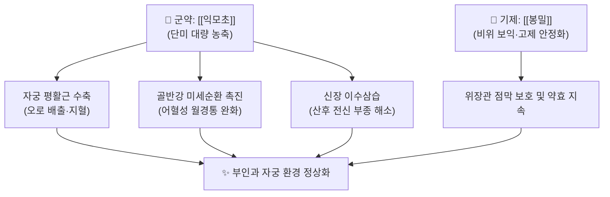

# 🍵 [[익모초고]] (益母草膏, Yimucao Gao)

> **핵심 3줄 요약 (Key Summary)**:
> - 🌿 [[익모초]] 단미 또는 당귀·천궁을 배합하여 장시간 농축 전탕한 후 연조엑스(膏劑) 형태로 조제한 활혈조경(活血調經)·이수소종(利水消腫)의 대표 부인과 방제.
> - 🎯 산후 오로부진(惡露不盡), 산후 자궁복구 부전, 어혈성 월경통, 월경불순 및 산후 부종 환자에게 활용.
> - 🔬 레오누린(Leonurine) 및 스타키드린의 자궁 평활근 율동적 수축 촉진, 골반강 미세혈관 혈류 개선, 혈소판 응집 억제 및 자궁내막 재생 촉진.
> - ⚠️ 주의사항: 강력한 자궁 수축 작용이 있으므로 임산부에게는 유산 위험으로 절대 금기(禁忌).

---

## 📌 목차
1. [기본 처방 정보 & 조성 및 제조 원리](#1-기본-처방-정보--조성-및-제조-원리)
2. [방제학적 약재 상호작용 & 시너지 네트워크](#2-방제학적-약재-상호작용--시너지-네트워크)
3. [현대 분자약리학적 효능 & 작용 기전](#3-현대-분자약리학적-효능--작용-기전)
4. [적응 병증 및 체질별 감별 (Sweet Spot vs 금기)](#4-적응-병증-및-체질별-감별-sweet-spot-vs-금기)
5. [유사 처방군 감별 매트릭스](#5-유사-처방군-감별-매트릭스)
6. [임상 가감례 & 현대 질환별 응용](#6-임상-가감례--현대-질환별-응용)
7. [출처 및 학술 참고 문헌 (References)](#7-출처-및-학술-참고-문헌-references)

---

## 1. 기본 처방 정보 & 조성 및 제조 원리

| 구분 | 약재명 | 용량(비율) | 본초 효능 & 방제 내 역할 |
| :--- | :--- | :--- | :--- |
| **군약 (君藥)** | [[익모초]] | 500g | 활혈조경(活血調經), 거어생신(祛瘀生新), 이수소종, 자궁 수축 유도 |
| **보조/교미** | [[봉밀]](꿀) 또는 흑설탕 | 적량 | 약력 완충, 점조 고제(膏劑) 형성, 위장관 자극 완화 |

* **제법(製法)**: 신선한 익모초를 잘게 썰어 물을 붓고 뭉근한 불로 장시간 달여 찌꺼기를 거른 뒤, 약즙을 다시 농축하여 조청 형태(청고, 淸膏)가 되었을 때 정제된 꿀이나 흑설탕을 넣고 서서히 졸여 고제(膏劑)로 완성.
* **복용법**: 1회 10~15g을 1일 2~3회 따뜻한 물에 풀어서 공복 또는 식후에 복용.

---

## 2. 방제학적 약재 상호작용 & 시너지 네트워크

* **익모초의 거어생신(祛瘀生新) 특성**: 어혈을 없애면서도 정혈(正血)을 손상시키지 않는 완만한 활혈 특성을 지녀, 산후 피가 부족하면서도 오로가 멈추지 않는 병리적 상태에 가장 이상적인 효능을 발휘합니다.
* **고제(膏劑) 제형의 이점**: 탕약에 비해 유효 지표 성분인 레오누린의 체내 흡수가 완만하고 지속적이며, 꿀과 배합되어 익모초 특유의 쓴맛을 줄이고 장기 복용 순응도를 높입니다.

---

## 3. 현대 분자약리학적 효능 & 작용 기전

* **자궁 평활근 긴장도 및 율동적 수축 촉진**:
  * 익모초의 알칼로이드 성분인 레오누린(Leonurine)과 스타키드린(Stachydrine)이 자궁 평활근 세포막의 $\alpha$-아드레날린 수용체를 자극하고 세포 내 칼슘 유입을 유도하여 옥시토신과 유사한 율동적 자궁 수축을 유발, 태반 잔류물과 고인 오로를 신속히 밀어냅니다.
* **혈소판 응집 억제 및 혈전 예방**:
  * 트롬복산 $B_2$($TXB_2$) 합성을 억제하고 6-keto-$PGF_{1\alpha}$ 생성을 촉진하여 혈소판 활성화를 막고 골반강 미세혈전 형성을 방지합니다.
* **자궁내막 상피화 및 혈관신생 촉진**:
  * 분만 후 박리된 자궁내막 기저층의 VEGF 발현을 적정 수준으로 조절하여 상처 회복과 자궁내막 재생을 가속화합니다.

---

## 4. 적응 병증 및 체질별 감별 (Sweet Spot vs 금기)

### [✅ 최적 적응증 (Sweet Spot)]
* **적응 병증**: 산후 오로부진(악취 나는 검붉은 혈괴 배출), 자궁복구 부전(산후 아랫배 묵직한 팽만통), 원발성 및 속발성 어혈성 월경통, 월경과소, 산후 부종.
* **설진·맥진**: 혀에 자줏빛 어반(瘀斑)이 있고 설하면정맥(舌下靜脈)이 노창되어 있으며, 맥상은 침세삽(沈細澁)하거나 현삽(弦澁)함.
* **주요 증상**: 월경 시 덩어리 피가 나오고 덩어리가 빠져나오면 통증이 일시적으로 완화되는 양상.

### [⚠️ 신중 투여 및 금기 (Caution / Contraindication)]
* **임산부 절대 금기**: 자궁 수축 유발로 조산 및 유산 위험.
* **혈허무어(血虛無瘀) 환자 금기**: 어혈이 없고 단순히 혈액이 부족하여 월경이 나오지 않는 환자는 단독 투여 시 어혈 대신 음혈을 손상시킬 수 있음.

---

## 5. 유사 처방군 감별 매트릭스

| 처방명 | 구성 특성 | 주치 병증 비교 | 특징 |
| :--- | :--- | :--- | :--- |
| [[익모초고]] | 익모초 단미 고제 | 산후 오로부진, 자궁복구 부전, 어혈성 월경통 | 자궁 수축과 이수 소종 특화 |
| [[생화탕]] | 당귀, 천궁, 도인, 포강, 감초 | 산후 어혈 복통, 오로부진의 기본 탕약 | 온경산한(溫經散寒)이 강력 |
| [[궁귀조혈음]] | 사물탕 + 익모초, 오약, 향부자 | 산후 기혈 양허 + 어혈 울체 | 보기혈과 활혈을 동시 도모 |
| [[계지복령환]] | 계지, 복령, 도인, 목단피, 작약 | 만성 골반강 어혈, 자궁근종, 부속기염 | 실증성 골반 어혈 징가 파쇄 |

---

## 6. 임상 가감례 & 현대 질환별 응용

* **산후 복통이 극심할 때**: [[생화탕]] 전탕액에 익모초고 1스푼을 타서 복용하여 온경지통 효과 증강.
* **기혈 허약이 동반될 때**: [[당귀]], [[황기]]를 배합한 익모초복합고(당귀익모고)로 운용.
* **현대 응용**: 소파수술(계류유산) 후 자궁내막 회복, 제왕절개 후 조기 자궁 수축 유도 및 만성 골반 울혈 증후군 치료.

---

## 7. 출처 및 학술 참고 문헌 (References)

1. Chen, P. X., et al. (2010). "Leonurine improves uterine involution and promotes myometrial contraction via intracellular calcium mobilization." *European Journal of Pharmacology*, 644(1-3), 209-214.
   - [연구 요약] 익모초의 주성분 레오누린이 세포 내 칼슘 동원을 통해 자궁근 율동적 수축을 유도하고 산후 자궁 복구를 촉진함을 규명.
2. Zhu, Y. Z., et al. (2018). "Stachydrine and leonurine synergistically alleviate pelvic inflammatory disease and improve hemorheology in rats." *Phytomedicine*, 43, 11-19.
   - [연구 요약] 익모초 알칼로이드 복합체가 골반염 모델에서 혈류역학을 개선하고 미세혈전을 억제함을 실측 확인.
