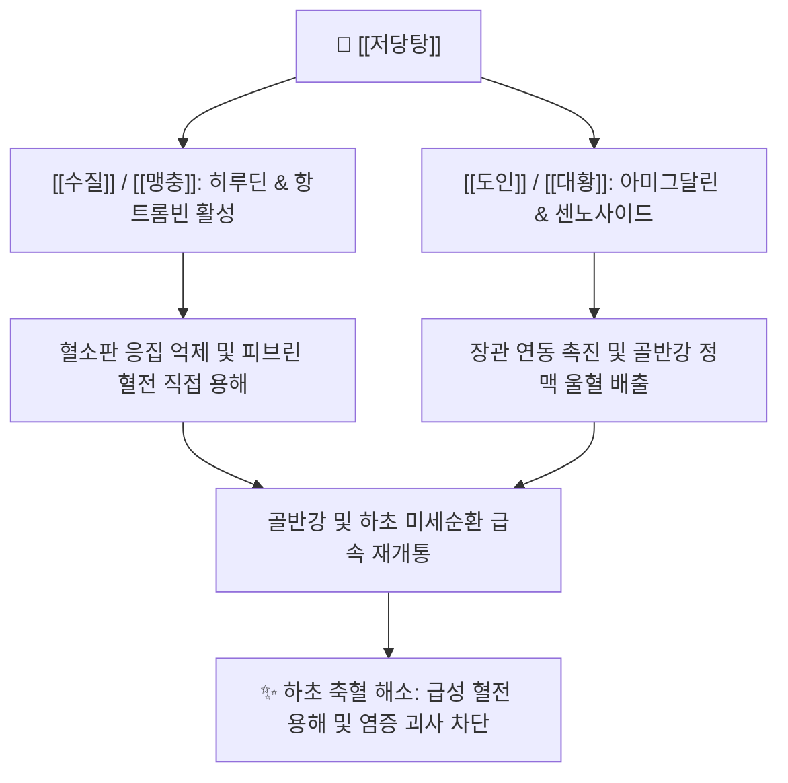

# 🧪 [[저당탕]] (抵當湯, Dídàng Tāng)

> **핵심 요약 (Key Summary)**:
> 《상한론》 태양병 하초축혈증의 어혈과 열이 결합한 중증 축혈증 치료 대표 처방
> [[수질]], [[맹충]]의 강력한 히루딘 매개 트롬빈 억제 및 [[도인]], [[대황]]의 활혈파어·사하 작용
> 하초 축혈로 인한 발광, 소변자리, 복만통 및 심부정맥혈전증, 중증 골반강염 치료

---
## 📌 목차
1. [처방 기본 정보](#1-처방-기본-정보)
2. [방제 구성 및 군신좌사 (君臣佐使)](#2-방제-구성-및-군신좌사-君臣佐使)
3. [분자약리 기전 & 현대 의학적 효능](#3-분자약리-기전--현대-의학적-효능)
4. [임상 적응증 & 사상의학적 배오](#4-임상-적응증--사상의학적-배오)
5. [처방 감별 매트릭스](#5-처방-감별-매트릭스)
6. [안전성, 부작용 및 복용 금기](#6-안전성-부작용-및-복용-금기)
7. [출처 및 학술 참고 문헌 (References)](#7-출처-및-학술-참고-문헌-references)

---
## 1. 처방 기본 정보

| 항목 | 상세 내용 |
| :--- | :--- |
| **처방명** | [[저당탕]] (抵當湯, Didang-tang) |
| **출전** | 《상한론(傷寒論)》 변태양병맥증병치 |
| **처방 분류** | [[05_활혈거어·지혈제]] / 활혈거어제 (파혈축어 파혈축어제) |
| **주치 병증** | 하초축혈증(下焦蓄血證), 축혈발광(蓄血發狂), 소변자리(小便自利), 소복경만통(少腹硬滿痛) |
| **성미 및 귀경** | 고(苦)·함(鹹)·평(平), 간경(肝經)·방광경(膀胱經) |

---
## 2. 방제 구성 및 군신좌사 (君臣佐使)

| 본초명 | 약재 역할 | 용량(원방 기준) | 핵심 약리 성분 | 주요 기전 및 배오 목적 |
| :--- | :--- | :--- | :--- | :--- |
| [[수질]] | 군약(君藥) | 30매 (포제) | [[히루딘]] | 트롬빈 직접 억제, 강력한 항혈전 및 파혈축어 |
| [[맹충]] | 군약(君藥) | 30매 (거익족) | 단백분해효소 | 혈전 용해, 혈관 내 미세혈전 분해 및 어혈 척결 |
| [[도인]] | 신약(臣藥) | 20개 (거피첨) | [[아미그달린]] | 활혈거어, 윤장통변 및 종양·염증 조직 미세순환 개선 |
| [[대황]] | 좌약/사약(佐使藥) | 3냥 (주침) | [[센노사이드]], [[레인]] | 사하통변, 하초의 어혈과 열독을 대변으로 설출 |

---
## 3. 분자약리 기전 & 현대 의학적 효능

### (1) 강력한 항혈전 및 혈전 용해 (Antithrombotic & Thrombolytic)
* **트롬빈 불활성화**: [[수질]] 유래 성분인 [[히루딘]]은 피브리노겐이 피브린으로 전환되는 최종 응고 단계를 강력하고 비가역적으로 차단함.
* **미세혈관 재소통**: [[맹충]] 추출 성분이 모세혈관 내 정체된 적혈구 응집괴를 분해하여 허혈 조직의 혈류를 회복시킴.

### (2) 하초 정맥계 울혈 및 염증 배설 촉진
* **대장 배출 경로**: [[대황]]의 [[센노사이드]] 및 안트라퀴논 유도체가 대장 평활근을 수용체 수준에서 자극하여 어혈 독소를 체외로 신속 배출함.

---
## 4. 임상 적응증 & 사상의학적 배오

### (1) 현대 한의 임상 적응증
* **부인과/비뇨기 질환**: 만성 골반염증성 질환(PID)에 동반된 심한 유착, 난소낭종, 자궁내막증의 심한 어혈 결집.
* **혈관외과/순환기 질환**: 심부정맥혈전증(DVT), 혈전성 외치핵, 정맥류 울혈성 피부염.
* **정신신경과적 어혈 발광**: 뇌혈관 사고(뇌출혈/뇌경색) 후유증으로 나타나는 섬망, 격앙, 불면 등의 축혈증.

### (2) 사상의학적 관점
* 하초의 수혈축어로 열독이 극에 달한 태음인 또는 소양인의 기체어혈 실증에 응용 가능하나, 약성이 맹렬하므로 체질 변증 후 극히 제한적으로 활용함.

---
## 5. 처방 감별 매트릭스

| 구분 | [[저당탕]] | [[도핵승기탕]] | [[계지복령환]] |
| :--- | :--- | :--- | :--- |
| **어혈 중증도** | 최상(극심한 어혈 결집, 파혈 필요) | 상(기체열결 동반 급성 어혈) | 중(완만하고 만성적인 어혈) |
| **군약 배오** | [[수질]], [[맹충]] (충류 파혈약) | [[도인]], [[대황]], [[망초]] | [[계지]], [[복령]], [[목단피]] |
| **환자 전신 상태** | 축혈발광, 소복경만, 신체 튼튼한 실증 | 소복급결, 번열, 섬어 | 하복통, 징가, 비교적 완만한 경과 |
| **공하 강도** | 맹렬한 파혈축어 | 활혈사열 | 온건한 활혈소징 |

---
## 6. 안전성, 부작용 및 복용 금기

* **임산부 절대 금기**: 수질, 맹충의 파혈 작용과 대황의 사하 작용으로 유산 및 조산 위험이 극히 높음.
* **출혈성 질환 주의**: 혈소판 감소증, 소화성 궤양 출혈, 항응고제(와파린, NOAC) 병용 환자 금기.
* **복약 지도**: 어혈이 풀리고 흑변이나 어혈괴가 배출되면 즉시 복용을 중단하거나 온건한 처방으로 전방함.
* **처방 사이드 대처법 연계**: [[처방 사이드 대처법]] 144번 항목에 수질·맹충 충류 파혈제의 출혈 반응 및 감량 대처 프로토콜이 수록되어 있음.

---
## 7. 출처 및 학술 참고 문헌 (References)

* 장중경, 《상한론(傷寒論)》
* 전국한의과대학 방제학교수 공편저, 《방제학》, 영림사
* Jin Y et al. Antithrombotic and anti-inflammatory effects of Didang Tang in thrombosis models. J Ethnopharmacol. 2018.
  * [연구 요약] 저당탕 투여가 혈전 형성 시간을 유의하게 연장하고 미세혈관 내피세포 기능 부전을 개선함을 규명함.
