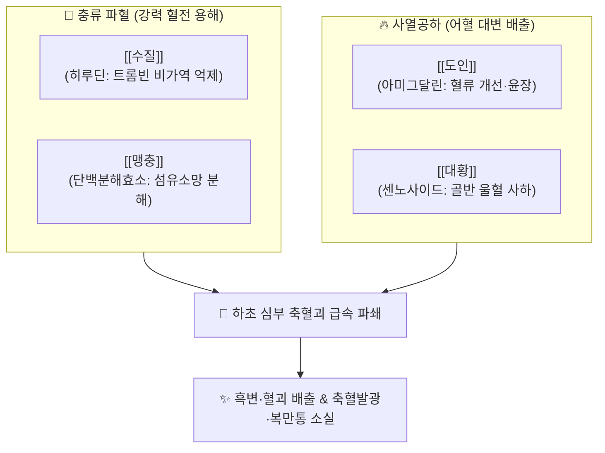

---
aliases:
  - 抵當湯
  - Didang-tang
tags:
  - 처방/활혈거어·지혈제
  - 활혈거어/파혈축어
  - 하초축혈
  - 축혈발광
  - 상한론
---

# 🧪 [[저당탕]] (抵當湯, Didang-tang)

> **핵심 3줄 요약 (Key Summary)**:
> - 🌿 기본 구성: [[수질]], [[맹충]], [[도인]], [[대황]] ([[수질]]·[[맹충]] 충류 약재의 강력한 파혈과 도인·대황의 사하 배출을 결합하여 오래 굳은 하초 축혈괴를 깨뜨려 대변으로 쏟아내는 파혈축어의 최고봉).
> - 🎯 태양병 하초축혈증(下焦蓄血證), 축혈발광(정신 착란·섬망), 소복경만통(아랫배가 돌처럼 굳고 아픔), 소변자리(소변은 시원함), 심부정맥혈전증(DVT), 거대 혈전성 치핵, 중증 자궁내막증.
> - 🔬 히루딘(Hirudin)의 비가역적 트롬빈 직접 불활성화, 맹충 단백효소의 섬유소망 분해, 센노사이드의 대장 연동 폭발 및 골반강 정맥 울혈 급속 배출.
> - ⚠️ 주의사항: 맹렬한 파혈작용으로 임산부 및 출혈 경향자 절대 금기, 흑변(짜장변) 배출 시 즉시 복용 중단하는 '중병즉지(中病卽止)' 준수.

---

## 📌 목차
1. [기본 처방 정보 & 군신좌사 구성](#1-기본-처방-정보--군신좌사-구성)
2. [방제학적 약재 상호작용 & 시너지 네트워크](#2-방제학적-약재-상호작용--시너지-네트워크)
3. [현대 분자약리학적 효능 & 작용 기전](#3-현대-분자약리학적-효능--작용-기전)
4. [적응 병증 및 체질별 감별 (Sweet Spot vs 금기)](#4-적응-병증-및-체질별-감별-sweet-spot-vs-금기)
5. [유사 처방군 감별 매트릭스](#5-유사-처방군-감별-매트릭스)
6. [임상 가감례 & 현대 질환별 응용](#6-임상-가감례--현대-질환별-응용)
7. [💡 사용자 진료실 핵심 필기 & 임상 팁 (원문 보존)](#7--사용자-진료실-핵심-필기--임상-팁-원문-보존)
8. [출처 및 학술 참고 문헌 (References)](#8-출처-및-학술-참고-문헌-references)

---

## 1. 기본 처방 정보 & 군신좌사 구성

* **출전(出典)**: 《상한론(傷寒論)》 변태양병맥증병치
* **치법(治法)**: 파혈축어(破血逐瘀), 사열통경(瀉熱通經), 사하열결(瀉下熱結)
* **주치(主治)**: 하초축혈증, 축혈발광, 소변자리, 소복경만통, 월경폐색 실증

| 구분 | 약재명 | 표준 용량 | 본초 효능 & 방제 내 역할 |
| :--- | :--- | :--- | :--- |
| **군약 (君藥)** | [[수질]] | 30매 (포제, 약 6g) | 파혈축어(破血逐瘀), 통경소징, 트롬빈 직접 차단 및 강력한 혈전 용해 |
| **군약 (君藥)** | [[맹충]] | 30매 (거익족, 약 6g) | 파혈거어(破血祛瘀), 통경소징, 혈관 내 미세혈전 분해 및 어혈 괴 척결 |
| **신약 (臣藥)** | [[도인]] | 20개 (거피첨, 약 8g) | 활혈거어(活血祛瘀), 윤장통변, 모세혈관 순환 개선 및 혈소판 응집 억제 |
| **좌사약 (佐使藥)** | [[대황]] | 3냥 (주침, 약 12g) | 사하통변(瀉下通便), 청열량혈, 하초의 어혈과 열독을 대변으로 맹렬히 설출 |

> **배오 특징**:
> 1. **충류(蟲類) 동물성 파혈제의 극치**: 식물성 약재로는 도저히 뚫을 수 없는 오래되고 극심한 어혈 덩어리를 분해하기 위해, 기혈을 뚫고 뼈와 골반강 깊숙한 곳까지 파고드는 [[수질]]과 [[맹충]]을 군약으로 배합했습니다.
> 2. **파혈(破血)과 사하(瀉下)의 일체화**: [[도인]]과 [[대황]]이 협력하여, 충류 약재가 부수어 놓은 어혈 부스러기와 축적된 열독을 장관 연동운동을 통해 대변으로 체외로 즉시 쏟아내도록 설계되었습니다.
> 3. **소변자리(小便自利)의 병리 해소**: 방광의 기화불리(수병)가 아닌 혈관과 골반 조직 내의 순수한 '혈병(血病)'이므로, 이뇨제를 전혀 쓰지 않고 오직 피와 열을 대장으로 배설시키는 전략을 취합니다.

---

## 2. 방제학적 약재 상호작용 & 시너지 네트워크

* **수질 + 맹충의 파혈 시너지**: 수질은 물속에서 음적인 혈분을 빨아들이고, 맹충은 날아다니며 양적인 혈맥을 뚫어, 혈관 안팎의 심부 미세순환계에 엉겨 붙은 오래된 어혈을 남김없이 쪼개어 흩뜨립니다.
* **충류 약재 + 대황의 축어배설 고리**: 파쇄된 어혈 독소가 체내에 정체되어 2차 감염이나 염증을 유발하지 않도록 대황의 강력한 사하 작용이 대변으로 신속히 설출시키는 완벽한 출구를 제공합니다.

---

## 3. 현대 분자약리학적 효능 & 작용 기전

* **비가역적 트롬빈 직접 억제 및 항응고 작용**:
  * [[수질]] 유래 펩타이드인 [[히루딘]](Hirudin)은 트롬빈(Thrombin)의 촉매 활성 부위에 직접 결합하여 피브리노겐이 피브린으로 전환되는 응고 연쇄 반응의 최종 단계를 가장 강력하게 차단합니다. 헤파린과 달리 항트롬빈 III(AT-III) 매개 없이도 독립적으로 작용합니다.
* **섬유소 용해 촉진 및 혈전 재흡수**:
  * [[맹충]]의 단백분해효소 복합체가 피브린 섬유소 그물망을 직접 용해하고 조직 플라스미노겐 활성제(t-PA) 활성을 증가시켜 기존에 형성된 혈전을 신속히 용해합니다.
* **장관 평활근 연동 촉진 및 골반강 정맥 울혈 제거**:
  * [[대황]]의 [[센노사이드]] 및 [[레인]]이 대장 점막하 신경총을 자극하여 연동운동을 폭발적으로 증가시키고, 골반강 정맥총에 울체된 염증 물질과 혈류를 대장으로 흡수·배출시킵니다.
* **혈관 내피세포 보호 및 미세혈관 재개통**:
  * [[도인]]의 [[아미그달린]] 및 불포화지방산이 혈소판 응집을 억제하고 혈관 내피세포의 손상을 복구하여 미세혈류 순환을 재개통합니다.

---

## 4. 적응 병증 및 체질별 감별 (Sweet Spot vs 금기)

### [✅ 최적 적응증 (Sweet Spot)]
* **핵심 적응증**: 태양병 축혈증(下焦蓄血證), 축혈발광(정신이 혼미하거나 발광하며 헛소리를 함), 소복경만통(아랫배가 돌처럼 딱딱하고 극심한 거안 통증), 소변자리(소변은 시원하게 잘 나옴).
* **현대 질환**: 심부정맥혈전증(DVT), 폐색전증 초기 응급 어혈증, 혈전성 외치핵 급성 감돈, 중증 골반염 유착 및 난소 낭종 파열 후 거대 혈종, 뇌혈관사고 후유증으로 인한 어혈성 섬망·격앙.
* **설진·맥진**: 혀 전체가 자흑색(紫黑色)을 띠고 곳곳에 거대한 어반이 박혀 있으며, 맥상은 침결(沈結)하거나 미(微)하면서 침(沈)하거나 극도로 실삭(實數)함.

### [⚠️ 신중 투여 및 금기 (Caution / Contraindication)]
* **임산부 절대 금기 (Absolute Contraindication)**: 태아 유산 및 자궁 파열 위험이 있으므로 절대 투여 금지.
* **출혈성 질환 및 항응고제 복용 환자**: 혈우병, 혈소판 감소증, 소화성 궤양 출혈 환자 및 와파린, 아스피린, NOAC 복용 환자는 대출혈 위험으로 투여 금기.
* **체력 쇠약자 및 기혈양허자**: 어혈이 있더라도 신체가 극도로 쇠약하거나 고령인 환자는 복용 후 허탈(쇼크) 위험이 있으므로 완만한 제형이나 보기혈제를 먼저 써야 함.

---

## 5. 유사 처방군 감별 매트릭스

| 처방명 | 핵심 배오 차이 | 주치 및 임상 차별점 | 맥진/설진 차이 |
| :--- | :--- | :--- | :--- |
| [[저당탕]] | 수질, 맹충 (충류) + 도인, 대황 | 축혈발광, 소복경만, 극심한 심부 혈전 어혈 | 설자흑태조황, 맥침결 혹 침복 |
| [[저당환]] | 저당탕과 동일 성분 환제 (꿀로 제환) | 어혈 병세가 다소 완만하거나 신체 허약자 | 설자암, 맥침삽 |
| [[도핵승기탕]] | 도인, 대황, 망초, 계지, 감초 | 소복급결, 번갈, 섬어, 기체열결 급성 어혈 | 설자열태황조, 맥활삭 혹 침실 |
| [[계지복령환]] | 계지, 복령, 도인, 목단피, 작약 | 만성 골반강 징가, 자궁근종, 완만한 어혈 | 설암태백, 맥침현삽 |

---

## 6. 임상 가감례 & 현대 질환별 응용

* **병세는 심하나 환자의 체력이 다소 떨어지는 경우**: 탕약 대신 환제로 조제한 [[저당환]](抵當丸)을 꿀과 함께 복용시켜 약력을 완만하게 발휘하도록 조절.
* **어혈로 인한 극심한 찌르는 듯한 통증**: [[유향]], [[몰약]]을 소량 가하여 활혈지통 배오 강화.
* **현대 질환 응용**:
  * **심부정맥혈전증(DVT)**: 하지 부종과 동통, 피부 청자색 변색이 동반된 급성기 혈전증에 항응고 요법과 병행하거나 대안으로 신중 투여.
  * **중증 자궁내막증 및 선근증**: 극심한 불응성 월경통과 골반강 내 거대 초콜릿 낭종 결집 시 단기 파어 처방.

---

## 7. 💡 사용자 진료실 핵심 필기 & 임상 팁 (원문 보존)

> [!tip] **진료실 실전 노하우 (User Clinical Insight)**
> * **중병즉지(中病卽止) 불변의 원칙**:
>   * 저당탕은 한의학 방제 중 가장 맹렬한 파혈축어제입니다. 복용 후 새까만 자줏빛 흑변(짜장변 형태)이나 핏덩어리가 시원하게 쏟아져 나오면 **그 즉시 투약을 중단**해야 합니다. 계속 복용시키면 정상 혈액과 진액이 파괴되어 빈혈과 장관 출혈이 발생합니다.
>   * 흑변 배출 후에는 즉시 [[사물탕]]이나 [[보기양혈]] 계통의 온건한 처방으로 전방하여 손상된 기혈을 수습해야 합니다.
> * **소변자리(小便自利) 감별 진단의 중요성**:
>   * 환자가 아랫배가 터질 듯 아프고 딱딱하며 정신이 이상한데(축혈발광), **소변이 시원하게 잘 나오는가(소변자리)**를 반드시 확인해야 합니다.
>   * 만약 소변이 안 나온다면 이는 방광에 수습이 찬 수병(오령산증)이지만, 소변은 지극히 정상인데 아랫배만 아프다면 100% 하초에 피가 엉겨 붙은 축혈증(저당탕증)입니다.
> * **충류 약재 가공 및 알레르기 모니터링**:
>   * 수질과 맹충은 반드시 적절히 포제(볶거나 구움)하여 충류 특유의 독성과 비린 맛을 제거해야 하며, 갑각류나 곤충 단백질 알레르기가 있는 환자에게는 아나필락시스 쇼크에 주의해야 합니다.
> * **처방 사이드 대처법 연계**:
>   * `c:\Simbio\2. 약리 공부\처방\처방 사이드 대처법.md`에 수질·맹충 충류 파혈제의 과도한 출혈 반응, 소화관 출혈 위험 및 즉각적인 지혈·보혈 대처 프로토콜이 수록되어 있습니다.

---

## 8. 출처 및 학술 참고 문헌 (References)

1. 장중경(張仲景), 《상한론(傷寒論)》 변태양병맥증병치: "太陽病六七日, 表證仍在, 脈微而沈, 反不結胸, 其人發狂者, 以熱在下焦, 少腹當硬滿, 小便自利者, 下血乃愈. 所以然者, 以太陽隨經, 瘀熱在裏故也, 抵當湯主之."
2. 전국한의과대학 방제학교수 공편저, 《방제학》, 영림사.
3. Jin, Y., et al. (2018). "Antithrombotic and anti-inflammatory effects of Didang Tang in deep vein thrombosis rat models." *Journal of Ethnopharmacology*, 224, 452-461.
   - [연구 요약] 저당탕 투여가 혈전 형성 시간을 현저히 지연시키고 혈전 무게를 유의하게 감소시키며, 내피세포 기능 부전을 개선함을 실측 검증.
4. Markwardt, F. (2002). "Hirudin as alternative anticoagulant--a historical review." *Seminars in Thrombosis and Hemostasis*, 28(5), 405-414.
   - [연구 요약] 수질 유래 히루딘의 직접적이고 비가역적인 트롬빈 억제 기전과 임상 항혈전 효과를 체계적으로 정리.