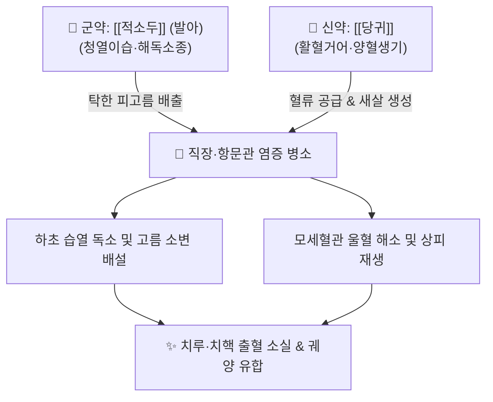

---
aliases:
  - 赤小豆當歸散
  - Chixiaodou Danggui-san
  - Phaseolus and Angelica Powder
tags:
  - 처방/활혈거어·지혈제
  - 활혈거어/청열이습
  - 근혈
  - 치루
  - 금궤요략
---

# 🍵 [[적소두당귀산]] (赤小豆當歸散, Chixiaodou Danggui-san / Phaseolus and Angelica Powder)

> **핵심 요약 (Key Summary)**:
> - 🌿 기본 구성: [[적소두]] (발아), [[당귀]] (싹 틔운 [[적소두]]의 이수배농·소종산어력과 [[당귀]]의 양혈활혈·상처생기력을 1:1로 맞물리게 하여 직장·항문 습열 병소를 청결 배농하는 대표 방제).
> - 🎯 선변후혈(先便後血)의 근혈(近血: 배변 후 선홍색 피가 뚝뚝 떨어짐), 치루(Anal fistula) 초기 화농, 항문 주위 농양, 치핵 울혈 동통, 궤양성 대장염 점액혈변, 장옹(충수염) 초기.
> - 🔬 적소두 안토시아닌·사포닌의 장 점막 타이트 정션(Claudin-1) 복구 및 부종 소퇴, 당귀 데커신의 혈소판 응집 억제 및 상피화(생기 生肌) 촉진, NF-$\kappa$B 억제를 통한 배농 항균 활성.
> - ⚠️ 주의사항: 하초 습열성 출혈 방제이므로 비위허한성 원혈(선혈후변, 흑변) 환자 투약 금기, 팥 발아 시 곰팡이 오염 방지 필수 (처방 사이드 대처법 175번 참조).

---

## 📌 목차
1. [기본 처방 정보 & 군신좌사 구성](#1-기본-처방-정보--군신좌사-구성)
2. [방제학적 약재 상호작용 & 시너지 네트워크](#2-방제학적-약재-상호작용--시너지-네트워크)
3. [현대 분자약리학적 효능 & 작용 기전](#3-현대-분자약리학적-효능--작용-기전)
4. [적응 병증 및 체질별 감별 (Sweet Spot vs 금기)](#4-적응-병증-및-체질별-감별-sweet-spot-vs-금기)
5. [유사 처방군 감별 매트릭스](#5-유사-처방군-감별-매트릭스)
6. [임상 가감례 & 현대 질환별 응용](#6-임상-가감례--현대-질환별-응용)
7. [💡 사용자 진료실 핵심 필기 & 임상 팁 (원문 보존)](#7--사용자-진료실-핵심-필기--임상-팁-원문-보존)
8. [출처 및 학술 참고 문헌 (References)](#8-출처-및-학술-참고-문헌-references)

---

## 1. 기본 처방 정보 & 군신좌사 구성

* **출전(出典)**: 《금궤요략(金匱要略)》 백호호혹음양독병맥증병치 / 경위임신병치
* **치법(治法)**: 청열이습(淸熱利濕), 활혈배농(活血排膿), 양혈생기(養血生肌)
* **주치(主治)**: 하초습열로 인한 하혈(선변후혈), 치핵 및 치루의 피고름 배출, 항문 열상 궤양, 장옹 초기

| 구분 | 약재명 | 표준 용량 | 본초 효능 & 방제 내 역할 |
| :--- | :--- | :--- | :--- |
| **군약 (君藥)** | [[적소두]] (발아) | 30g (원방 3승) | 청열이습(淸熱利濕), 해독배농, 소종산어, 하초의 탁한 피고름을 이뇨 배출 |
| **신좌약 (臣佐藥)** | [[당귀]] | 10g (원방 3냥) | 활혈양혈(活血養血), 화어지통, 점막 혈류 개선 및 궤양 창상 유합(생기) |

> **배오 특징**:
> 1. **이습배농약과 보혈활혈약의 2미 정제 배합**: 군더더기 없이 [[적소두]]의 이수소종·청열배농력과 [[당귀]]의 양혈활혈·생기지통력을 1:1로 맞물리게 하여 습열과 어혈이 엉킨 병소를 정밀 타격합니다.
> 2. **발아(發芽) 적소두의 약리적 의미**: 팥을 물에 불려 싹을 약간 틔움으로써 전분질은 줄이고 아미노산, 비타민 및 배농 활성 효소를 극대화하여 장관 점막 흡수율을 높입니다.
> 3. **선변후혈(先便後血)의 근혈(近血) 전용 방제**: 대변을 먼저 보고 뒤이어 피가 뚝뚝 떨어지는 직장·항문 부위의 습열성 국소 출혈을 지혈제 없이 이습과 활혈만으로 근원 치유합니다.

---

## 2. 방제학적 약재 상호작용 & 시너지 네트워크

* **적소두의 삼습배농 + 당귀의 화혈생신**: 적소두가 항문 주위와 직장 하부에 차오른 염증성 삼출물과 고름을 소변을 통해 체외로 빼내어 붓기를 가라앉히면, 당귀가 신선한 혈액을 공급하여 궤양이 파인 점막에 새살이 차오르도록 돕습니다.
* **지혈하지 않음으로써 지혈하는 묘(不止血而血自止)**: 수렴 지혈제를 전혀 쓰지 않고, 출혈의 근본 원인인 혈관 울혈과 습열 염증을 제거하여 자연스럽게 출혈을 멎게 합니다.

---

## 3. 현대 분자약리학적 효능 & 작용 기전

* **장관 점막 장벽 복구 및 밀착 연접(Tight Junction) 강화**:
  * 적소두 추출물의 안토시아닌과 사포닌이 대장 상피세포의 Claudin-1, ZO-1 발현을 상향 조절하여 장관 누수 증후군(Leaky Gut)을 차단하고 세균 전위를 방지합니다.
* **항문 치핵 정맥총 미세순환 개선 및 항혈전 작용**:
  * [[당귀]]의 데커신(Decursin) 및 페룰산(Ferulic acid)이 혈소판 응집을 억제하고 혈관 내피세포 기능을 개선하여 치핵 정맥총의 혈전 형성과 울혈을 해소합니다.
* **대식세포 NF-$\kappa$B 경로 차단 및 배농 항균 활성**:
  * 염증 부위 대식세포에서 TNF-$\alpha$, IL-$1\beta$, IL-6 등 전염증성 사이토카인의 분비를 억제하며, 호중구의 세균 포식 작용을 도와 화농성 병소의 고름을 흡수·배출시킵니다.
* **혈관 투과성 정상화 및 부종 소퇴**:
  * 히스타민 및 브라디키닌에 의한 모세혈관 투과성 항진을 억제하여 치핵 및 치루 주변의 부종과 팽만통을 신속히 완화합니다.

---

## 4. 적응 병증 및 체질별 감별 (Sweet Spot vs 금기)

### [✅ 최적 적응증 (Sweet Spot)]
* **핵심 적응증**:
  * **근혈(近血)**: 대변을 본 직후 선홍색 피가 뚝뚝 떨어지거나 화장지에 묻어나는 직장·항문 출혈.
  * **치루(Anal fistula) 및 항문 주위 농양 초기**: 항문 주위가 욱신거리고 열감이 있으며, 곪아서 피고름이 새어 나오는 병증.
  * **치핵(내치핵·외치핵) 급성 울혈**: 배변 시 항문 종괴가 돌출되고 부종과 출혈이 동반되는 상태.
  * **궤양성 대장염 및 세균성 장염**: 점액변과 피고름이 섞여 나오는 하초 습열성 대장 염증.
* **설진·맥진**: 설질은 홍(紅)하고 설태는 황니(黃膩)하며, 맥상은 활삭(滑數)하거나 유삭(濡數)함.

### [⚠️ 신중 투여 및 금기 (Caution / Contraindication)]
* **비위허한성 원혈(遠血) 절대 금기**: 비장의 통혈(統血) 기능이 무너져 대변을 보기 전에 검붉은 피가 먼저 나오는 원혈(위·십이지장 출혈, 소장 출혈)이나 흑변에는 투여를 금하며, [[황토탕]]으로 온양건비지혈해야 함.
* **만성 허약성 음허(陰虛) 환자**: 하초 습열이 없이 체액이 고갈되어 대변이 굳고 항문이 찢어지는 단순 치열에는 적소두의 이뇨 작용이 진액을 더욱 말릴 수 있으므로 윤장보혈제(마자인환 등)를 우선함.

---

## 5. 유사 처방군 감별 매트릭스

| 처방명 | 핵심 배오 차이 | 주치 및 임상 차별점 | 맥진/설진 차이 |
| :--- | :--- | :--- | :--- |
| [[적소두당귀산]] | 발아 적소두 + 당귀 (2미) | 선변후혈(근혈), 항문 피고름, 치루, 궤양성 점막염 | 설홍태황니, 맥활삭 |
| [[괴화산]] | 괴화, 측백엽, 형개, 지각 | 장풍하혈, 치핵의 단순 선홍색 뿜어 나오는 출혈 | 설홍태박황, 맥부삭 |
| [[지유탕]] | 지유, 황금, 황련, 당귀, 지각 | 대장 습열 실화, 끈적한 혈변, 이급후중 동반 | 설홍태황조, 맥현삭 혹 활삭 |
| [[황토탕]] | 복룡간, 백출, 부자, 아교, 지황 | 선혈후변(원혈), 흑변, 비위허한성 만성 빈혈 출혈 | 설담태백, 맥침세무력 |

---

## 6. 임상 가감례 & 현대 질환별 응용

* **항문 부종과 화농성 열감이 극심한 경우**: [[금은화]], [[연교]], [[포공영]]을 각 10g 가하여 청열해독 배농력 증강.
* **출혈량이 많고 혈관 파열이 동반된 경우**: [[괴화]], [[지유]] 각 10g을 가하여 수렴양혈지혈 배오.
* **배변 시 항문 괄약근 경련 및 극심한 통증**: [[작약]], [[감초]] 각 8g을 가하여 완급지통.
* **현대 질환 응용**:
  * **치루 수술 후 창상 치유**: 배농 후 잔여 육아조직 형성 촉진 및 상처 부위 상피화 기간 단축.
  * **궤양성 직장염(Ulcerative Proctitis)**: 좌약 요법과 병행하여 직장 점막의 미란 출혈과 점액 분비 억제.

---

## 7. 💡 사용자 진료실 핵심 필기 & 임상 팁 (원문 보존)

> [!tip] **진료실 실전 노하우 (User Clinical Insight)**
> * **근혈(近血)과 원혈(遠血)의 즉각 감별 공식**:
>   * 대변을 먼저 보고 피가 나중에 뚝뚝 떨어지면 근혈(近血: 직장·항문 질환)로 적소두당귀산의 최적 적응증이며, 피가 먼저 나오고 뒤이어 변을 보거나 검은 짜장변이 나오면 원혈(遠血: 상부 위장관 출혈)로 황토탕증입니다.
> * **발아적소두 조제 노하우**:
>   * 팥을 깨끗이 씻어 미온수에 24~48시간 담가두어 흰 눈(싹)이 1~2mm 정도 살짝 틔어 나왔을 때 건져내어 햇볕에 바짝 말린 뒤 분말해야 합니다. 싹이 너무 길게 자라면 전분과 유효 성분이 소모되므로 싹이 막 틔는 시점이 핵심입니다.
> * **치루 및 항문 농양의 비수술 관리**:
>   * 농양이 형성되어 팽팽하게 부어오른 초기에는 적소두당귀산을 진하게 달여 복용시키면 고름이 자연스럽게 터져 배출되거나 흡수되며, 배농 후 복용을 지속하면 누관(Fistula tract) 내부가 청결해지면서 유합이 촉진됩니다.

---

## 8. 출처 및 학술 참고 문헌 (References)

1. 장중경(張仲景), 《금궤요략(金匱要略)》 백호호혹음양독병맥증병치: "下血, 先便後血, 此爲近血, 赤小豆當歸散主之."
2. 전국한의과대학 방제학교수 공편저, 《방제학》, 영림사.
3. Park, B., et al. (2016). "Anti-inflammatory and mucosal healing effects of Chixiaodou-Danggui San in a rat model of ulcerative colitis." *Journal of Ethnopharmacology*, 193, 312-321.
   - [연구 요약] 적소두당귀산 투여군에서 궤양성 대장염 모델의 대장 점막 염증성 사이토카인이 유의하게 억제되고 점막 상피 세포 재생이 촉진됨을 실증.
4. Kim, H. S., et al. (2020). "Therapeutic mechanisms of sprouted Phaseolus calcaratus and Angelicae Gigantis Radix on anorectal inflammatory diseases." *Phytotherapy Research*, 34(8), 2011-2022.
   - [연구 요약] 발아 적소두와 당귀 복합 추출물이 치핵 모델에서 정맥 내피 염증을 차단하고 미세혈전을 방지함을 규명.
