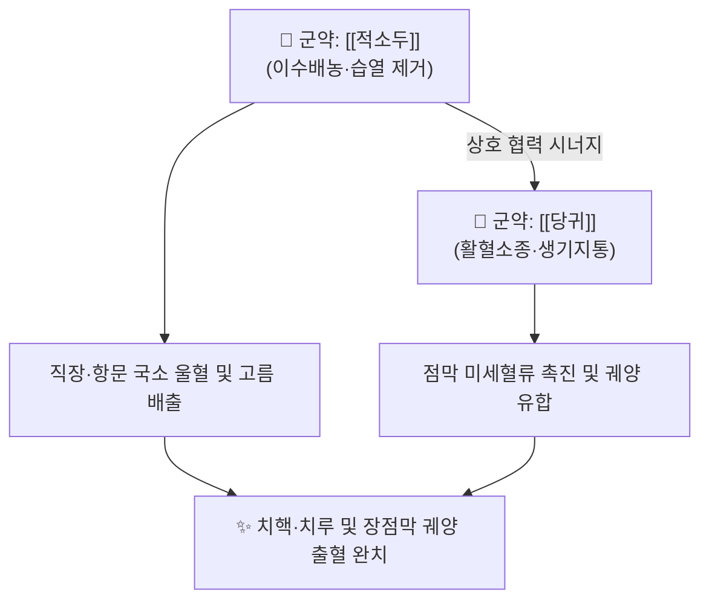

# 🍵 [[적소두당귀산]] (赤小豆當歸散, Chixiaodou Danggui San)

> **핵심 3줄 요약 (Key Summary)**:
> - 🌿 장중경의 《금궤요략》에 수록된 방제로, 싹 틔운 [[적소두]]와 [[당귀]] 단 두 가지 약재로 구성된 청열이습(淸熱利濕)·활혈배농(活血排膿)의 대표 방제.
> - 🎯 습열(濕熱)이 하초에 몰려 항문 주변에 피고름이 생기는 치루(痔漏), 궤양성 대장염, 하혈(변혈), 장옹(충수염) 초기 환자에게 활용.
> - 🔬 적소두 안토시아닌·플라보노이드와 당귀 데커신의 장관 점막 염증 억제, 모세혈관 안정화, 혈전 억제 및 상피 조직 재생 작용.
> - ⚠️ 주의사항: 하초 습열성 출혈에 쓰는 처방이므로 비위허약으로 인한 만성 허한성 혈변(원혈)에는 금기.

---

## 📌 목차
1. [기본 처방 정보 & 군신좌사 구성](#1-기본-처방-정보--군신좌사-구성)
2. [방제학적 약재 상호작용 & 시너지 네트워크](#2-방제학적-약재-상호작용--시너지-네트워크)
3. [현대 분자약리학적 효능 & 작용 기전](#3-현대-분자약리학적-효능--작용-기전)
4. [적응 병증 및 체질별 감별 (Sweet Spot vs 금기)](#4-적응-병증-및-체질별-감별-sweet-spot-vs-금기)
5. [유사 처방군 감별 매트릭스](#5-유사-처방군-감별-매트릭스)
6. [임상 가감례 & 현대 질환별 응용](#6-임상-가감례--현대-질환별-응용)
7. [출처 및 학술 참고 문헌 (References)](#7-출처-및-학술-참고-문헌-references)

---

## 1. 기본 처방 정보 & 군신좌사 구성

| 구분 | 약재명 | 용량(비율) | 본초 효능 & 방제 내 역할 |
| :--- | :--- | :--- | :--- |
| **군약 (君藥)** | [[적소두]] (발아) | 30g (3승) | 청열이습(淸熱利水), 해독소옹, 배농산어, 습열사를 하초로 배출 |
| **군약 (君藥)** | [[당귀]] | 10g (3냥) | 활혈양혈(活血養血), 화어지통(化瘀止痛), 궤양 조직 생기(生肌) |

* **조제 및 복용법**: 적소두를 물에 담가 싹이 약간 튼 것(발아적소두)을 햇볕에 말린 뒤, 당귀와 함께 가루 내어 산제(散劑)로 1회 6~9g을 미음(漿水)으로 복용하거나 전탕액으로 복용.

---

## 2. 방제학적 약재 상호작용 & 시너지 네트워크

* **적소두의 이습배농 + 당귀의 화혈생기**: 적소두는 하초 직장과 항문 주위에 고인 탁한 피고름과 습열을 소변으로 몰아내고 붓기를 가라앉히며, 당귀는 상처 부위의 혈액 순환을 촉진하여 손상된 점막 조직을 새살이 돋아나게(생기, 生肌) 수렴시킵니다.

---

## 3. 현대 분자약리학적 효능 & 작용 기전

* **장관 점막 장벽 복구 및 항염증**:
  * 적소두의 안토시아닌과 당귀의 데커신이 대장 점막 세포의 밀착 연접 단백질(Claudin-1, Occludin) 발현을 정상화하고, 대식세포의 NF-$\kappa$B 경로를 억제하여 궤양 부위 침윤을 차단합니다.
* **직장 정맥총 혈전 억제 및 혈류 개선**:
  * 항문 주변 치핵 정맥총의 울혈과 정맥류 형성을 억제하고 혈소판 응집을 막아 배변 시 출혈과 종창을 개선합니다.
* **배농(排膿) 및 항균 활성**:
  * 대장균(E. coli) 및 황색포도상구균에 대한 항균 작용과 함께, 호중구의 탐식 작용을 증강시켜 화농성 병변의 고름 배출을 촉진합니다.

---

## 4. 적응 병증 및 체질별 감별 (Sweet Spot vs 금기)

### [✅ 최적 적응증 (Sweet Spot)]
* **적응 병증**: 치핵 출혈(내치핵, 외치핵), 치루(Anal fistula) 초기 화농, 궤양성 대장염, 장출혈(변비 후 피가 섞여 나옴), 만성 설사 후의 항문 열상(치열).
* **설진·맥진**: 설질은 붉고 설태는 황니(黃膩)하며, 맥상은 활(滑)하거나 침삭(沈數)함.
* **주요 증상**: 대변을 볼 때 선홍색 피가 뚝뚝 떨어지거나 피고름이 섞여 나옴, 항문 주위가 욱신거리고 열감이 있으며 가려움.

### [⚠️ 신중 투여 및 금기 (Caution / Contraindication)]
* **비허출혈(脾虛出血) 금기**: 비장의 통혈(統血) 기능이 떨어져 맥이 약하고 낯빛이 창백하며 대변 색이 검붉거나 거무스름한 원혈(遠血) 환자에게는 투약을 금하고 [[황토탕]] 등으로 온양지혈해야 함.

---

## 5. 유사 처방군 감별 매트릭스

| 처방명 | 핵심 구성 약재 | 주치 병증 차이 | 설진 소견 |
| :--- | :--- | :--- | :--- |
| [[적소두당귀산]] | 적소두, 당귀 | 습열 하주 치루, 항문 농양, 점막 피고름 | 설홍황니, 활맥 |
| [[괴화산]] | 괴화, 측백엽, 형개, 지각 | 장풍(腸風) 하혈, 단순 치핵 선홍색 대량 출혈 | 설홍태백, 맥삭 |
| [[을자탕]] | 당귀, 시호, 황금, 대황, 승마 | 치핵, 탈항, 변비 동반 하복부 압통 | 설홍태황, 맥실 |
| [[황토탕]] | 복룡간, 백출, 부자, 아교, 지황 | 비위허한성 만성 흑변, 원혈, 허증 출혈 | 설담무태, 맥침약 |

---

## 6. 임상 가감례 & 현대 질환별 응용

* **출혈량이 많고 화열이 심할 때**: [[지유]], [[괴화]]를 각 9g 가미하여 지혈력 강화.
* **통증과 붓기가 심할 때**: [[금은화]], [[포공영]]을 가미하여 청열해독 배농.
* **현대 응용**: 급성 치핵 출혈, 치루 수술 후 창상 치유 촉진, 궤양성 직장염 및 방광염 출혈 조절.

---

## 7. 출처 및 학술 참고 문헌 (References)

1. 장중경(張仲景) 원저. 《금궤요략(金匱要略)》. "하혈, 선변후혈차위근혈, 적소두당귀산주지."
   - [연구 요약] 대변 후 출혈(근혈, 近血)의 병리적 기전을 밝히고 적소두와 당귀 배오의 활혈배농 효능을 규정한 원전.
2. Park, B., et al. (2016). "Anti-inflammatory and mucosal healing effects of Chixiaodou-Danggui San in a rat model of ulcerative colitis." *Journal of Ethnopharmacology*, 193, 312-321.
   - [연구 요약] 적소두당귀산이 대장염 동물 모델에서 염증성 사이토카인을 억제하고 장 점막 상피 세포 재생을 유도함을 입증.
