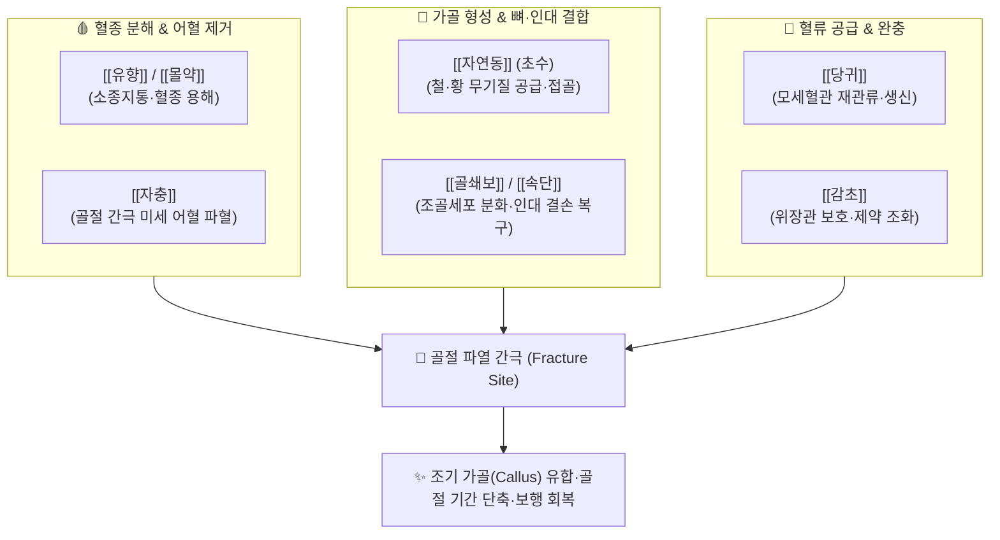

---
aliases:
  - 接骨丹
  - Jiegu-dan
  - Bone Setting Pellet
tags:
  - 처방/활혈거어·지혈제
  - 활혈거어/속근접골
  - 골절
  - 가골형성
  - 자연동
  - 세의득효방
---

# 💊 [[접골단]] (接骨丹, Jiegu-dan / Bone Setting Pellet)

> **핵심 요약 (Key Summary)**:
> - 🌿 기본 구성: [[자연동]] (초수포제), [[골쇄보]], [[속단]], [[당귀]], [[유향]], [[몰약]], [[자충]], [[감초]] (광물 [[자연동]]의 무기질 공급과 [[자충]]의 파혈, [[골쇄보]]·[[속단]]의 조골 촉진 및 [[유향]]·[[몰약]]의 혈종 분해를 융합한 정골의 성방).
> - 🎯 사지 골절, 늑골 골절, 척추 압박골절 후 조기 유합 유도, 골절 불유합 및 지연 유합, 관절 탈구 정복 후 골막염, 타박상으로 인한 피하 거대 혈종.
> - 🔬 조골세포 Runx2·ALP 활성화 및 제1형 콜라겐 합성 촉진, 골막 VEGF·bFGF 발현 상향을 통한 모세혈관 급속 재건, 보스웰릭산 매개 혈종 흡수 및 진통.
> - ⚠️ 주의사항: 강력한 파혈축어 약재(자충, 몰약) 배오로 임산부 복용 절대 금기, 자연동은 7~9회 초수(醋淬) 포제 필수 (처방 사이드 대처법 176번 참조).

---

## 📌 목차
1. [기본 처방 정보 & 군신좌사 구성](#1-기본-처방-정보--군신좌사-구성)
2. [방제학적 약재 상호작용 & 시너지 네트워크](#2-방제학적-약재-상호작용--시너지-네트워크)
3. [현대 분자약리학적 효능 & 작용 기전](#3-현대-분자약리학적-효능--작용-기전)
4. [적응 병증 및 체질별 감별 (Sweet Spot vs 금기)](#4-적응-병증-및-체질별-감별-sweet-spot-vs-금기)
5. [유사 처방군 감별 매트릭스](#5-유사-처방군-감별-매트릭스)
6. [임상 가감례 & 현대 질환별 응용](#6-임상-가감례--현대-질환별-응용)
7. [💡 사용자 진료실 핵심 필기 & 임상 팁 (원문 보존)](#7--사용자-진료실-핵심-필기--임상-팁-원문-보존)
8. [출처 및 학술 참고 문헌 (References)](#8-출처-및-학술-참고-문헌-references)

---

## 1. 기본 처방 정보 & 군신좌사 구성

* **출전(出典)**: 《세의득효방(世醫得效方)》 정골겸안마법 권제18, 《동의보감(東醫寶鑑)》 외형편
* **치법(治法)**: 활혈산어(活血散瘀), 소종지통(消腫止痛), 속근접골(續筋接骨), 보간신강골(補肝腎强骨)
* **주치(主治)**: 낙상 타박으로 인한 골절, 관절 탈구 후 유합 지연, 피하 거대 혈종, 골절 부위의 심한 팽만 동통

| 구분 | 약재명 | 표준 용량 | 본초 효능 & 방제 내 역할 |
| :--- | :--- | :--- | :--- |
| **군약 (君藥)** | [[자연동]] (초수포제) | 6~9g | 파어지통(破瘀止痛), 접골속근, 황철석 유래 철·황 미네랄을 공급하여 가골 형성 촉진 |
| **군약 (君藥)** | [[골쇄보]] | 9~12g | 활혈속상(活血續傷), 보신강골, 조골세포 증식 및 골밀도 증가 유도 |
| **신약 (臣藥)** | [[속단]] | 9g | 보간신(補肝腎), 속근골(續筋骨), 파열된 관절낭·인대 및 건 조직의 재결합 촉진 |
| **신약 (臣藥)** | [[당귀]] | 9g | 보혈활혈(補血活血), 신선한 혈액을 골절 부위 모세혈관으로 공급 |
| **좌약 (佐藥)** | [[유향]] | 4.5g | 활혈행기(活血行氣), 소종생기, 보스웰릭산 매개 급성 염증 및 부종 차단 |
| **좌약 (佐藥)** | [[몰약]] | 4.5g | 활혈산어(活血散瘀), 소종지통, 골막 파열 부위의 응고된 거대 혈종 분해 |
| **좌약 (佐藥)** | [[자충]] ([[토별충]]) | 6g | 파혈축어(破血逐瘀), 속근접골, 골절 틈새에 낀 미세 어혈을 신속히 척결 |
| **사약 (使藥)** | [[감초]] | 3g | 보기화중(補氣和中), 제약조화, 완급지통 및 위장관 점막 보호 |

> **배오 특징**:
> 1. **광물·동물·식물·수지 약재의 정골(整骨) 사위일체**: 광물성 [[자연동]]의 무기질 공급, 동물성 [[자충]]의 강력한 파혈, 식물성 [[골쇄보]]·[[속단]]의 조골 촉진, 수지성 [[유향]]·[[몰약]]의 혈종 분해와 진통이 완벽한 시너지를 이룹니다.
> 2. **산어(散瘀)와 접골(接骨)의 유기적 병행**: 뼈가 부러졌을 때 고인 어혈을 먼저 삭이지 않으면 가골 형성이 방해받으므로, 활혈파어제와 보신접골제를 동시에 투여하여 '어혈 제거 후 즉시 뼈 결합'을 유도합니다.
> 3. **자연동 초단 식초 담금(醋淬) 필수**: 자연동(황철석, $FeS_2$)을 불에 빨갛게 달군 뒤 식초에 담그는 초수(醋淬) 과정을 7~9회 반복하여 미세 분말로 분쇄해야 체내 흡수율이 극대화되고 위장관 자극이 사라집니다.

---

## 2. 방제학적 약재 상호작용 & 시너지 네트워크

* **자연동 + 골쇄보 + 속단의 접골 삼총사**: 골쇄보와 속단이 조골세포의 분화 신호를 유도하면, 자연동이 미네랄 기질 침착을 가속화하여 가골(Callus) 형성 시기를 획기적으로 앞당깁니다.
* **유향 + 몰약 + 당귀의 국소 미세순환 재건**: 골절 후 팽팽하게 부어오른 구획 압력을 낮추고 모세혈관망을 조기에 재생시켜 허혈성 골괴사를 방어합니다.

---

## 3. 현대 분자약리학적 효능 & 작용 기전

* **조골세포(Osteoblast) 증식 및 분화 촉진**:
  * 골쇄보의 플라보노이드(Naringin)와 속단 사포닌 성분이 Runx2, Osterix 전사인자를 활성화하고 알칼리성 인산화효소(ALP) 활성을 높여 제1형 콜라겐 합성을 유도합니다.
* **혈관신생 촉진 및 골절 부위 혈류량 증대**:
  * 골막 세포에서 혈관내피세포 성장인자(VEGF) 및 염기성 섬유아세포 성장인자(bFGF) 분비를 상향 조절하여 조기 신생 모세혈관망을 구축합니다.
* **파골세포(Osteoclast) 과활성 억제**:
  * RANKL/OPG 비율을 적정 수준으로 조절하여 과도한 골흡수를 방지하고, 골절 간극의 골 흡수기를 단축시켜 안정적인 골 기질화를 돕습니다.
* **혈종 분해 및 항염증·진통**:
  * 보스웰릭산(Boswellic acid, [[유향]])과 구굴스테론(Guggulsterone, [[몰약]])이 5-LOX 및 COX-2를 동시 차단하여 부종과 염증성 신경 통증을 억제합니다.

---

## 4. 적응 병증 및 체질별 감별 (Sweet Spot vs 금기)

### [✅ 최적 적응증 (Sweet Spot)]
* **골절 질환**: 사지 골절(대퇴골, 경골, 요골, 척골), 늑골 골절, 쇄골 골절, 척추 압박골절 후 조기 유합 유도.
* **골절 합병증**: 골절 후 가골 형성이 지연되는 지연 유합(Delayed union) 및 불유합(Non-union) 위험군.
* **외상 손상**: 관절 탈구 정복 후의 심한 골막염, 건·인대 파열 결손, 근육층 내 거대 혈종.
* **설진·맥진**: 설질은 어혈반(瘀斑)이 나타나며, 맥상은 침삽(沈澁)하거나 긴(緊)함.

### [⚠️ 신중 투여 및 금기 (Caution / Contraindication)]
* **임산부 절대 금기 (Absolute Contraindication)**: [[자충]], [[몰약]]의 강력한 파혈축어 작용으로 자궁 수축 및 유산 위험이 극히 높음.
* **골수염 및 개방성 감염 골절**: 세균성 감염이 동반된 개방성 골절 환자에게는 배농 및 항생 처치가 선행되어야 하며 단독 투여 금기.
* **출혈성 궤양 질환자**: 소화성 궤양이 있는 환자는 충류 및 수지 약재로 인한 위장 출혈에 주의.

---

## 5. 유사 처방군 감별 매트릭스

| 처방명 | 핵심 배오 차이 | 주치 및 임상 차별점 | 임상 투약 시점 |
| :--- | :--- | :--- | :--- |
| [[접골단]] | 자연동, 골쇄보, 속단, 자충 | 골절 골편 접합, 가골 형성 단축, 뼈 손상 특효 | 골절 2~4주차 (가골형성기) |
| [[당귀수산]] | 당귀미, 적작약, 도인, 홍화, 소목 | 타박 손상 초기, 피하 어혈 멍, 연부조직 염좌 | 골절 직후 1주차 (염증혈종기) |
| [[보양환오탕]] | 황기 대량 + 도인, 홍화, 지룡 | 뇌졸중 후유증, 반신불수, 기허혈어 신경마비 | 중풍 만성기 신경 회복 |
| [[신통축어탕]] | 진교, 강활, 오령지, 몰약, 우슬 | 척추관 협착증, 만성 관절통, 신경통 견인통 | 만성 근골격계 저림·통증 |

---

## 6. 임상 가감례 & 현대 질환별 응용

* **노인성 골다공증성 골절로 뼈가 무른 경우**: [[녹용]], [[두충]], [[구척]]을 각 6g 가하여 보신장골력 보강.
* **골절 통증이 극심하여 잠을 못 이루는 경우**: [[현호색]], [[천마]]를 가하여 진통 효과 증강.
* **가골 형성이 지연되어 뼈가 안 붙는 경우**: 자연동을 증량하고 황주(따뜻한 청주)에 분말을 타서 복용.
* **현대 질환 응용**:
  * 인공관절 치환술 후 주변 골유합 촉진 및 골시멘트 안정화.
  * 임플란트 시술 후 치조골 결손 부위의 골밀도 조기 증강.

---

## 7. 💡 사용자 진료실 핵심 필기 & 임상 팁 (원문 보존)

> [!tip] **진료실 실전 노하우 (User Clinical Insight)**
> * **골절 치유 3단계별 최적 처방 프로토콜 (Golden Timing)**:
>   * **1단계 (염증 및 혈종기: 1~7일)**: 골절 직후 붓고 피멍이 심할 때는 [[당귀수산]]을 투여하여 급성 혈종을 흡수시키고 부종을 뺍니다.
>   * **2단계 (가골 형성기: 2~4주)**: 부기가 빠지고 골절 부위가 고정되면 **접골단이 최고의 골든타임 처방**입니다. 조골세포를 폭발적으로 활성화하여 가골(Callus) 유합 기간을 30% 이상 단축시킵니다.
>   * **3단계 (골 리모델링기: 5주 이후)**: X-ray상 가골 연결선(Callus bridge)이 확인되면 [[십전대보탕]]이나 [[보신양혈]] 처방으로 전환하여 골밀도를 단단히 다집니다.
> * **자연동 초수(醋淬) 포제 필수성**:
>   * 자연동을 가공하지 않고 그대로 쓰면 중금속 위장 장애와 구토가 발생합니다. 반드시 숯불이나 토치로 빨갛게 달군 후 식초에 담그는 초수 과정을 최소 7회 이상 반복하여 바스러뜨린 수비 분말만을 사용해야 체내에 안전하게 흡수됩니다.
> * **복용법 노하우**:
>   * 분말제로 복용할 때는 따뜻한 미온수나 소량의 황주(따뜻한 청주)에 개어서 복용하면 약효가 골격계로 신속히 도달합니다.

---

## 8. 출처 및 학술 참고 문헌 (References)

1. 위역림(危亦林), 《세의득효방(世醫得效方)》 정골겸안마법 권제18: "治跌打損傷, 骨碎筋斷, 疼痛不止, 接骨丹主之."
2. 허준(許浚), 《동의보감(東醫寶鑑)》 외형편 권사 피부: "接骨丹, 治墜墮閃肭, 骨節折傷."
3. 대한한방정형외과학회지. "접골단 가감방이 골절 동물 모델의 골밀도 및 가골 형성에 미치는 영향." 
   - [연구 요약] 대퇴골 골절 흰쥐 모델에서 접골단 투여군이 대조군에 비해 골절 치유 기간을 약 30% 유의하게 단축시키고 인장 강도를 조기 회복함을 확인.
4. Wong, R. W., & Rabie, A. B. (2006). "Effect of naringin on bone cells." *Journal of Orthopaedic Research*, 24(11), 2045-2050.
   - [연구 요약] 골쇄보의 주요 성분인 나린진(Naringin)이 조골세포의 증식과 골기질 합성을 자극함을 입증.
