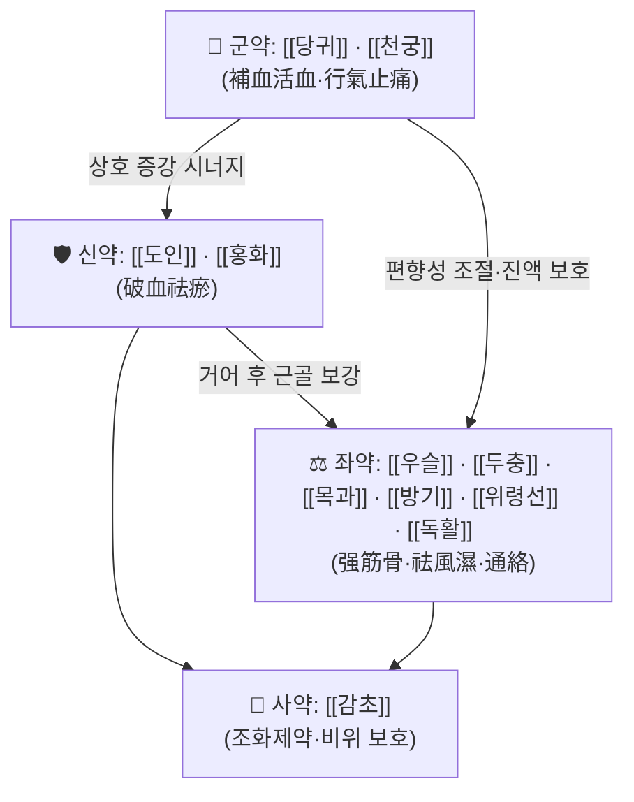

# 🍵 [[증보활혈탕]] (增補活血湯, Jeungbo Hwalhyeol-tang)

> **핵심 3줄 요약 (Key Summary)**:
> - 🌿 사물탕(四物湯) 계열의 [[당귀]]·[[천궁]] 補血活血 약재를 축으로, [[도인]]·[[홍화]]의 破血祛瘀 약재를 더하고 여기에 [[우슬]]·[[두충]]·[[목과]]·[[방기]]·[[위령선]]·[[독활]] 등 强筋骨·祛風濕·通絡 약재를 배오한 **활혈거어 + 거풍습·강근골 복합 방제**로 이해된다. (※ 정확한 원문 배오·용량은 1차 문헌 확인 필요 — **근거 미확인**)
> - 🎯 임상 최적 적응증은 **어혈(瘀血)이 겸된 요통·하지통·각기(脚氣)**, 즉 외상·만성 노동·좌식 생활로 인한 만성 근골격계 통증으로, 눌렀을 때 아프고 밤에 심해지며 자세를 바꾸면 덜 아픈 양상에 쓴다. 체질적으로는 근육이 무겁고 살집이 있으면서 하지가 잘 붓고 저린 태음인·비만 경향에서 적중률이 높다고 본다.
> - 🔬 복합 처방 자체에 대한 현대 분자약리 연구는 **검색된 PubMed 논문이 없어 근거 미확인**이며, 아래 3장은 개별 구성 본초의 일반 약리(항혈소판·혈류유변학·항염·진통) 수준에서 정리한 것이다.
> - ⚠️ 주의사항: 파혈(破血) 약재를 포함하므로 **임신부·출혈 경향자(혈우병, 항응고제 복용자, 소화성 궤양 출혈력), 월경과다 여성**에는 원칙적으로 신중/금기이다. 습열이 심하거나 실열(實熱)이 뚜렷한 급성 염증기에도 단독 투여는 피한다.

---
## 📌 목차
1. [기본 처방 정보 & 군신좌사 구성](#1-기본-처방-정보--군신좌사-구성)
2. [방제학적 약재 상호작용 & 시너지 네트워크](#2-방제학적-약재-상호작용--시너지-네트워크)
3. [현대 분자약리학적 효능 & 작용 기전](#3-현대-분자약리학적-효능--작용-기전)
4. [적응 병증 및 체질별 감별 (Sweet Spot vs 금기)](#4-적응-병증-및-체질별-감별-sweet-spot-vs-금기)
5. [유사 처방군 감별 매트릭스](#5-유사-처방군-감별-매트릭스)
6. [임상 가감례 & 현대 질환별 응용](#6-임상-가감례--현대-질환별-응용)
7. [💡 사용자 진료실 핵심 필기 & 임상 팁 (원문 보존)](#7--사용자-진료실-핵심-필기--임상-팁-원문-보존)
8. [출처 및 학술 참고 문헌 (References)](#8-출처-및-학술-참고-문헌-references)

---
## 1. 기본 처방 정보 & 군신좌사 구성

* **출전**: 『[[청강의감]](晴崗醫鑑)』 — 청강 [[김영훈]](金永勳) 선생의 임상 처방집으로 분류된다. *(동아시아 방제 계보상 『[[동의보감]]』 腰脚·瘀血門 및 왕청임(王淸任)의 活血化瘀方 계열과 개념적으로 연결되나, 본 처방의 문헌적 연원을 특정 고전 조문으로 확정하는 것은 **근거 미확인**.)*
* **이표(異表)**: 같은 처방이 문헌에 따라 **증손활혈탕(增損活血湯)**으로도 표기된다. '증손(增損)'은 "더하고 덜한다(가감한다)"의 뜻이고 '증보(增補)'는 "더하여 보충한다"의 뜻으로, 동일 방제의 이칭(異稱)으로 보는 것이 통설이나 **표기 혼용의 문헌적 근거는 확인되지 않음**.
* **치법**: 활혈거어(活血祛瘀) · 거풍습(祛風濕) · 강근골(强筋骨) · 통락지통(通絡止痛)

| 구분 | 약재명 | 표준 용량 | 본초 효능 & 방제 내 역할 |
| :--- | :--- | :--- | :--- |
| **군약 (君藥)** | [[당귀]] · [[천궁]] | 4~6g (각) | 補血活血·行氣止痛. 어혈로 막힌 하지·요부의 미세순환을 열고, 통증의 근본인 '血滯'를 푸는 방제의 축. 천궁은 血中氣藥으로 기혈을 함께 돌린다. |
| **신약 (臣藥)** | [[도인]] · [[홍화]] | 3~4g (각) | 破血祛瘀. 군약이 연 혈맥에서 굳은 어혈(久瘀)을 직접 부수는 역할. 만성·고착성 통증에 대한 '거어(祛瘀)' 축을 담당. |
| **좌약 (佐藥)** | [[우슬]] · [[두충]] · [[목과]] · [[방기]] · [[위령선]] · [[독활]] | 4~6g (각) | 强筋骨(우슬·두충)·舒筋活絡(목과·위령선)·祛風濕止痛(방기·독활). 하지·요부의 습(濕)과 풍(風)을 빼고 근골을 보강하여 '왜 아픈가'의 底를 다룬다. |
| **사약 (使藥)** | [[감초]] | 2~3g | 조화제약(調和諸藥). 제 약재의 자극성을 완충하고 脾를 보호한다. |

> **배오 특징** (※ 아래는 방제학적 **해석**이며 원문 배오비의 문헌 확인은 **근거 미확인**):
> 방제의 뼈대는 **"補血(당귀·천궁) + 破血(도인·홍화)"** 의 1축과 **"强筋骨(우슬·두충) + 祛風濕(목과·방기·위령선·독활)"** 의 1축이 맞물린 **2축 구조**다. 즉 ① 혈을 돌려 통증을 풀고(活血止痛), ② 하지에 정체된 습과 풍을 내보내며(祛濕通絡), ③ 근골을 보강해 재발을 막는(强筋骨) 삼단 구성이다. 전체적으로 **보(補) 3 : 사(瀉) 5 : 화(和) 2** 정도의 경향으로, 순수 補益方보다는 **疏通(소통) 쪽에 무게가 실린 처방**으로 본다. 승강(升降)으로 보면 도인·홍화·목과·방기가 降(하지로 내려보내고), 천궁·독활이 升散하여 **상하 순환을 재개시키는 설계**다.

* **사물탕(四物湯) 계열 補血 약재([[백작약]]·[[숙지황]])가 함께 가해진 구성**으로 소개되는 이본(異本)도 있으나, 본 노트에서는 원문 확인 전까지 **근거 미확인**으로 표시하고 표에서 제외한다.

---
## 2. 방제학적 약재 상호작용 & 시너지 네트워크

* **[[당귀]] + [[천궁]] 배오(相使)**: 補血과 行氣를 겸한 대표적 相使 배합. 당귀가 血을 채우면 천궁이 그것을 돌려, "보태기만 하고 정체되는" 補血의 폐단을 막는다. 하지·요부의 **정맥성 울혈·미세순환 정체**를 다루는 기본 단위로 해석된다.
* **[[당귀]]·[[천궁]] + [[도인]]·[[홍화]] 배오(相須)**: 완만한 活血藥 위에 破血藥을 얹어 **약효 강도를 한 단계 끌어올리는** 구조. 만성적으로 굳은 통증(久痛入絡)에 대응한다. 다만 이 조합이 바로 **출혈 위험의 원천**이므로 4장의 금기 기준이 반드시 함께 적용되어야 한다.
* **[[우슬]] + [[두충]] 배오**: 強筋骨의 고전적 대구(對句). 우슬이 下行하여 하지·무릎으로 약성을 끌고 가고(引藥下行), 두충이 肝腎을 보해 근골 허약을 채운다. 즉 **인경(引經) + 보익(補益)** 의 이중 역할.
* **[[목과]]·[[방기]]·[[위령선]]·[[독활]] 배오**: 濕을 내리고(利濕) 風을 쫓으며(祛風) 絡을 통하게 하는(通絡) 삼각 편대. 활혈 약재만으로는 잡히지 않는 **"무겁고 뻣뻣하고 저린" 잔여 증상**을 담당한다.
* **[[감초]]의 완충 작용**: 도인·홍화·독활 등 자극성·분산성 약재의 위장 자극을 완화하고, 처방 전체의 작용 시간을 늘리는 **서방(徐放) 완충층** 역할로 이해된다.

---
## 3. 현대 분자약리학적 효능 & 작용 기전

> ⚠️ **중요**: 증보활혈탕(增補活血湯) **복합 처방 자체**를 대상으로 한 현대 분자약리·임상 연구는 이번 검색에서 **확인된 PubMed 논문이 없다(근거 미확인)**. 아래 내용은 **개별 구성 본초의 단독 연구 수준**에서 알려진 일반 약리 기전을 방제 구조에 대입해 정리한 것으로, 처방 전체의 효능으로 단정할 수 없다.

### 1) 항염증·면역 조절 (개별 본초 수준)
* [[당귀]]·[[천궁]]·[[독활]]·[[감초]] 계열에서 NF-κB 신호 억제, TNF-α·IL-6·IL-1β 등 전염증성 사이토카인 감소가 보고되어 있다(개별 본초/단일 성분 연구).
* [[위령선]]·[[방기]] 유래 사포닌·테트란드린 계열은 COX-2/PGE₂ 억제를 통한 말초 진통·소염 기전이 알려져 있다.
* **처방 복합 추출물에 대한 검증은 근거 미확인.**

### 2) 순환기·미세순환 및 혈액유변학 개선
* [[당귀]]의 페룰산(ferulic acid), [[천궁]]의 테트라메틸피라진(TMP)·페룰산, [[홍화]]의 하이드록시사프로플로어 옐로우 A, [[도인]] 유래 성분은 **항혈소판·혈액 점도 저하·미세혈류 개선** 작용이 개별적으로 보고되어 있다.
* [[계지]] 성분 신남알데히드(cinnamaldehyde)의 혈관이완, [[두충]] 리그난의 말초혈관 확장·혈압 강하 작용도 개별 본초 수준의 자료다.
* → 방제학적으로는 **"어혈 = 혈액유변학적 이상 + 미세순환 저하"** 라는 현대적 해석틀과 잘 맞아떨어지지만, **처방 단위 인체 데이터는 근거 미확인.**

### 3) 근골격계·신경계 및 자율신경
* [[우슬]]·[[두충]] 계열의 항염·연골 보호, 조골세포 활성 관련 연구가 개별 본초 수준에서 존재한다.
* [[목과]]·[[독활]]·[[위령선]]의 근긴장 완화·진통 작용은 전통적으로 舒筋活絡 효능으로 설명되나, **작용 표적(TRP 채널, 근방추 흥분성 등)에 대한 처방 수준 검증은 근거 미확인.**
* HPA축 조절, 자율신경 항상성 회복에 대한 서술은 **본 처방에 대해서는 근거 미확인.**

---
## 4. 적응 병증 및 체질별 감별 (Sweet Spot vs 금기)

### [✅ 최적 적응증 (Sweet Spot)]

* **원전 주치(개괄)**: 요통(腰痛), 하지통(下肢痛), 각기(脚氣) — 즉 **"어혈이 겸된 하부(요부·下肢)의 만성 통증·부종·저림"** 군.
  *(정확한 원문 주치 조문 및 문구는 1차 문헌 확인 필요 — **근거 미확인**.)*
* **체질 소견**
  * **태음인 / 비만·근육질 체형**에서 적중률이 높다고 본다. 살집이 있고 하지가 잘 붓거나 무거우며, 땀·소변 배출이 원활치 않은 경향.
  * **소양인**에서도 어혈 증후(외상력, 고착성 통증)가 뚜렷하면 고려 가능.
  * **소음인**은 破血藥에 예민하므로 **도인·홍화를 감량**하거나 補血藥을 가미해 완화 투여하는 편이 안전하다.
* **임상 주치(진료실 최적 적응 양상)**
  * 눌렀을 때 통증이 심해지고(압통 +), **밤에 심해지며(夜間痛 +)**, 자세를 바꾸면 다소 완화되는 통증.
  * 하지가 **무겁고 저리며 붓는** 감각, 오래 앉았다 일어설 때 뻣뻣함.
  * 외상·타박·만성 과로·좌식 생활 후 발생한 요추부·둔부·대퇴 후면 통증.
  * 피부색이 어둡거나 입술·혀 아래 정맥이 울혈된 소견.
* **설진/맥진**
  * 설질: 암자색(暗紫), 혹은 자반(紫斑)·어점(瘀點), 舌下絡脈 怒張.
  * 설태: 박백태~후니태(습이 겸하면 후니).
  * 맥상: **삽(澁)·현(弦)·긴(緊)** — 어혈·기체·한습 정체의 전형. 습이 심하면 **활(滑)**, 허가 겸하면 **세약(細弱)**.

### [⚠️ 신중 투여 및 금기 (Caution / Contraindication)]

* **절대적 금기·강한 주의**
  * **임신부 및 임신 가능성 있는 여성**: [[도인]]·[[홍화]]의 破血 작용은 자궁 흥분·유산 위험과 연결되므로 금기로 본다.
  * **출혈 경향자**: 혈우병, 혈소판 감소증, 소화성 궤양 출혈력, 치질 출혈, 뇌출혈 병력자.
  * **항응고·항혈소판제 복용자**: 와파린, NOAC, 아스피린, 클로피도그렐 등과 병용 시 출혈 위험 상승. **반드시 병용 여부를 문진하고, 필요 시 INR 모니터링.**
* **병증(病證) 반대 시 주의**
  * **실열(實熱)·습열이 뚜렷한 급성기**: 발열, 국소 발적·발열, 급성 디스크 탈출 초기의 격렬한 염증성 통증에는 단독 투여를 피하고 [[황백]]·[[창출]]·[[금은화]] 등 청열약을 배오하거나 별도 처방을 고려한다.
  * **한열(寒熱)이 극단적인 경우**: 순한(純寒) 허냉증에는 破血藥이 지나치게 소모적일 수 있고, 순열(純熱)에는 온조(溫燥)한 거풍약이 부담이 된다.
  * **음허화왕(陰虛火旺)·기혈극허(氣血極虛)**: 도인·홍화·목과·방기 등 疏散·渗利 약재가 기혈을 더 소모할 수 있으므로 補益 위주로 전환하거나 감량한다.
  * **위장 허약자(脾胃虛寒)**: 도인·홍화·독활의 위 자극으로 위통·설사·속쓰림이 생길 수 있다. [[백출]]·[[진피]]·[[생강]]·[[대조]] 가미 또는 식후 복용.
* **복약 반응 관찰 포인트**
  * 월경량 증가, 잇몸 출혈, 코피, 멍이 잘 드는지(자반), 대변 흑색 여부 → 즉시 감량·중단 검토.
  * 위장 불편(속쓰림·오심·묽은 변) → 식후 복용 전환, [[진피]]·[[생강]] 가미.
  * 1~2주 투여에도 반응이 없으면 어혈 단독 병기 진단을 재검토한다.

---
## 5. 유사 처방군 감별 매트릭스

| 처방명 | 핵심 구성 차이 | 주치 및 체질 차이 | 맥진/설진 차이 |
| :--- | :--- | :--- | :--- |
| [[증보활혈탕]] | 기준 구성 (活血 + 强筋骨 + 祛風濕) | **어혈 겸 요통·하지통·각기, 태음인·비만·부종 경향** | 설질 암자·어점, 맥 삽·현·긴 |
| [[신통탕]] | 活血化瘀 위주(도인·홍화·당귀·천궁·몰약·향부자 등), 祛風濕 약재는 상대적으로 적음 | 周身·四肢의 遊走性 통증, 어혈이 전신성일 때. 强筋骨보다 通絡 위주 | 설 자암, 맥 삽·현 |
| [[독활기생탕]] | 補肝腎·益氣血(독활·상기생·두충·우슬·당귀·인삼 등) 중심, 破血藥 없음 | **허증(虛證) 위주**의 만성 요통·하지 무력, 노인·산후·소음인 | 설 담백·박태, 맥 세약·침지 |
| [[당귀수산]] | 破血逐瘀(당귀미·홍화·도인·천산갑·대황 등) 강도 높음 | 跌打損傷·어혈 정체의 급성·실증, 통증 격렬 | 설 자암·어반, 맥 삽·실 |
| [[소활락단]] | 祛風寒濕·化痰通絡(천오·초오·남성·유향·몰약) 중심 | 風寒濕痺의 頑固한 관절통, 寒證 뚜렷 | 설 백활, 맥 현긴 |

> ⚠️ 표 내부에서는 마크다운 열 구분자 파괴를 방지하기 위해 파이프(`|`)가 들어간 링크를 쓰지 않고 순수한 [[처방명]] 단독 형태로만 작성합니다.

**한 줄 요약 감별**: *어혈이 주(主)이고 습이 겸(兼)하면 → 증보활혈탕 / 허(虛)가 주이면 → 독활기생탕 / 전신 어혈이면 → 신통탕 / 급성 외상 실증이면 → 당귀수산.*

---
## 6. 임상 가감례 & 현대 질환별 응용

* **수반 증상별 가감법** *(아래는 방제 원리에 기반한 **일반적 응용 제안**이며, 청강의감 원문 가감법과 일치하는지는 **근거 미확인**)*:
  * **냉통·한랭 악화, 하지가 시릴 때** → + [[오약]] · [[계지]] · [[세신]] (온경산한)
  * **습이 심해 무겁고 붓고 소변不利** → + [[의이인]] · [[택사]] · [[복령]] (利水渗濕)
  * **습열 겸증(발적·열감·냄새·진물)** → + [[황백]] · [[창출]] · [[우방자]]
  * **腎虛 요통, 야간통·만성화, 노인** → + [[숙지황]] · [[산수유]] · [[파극천]] · [[구기자]] (補腎强腰)
  * **어혈이 매우 고착(久痛入絡), 야간통 극심** → + [[삼릉]] · [[아출]] · [[수질]] · [[전갈]] (破血通絡) — 출혈 위험 재확인
  * **기체(氣滯) 겸증, 통증이 이동성** → + [[향부자]] · [[지각]] · [[목향]]
  * **위장 장애·속쓰림** → + [[진피]] · [[생강]] · [[대조]] · [[백출]]
  * **불면·번조 동반** → + [[산조인]] · [[야교등]] · [[모려]] (養心安神)
* **현대 질환별 임상 매핑** *(적응 가능성 수준의 서술이며, 본 처방의 임상시험 근거는 **근거 미확인**)*:
  * **근골격계**: 만성 요추부 근막통증증후군, 추간판성 요통의 만성기, 좌골신경통, 무릎 퇴행성 관절염의 어혈형, 하지정맥류성 통증·부종감, 운동 후 지연성 근육통(DOMS).
  * **순환기/대사**: 말초동맥질환의 조기 증상(간헐성 파행), 당뇨병성 말초신경병증의 저림·작열감(어혈·습열형 감별 필요), 하지부종.
  * **부인과**: 어혈성 월경통, 산후 하지통·부종(단, 산후 출혈기에는 금기).
  * **신경계/자율신경**: 자율신경실조에 동반된 하지 이상감각, 냉방병성 근육 경직.
  * **노년기 각기(脚氣)형 증상**: 하지 무력감·부종·저림 — 감별상 비타민 B1 결핍 여부 및 심부전 여부를 먼저 배제할 것.

---
## 7. 💡 사용자 진료실 핵심 필기 & 임상 팁 (원문 보존)

> [!tip] **진료실 실전 노하우 (User Clinical Insight)**
> - *(원장님의 기존 메모·필기가 아직 이 노트에 입력되지 않았습니다. 위 4~6장까지는 문헌·방제 원리 기반의 서술이며, 실제 진료실에서의 체질 선택 기준·용량 감각·환자 티칭 멘트는 원장님 원문을 이 위치에 그대로 보존합니다.)*
> - **입력 시 체크 항목(템플릿 안내)**
>   - 태음인 vs 소음인에서 본 처방을 고르는 실제 기준과 감별 포인트
>   - 도인·홍화 용량을 실제로 얼마나 올리고 내리는지에 대한 감각
>   - 투여 후 "며칠째부터 반응이 오는지"에 대한 임상 관찰 기록
>   - 환자에게 설명하는 티칭 멘트(예: "피가 뭉쳐서 아픈 것"이라는 표현 사용 여부)
>   - 양약(NSAIDs, 항응고제, 스타틴 등)과 병용 시 실제 조정 경험

---
## 8. 출처 및 학술 참고 문헌 (References)

> ⚠️ **검색된 PubMed 논문이 없어, 본 노트에는 현대 논문을 인용하지 않았다.** 아래는 방제의 출전 및 개념적 연원에 해당하는 문헌이며, **특정 조문·페이지를 확정 인용하지 않았으므로 원문 대조가 필요하다(근거 미확인 항목 포함).**

1. **김영훈 (청강)**. 『**청강의감(晴崗醫鑑)**』.
   - **[출전 문헌]**: 본 처방(증보활혈탕/증손활혈탕)의 출전으로 분류되는 임상 처방집. 요통·하지통·각기 항목에서 본 처방의 주치와 가감법이 제시되는 것으로 알려져 있으나, **정확한 원문 배오·용량·조문은 1차 문헌 대조 필요(근거 미확인)**.
2. **허준 (1613)**. 『**[[동의보감]]**』.
   - **[임상 문헌]**: 腰脚門·瘀血門의 活血化瘀·祛風濕 치법 개념적 배경. 본 처방과의 직접적 조문 대응은 **근거 미확인**.
3. **장중경 (200년경)**. 『**[[상한론]]**』 / 『**금궤요략**』.
   - **[고전 원전]**: 活血化瘀·利水渗濕·祛風濕 방제의 개념적 뿌리(예: 桂枝茯苓丸, 大黃蟅蟲丸 계열). 증보활혈탕의 직접 출전은 아니며, **연원 관계는 근거 미확인.**
4. **왕청임(王淸任)**. 『**의림개착(醫林改錯)**』.
   - **[이론 문헌]**: 身痛逐瘀湯 등 活血化瘀治法의 이론적 토대. 증보활혈탕의 어혈 병기 해석을 위한 참고 틀.

---

**📌 편집 메모(차기 업데이트 시 확인할 항목)**
- [ ] 『청강의감』 원문에서 **정확한 처방명(증보 vs 증손)·약재 목록·용량** 확정 후 1장 표 갱신
- [ ] 원문 가감법 확인 후 6장을 "문헌 가감"과 "임상 가감"으로 분리
- [ ] 증보활혈탕 관련 국내 학술지(RISS/KISS)·PubMed 재검색하여 3장·8장 보강
- [ ] 원장님 진료실 필기 7장에 이관