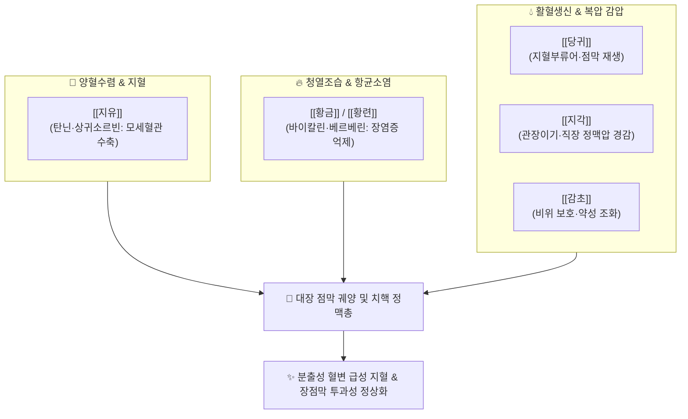

---
aliases:
  - 地楡湯
  - Jiyu-tang
  - Sanguisorba Decoction
tags:
  - 처방/활혈거어·지혈제
  - 지혈제/양혈수렴지혈
  - 장풍하혈
  - 치핵출혈
  - 동의보감
  - 성제총록
---

# 🍵 [[지유탕]] (地楡湯, Jiyu-tang / Sanguisorba Decoction)

> **핵심 요약 (Key Summary)**:
> - 🌿 기본 구성: [[지유]], [[황금]], [[황련]], [[당귀]], [[지각]], [[감초]] ([[지유]]의 탄닌 수렴지혈과 [[황금]]·[[황련]]의 청열조습, [[당귀]]의 지혈부류어 및 [[지각]]의 관장이기 감압을 일체화한 대장 습열 하혈의 명방).
> - 🎯 대장 습열(大腸濕熱) 및 혈열로 인한 장풍하혈(腸風下血), 내치핵·외치핵의 분출성 선홍색 출혈, 궤양성 대장염의 끈적한 점액혈농변, 세균성 이질, 항문 작열통, 자궁 부정출혈(붕루).
> - 🔬 상귀소르빈(Sanguisorbin)·엘라그산의 모세혈관 수축 및 프로트롬빈 시간 단축, 바이칼린·베르베린의 NF-$\kappa$B 차단을 통한 장 점막 미란 치유 및 항균 작용.
> - ⚠️ 주의사항: 탄닌 고농도 함유로 인한 2차 변비 및 치열 악화 주의, 비위허한성 만성 출혈(원혈, 흑변) 환자 투약 금기 (처방 사이드 대처법 177번 참조).

---

## 📌 목차
1. [기본 처방 정보 & 군신좌사 구성](#1-기본-처방-정보--군신좌사-구성)
2. [방제학적 약재 상호작용 & 시너지 네트워크](#2-방제학적-약재-상호작용--시너지-네트워크)
3. [현대 분자약리학적 효능 & 작용 기전](#3-현대-분자약리학적-효능--작용-기전)
4. [적응 병증 및 체질별 감별 (Sweet Spot vs 금기)](#4-적응-병증-및-체질별-감별-sweet-spot-vs-금기)
5. [유사 처방군 감별 매트릭스](#5-유사-처방군-감별-매트릭스)
6. [임상 가감례 & 현대 질환별 응용](#6-임상-가감례--현대-질환별-응용)
7. [💡 사용자 진료실 핵심 필기 & 임상 팁 (원문 보존)](#7--사용자-진료실-핵심-필기--임상-팁-원문-보존)
8. [출처 및 학술 참고 문헌 (References)](#8-출처-및-학술-참고-문헌-references)

---

## 1. 기본 처방 정보 & 군신좌사 구성

* **출전(出典)**: 《성제총록(聖濟總錄)》 권제백삼십, 《동의보감(東醫寶鑑)》 잡병편 권사 대변
* **치법(治法)**: 양혈지혈(凉血止血), 청열조습(淸熱燥濕), 이기관장(理氣寬腸), 양혈화혈(養血和血)
* **주치(主治)**: 대장 습열 및 혈열로 인한 장풍하혈(腸風下血), 치질 출혈, 혈리(血痢), 점액 농혈변, 자궁 부정출혈

| 구분 | 약재명 | 표준 용량 | 본초 효능 & 방제 내 역할 |
| :--- | :--- | :--- | :--- |
| **군약 (君藥)** | [[지유]] | 12g | 양혈지혈(凉血止血), 해독렴창, 탄닌 성분으로 장관 출혈을 직접 수렴 차단 |
| **신약 (臣藥)** | [[황금]] | 8g | 청열조습(淸熱燥濕), 사화해독, 장관 상피 염증과 모세혈관 충혈을 해소 |
| **신약 (臣藥)** | [[황련]] | 6g | 청열조습, 사화지리(瀉火止痢), 대장 습열 화독을 사하하고 장내 유해균 제어 |
| **좌약 (佐藥)** | [[당귀]] | 8g | 양혈활혈(養血活血), 생신지통, 수렴 지혈 시 발생할 수 있는 어혈 정체 방지 |
| **좌약 (佐藥)** | [[지각]] | 6g | 파기소적(破氣消積), 관장이기, 장관 기기를 소통시켜 골반 내 압박 경감 |
| **사약 (使藥)** | [[감초]] | 4g | 보기화중(補氣和中), 조화제약, 고한(苦寒)한 약재의 위장관 점막 자극 완충 |

> **배오 특징**:
> 1. **수렴(收斂)과 청열(淸熱)의 합벽**: [[지유]]의 차가운 수렴지혈 작용과 [[황금]]·[[황련]]의 쓴맛 나는 청열조습 약재가 배합되어, 모세혈관 파열을 즉각 틀어막는 동시에 출혈의 근본 원인인 장내 습열 염증을 근절합니다.
> 2. **지혈부류어(止血不留瘀)의 완벽 배오**: 지혈제를 다량 쓰면 혈액이 굳어 미세혈전이 생길 수 있으나, [[당귀]]를 배합하여 지혈하면서도 혈액 순환을 정상 유지시켜 손상 조직의 상피화를 촉진합니다.
> 3. **기관장(寬腸)을 통한 출혈압 경감**: [[지각]]이 장관 내 가스와 대변 정체로 인한 복압을 낮추어 줌으로써 치핵 정맥총이 과도하게 팽창하여 터지는 것을 방지합니다.

---

## 2. 방제학적 약재 상호작용 & 시너지 네트워크

* **지유 + 황련의 장내 습열 제압**: 지유가 국소 혈관을 압박 수축시키는 동안 황련이 대장 점막의 염증 반응을 강력하게 진화하여 장관 삼출물과 출혈을 동시 차단합니다.
* **지각 + 당귀의 배변 순환 보조**: 지각이 장벽 평활근의 비정상적 경련을 풀어 배변 시 힘주기를 줄여주고, 당귀가 장관 점막을 윤활하여 변비로 인한 물리적 점막 파열을 예방합니다.

---

## 3. 현대 분자약리학적 효능 & 작용 기전

* **모세혈관 수축 및 혈소판 활성화**:
  * [[지유]]의 지표 성분인 [[상귀소르빈]](Sanguisorbin)과 [[엘라그산]](Ellagic acid)이 혈관 내피세포의 $Ca^{2+}$ 채널을 활성화하여 평활근 수축을 유발하고, 혈소판 응집과 프로트롬빈 시간을 단축시킵니다.
* **장점막 상피 세포 보호 및 NF-$\kappa$B 차단**:
  * [[황금]]의 [[바이칼린]]과 [[황련]]의 [[베르베린]]이 염증성 대식세포의 NF-$\kappa$B p65 핵내 전위를 차단하여 TNF-$\alpha$, IL-1$\beta$, IL-6 등 염증 인자를 억제하고 장 점막 미란을 치유합니다.
* **장관 투과성(Leaky Gut) 복구 및 밀착 연접 정상화**:
  * 궤양성 대장염 모델에서 장 상피의 Occludin 및 Claudin-1 단백질 손실을 막아 세균 내독소(LPS)의 혈류 유입을 억제합니다.
* **장내 세균총 환경 개선**:
  * 베르베린이 대장균, 살모넬라, 세균성 이질균(Shigella) 증식을 억제하고 장내 유익균 비율을 회복시킵니다.

---

## 4. 적응 병증 및 체질별 감별 (Sweet Spot vs 금기)

### [✅ 최적 적응증 (Sweet Spot)]
* **핵심 적응증**:
  * **내치핵 및 외치핵 출혈**: 배변 시 선홍색 피가 뿜어져 나오거나 변기에 가득 차며, 항문에 작열감이 동반되는 상태.
  * **궤양성 대장염(UC) 및 크론병**: 끈적끈적한 점액과 피고름이 섞인 설사를 자주 보며 복통과 배변 후에도 묵직한 이급후중(裏急後重)이 있는 환자.
  * **세균성 이질 및 감염성 장염**: 고열은 내렸으나 혈농변이 지속되는 아급성기 장질환.
  * **부인과 부정출혈**: 혈열(血熱)로 인해 월경 주기가 빠르고 검붉은 피가 덩어리 없이 대량으로 쏟아지는 기능성 자궁출혈.
* **설진·맥진**: 설질은 선홍(鮮紅)색이고 설태는 황니(黃膩)하거나 건조하며, 맥상은 활삭(滑數)하거나 현삭(弦數)함.

### [⚠️ 신중 투여 및 금기 (Caution / Contraindication)]
* **비위허한성 원혈(遠血) 환자 금기**: 손발이 차고 맥이 침약하며 대변 색이 흑갈색이거나 묽은 만성 허한성 출혈 환자에게 투약 시 비신양기(脾腎陽氣)를 더욱 손상시키므로 [[황토탕]]으로 온양해야 함.
* **심한 위궤양 및 만성 변비 환자 신중**: 지유의 고농도 탄닌 성분은 위산 분비를 자극하거나 장관 수분을 흡수하여 변비를 악화시킬 수 있으므로 주의.

---

## 5. 유사 처방군 감별 매트릭스

| 처방명 | 핵심 배오 차이 | 주치 및 임상 차별점 | 맥진/설진 차이 |
| :--- | :--- | :--- | :--- |
| [[지유탕]] | 지유, 황금, 황련, 당귀, 지각 | 대장 습열 실화, 분출성 혈변, 끈적한 점액 혈농변 | 설홍태황니, 맥활삭 |
| [[괴화산]] | 괴화, 측백엽, 형개, 지각 | 장풍(腸風) 풍열 하혈, 단순 내치핵 선홍색 출혈 | 설홍태박황, 맥부삭 |
| [[적소두당귀산]] | 발아 적소두, 당귀 | 선변후혈, 항문 피고름 배출, 치루, 궤양 유합 | 설홍태황, 맥활 |
| [[황토탕]] | 복룡간, 백출, 부자, 아교, 지황 | 선혈후변, 흑변, 비위허한성 노인 만성 출혈 | 설담태백, 맥침세약 |

---

## 6. 임상 가감례 & 현대 질환별 응용

* **출혈량이 극도로 많아 빈혈이 우려되는 경우**: [[괴화탄]], [[측백엽탄]] 각 10g을 가하여 수렴지혈력 보강.
* **복통과 뒤가 묵직한 이급후중이 심한 경우**: [[목향]], [[빈랑]] 각 6g을 가하여 행기지통(行氣止痛).
* **변비가 심해 배변 시 항문이 찢어지는 경우**: [[대황]], [[마자인]]을 소량 가하여 윤장통변.
* **현대 질환 응용**:
  * **방사선 직장염(Radiation Proctitis)**: 골반암 방사선 치료 후 발생하는 난치성 직장 점막 미란 및 출혈 치료.
  * **내치핵 보존적 치료**: 수술 전후 급성 출혈 억제 및 부종 소퇴.

---

## 7. 💡 사용자 진료실 핵심 필기 & 임상 팁 (원문 보존)

> [!tip] **진료실 실전 노하우 (User Clinical Insight)**
> * **치핵 출혈의 3대 감별 공식 (괴화산 vs 지유탕 vs 황토탕)**:
>   * 1. 피가 맑고 붉으며 배변 시 시원하게 뿜어져 나오면 풍열(風熱)의 [[괴화산]]증입니다.
>   * 2. 피가 끈적하고 냄새가 독하며 뒤가 묵직하고 작열감이 있으면 습열(濕熱)의 지유탕증입니다.
>   * 3. 피의 색이 어둡고 묽으며 환자가 기운이 없고 손발이 차면 허한(虛寒)의 [[황토탕]]증입니다.
> * **탄닌 성분에 의한 변비 부작용 방어법**:
>   * 지유탕을 복용하고 피는 멎었으나 대변이 딱딱하게 굳어 다음 배변 시 상처가 다시 터지는 경우가 있습니다. 이를 막기 위해 처방 내 [[당귀]]를 12g으로 증량하고, 환자에게 충분한 수분 섭취와 좌욕을 병행하도록 티칭해야 합니다.
> * **단기 투약 원칙**:
>   * 출혈이 완전히 멎고 염증이 가라앉으면 지유탕을 장복시키지 말고, 손상된 점막을 보수하는 [[보중익기탕]]이나 [[사물탕]] 가감방으로 전방하여 재발을 막아야 합니다.

---

## 8. 출처 및 학술 참고 문헌 (References)

1. 조길(趙佶) 편, 《성제총록(聖濟總錄)》 권제백삼십 하혈문: "治大腸風熱, 下血不止, 地楡湯方."
2. 허준(許浚), 《동의보감(東醫寶鑑)》 잡병편 권사 대변: "地楡湯, 治腸風臟毒, 下血不止."
3. Zhang, S., et al. (2012). "Hemostatic and wound healing properties of *Sanguisorba officinalis* L. extracts." *Journal of Ethnopharmacology*, 140(2), 245-251.
   - [연구 요약] 지유 추출물이 프로트롬빈 시간을 단축시키고 섬유소 형성을 촉진하며, 내피세포 성장인자를 유도하여 창상 치유를 가속화함을 확인.
4. Wang, Y., et al. (2018). "Baicalin and berberine regulate gut microbiota and mucosal barrier in ulcerative colitis." *Frontiers in Pharmacology*, 9, 874.
   - [연구 요약] 바이칼린과 베르베린의 복합 투여가 장점막 타이트 정션 단백질 손실을 막고 장 점막 궤양성 출혈을 유의하게 억제함을 증명.
