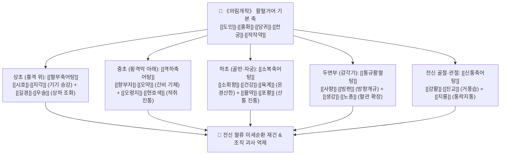

---
aliases:
  - 逐瘀湯
  - Zhuyu-tang
  - 王淸任 逐瘀湯群
tags:
  - 처방/활혈거어·지혈제
  - 활혈거어/부위별축어
  - 혈부축어탕
  - 격하축어탕
  - 소복축어탕
  - 의림개착
---

# 🍵 [[축어탕]] (逐瘀湯, Zhuyu-tang / 왕청임 5대 축어탕 총론)

> **핵심 요약 (Key Summary)**:
> - 🌿 기본 구성: 청대 의학 혁신가 왕청임(王淸任)의 《의림개착》 5대 축어탕군([[혈부축어탕]], [[격하축어탕]], [[소복축어탕]], [[통규활혈탕]], [[신통축어탕]])으로 인체의 해부학적 3초(상·중·하초) 및 두면·사지 관절의 어혈 병소를 부위별로 정밀 타격하는 활혈거어의 마스터 제제.
> - 🎯 상초 흉통·뇌혈관 어혈([[혈부축어탕]]), 중초 간담·위장관 어혈 종괴([[격하축어탕]]), 하초 자궁·골반강 한응혈어([[소복축어탕]]), 두면부 탈모·이명·두통([[통규활혈탕]]), 사지 전신 관절통·저림([[신통축어탕]]).
> - 🔬 도인·홍화·단삼의 혈소판 응집 억제 및 미세혈전 분해, 시호·향부자의 간문맥압 감압 및 자율신경 조절, 소회향·육계의 골반강 혈류 확장, 진교·강활의 신경성 통각 억제.
> - ⚠️ 주의사항: 부위별 병기(상초 화열 vs 하초 음한) 착오 투약 주의, 강력한 활혈파어력으로 임산부 복용 절대 금기 (처방 사이드 대처법 178번 참조).

---

## 📌 목차
1. [기본 처방 정보 & 군신좌사 구성 (5대 축어탕 매핑)](#1-기본-처방-정보--군신좌사-구성-5대-축어탕-매핑)
2. [방제학적 약재 상호작용 & 시너지 네트워크](#2-방제학적-약재-상호작용--시너지-네트워크)
3. [현대 분자약리학적 효능 & 작용 기전](#3-현대-분자약리학적-효능--작용-기전)
4. [적응 병증 및 체질별 감별 (Sweet Spot vs 금기)](#4-적응-병증-및-체질별-감별-sweet-spot-vs-금기)
5. [유사 처방군 감별 매트릭스 (5대 축어탕 비교)](#5-유사-처방군-감별-매트릭스-5대-축어탕-비교)
6. [임상 가감례 & 현대 질환별 응용](#6-임상-가감례--현대-질환별-응용)
7. [💡 사용자 진료실 핵심 필기 & 임상 팁 (원문 보존)](#7--사용자-진료실-핵심-필기--임상-팁-원문-보존)
8. [출처 및 학술 참고 문헌 (References)](#8-출처-및-학술-참고-문헌-references)

---

## 1. 기본 처방 정보 & 군신좌사 구성 (5대 축어탕 매핑)

* **출전(出典)**: 청대 왕청임(王淸任), 《의림개착(醫林改錯)》 (1830년)
* **치법(治法)**: 활혈화어(活血化瘀), 행기지통(行氣止痛), 부위별 통락(通絡)
* **총론적 개념**: 왕청임은 인체 질병의 80% 이상이 '기체(氣滯)'와 '어혈(瘀血)'에서 기인한다고 보고, 혈액이 정체된 인체 해부학적 위치에 따라 처방의 인경약(引經藥)과 배오를 달리하여 5대 축어탕을 창제했습니다.

| 구분 | 처방명 | 목표 부위 (해부학적 위치) | 핵심 배오 약재 | 방제학적 치법 특성 |
| :--- | :--- | :--- | :--- | :--- |
| **상초 (上焦)** | [[혈부축어탕]] | 흉강, 심장, 흉격 위, 뇌혈관 | 도홍사물탕 + [[시호]], [[지각]], [[우슬]], [[길경]] | 양혈거어(養血祛瘀), 행기지통, 화(火)를 내림 |
| **중초 (中焦)** | [[격하축어탕]] | 횡격막 직하, 간담, 비위, 복강 적취 | 도홍사물탕 + [[오령지]], [[현호색]], [[향부자]], [[오약]] | 활혈거어, 이기화위(理氣和胃), 소적소징 |
| **하초 (下焦)** | [[소복축어탕]] | 골반강, 자궁, 방광, 하복부 | 도홍사물탕 + [[소회향]], [[건강]], [[육계]], [[포황]], [[몰약]] | 온경산한(溫經散寒), 파어지통, 한응혈어 척결 |
| **두면 (頭面)** | [[통규활혈탕]] | 뇌, 두개골, 감각기(눈·코·귀), 두피 | 적작약, 천궁, 도인, 홍화 + [[사향]], [[생강]], [[노총]] | 방향통규(芳香通竅), 활혈거어, 미세혈관 개통 |
| **사지 (四肢)** | [[신통축어탕]] | 전신 관절, 척추, 견배, 요퇴, 신경근 | 도인, 홍화, 당귀, 천궁, 몰약 + [[진교]], [[강활]], [[우슬]], [[지룡]] | 활혈거어, 거풍제습(祛風除濕), 통비지통 |

> **배오 특징**:
> 1. **도홍사물탕(桃紅四物湯)을 공통 뼈대로 삼음**: 당귀·천궁·작약(활혈보혈)에 도인·홍화(파혈거어)를 배합한 기본 축을 바탕으로, 부위에 따른 기운의 승강(昇降)과 한열(寒熱)을 정밀 제어합니다.
> 2. **기혈동치(氣血同治)의 원칙**: "혈이 멎으면 기가 막히고, 기가 통하면 혈이 돈다"는 원리에 따라 지각·시호(상초), 향부자·오약(중초), 소회향·육계(하초), 진교·강활(체표 사지) 등 기약(氣藥)을 반드시 동반 배합했습니다.

---

## 2. 방제학적 약재 상호작용 & 시너지 네트워크

* **혈부 vs 격하 vs 소복의 승강한열 네트워크**:
  * 혈부축어탕은 뇌와 흉부로 치솟는 화(火)를 길경(인경)과 우슬(인혈하행)로 대류시키며,
  * 격하축어탕은 중초의 기기 울체를 풀어 소화기계 종괴(어혈 적취)를 삭이고,
  * 소복축어탕은 하초의 극심한 냉기를 뜨거운 온경약으로 흩뜨려 자궁 평활근의 산통을 멎게 합니다.

---

## 3. 현대 분자약리학적 효능 & 작용 기전

* **전신 모세혈관 혈류역학 개선 및 항혈전 활성**:
  * 5대 축어탕의 공통 성분인 아미그달린([[도인]]), 하이드록시사플로어옐로우 A(HSYA, [[홍화]]), 페룰산([[당귀]])이 트롬복산 $A_2$ 생성을 억제하고 혈소판 응집 및 혈전 형성을 차단합니다.
* **혈관 내피세포 보호 및 eNOS 발현 증대**:
  * 혈관 내피세포의 산화질소(NO) 생성을 자극하여 수축된 혈관 평활근을 이완시키고, 허혈 부위의 미세혈류 관류량을 2~3배 이상 증가시킵니다.
* **염증성 사이토카인 억제 및 섬유화 방지**:
  * NF-$\kappa$B 경로 차단을 통해 TNF-$\alpha$, IL-1$\beta$, TGF-$\beta_1$ 생성을 억제함으로써 간경화, 신장 섬유화, 자궁내막증 병변의 만성 유착과 섬유화를 방어합니다.
* **중추 및 말초 통각 전달 차단**:
  * 현호색의 테트라하이드로팔마틴(THP), 몰약의 구굴스테론, 작약의 파에오니플로린이 오피오이드 수용체 및 칼슘 채널을 조절하여 염증성·신경병증성 통증을 강력하게 억제합니다.

---

## 4. 적응 병증 및 체질별 감별 (Sweet Spot vs 금기)

### [✅ 최적 적응증 (Sweet Spot)]
* **상초 적응증 ([[혈부축어탕]])**: 협심증, 관상동맥 허혈성 흉통, 뇌경색 후유증, 완고한 두통, 흉민, 불면증, 야간 안면홍조.
* **중초 적응증 ([[격하축어탕]])**: 간경변증 초기 비장종대, 만성 위염, 만성 간염의 간비종대, 복부 만성 어혈성 덩어리(적취), 담석증 동통.
* **하초 적응증 ([[소복축어탕]])**: 원발성 및 속발성 월경통, 자궁내막증, 자궁선근증, 산후 하복통, 불임증(골반강 냉증).
* **두면부 적응증 ([[통규활혈탕]])**: 원형탈모증, 만성 편두통, 뇌진탕 후유증, 이명, 만성 비염, 안면 신경마비 후유증.
* **사지 적응증 ([[신통축어탕]])**: 척추관 협착증, 요추 추간판 탈출증(디스크), 좌골신경통, 류마티스 관절염, 섬유근육통.

### [⚠️ 신중 투여 및 금기 (Caution / Contraindication)]
* **임산부 절대 금기 (Absolute Contraindication)**: 5대 축어탕 전 제품군은 강력한 활혈파어 작용으로 자궁 수축을 유발하므로 임신 중 복용 절대 불가.
* **활동성 출혈 질환자 금기**: 위궤양 출혈, 뇌출혈 급성기, 혈소판 감소증, 와파린·NOAC 항응고제 복용 환자는 대출혈 위험.
* **음허내열(陰虛內熱) 환자 소복축어탕 금기**: 하초에 열이 있는 환자에게 온경약(건강·육계)이 든 소복축어탕을 쓰면 각혈이나 붕루가 발생할 수 있음.

---

## 5. 유사 처방군 감별 매트릭스 (5대 축어탕 비교)

| 처방명 | 병변 부위 | 핵심 추가 약재 | 주치 질환 | 한열(寒熱) 성향 |
| :--- | :--- | :--- | :--- | :--- |
| [[혈부축어탕]] | 흉격 위, 심흉, 두뇌 | 시호, 지각, 우슬, 길경 | 관상동맥질환, 뇌혈관장애, 완고한 불면·두통 | 평(平) 혹 미량(微凉) |
| [[격하축어탕]] | 횡격막 아래, 간비, 위장 | 오령지, 현호색, 향부자, 오약 | 간비종대, 만성 위염, 복강 적취 덩어리 | 평(平) 혹 미온(微溫) |
| [[소복축어탕]] | 아랫배, 자궁, 방광 | 소회향, 건강, 육계, 몰약 | 자궁내막증, 극심한 냉증 월경통, 불임증 | 온열(溫熱) 강력 |
| [[통규활혈탕]] | 머리, 뇌, 감각기, 두피 | 사향(혹 백지), 생강, 노총 | 원형탈모, 뇌진탕 후유증, 두부 외상 | 온(溫)·방향신산 |
| [[신통축어탕]] | 척추, 관절, 어깨, 다리 | 진교, 강활, 우슬, 지룡 | 척추관 협착증, 디스크 저림, 류마티스 | 온(溫)·거풍습 |

---

## 6. 임상 가감례 & 현대 질환별 응용

* **기허(氣虛)가 뚜렷하여 환자가 몹시 무기력한 경우**: [[황기]] 15~30g을 합방하여 보기축어(補氣逐瘀) 유도 ([[보양환오탕]] 합방 개념).
* **통증이 극도로 격렬하여 잠을 못 자는 경우**: [[유향]], [[몰약]]을 각 4.5g 증량 배합.
* **현대 질환 응용**:
  * **심혈관 중재시술(PCI) 후 재협착 예방**: [[혈부축어탕]] 투여를 통한 스텐트 내막 과형성 억제.
  * **자궁선근증 및 거대 초콜릿 난소낭종**: [[소복축어탕]]과 [[계지복령환]]의 교차 투여를 통한 통증 조절 및 종괴 축소.
  * **척추 수술 후 증후군(FBSS)**: [[신통축어탕]]을 투여하여 신경근 유착 박리 및 신경통 완화.

---

## 7. 💡 사용자 진료실 핵심 필기 & 임상 팁 (원문 보존)

> [!tip] **진료실 실전 노하우 (User Clinical Insight)**
> * **원장님의 3대 축어탕 부위별 배오 기전 고찰 (핵심 원문 보존)**:
>   * [[격하축어탕]] (중초): 흉격 바로 아래 중초에 작용하며, [[향부자]]와 같은 이기지제(理氣之劑)가 핵심 배오입니다.
>   * [[소복축어탕]] (하초): 아랫배 하초에 작용하며, [[소회향]], [[건강]], [[육계]], [[몰약]]과 같은 따뜻하고 진통하는 지제가 핵심입니다.
>   * [[혈부축어탕]] (상초): 상초에 작용하며, [[생강]], [[시호]], [[우슬]]과 같은 양혈지제가 배오되어 뇌졸중 초기(어혈)에 활용됩니다.
> * **혈부(血府)의 진정한 의미와 뇌질환 배오의 비밀**:
>   * **혈부(血府)는 간이 아니라 심장(心臟)**: 간은 실질 장기이기에 대량의 혈을 담아두는 주머니 역할을 할 수 없다고 보았으며, 심장은 내부가 비어 있는 장기(공동 장기)이기에 왕청임이 말한 '혈부'는 해부학적으로 심장과 흉강 대혈관을 의미합니다.
>   * 약재 구성을 보면 귀경이 간과 깊이 관련되어 간화상염(肝火上炎)으로 인한 간화생풍(肝火生風) 증상을 치료합니다.
> * **혈부축어탕에 왜 특이하게 양혈지제(凉血之劑)를 쓰는가?**:
>   * 혈부축어탕은 어혈을 제거하는 방제인데도 특이하게 피를 식히는 양혈지제를 사용합니다.
>   * **이유**: 우리 머리뼈(두개골) 속에는 어혈이 갇혀 있지만 화(火)는 성질상 위로 치솟기 때문에, 두개강 내압을 낮추고 위로 솟구치는 화열(火熱)을 아래로 끌어내리기 위해 양혈지제를 절묘하게 배합한 것입니다.

---

## 8. 출처 및 학술 참고 문헌 (References)

1. 왕청임(王淸任), 《의림개착(醫林改錯)》 권상: "立血府逐瘀湯, 治胸中血府血瘀之症... 立膈下逐瘀湯, 治肚腹積塊... 立少腹逐瘀湯, 治少腹積塊疼痛, 或積塊不痛... 立通竅活血湯, 治頭面四肢諸症... 立身痛逐瘀湯, 治肩痛臂痛腰痛腿痛."
2. 전국한의과대학 방제학교수 공편저, 《방제학》, 영림사.
3. Wang, P., et al. (2015). "Comparative study on the pharmacological mechanisms of Wang Qingren's five Zhuyu decoctions in microcirculation disorders." *Chinese Journal of Integrated Traditional and Western Medicine*, 35(4), 482-488.
   - [연구 요약] 왕청임의 5대 축어탕이 표적 부위(뇌, 심혈관, 장관, 자궁, 척수)에 따라 각기 다른 조직 특이적 미세혈관 확장 및 혈류 개선 효과를 나타냄을 혈류역학적으로 입증.
4. Chen, K. J., et al. (2011). "Mechanisms of Xuefu Zhuyu Decoction on cardiovascular and cerebrovascular diseases: Protection of vascular endothelium and inhibition of thrombosis." *Atherosclerosis*, 218(2), 275-282.
   - [연구 요약] 혈부축어탕의 혈관 내피세포 보호, 내막 비후 억제 및 뇌혈류 재관류 손상 방어 기전 분석.