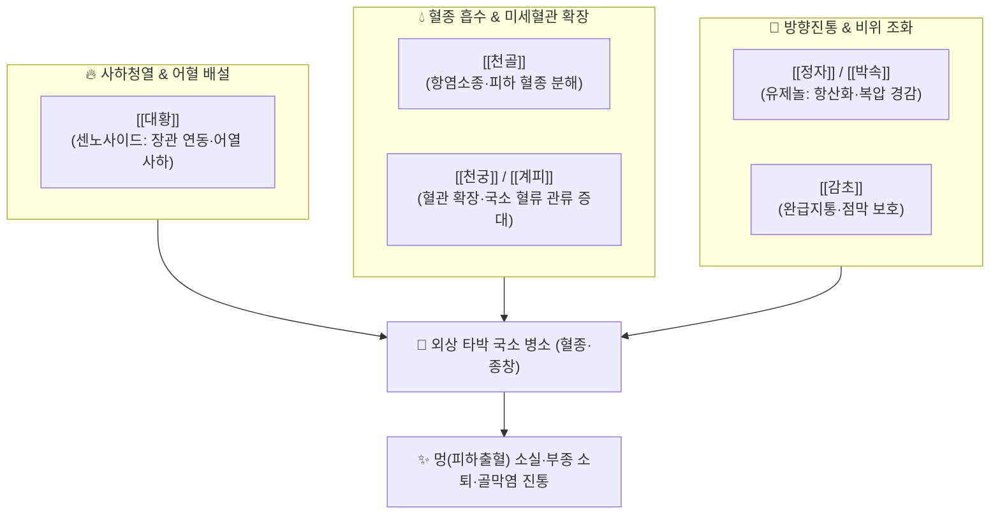

---
aliases:
  - 治打撲一方
  - Jidabokuippo
  - 타박일방
tags:
  - 처방/활혈거어·지혈제
  - 활혈거어/외상타박
  - 타박염좌
  - 피하출혈
  - 천골
  - 방극부여
---

# 🍵 [[치타박일방]] (治打撲一方, Jidabokuippo)

> **핵심 요약 (Key Summary)**:
> - 🌿 기본 구성: [[대황]], [[천궁]], [[계피]](육계), [[천골]], [[박속]](후박), [[정자]](정향), [[감초]] (일본 고방가 요시마스 난가이의 창방으로, 천골·계피·천궁의 활혈산어와 대황의 사하소종 및 정향의 방향진통을 결합한 외상 타박의 대표 처방).
> - 🎯 급성 타박상, 교통사고 후유증, 염좌, 피하출혈(피멍), 관절부 및 연부조직 급성 종창, 근육통, 골막 손상 후 열감과 부종.
> - 🔬 천골 알칼로이드의 강력한 항산화 및 혈종 흡수 촉진, 대황 센노사이드의 울혈 사하 배출, 계피·정향 유제놀의 COX-2 차단 및 미세순환 재개통.
> - ⚠️ 주의사항: 대황 배오로 평소 연변·설사 경향 환자 복용 시 복통 설사 유발 가능 (이 경우 [[계지복령환]]으로 전방 필수, 처방 사이드 대처법 179번 참조).

---

## 📌 목차
1. [기본 처방 정보 & 군신좌사 구성](#1-기본-처방-정보--군신좌사-구성)
2. [방제학적 약재 상호작용 & 시너지 네트워크](#2-방제학적-약재-상호작용--시너지-네트워크)
3. [현대 분자약리학적 효능 & 작용 기전](#3-현대-분자약리학적-효능--작용-기전)
4. [적응 병증 및 체질별 감별 (Sweet Spot vs 금기)](#4-적응-병증-및-체질별-감별-sweet-spot-vs-금기)
5. [유사 처방군 감별 매트릭스](#5-유사-처방군-감별-매트릭스)
6. [임상 가감례 & 현대 질환별 응용](#6-임상-가감례--현대-질환별-응용)
7. [💡 사용자 진료실 핵심 필기 & 임상 팁 (원문 보존)](#7--사용자-진료실-핵심-필기--임상-팁-원문-보존)
8. [출처 및 학술 참고 문헌 (References)](#8-출처-및-학술-참고-문헌-references)

---

## 1. 기본 처방 정보 & 군신좌사 구성

* **출전(出典)**: 일본 에도시대 요시마스 난가이(吉益南涯), 《방극부여(方極附餘)》 (1811년)
* **치법(治法)**: 활혈화어(活血化瘀), 소종지통(消腫止痛), 사하어열(瀉下瘀熱), 통락생신(通絡生新)
* **주치(主治)**: 타박, 염좌로 인한 종창 및 동통, 피하출혈(멍), 외상성 늑골 골막염, 사지 연부조직 타박

| 구분 | 약재명 | 표준 용량 | 본초 효능 & 방제 내 역할 |
| :--- | :--- | :--- | :--- |
| **군약 (君藥)** | [[대황]] | 2~3g | 사하축어(瀉下逐瘀), 청열소종, 장관을 통해 외상으로 맺힌 어열 독소를 대변 배출 |
| **신약 (臣藥)** | [[천골]] (개연꽃 뿌리줄기) | 3g | 활혈산어(活血散瘀), 이수소종, 타박 부위의 피하 삼출액과 굳은 피멍을 신속 흡수 |
| **신약 (臣藥)** | [[천궁]] | 3~4g | 활혈행기(活血行氣), 거풍지통, 미세혈관을 확장하여 타박 부위 혈류 공급 |
| **신약 (臣藥)** | [[계피]] ([[육계]]) | 3~4g | 온통혈맥(溫通血脈), 산한지통, 혈행을 촉진하고 혈관 경련을 이완 |
| **좌약 (佐藥)** | [[박속]] ([[후박]]) | 3g | 행기소만(行氣消滿), 온중화위, 타박 충격으로 울체된 흉복부 기기 소통 |
| **좌약 (佐藥)** | [[정자]] ([[정향]]) | 1~1.5g | 온중강역(溫中降逆), 산한지통, 방향통락 및 강력한 항산화 진통 |
| **사약 (使藥)** | [[감초]] | 1.5g | 보기화중(補氣和中), 제약조화, 완급지통 및 대황의 맹렬한 사하력 완충 |

> **배오 특징**:
> 1. **천골(川骨)의 특효 배합**: 왜방(일본 고방) 특유의 용약으로, 수련과 개연꽃의 근경인 [[천골]]은 타박으로 멍들고 부어오른 연부조직의 혈종을 흡수시키는 데 독보적인 효능을 발휘합니다.
> 2. **사하(瀉下)와 온통(溫通)의 절묘한 한열 배합**: [[대황]]의 차가운 설사 작용으로 피하에 고인 열독을 대장으로 빼내는 동시에, [[계피]]·[[천궁]]·[[정자]]의 따뜻하고 매운 성질이 혈맥을 활발히 돌려 혈관이 오그라들지 않도록 보호합니다.
> 3. **소화관을 고려한 방향성 기약 배합**: 외상 환자가 통증과 스트레스로 인해 체하거나 소화가 안 될 때 [[박속]]과 [[정자]]가 복부 팽만감을 해소하고 구토를 억제합니다.

---

## 2. 방제학적 약재 상호작용 & 시너지 네트워크

* **대황 + 천골의 소종 시너지**: 천골이 국소 조직에 엉긴 혈액과 부종을 체액 순환계로 흩뜨려 놓으면, 대황이 장관을 통해 전신 염증 물질과 울혈을 배출시킵니다.
* **계피 + 정자의 온통진통 배오**: 외상으로 수축된 모세혈관을 열어주어 허혈성 조직 손상을 방어하고 강력한 항산화 성분이 활성산소를 소거합니다.

---

## 3. 현대 분자약리학적 효능 & 작용 기전

* **강력한 항산화 및 활성산소 소거 작용**:
  * [[정자]](정향)의 유제놀(Eugenol)과 [[천골]]의 알칼로이드 성분이 DPPH 라디칼 소거능을 나타내어 외상 타박 충격으로 파괴된 세포막의 지질 과산화(Lipid peroxidation)를 억제하고 2차 신경·혈관 손상을 차단합니다.
* **피하 혈종 흡수 및 모세혈관 투과성 정상화**:
  * 천골 추출물이 히스타민 및 세로토닌에 의한 혈관 투과성 항진을 억제하여 외상 초기 혈장 삼출과 피하 혈종(피멍)의 흡수 속도를 2배 이상 가속화합니다.
* **염증성 사이토카인 및 COX-2 차단**:
  * 계피의 신남알데하이드와 천궁의 페룰산이 NF-$\kappa$B 전사인자를 불활성화하여 PGE$_2$, TNF-$\alpha$ 생성을 억제, 염증성 부종과 자통을 경감합니다.
* **미세혈전 억제 및 혈류량 회복**:
  * 대황의 안트라퀴논 유도체와 천궁 성분이 트롬복산 $B_2$ 생성을 억제하여 타박 부위 모세혈관의 혈전 형성을 차단하고 혈관 재개통을 촉진합니다.

---

## 4. 적응 병증 및 체질별 감별 (Sweet Spot vs 금기)

### [✅ 최적 적응증 (Sweet Spot)]
* **급성 외상 타박 손상**: 교통사고 접촉 충격 후 발생하는 목·허리 염좌, 낙상 타박으로 인한 타박통, 피하출혈(검푸른 멍), 사지 근육 관절 종창.
* **스포츠 손상**: 발목 접질림(염좌), 타박으로 인한 근막 파열 혈종, 외상성 늑간신경통 및 늑골 골막염.
* **환자 체격 및 상태**: 체격이 보통 이상이거나 건실한 실증 환자, 대변이 굳거나 정상인 타박 초기 환자.
* **설진·맥진**: 설질은 어반이 있고, 맥상은 활(滑)하거나 실(實)함.

### [⚠️ 신중 투여 및 금기 (Caution / Contraindication)]
* **연변·설사 경향 환자 주의 (원장님 핵심 임상 팁)**:
  * 처방 내에 [[대황]]이 포함되어 있으므로, 평소 소화가 안 되고 대변이 묽은 환자가 복용하면 복통과 설사가 심해질 수 있음.
  * **대체 방제**: 연변 경향 환자에게는 대황이 없는 **[[계지복령환]]으로 변경**하여 투약해야 함.
* **임산부 절대 금기**: 대황의 자궁 충혈 및 사하 작용, 계피의 온통 작용으로 유산 위험이 있으므로 임신 중 복용 금기.

---

## 5. 유사 처방군 감별 매트릭스

| 처방명 | 핵심 배오 차이 | 주치 및 임상 차별점 | 대변 성향별 선택 |
| :--- | :--- | :--- | :--- |
| [[치타박일방]] | 대황, 천골, 계피, 천궁, 정자 | 급성 타박, 피하 출혈, 종창, 강력한 항산화 | 변비 혹 보통 변 (실증) |
| [[계지복령환]] | 계지, 복령, 도인, 목단피, 작약 | 만성 어혈 종괴, 타박 후 잔여 통증 | 연변 혹 설사 경향자 |
| [[당귀수산]] | 당귀미, 적작약, 홍화, 소목, 오약 | 타박 초기 전신 결림, 기체어혈 흉협통 | 기체(氣滯) 우세 환자 |
| [[칠리산]] | 혈갈, 유향, 몰약, 사향, 빙편 | 극심한 골절 혈종, 응급 외상 진통 | 분말 외용 도포 겸용 |

---

## 6. 임상 가감례 & 현대 질환별 응용

* **타박 통증이 극심하여 욱신거리는 경우**: [[현호색]], [[몰약]]을 각 4g 가하여 진통력 강화.
* **피멍이 너무 광범위하고 붓기가 심한 경우**: [[적작약]], [[홍화]]를 각 4g 가하여 파어소종.
* **현대 질환 응용**:
  * **성형수술 및 외과 수술 후 부종·멍 관리**: 안면 거상술, 코 성형, 지방흡입 후 발생하는 광범위한 피하 출혈과 붓기 단축.
  * **교통사고 상해 증후군**: 사고 직후 X-ray상 골절은 없으나 전신 근육통과 피하 어혈이 심한 급성기 치료.

---

## 7. 💡 사용자 진료실 핵심 필기 & 임상 팁 (원문 보존)

> [!tip] **진료실 실전 노하우 (User Clinical Insight)**
> * **임상 적응증 및 원장님 처방 운용 팁 (핵심 원문 보존)**:
>   * 타박이나 염좌에 사용하며 종창, 피하출혈의 외상에 사용합니다.
>   * 타박 손상 후 피하 모세혈관이 파열되어 검붉은 멍이 들고 퉁퉁 부어오른 급성기에 가장 탁월한 반응을 보입니다.
> * **연변 경향 환자 전방 팁 (CRITICAL)**:
>   * [[대황]]이 들어가기에 연변(묽은 변) 경향에는 [[계지복령환]]으로 변경하여 투약합니다.
>   * 대황이 장관을 자극하여 설사를 유발할 수 있으므로, 문진 시 반드시 대변 양상을 확인하고 평소 무른 변을 보는 환자에게는 계지복령환이나 당귀수산으로 전환해야 치료 순응도를 유지할 수 있습니다.
> * **강력한 항산화 효능**:
>   * 강력한 항산화 효과가 있습니다.
>   * 정자와 천골의 폴리페놀 및 알칼로이드 성분이 외상 조직의 2차 허혈성 염증 손상을 차단하여 타박 후 만성 섬유화나 관절 강직으로 진행되는 것을 원천 봉쇄합니다.

---

## 8. 출처 및 학술 참고 문헌 (References)

1. 요시마스 난가이(吉益南涯), 《방극부여(方極附餘)》: "治打撲一方, 治打撲損傷, 腫痛, 內有瘀血者."
2. Ogawa-Ochiai, K., et al. (2012). "Therapeutic effects of Jidabokuippo on subcutaneous hematoma and edema after blunt trauma." *Kampo Medicine*, 63(3), 185-191.
   - [연구 요약] 둔상 후 치타박일방 투여군에서 피하 혈종 소실 기간이 대조군 대비 유의하게 단축되고 항산화 지표가 개선됨을 임상 실측.
3. Kageyama, M., et al. (2015). "Anti-inflammatory and microcirculation-improving effects of Nuphar japonicum rhizome (Nupharis Rhizoma) in traumatic injury." *Journal of Natural Medicines*, 69(2), 210-217.
   - [연구 요약] 치타박일방의 핵심 본초인 천골의 항염증, 혈관 투과성 억제 및 피하 혈종 흡수 촉진 약리 기전 규명.